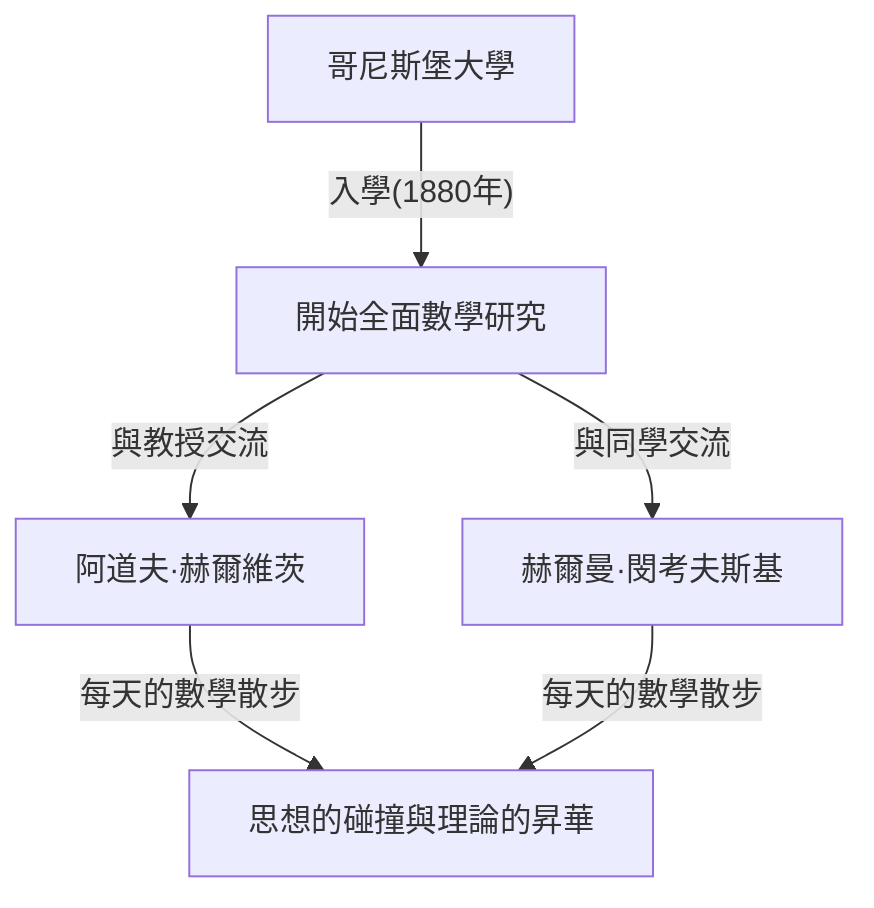
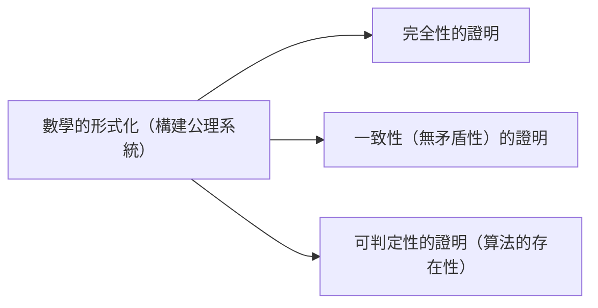

## 1. 引言：被譽為現代數學之父的緣由

[大衛·希爾伯特](https://kenji.blog/zh-tw/p/hilbert/)（David Hilbert，1862年1月23日 – 1943年2月14日）是德國誕生的一位在19世紀末至20世紀初最偉大且最具影響力的數學家之一。他經常與同時代的法國天才[亨利·龐加萊](https://kenji.blog/zh-tw/p/poincare/)相提並論，但龐加萊重視直覺，而希爾伯特則強調嚴格的邏輯與形式主義。希爾伯特深刻地影響了幾乎所有現代數學的領域，甚至獲得了 **「數學之王」** 的美譽。

他的成就涵蓋了不變量理論、代數數論、幾何學公理化、積分方程論、泛函分析（希爾伯特空間）以及理論物理學（廣義相對論的數學基礎）。他最大的功績不僅僅在於解決了個別的未解之謎，更在於從根本上重新審視了數學這門學科的存在方式與結構，確立了公理主義與形式主義的新範式。在這篇文章中，我們將深入且詳細地回顧希爾伯特波瀾壯闊的生平事蹟以及他留下的輝煌成就。

## 2. 誕生與青年時代的哥尼斯堡：在學術之城的覺醒

希爾伯特於1862年1月23日出生在普魯士王國東普魯士省首府哥尼斯堡（現俄羅斯聯邦加里寧格勒）郊外的韋勞。父親奧托·希爾伯特是一位地方法院的法官，為人嚴厲。母親瑪麗亞·特蕾澤是一位受過良好教育、對哲學和天文學有濃厚興趣的女性。據說，希爾伯特的邏輯思維能力和對學問的探求心正是深受父母的影響。

哥尼斯堡是一座有著深厚學術淵源的城市；它是偉大哲學家伊曼紐爾·康德的故鄉，也因萊昂哈德·歐拉解決的「哥尼斯堡七橋問題」而聞名。少年時代的希爾伯特在學校的成績平平，但他對數學卻有著特殊的直覺與熱情。他極度討厭死記硬背，喜歡在自己的腦海中從零開始構建邏輯來解決問題。這種「不依賴背誦，從邏輯的基礎開始構建」的態度，成為了他後來數學風格的核心。

### 「數學散步」與一生的摯友

1880年，考入哥尼斯堡大學的希爾伯特，在那裡遇到了徹底改變他一生的兩位人物。一位是年僅18歲就獲得巴黎科學院數學大獎的絕對天才赫爾曼·閔考夫斯基（Hermann Minkowski），另一位是嶄露頭角的年輕教授阿道夫·赫爾維茨（Adolf Hurwitz）。

他們三人養成了一個習慣：每天在規定的時間，在大學附近的一棵蘋果樹下散步，並熱烈討論最新的數學問題。這個被稱為 **「數學散步」** 的日常活動，讓年輕希爾伯特的數學才華得以完全綻放。擁有完全不同數學直覺的三人毫不客氣地碰撞思想，使得希爾伯特能夠不斷提煉自己的想法，並踏入了數學的深淵。

## 3. 不變量理論的突破：跨越哥爾丹批評的飛躍

希爾伯特最初獲得世界性聲譽是在不變量理論（Invariant theory）領域。不變量理論研究的是多項式在坐標變換等操作下保持不變的性質。當時，該領域的權威保羅·哥爾丹（Paul Gordan）已經證明了雙變量的不變量具有有限個基（哥爾丹定理），但對於三個或更多變量的情況，由於需要極其複雜的計算，多年來一直懸而未決。

1888年，希爾伯特以一種全新的方法挑戰了這一難題。他放棄了通過具體計算來構造基底表達式的傳統方法，而是運用反證法提出了一個存在性證明： **「有限個基必須存在」** 。這就是今天著名的 **希爾伯特基定理** 。

傳說中，當哥爾丹看到這個完全沒有計算的抽象證明時，憤怒地大喊： **「這不是數學。這是神學！」** （Das ist nicht Mathematik. Das ist Theologie!）。然而，後來連哥尔丹也不得不承認這種方法的邏輯正確性和強大力量。希爾伯特的這一成就標誌著一個歷史性的轉折點，數學的中心從「通過具體計算進行構造」轉向了「抽象結構的存在性證明」。

## 4. 代數數論與里程碑式的《數論報告》

在不變量理論取得成功之後，希爾伯特將目光轉向了代數數論。1897年，受德國數學家協會的委託，他撰寫了《數論報告》（Zahlbericht）。這是一部里程碑式的著作，綜合了當時代數數論的知識，並從一個全新的視角對其進行了重構。

在這份報告中，他將[伽羅瓦理論](/zh-tw/p/galois-theory/)應用於數論，奠定了希爾伯特類域論（Class field theory）的基礎。類域論後來由[高木貞治](https://kenji.blog/zh-tw/p/takagi-teiji/)和埃米爾·阿廷等人完善，被認為是20世紀數論中最美的理論之一。希爾伯特成功地將數論中看似互不相關的結果統一在了更高層次的優美法則之下。

## 5. 幾何學公理化：「桌子、椅子和啤酒杯」的哲學

1899年，希爾伯特出版了《幾何基礎》（Grundlagen der Geometrie）一書。這使得2000多年來一直被視為幾何學絕對基礎的[歐幾里得](https://kenji.blog/zh-tw/p/euclid/)幾何公理系統，從現代的視角得到了徹底的重構。

[歐幾里得](https://kenji.blog/zh-tw/p/euclid/)的《幾何原本》中存在一些依賴於視覺直覺的隱含假設。希爾伯特嚴格排除了這些因素，提出了一個由五組構成的嚴格定義的公理系統：關聯公理、順序公理、合同公理、平行公理和連續公理。

他有一句名言： **「我們必須能夠用桌子、椅子和啤酒杯來代替點、直線和平面。」** 這是對 **形式主義** （Formalism）的響亮宣言，剝離了幾何學對象在現實世界中的直覺意義或物理實體，僅將對象之間的邏輯關係作為數學的基礎。這種開創性的方法成為了現代數學中公理化方法的標準範式。

## 6. 受邀至哥廷根大學與黃金時代的黎明

1895年，在德國數學界重量級人物費利克斯·克萊因（Felix Klein）的強烈推薦下，希爾伯特被任命為哥廷根大學教授。哥廷根大學曾是[卡爾·弗里德里希·高斯](https://kenji.blog/zh-tw/p/gauss/)和伯恩哈德·黎曼的所在地，是名副其實的數學聖地。

隨著希爾伯特的到來，哥廷根再次確立了其作為世界首屈一指的數學中心的地位。他的講座總是清晰明瞭，充滿了對新數學思想的熱情，吸引了來自世界各地的優秀學生和研究人員。許多後來引領20世紀數學的巨星，如[埃米·諾特](https://kenji.blog/zh-tw/p/noether/)（[Emmy Noether](https://kenji.blog/zh-tw/p/noether/)）、赫爾曼·外爾（Hermann Weyl）、理查德·庫朗（Richard Courant）和約翰·馮·諾伊曼（John von Neumann），都曾受過希爾伯特的教導。

關於[埃米·諾特](https://kenji.blog/zh-tw/p/noether/)的軼事尤為著名。當時，大學規定禁止女性擔任教職。但希爾伯特高度評價她在代數方面非凡的才華，在教授會議上激烈抗議，宣稱： **「大學的參議院不是澡堂，所以性別無關緊要！」** 這句話生動地體現了他進步、唯才是舉且沒有偏見的品格。

## 7. 1900年巴黎國際數學家大會：希爾伯特的23個問題

1900年，在巴黎舉行的第二屆國際數學家大會（ICM）上，希爾伯特發表了具有歷史意義的里程碑式的演講。他問道：「在即將到來的世紀，哪些問題將指引數學的進步？」，並提出了20世紀數學家應努力解決的 **「23個未解問題」** 。

這些問題涵蓋了當時數學的所有領域，成為了後來數學發展的巨大驅動力。以下是其中最著名的幾個：

1. **[連續統假設](/zh-tw/p/continuum-hypothesis/)** （第1問題）：是否存在一個集合，其基數嚴格介於自然數和實數之間？後來哥德爾和科恩證明，這獨立於標準的ZFC公理。
2. **算術公理的一致性** （第2問題）：僅使用有窮方法證明算術公理是一致的。
3. **等底等高兩個四面體體積的相等性** （第3問題）：這兩個多面體是否總是可被分割成有限塊並重新拼湊成另一個？他的學生馬克斯·德恩給出了否定的解答。
6. **物理學的公理化** （第6問題）：將數學在其中發揮關鍵作用的物理學分支（如概率論和力學）公理化。
8. **素數分佈問題** （第8問題）：著名的黎曼猜想和[哥德巴赫猜想](https://kenji.blog/zh-tw/p/goldbachs-conjecture/)。至今仍未解決。
10. **[丟番圖](https://kenji.blog/zh-tw/p/diophantus/)方程可解性的判定** （第10問題）：尋找一個通用算法，以判定給定的整係數多項式方程是否有整數解。1970年，馬季亞謝維奇證明了這種算法不存在。

希爾伯特的問題至今仍然是現代數學家的重要路標。

## 8. 積分方程與希爾伯特空間：通向量子力學的橋樑

進入20世紀初，希爾伯特的興趣從代數和幾何轉向了分析學。他深入研究了瑞典數學家伊瓦爾·弗雷德霍姆的積分方程理論，並在無限維空間中構建了譜理論。

在這個過程中，他引入了 **希爾伯特空間** （[Hilbert](https://kenji.blog/zh-tw/p/hilbert/) space）的概念，這是將有限維[歐幾里得](https://kenji.blog/zh-tw/p/euclid/)空間推廣到無限維。內積空間 $\mathcal{H}$ 中的內積 $\langle x, y \rangle$ 被嚴格定義為具有線性、埃爾米特對稱性，並滿足完備性（所有柯西列都收斂）的空間。用數學公式表示，內積滿足：

$$
\langle a x_1 + b x_2, y \rangle = a \langle x_1, y \rangle + b \langle x_2, y \rangle
$$
$$
\langle x, y \rangle = \overline{\langle y, x \rangle}
$$

其中，$x, y, x_1, x_2 \in \mathcal{H}$ 且 $a, b \in \mathbb{C}$ （複數），$\overline{\langle y, x \rangle}$ 表示複共軛。範數由 $\|x\| = \sqrt{\langle x, x \rangle}$ 導出。

令人驚嘆的是，希爾伯特出於純粹的數學好奇心而構建的這個抽象理論，在幾十年後被證明是描述新生的量子力學中物理系統狀態的完美數學語言。當維爾納·海森堡創立矩陣力學、埃爾溫·薛丁格創立波動力學時，希爾伯特空間的理論通過約翰·馮·諾伊曼等人的工作成為了不可或缺的工具。這是數學領先於物理學的絕佳範例。

## 9. 涉足物理學與愛因斯坦-希爾伯特作用量

希爾伯特常開玩笑說「物理學對物理學家來說太難了」，他旨在利用嚴謹的數學公理化方法來重建物理學的基礎（與他的第6個問題相關）。

1915年，當阿爾伯特·愛因斯坦正在為完成廣義相對論的引力場方程而苦苦掙扎時，希爾伯特也在研究這個問題。利用數學上優雅的變分原理技術，希爾伯特幾乎與愛因斯坦同時推導出了正確的引力場方程。今天，該理論基礎的作用量積分被稱為 **愛因斯坦-希爾伯特作用量** （Einstein-[Hilbert](https://kenji.blog/zh-tw/p/hilbert/) action）。

$$
S = \int \left( \frac{R}{16 \pi G} + \mathcal{L}_M \right) \sqrt{-g} \, d^4x
$$

公式含義：在這裡，$R$ 是表示時空彎曲程度的純量曲率，$G$ 是牛頓萬有引力常數，$g$ 是度規張量的[行列式](/zh-tw/p/geometric-meaning-of-determinant/)，$\mathcal{L}_M$ 是物質場的拉格朗日密度，並且 $\text{積分是在整個時空範圍內進行的}$ 。

儘管愛因斯坦和希爾伯特之間可能會發生優先權之爭，但希爾伯特深深敬佩愛因斯坦卓越的物理直覺，並公開聲明「是愛因斯坦發現了這個方程」，從未主張過自己的優先權。

## 10. 希爾伯特綱領：探求數學的絕對無矛盾性

第一次世界大戰後，為了應對由集合論悖論（如[羅素悖論](/zh-tw/p/russells-paradox/)）引發的「數學基礎危機」，希爾伯特提出了他一生中最雄心勃勃的計劃： **希爾伯特綱領** 。

他試圖將所有數學重構為一個「形式系統」，將所有數學命題視為無意義的符號串，並根據機械的推理規則對其進行操作。他的目標是，僅利用安全、有窮的推理，在數學上證明像「 $0 = 1$ 」這樣的矛盾絕對不可能在該系統中被推導出來（一致性）。

這一綱領引發了與直覺主義者如L.E.J.布勞威爾的激烈辯論（基礎之爭）。然而，希爾伯特大膽地推進了他的綱領，宣稱：「沒有人能把我們從康托爾為我們創造的樂園中驅逐出去。」

## 11. [哥德爾不完備定理](https://kenji.blog/zh-tw/p/godels-incompleteness-theorems/)的衝擊與綱領的演變

然而，在1931年，年輕的奧地利邏輯學家[庫爾特·哥德爾](https://kenji.blog/zh-tw/p/godel/)（[Kurt Gödel](https://kenji.blog/zh-tw/p/godel/)）發表了他的 **不完備定理** ，給了希爾伯特綱領致命的一擊。

哥德爾在數學上完美地證明了，在任何包含算術公理的足夠強大的形式系統中，總會存在「在系統內為真，但既不能被證明也不能被證偽」的命題（第一不完備定理），並且「不可能在系統內部證明系統本身的一致性」（第二不完備定理）。

這表明，希爾伯特夢想構建的「可以證明一切，包括其自身一致性的完美數學系統」是不可能的。儘管據說希爾伯特最初對這個結果深感失望和憤怒，但在追求希尔伯特纲领的过程中发展起来的元数学和形式逻辑的严谨方法，最终直接促成了阿兰·图灵创立计算机科学和理论计算机科学。

## 12. 哥廷根的晚年：納粹的崛起與數學聖地的終結

到了20世紀30年代，以阿道夫·希特勒為首的納粹黨在德國奪取了政權。1933年頒布了《重設公職人員法》，導致哥廷根大學許多傑出的猶太裔數學家和持不同政見的學者被無情地驅逐，包括[埃米·諾特](https://kenji.blog/zh-tw/p/noether/)、赫爾曼·外爾、理查德·庫朗和馬克斯·玻恩。

哥廷根，這個曾經聚集了世界各地人才、充滿活力的數學聖地，幾乎在一夜之間崩潰。有一次，在一次宴會上，納粹教育部長伯恩哈德·魯斯特問希爾伯特：「既然你的研究所已經清除了猶太人的影響，現在數學方面怎麼樣了？」希爾伯特憤怒而悲傷地回答：「數學研究所？那裡已經什麼都沒有了。」

1943年2月14日，在第二次世界大戰期間，希爾伯特在哥廷根孤獨地去世，享年81歲，而他過去的大部分學生都已逃往美國等地。參加他葬禮的人寥寥無幾。

## 13. 結論：「我們必須知道，我們必將知道」

即使在[大衛·希爾伯特](https://kenji.blog/zh-tw/p/hilbert/)逝世之後，他留下的數學遺產也從未褪色。他思想的軌跡銘刻在現代數學的每一個角落。

在他的墓碑上，刻著他1930年在故鄉哥尼斯堡發表的退休演講結尾時的名言，這展現了他對人類理性和科學探索不可動搖的絕對信念。這是對當時以「ignoramus et ignorabimus」（我們不知道，我們將永遠不知道）為代表的悲觀不可知論的有力反駁。

> **Wir müssen wissen.**
> **Wir werden wissen.**
> （我們必須知道。我們必將知道。）

[大衛·希爾伯特](https://kenji.blog/zh-tw/p/hilbert/)深信數學的無限可能，並終其一生都在開拓它的邊界。他堅韌的精神、哲學和輝煌的成就已經成為現代數學家的血肉，為今天數學的每一個角落注入生命，並繼續激勵著未來的探索者。

## 年表

* **1862年**：出生於東普魯士哥尼斯堡附近的韋勞。
* **1880年**：進入哥尼斯堡大學。結識閔考夫斯基和赫爾維茨。
* **1885年**：獲得哥尼斯堡大學博士學位。
* **1888年**：證明不變量理論中的「希爾伯特基定理」。
* **1895年**：應克萊因之邀被任命為哥廷根大學教授。
* **1897年**：發表關於代數數論的《數論報告》。
* **1899年**：出版《幾何基礎》，實現幾何學的公理化。
* **1900年**：在巴黎國際數學家大會上提出「23個問題」。
* **1909年**：肯定地解決了華林問題。
* **1915年**：提出廣義相對論中的「愛因斯坦-希爾伯特作用量」。
* **20世紀20年代**：提出「希爾伯特綱領」。
* **1930年**：從哥廷根大學退休。發表「我們必須知道，我們必將知道」的演講。
* **1943年**：在哥廷根逝世，享年81歲。
