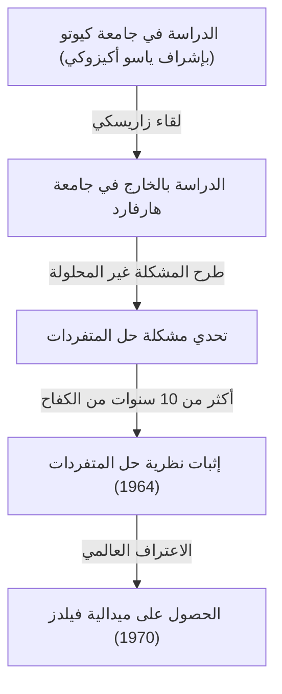
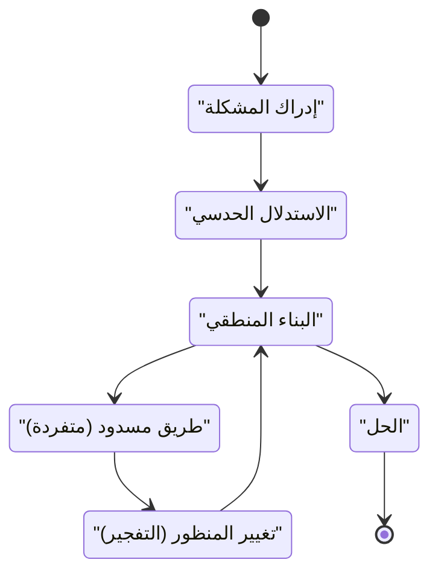

## مقدمة

 **[هيسوكي هيروناكا](https://kenji.blog/p/hironaka-heisuke/)** هو عالم رياضيات ياباني ترك بصمة ثورية في عالم الرياضيات في أواخر القرن العشرين، لا سيما في مجال الهندسة الجبرية. ميدالية فيلدز التي حصل عليها عام 1970 هي أعلى تكريم في الرياضيات، مُنحت لحله "حل متفردات متنوعة جبرية على حقل ذو خاصية صفرية" — وهي مشكلة ضخمة اعتبرها الجميع في ذلك الوقت مستحيلة.

في هذه المقالة، نتعمق في حياة هيروناكا الدرامية من طفولته إلى حصوله على ميدالية فيلدز، والخلفية الرياضية لـ "نظرية حل المتفردات" المرادفة لاسمه، والفلسفة الفريدة المتعلقة بـ "الإبداع" التي دافع عنها باستمرار.

## الطفولة والاهتمامات المتنوعة

ولد هيروناكا عام 1931 في محافظة ياماغوتشي باليابان، ونشأ في عائلة كبيرة مكونة من 15 شقيقًا. خلال طفولته، لم يبرز هيروناكا على الفور كعبقري في الرياضيات. بدلاً من ذلك، كان لديه شغف عميق بالموسيقى، حيث انغمس في العزف على البيانو، وقرأ على نطاق واسع في الأدب والفلسفة، مما أظهر مجموعة متنوعة من الاهتمامات. أصبح هذا الفضول المتنوع والحساسية الغنية المصدر الذي أنتج لاحقًا تفكيره الحر في عالم الرياضيات المجرد.

## لقاءات مصيرية في جامعة كيوتو

كانت اللحظة الحاسمة التي اختار فيها الرياضيات كمسار حياته هي التحاقه بكلية العلوم في جامعة كيوتو. هناك، تحت إشراف الأستاذ **ياسو أكيزوكي** ، الذي كان يقود الجبر الياباني، أصبح مفتونًا بالعالم العميق للهندسة الجبرية.

خلال فترة وجوده في جامعة كيوتو، أتيحت لهيروناكا الفرصة لمقابلة باحثين من الدرجة الأولى مثل عالم الرياضيات الفرنسي **رينيه توم** ، الذي سيشاركه لاحقًا ميدالية فيلدز، والسيد العالمي للهندسة الجبرية، **أوسكار زاريسكي** . زاريسكي، على وجه الخصوص، قدر موهبة هيروناكا تقديراً عالياً ودعاه إلى جامعة هارفارد.

## تحدي المشكلة الضخمة: "حل المتفردات"

عند الدراسة بالخارج في جامعة هارفارد، عهد زاريسكي إلى هيروناكا بـ "مشكلة حل المتفردات"، والتي عمل عليها زاريسكي نفسه لسنوات عديدة دون التوصل إلى حل كامل. كانت هذه واحدة من أعظم المشاكل غير المحلولة في الهندسة الجبرية، والتي حاول علماء الرياضيات العباقرة في جميع أنحاء العالم حلها وفشلوا.

### ما هي المتفردة؟

النوع الجبري (شكل أو مساحة محددة بنظام من المعادلات متعددة الحدود) لا يحتوي دائمًا على سطح أملس (قابل للتفاضل). يمكن أن تحتوي على نتوءات أو نقاط ذات تقاطعات ذاتية، والتي تسمى "متفردات".

على سبيل المثال، ضع في اعتبارك المنحنى التالي في مستوى ثنائي الأبعاد:

$$ y^2 = x^3 $$

يحتوي هذا المنحنى على نقطة حادة (متفردة) عند الأصل $ (0, 0) $. في مثل هذه النقطة، لا يتم تحديد المماس بشكل فريد، مما يجعل من الصعب تطبيق الأساليب التحليلية مباشرة مثل حساب التفاضل والتكامل.

### التعريف الرياضي لحل المتفردات

حل المتفردات، بشكل حدسي، هو "تحويل مساحة بها متفردات وفقًا لقاعدة معينة لإنشاء مساحة ملساء تمامًا".

يُعبر عنها بدقة باستخدام الصيغ الرياضية، بالنسبة لمتنوعة جبرية $ X $ ذات متفردات، فهي عملية إيجاد متنوعة جبرية غير متفردة (ملساء) $ \tilde{X} $ وتشكل ثنائي الاستقطاب مناسب $ \pi: \tilde{X} \to X $.

$$ \pi : \tilde{X} \to X $$

هنا، إذا تم الإشارة إلى مجموعة متفردات $ X $ على أنها $ \text{المتفردات}(X) $، فإن $ \pi $ هو تشاكل على المجموعة الفرعية خارجها. وبعبارة أخرى، من خلال "فك" أجزاء المتفردة فقط، يتم تحويلها إلى متنوعة ملساء.

### طريقة التفجير (Blow-up)

العملية الهندسية الأساسية التي استخدمها هيروناكا كانت "التفجير".

من خلال تكرار الانفجارات في الأماكن المناسبة، يتم تبسيط المتفردات المعقدة خطوة بخطوة. ومع ذلك، في الأبعاد الأعلى، أصبح تحديد الترتيب الذي يجب التفجير به صعبًا للغاية، وكانت عملية واحدة خاطئة تحمل خطر الوقوع في حلقة لا نهائية.

## إثبات رائد وميدالية فيلدز

في حين اعتبر إثبات حل المتفردات في أبعاد $ n $ العامة ميؤوسًا منه، فقد جرد هيروناكا بشكل كبير نظرية الحلقات المحلية واستخدم استقراءً معقدًا للغاية لإثبات أن حل المتفردات ممكن للأنواع الجبرية من أي بُعد على حقل ذو خاصية صفرية.

نُشرت الورقة البحثية التي يبلغ طولها مئات الصفحات في مجلة "Annals of Mathematics" عام 1964، وأذهلت علماء الرياضيات في جميع أنحاء العالم، وحصل هيروناكا على ميدالية فيلدز في عام 1970.

## الإبداع وفلسفة "المتفردات الفكرية"

يُعرف هيروناكا أيضًا بتصريحاته الفلسفية المتعلقة بأساليب تفكيره الفريدة وإبداعه.

في كتابه "اكتشاف المعرفة"، وصف نفسه ليس بأنه "عبقري" بل بأنه "شخص ذو جهد". كانت "القدرة على التحمل" لمواصلة التفكير لمئات الساعات هي سلاحه.

بالنسبة لهيروناكا، لم يكن الوصول إلى طريق مسدود في التفكير (متفردة فكرية) فاشلاً، بل كان فرصة مثالية لإدخال منظور جديد (تفجير). يتردد صدى هذه الفلسفة بشكل جميل مع إنجازاته الرياضية نفسها.

## خاتمة

غيرت نظرية حل المتفردات التي توصل إليها [هيسوكي هيروناكا](https://kenji.blog/p/hironaka-heisuke/) مشهد الهندسة الجبرية ولا تزال أداة لا غنى عنها في مجالات متنوعة مثل نظرية الأوتار الفائقة. عند مواجهة الجدران الصعبة، يستمر موقفه المتمثل في "فك" التشابكات المعقدة في إبهار الكثير من الناس اليوم.
