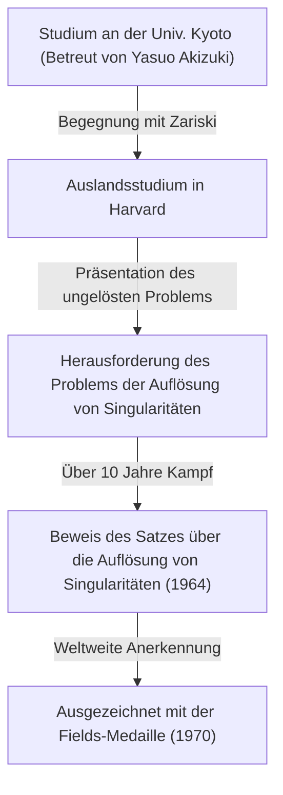
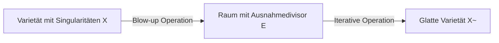
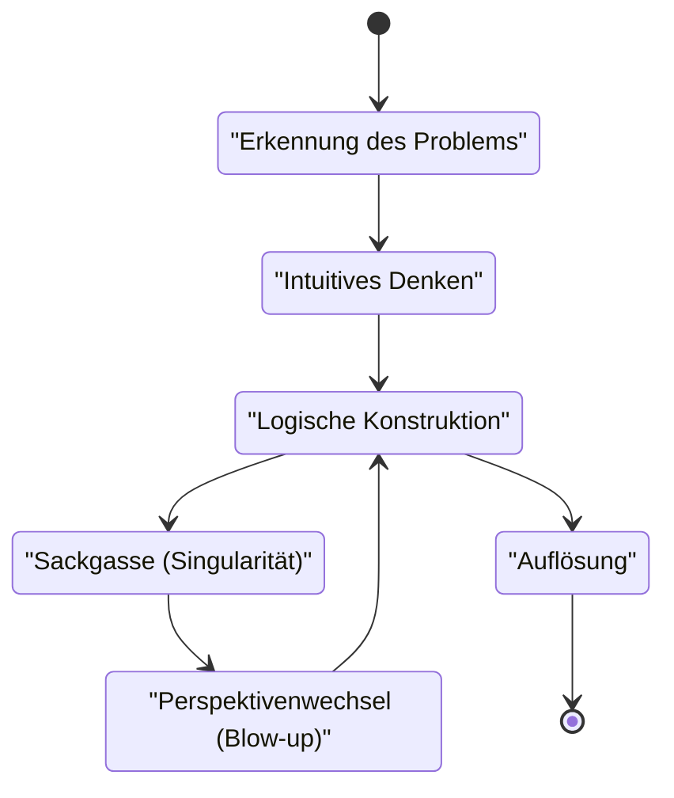

## Einführung

 **[Heisuke Hironaka](https://kenji.blog/de/p/hironaka-heisuke/)** ist ein japanischer Mathematiker, der im späten 20. Jahrhundert revolutionäre Spuren in der mathematischen Welt hinterlassen hat, insbesondere auf dem Gebiet der algebraischen Geometrie. Die Fields-Medaille, die er 1970 erhielt, ist die höchste Auszeichnung in der Mathematik, verliehen für seine Lösung zur „Auflösung von Singularitäten einer algebraischen Varietät über einem Körper der Charakteristik null“ – ein monumentales Problem, das damals jeder für unmöglich hielt.

In diesem Artikel tauchen wir tief in Hironakas dramatisches Leben von seiner Kindheit bis zur Auszeichnung mit der Fields-Medaille ein, beleuchten den mathematischen Hintergrund seines gleichnamigen „Satzes über die Auflösung von Singularitäten“ und die einzigartige Philosophie in Bezug auf „Kreativität“, die er kontinuierlich vertrat.

## Kindheit und Vielfältige Interessen

Geboren 1931 in der Präfektur Yamaguchi, Japan, wuchs Hironaka in einer Großfamilie mit 15 Geschwistern auf. In seiner Kindheit fiel Hironaka nicht sofort als mathematisches Genie auf. Vielmehr hatte er eine tiefe Leidenschaft für die Musik, vertiefte sich in das Klavierspiel und las ausgiebig Literatur und Philosophie, wodurch er eine Vielzahl von Interessen zeigte. Diese vielfältige Neugier und reiche Sensibilität wurden zur Quelle, die später sein freies Denken in der abstrakten Welt der Mathematik hervorbrachte.

## Schicksalhafte Begegnungen an der Universität Kyoto

Der entscheidende Moment, in dem er die Mathematik als seinen Lebensweg wählte, war seine Einschreibung an der Naturwissenschaftlichen Fakultät der Universität Kyoto. Dort, unter der Anleitung von Professor **Yasuo Akizuki** , der die japanische Algebra leitete, wurde er von der tiefgründigen Welt der algebraischen Geometrie fasziniert.

Während seiner Zeit an der Universität Kyoto hatte Hironaka die Gelegenheit, erstklassige Forscher wie den französischen Mathematiker **René Thom** , der später die Fields-Medaille mit ihm teilen sollte, und den weltweiten Meister der algebraischen Geometrie, **Oscar Zariski** , kennenzulernen. Insbesondere Zariski schätzte Hironakas Talent sehr und lud ihn an die Harvard University ein.

## Die Herausforderung des Monumentalen Problems: "Auflösung von Singularitäten"

Nach seinem Studium an der Harvard University vertraute Zariski Hironaka das „Problem der Auflösung von Singularitäten“ an, an dem Zariski selbst viele Jahre gearbeitet hatte, ohne zu einer vollständigen Lösung zu gelangen. Dies war eines der größten ungelösten Probleme in der algebraischen Geometrie, an dem sich geniale Mathematiker auf der ganzen Welt versucht hatten und gescheitert waren.

### Was ist eine Singularität?

Eine algebraische Varietät (eine Form oder ein Raum, der durch ein System von Polynomgleichungen definiert ist) hat nicht immer eine glatte (differenzierbare) Oberfläche. Sie kann Spitzen (Cusps) oder Punkte mit Selbstüberschneidungen aufweisen, die als „Singularitäten“ bezeichnet werden.

Betrachten wir zum Beispiel die folgende Kurve (eine kuspidale Kurve) in einer 2D-Ebene:

$$ y^2 = x^3 $$

Diese Kurve hat am Ursprung $ (0, 0) $ einen scharfen Punkt (eine Singularität). In einem solchen Punkt ist die Tangente nicht eindeutig bestimmt, was es schwierig macht, analytische Methoden wie die Differentialrechnung direkt anzuwenden.

### Mathematische Definition der Auflösung von Singularitäten

Die Auflösung von Singularitäten ist intuitiv das „Transformieren eines Raumes mit Singularitäten nach einer bestimmten Regel, um einen vollständig glatten Raum zu schaffen“.

Streng durch mathematische Formeln ausgedrückt, handelt es sich bei einer algebraischen Varietät $ X $ mit Singularitäten um die Operation, eine nicht-singuläre (glatte) algebraische Varietät $ \tilde{X} $ und einen eigentlichen birationalen Morphismus $ \pi: \tilde{X} \to X $ zu finden.

$$ \pi : \tilde{X} \to X $$

Hierbei ist $ \pi $, wenn die Menge der Singularitäten von $ X $ als $ \text{Singularitäten}(X) $ bezeichnet wird, ein Isomorphismus auf der Teilmenge außerhalb dieser Menge. Mit anderen Worten, durch das "Entwirren" nur der singulären Teile wird sie in eine glatte Varietät transformiert.

### Die Blow-up-Methode

Die primäre geometrische Operation, die Hironaka anwandte, war das „Aufblasen“ (Blow-up).

Durch wiederholtes Aufblasen an geeigneten Stellen werden komplexe Singularitäten Schritt für Schritt vereinfacht. In höheren Dimensionen wurde es jedoch extrem schwierig zu bestimmen, in welcher Reihenfolge aufgeblasen werden sollte, und eine einzige falsche Operation barg die Gefahr, in eine Endlosschleife zu geraten.

## Bahnbrechender Beweis und die Fields-Medaille

Während der Beweis der Auflösung von Singularitäten in allgemeinen $ n $-Dimensionen als aussichtslos galt, abstrahierte Hironaka die Theorie der lokalen Ringe in hohem Maße und nutzte eine extrem komplexe Induktion, um zu beweisen, dass die Auflösung von Singularitäten für algebraische Varietäten jeglicher Dimension über einem Körper der Charakteristik null möglich ist.

Veröffentlicht in den „Annals of Mathematics“ im Jahr 1964, verblüffte die hunderte Seiten lange Arbeit Mathematiker weltweit, und Hironaka erhielt 1970 die Fields-Medaille.

## Kreativität und die Philosophie der „Intellektuellen Singularitäten“

Hironaka ist auch bekannt für seine philosophischen Aussagen bezüglich seiner einzigartigen Denkmethoden und Kreativität.

In seinem Buch „Die Entdeckung der Wissenschaft“ beschrieb er sich selbst nicht als „Genie“, sondern als „Person der Anstrengung“. Die „Ausdauer“, hunderte Stunden weiterzudenken, war seine Waffe.

Für Hironaka war das Erreichen einer Sackgasse im Denken (eine intellektuelle Singularität) kein Fehlschlag, sondern die perfekte Gelegenheit, eine neue Perspektive (ein Blow-up) einzuführen. Diese Philosophie harmoniert wunderbar mit seiner eigenen mathematischen Leistung.

## Fazit

[Heisuke Hironaka](https://kenji.blog/de/p/hironaka-heisuke/)s Satz über die Auflösung von Singularitäten hat die Landschaft der algebraischen Geometrie verändert und bleibt ein unverzichtbares Werkzeug in verschiedenen Bereichen wie der Superstringtheorie. Konfrontiert mit schwierigen Mauern, fasziniert seine Einstellung, komplexe Verstrickungen zu „entwirren“, auch heute noch viele Menschen.
