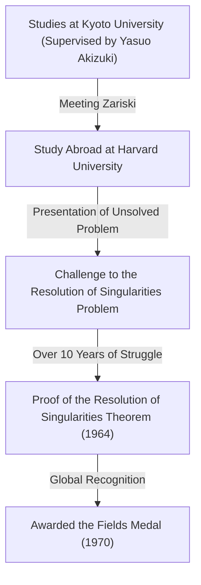
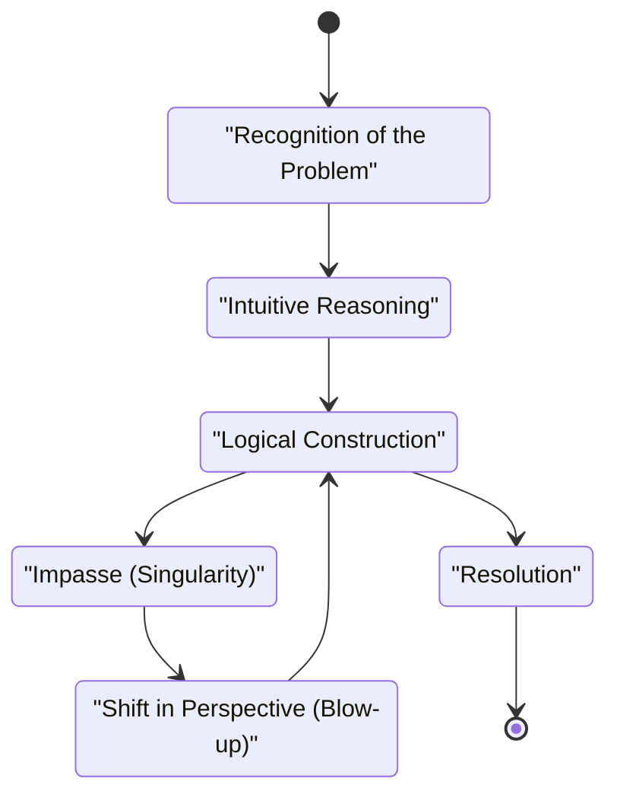

## Introduction

 **[Heisuke Hironaka](https://kenji.blog/en/p/hironaka-heisuke/)** is a Japanese mathematician who left a revolutionary mark on the mathematical world in the late 20th century, particularly in the field of algebraic geometry. The Fields Medal he received in 1970 is the highest honor in mathematics, awarded for his solution to the "resolution of singularities of an algebraic variety over a field of characteristic zero"—a monumental problem that everyone at the time considered impossible.

In this article, we delve deeply into Hironaka's dramatic life from his childhood to his Fields Medal award, the mathematical background of his synonymous "Resolution of Singularities Theorem", and the unique philosophy regarding "creativity" that he continuously advocated.

## Childhood and Diverse Interests

Born in 1931 in Yamaguchi Prefecture, Japan, Hironaka grew up in a large family of 15 siblings. During his childhood, Hironaka did not immediately stand out as a mathematical genius. Rather, he had a deep passion for music, immersing himself in playing the piano, and read extensively in literature and philosophy, displaying a wide variety of interests. This diverse curiosity and rich sensitivity became the wellspring that later produced his free thinking in the abstract world of mathematics.

## Fateful Encounters at Kyoto University

The decisive moment when he chose mathematics as his lifelong path was his enrollment in the Faculty of Science at Kyoto University. There, under the guidance of Professor **Yasuo Akizuki** , who was leading Japanese algebra, he became fascinated by the profound world of algebraic geometry.

During his time at Kyoto University, Hironaka had the opportunity to meet first-class researchers such as the French mathematician **René Thom** , who would later share the Fields Medal with him, and the global master of algebraic geometry, **Oscar Zariski** . Zariski, in particular, highly evaluated Hironaka's talent and invited him to Harvard University.

## Challenging the Monumental Problem: "Resolution of Singularities"

Upon studying abroad at Harvard University, Zariski entrusted Hironaka with the "resolution of singularities problem," which Zariski himself had worked on for many years without reaching a complete solution. This was one of the greatest unsolved problems in algebraic geometry, which genius mathematicians around the world had attempted and failed.

### What is a Singularity?

An algebraic variety (a shape or space defined by a system of polynomial equations) does not always have a smooth surface. It can have cusps or points with self-intersections, which are called "singularities".

For example, consider the following curve (a cuspidal curve) on a 2D plane:

$$ y^2 = x^3 $$

This curve has a sharp point (a singularity) at the origin $ (0, 0) $. At such a point, the tangent is not uniquely determined, making it difficult to directly apply analytical methods such as calculus.

### Mathematical Definition of Resolution of Singularities

The resolution of singularities is intuitively "transforming a space with singularities according to a certain rule to create a completely smooth space."

Expressed strictly using mathematical formulas, for an algebraic variety $ X $ with singularities, it is the operation of finding a non-singular (smooth) algebraic variety $ \tilde{X} $ and a proper birational morphism $ \pi: \tilde{X} \to X $.

$$ \pi : \tilde{X} \to X $$

Here, if the set of singularities of $ X $ is denoted as $ \text{Singularities}(X) $, then $ \pi $ is an isomorphism on the subset outside of it. In other words, by "unraveling" only the singularity parts, it is transformed into a smooth variety.

### The Blow-up Method

The primary geometric operation Hironaka utilized was the "blow-up".

By repeating blow-ups at appropriate places, complex singularities are step-by-step simplified. However, in higher dimensions, determining the order in which to blow up became extremely difficult, and one wrong operation carried the risk of falling into an infinite loop.

## Groundbreaking Proof and the Fields Medal

While the proof of the resolution of singularities in general $ n $ dimensions was considered hopeless, Hironaka highly abstracted the theory of local rings and utilized extremely complex induction to prove that the resolution of singularities is possible for algebraic varieties of any dimension over a field of characteristic zero.

Published in the "Annals of Mathematics" in 1964, the hundreds of pages long paper astonished mathematicians worldwide, and Hironaka was awarded the Fields Medal in 1970.

## Creativity and the Philosophy of "Intellectual Singularities"

Hironaka is also known for his philosophical statements regarding his unique thinking methods and creativity.

In his book "The Discovery of Scholarship," he described himself not as a "genius" but as a "person of effort." The "endurance" to continue thinking for hundreds of hours was his weapon.

For Hironaka, reaching a dead end in thought (an intellectual singularity) was not a failure, but a perfect opportunity to introduce a new perspective (a blow-up). This philosophy resonates beautifully with his mathematical achievement itself.

## Conclusion

[Heisuke Hironaka](https://kenji.blog/en/p/hironaka-heisuke/)'s Resolution of Singularities Theorem transformed the landscape of algebraic geometry and remains an indispensable tool in diverse fields like superstring theory. When faced with difficult walls, his attitude of "unraveling" complex entanglements continues to fascinate many people today.
