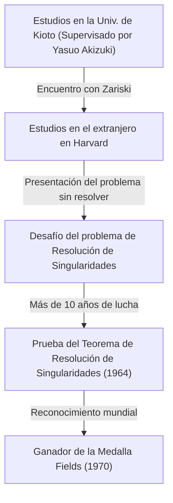
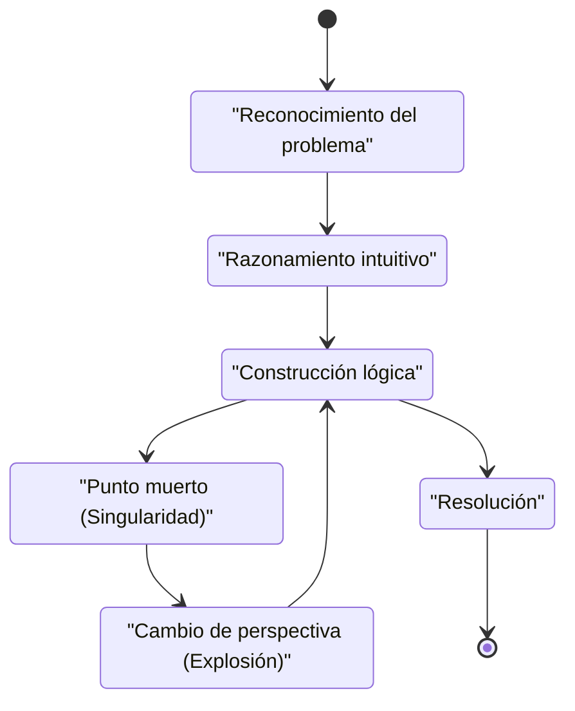

## Introducción

 **[Heisuke Hironaka](https://kenji.blog/p/hironaka-heisuke/)** es un matemático japonés que dejó una marca revolucionaria en el mundo matemático a finales del siglo XX, particularmente en el campo de la geometría algebraica. La Medalla Fields que recibió en 1970 es el mayor honor en matemáticas, otorgada por su solución a la "resolución de singularidades de una variedad algebraica sobre un cuerpo de característica cero", un problema monumental que todos en ese entonces consideraban imposible.

En este artículo, profundizaremos en la dramática vida de Hironaka desde su infancia hasta su premio de la Medalla Fields, los antecedentes matemáticos de su sinónimo "Teorema de Resolución de Singularidades" y su filosofía única con respecto a la "creatividad" que continuamente defendió.

## Infancia e Intereses Diversos

Nacido en 1931 en la prefectura de Yamaguchi, Japón, Hironaka creció en una familia numerosa de 15 hermanos. Durante su infancia, Hironaka no se destacó de inmediato como un genio matemático. Más bien, tenía una profunda pasión por la música, sumergiéndose en tocar el piano, y leía extensamente literatura y filosofía, mostrando una amplia variedad de intereses. Esta curiosidad diversa y rica sensibilidad se convirtieron en la fuente que luego produjo su pensamiento libre en el mundo abstracto de las matemáticas.

## Encuentros Fatídicos en la Universidad de Kioto

El momento decisivo en que eligió las matemáticas como su camino para toda la vida fue su ingreso a la Facultad de Ciencias de la Universidad de Kioto. Allí, bajo la dirección del profesor **Yasuo Akizuki** , que lideraba el álgebra japonesa, quedó fascinado por el profundo mundo de la geometría algebraica.

Durante su tiempo en la Universidad de Kioto, Hironaka tuvo la oportunidad de conocer a investigadores de primer nivel, como el matemático francés **René Thom** , quien más tarde compartiría la Medalla Fields con él, y el maestro mundial de la geometría algebraica, **Oscar Zariski** . Zariski, en particular, valoró mucho el talento de Hironaka y lo invitó a la Universidad de Harvard.

## Desafiando el Problema Monumental: "Resolución de Singularidades"

Al estudiar en el extranjero en la Universidad de Harvard, Zariski confió a Hironaka el "problema de la resolución de singularidades", en el que el mismo Zariski había trabajado durante muchos años sin llegar a una solución completa. Este fue uno de los mayores problemas sin resolver en la geometría algebraica, que genios matemáticos de todo el mundo habían intentado y fallado.

### ¿Qué es una Singularidad?

Una variedad algebraica (una forma o espacio definido por un sistema de ecuaciones polinómicas) no siempre tiene una superficie suave (diferenciable). Puede tener cúspides o puntos con auto-intersecciones, que se denominan "singularidades".

Por ejemplo, considere la siguiente curva (una curva cuspidal) en un plano 2D:

$$ y^2 = x^3 $$

Esta curva tiene un punto agudo (una singularidad) en el origen $ (0, 0) $. En tal punto, la tangente no está determinada unívocamente, lo que dificulta la aplicación directa de métodos analíticos como el cálculo.

### Definición Matemática de Resolución de Singularidades

La resolución de singularidades es, intuitivamente, "transformar un espacio con singularidades según una cierta regla para crear un espacio completamente suave".

Expresado estrictamente mediante fórmulas matemáticas, para una variedad algebraica $ X $ con singularidades, es la operación de encontrar una variedad algebraica no singular (suave) $ \tilde{X} $ y un morfismo birracional propio $ \pi: \tilde{X} \to X $.

$$ \pi : \tilde{X} \to X $$

Aquí, si el conjunto de singularidades de $ X $ se denota como $ \text{Singularidades}(X) $, entonces $ \pi $ es un isomorfismo en el subconjunto fuera de él. En otras palabras, "desenredando" solo las partes de singularidad, se transforma en una variedad suave.

### El Método de Explosión (Blow-up)

La principal operación geométrica que utilizó Hironaka fue la "explosión" (blow-up).

Repitiendo las explosiones en los lugares apropiados, las singularidades complejas se simplifican paso a paso. Sin embargo, en dimensiones superiores, determinar el orden en el cual explosionar se volvió extremadamente difícil, y una operación incorrecta conllevaba el riesgo de caer en un bucle infinito.

## Prueba Innovadora y la Medalla Fields

Mientras que la prueba de la resolución de singularidades en general en $ n $ dimensiones se consideraba desesperada, Hironaka abstrajo enormemente la teoría de los anillos locales y utilizó una inducción extremadamente compleja para demostrar que la resolución de singularidades es posible para variedades algebraicas de cualquier dimensión sobre un cuerpo de característica cero.

Publicado en los "Annals of Mathematics" en 1964, el artículo de cientos de páginas asombró a los matemáticos de todo el mundo, e Hironaka recibió la Medalla Fields en 1970.

## Creatividad y la Filosofía de las "Singularidades Intelectuales"

Hironaka también es conocido por sus declaraciones filosóficas con respecto a sus métodos de pensamiento únicos y creatividad.

En su libro "El Descubrimiento de la Beca", se describió a sí mismo no como un "genio" sino como una "persona de esfuerzo". La "resistencia" para seguir pensando durante cientos de horas fue su arma.

Para Hironaka, llegar a un callejón sin salida en el pensamiento (una singularidad intelectual) no era un fracaso, sino una oportunidad perfecta para introducir una nueva perspectiva (una explosión). Esta filosofía resuena maravillosamente con su logro matemático en sí.

## Conclusión

El Teorema de Resolución de Singularidades de [Heisuke Hironaka](https://kenji.blog/p/hironaka-heisuke/) transformó el paisaje de la geometría algebraica y sigue siendo una herramienta indispensable en diversos campos como la teoría de supercuerdas. Cuando nos enfrentamos a muros difíciles, su actitud de "desenredar" los enredos complejos continúa fascinando a muchas personas hoy en día.
