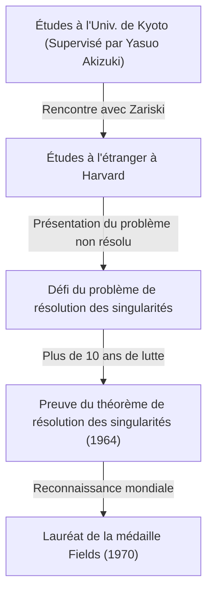
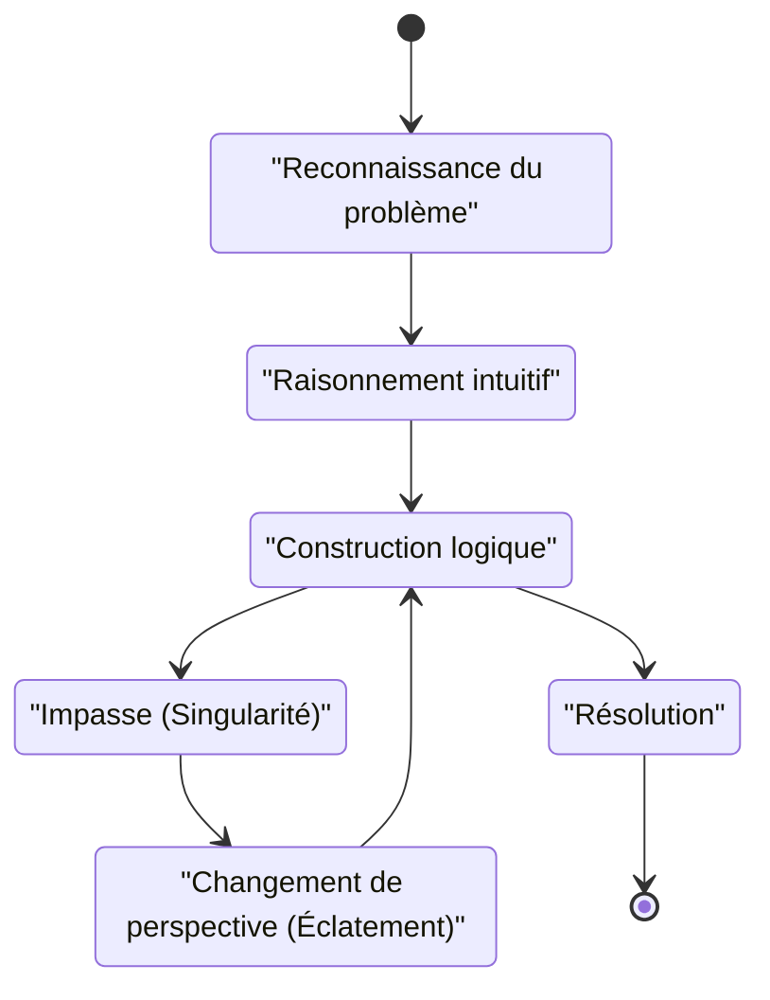

## Introduction

 **[Heisuke Hironaka](https://kenji.blog/p/hironaka-heisuke/)** est un mathématicien japonais qui a laissé une marque révolutionnaire dans le monde mathématique à la fin du 20e siècle, en particulier dans le domaine de la géométrie algébrique. La médaille Fields qu'il a reçue en 1970 est la plus haute distinction en mathématiques, décernée pour sa solution à la « résolution des singularités d'une variété algébrique sur un corps de caractéristique zéro » — un problème monumental que tout le monde à l'époque considérait comme impossible.

Dans cet article, nous plongeons profondément dans la vie dramatique de Hironaka, de son enfance à l'obtention de la médaille Fields, le contexte mathématique de son célèbre « Théorème de résolution des singularités », et la philosophie unique de la « créativité » qu'il a continuellement défendue.

## Enfance et Intérêts Divers

Né en 1931 dans la préfecture de Yamaguchi, au Japon, Hironaka a grandi dans une famille nombreuse de 15 frères et sœurs. Pendant son enfance, Hironaka ne s'est pas immédiatement distingué comme un génie mathématique. Il avait plutôt une profonde passion pour la musique, se plongeant dans la pratique du piano, et lisait abondamment de la littérature et de la philosophie, montrant une grande variété d'intérêts. Cette curiosité diverse et cette riche sensibilité sont devenues la source qui a plus tard produit sa liberté de pensée dans le monde abstrait des mathématiques.

## Rencontres Fatidiques à l'Université de Kyoto

Le moment décisif où il a choisi les mathématiques comme chemin pour la vie fut son entrée à la Faculté des Sciences de l'Université de Kyoto. Là, sous la direction du professeur **Yasuo Akizuki** , qui dirigeait l'algèbre japonaise, il a été fasciné par le monde profond de la géométrie algébrique.

Pendant son séjour à l'Université de Kyoto, Hironaka a eu l'occasion de rencontrer des chercheurs de premier plan tels que le mathématicien français **René Thom** , qui partagera plus tard la médaille Fields avec lui, et le maître mondial de la géométrie algébrique, **Oscar Zariski** . Zariski, en particulier, a hautement évalué le talent de Hironaka et l'a invité à l'Université d'Harvard.

## Le Défi d'un Problème Monumental : « Résolution des Singularités »

Lors de ses études à l'Université d'Harvard, Zariski a confié à Hironaka le « problème de résolution des singularités », sur lequel Zariski lui-même avait travaillé pendant de nombreuses années sans parvenir à une solution complète. C'était l'un des plus grands problèmes non résolus de la géométrie algébrique, que des mathématiciens de génie du monde entier avaient tenté de résoudre sans succès.

### Qu'est-ce qu'une Singularité ?

Une variété algébrique (une forme ou un espace défini par un système d'équations polynomiales) n'a pas toujours une surface lisse (différentiable). Elle peut avoir des points de rebroussement (cuspides) ou des points d'auto-intersection, que l'on appelle « singularités ».

Par exemple, considérez la courbe suivante (une courbe cuspidale) dans un plan 2D :

$$ y^2 = x^3 $$

Cette courbe présente un point aigu (une singularité) à l'origine $ (0, 0) $. En un tel point, la tangente n'est pas déterminée de manière unique, ce qui rend difficile l'application directe de méthodes analytiques telles que le calcul différentiel.

### Définition Mathématique de la Résolution des Singularités

La résolution des singularités consiste, intuitivement, à « transformer un espace présentant des singularités selon une certaine règle pour créer un espace complètement lisse ».

Exprimée strictement à l'aide de formules mathématiques, pour une variété algébrique $ X $ présentant des singularités, il s'agit de l'opération consistant à trouver une variété algébrique non singulière (lisse) $ \tilde{X} $ et un morphisme birationnel propre $ \pi: \tilde{X} \to X $.

$$ \pi : \tilde{X} \to X $$

Ici, si l'ensemble des singularités de $ X $ est noté $ \text{Singularités}(X) $, alors $ \pi $ est un isomorphisme sur le sous-ensemble qui lui est extérieur. En d'autres termes, en ne « dénouant » que les parties singulières, on la transforme en une variété lisse.

### La Méthode d'Éclatement (Blow-up)

L'opération géométrique principale utilisée par Hironaka fut l'« éclatement ».

En répétant les éclatements aux endroits appropriés, les singularités complexes sont simplifiées étape par étape. Cependant, dans les dimensions supérieures, déterminer l'ordre dans lequel effectuer les éclatements devenait extrêmement difficile, et une seule mauvaise opération risquait de conduire à une boucle infinie.

## Preuve Révolutionnaire et Médaille Fields

Alors que la preuve de la résolution des singularités en dimensions générales $ n $ était considérée comme sans espoir, Hironaka a hautement abstrait la théorie des anneaux locaux et a utilisé une récurrence extrêmement complexe pour prouver que la résolution des singularités est possible pour des variétés algébriques de toute dimension sur un corps de caractéristique zéro.

Publié dans les "Annals of Mathematics" en 1964, l'article de plusieurs centaines de pages a stupéfié les mathématiciens du monde entier, et Hironaka a reçu la médaille Fields en 1970.

## La Créativité et la Philosophie des « Singularités Intellectuelles »

Hironaka est également connu pour ses déclarations philosophiques concernant ses méthodes de pensée uniques et sa créativité.

Dans son livre « La Découverte de l'érudition », il s'est décrit non pas comme un « génie », mais comme une « personne d'effort ». L'« endurance » de continuer à penser pendant des centaines d'heures fut son arme.

Pour Hironaka, arriver à une impasse dans la réflexion (une singularité intellectuelle) n'était pas un échec, mais une occasion parfaite d'introduire une nouvelle perspective (un éclatement). Cette philosophie résonne magnifiquement avec sa propre réussite mathématique.

## Conclusion

Le théorème de résolution des singularités de [Heisuke Hironaka](https://kenji.blog/p/hironaka-heisuke/) a transformé le paysage de la géométrie algébrique et reste un outil indispensable dans divers domaines comme la théorie des supercordes. Face à des murs difficiles, son attitude consistant à « dénouer » les enchevêtrements complexes continue de fasciner de nombreuses personnes aujourd'hui.
