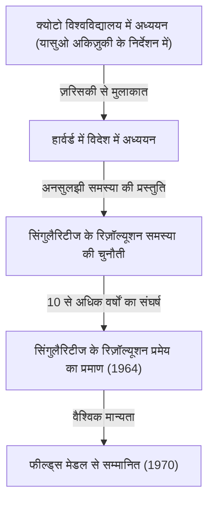
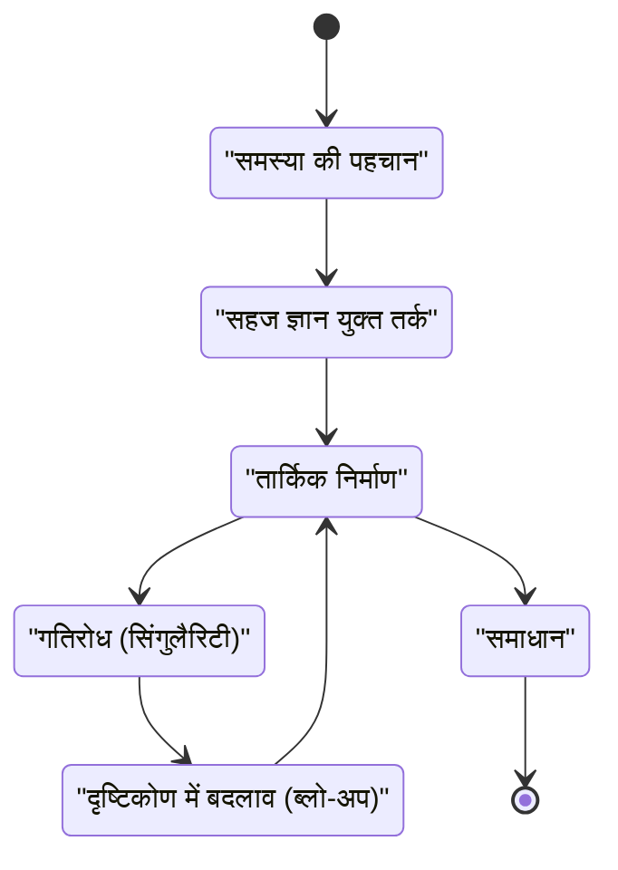

## परिचय

 **[हेसुके हिरोनाका](https://kenji.blog/hi/p/hironaka-heisuke/)** एक जापानी गणितज्ञ हैं जिन्होंने 20वीं सदी के उत्तरार्ध में गणितीय दुनिया में, विशेष रूप से बीजगणितीय ज्यामिति के क्षेत्र में, एक क्रांतिकारी छाप छोड़ी। 1970 में उन्हें मिला फील्ड्स मेडल गणित में सर्वोच्च सम्मान है, जो "विशेषता शून्य के क्षेत्र में बीजीय किस्म की विलक्षणताओं (सिंगुलैरिटीज) के संकल्प" के उनके समाधान के लिए प्रदान किया गया था - एक स्मारकीय समस्या जिसे उस समय हर कोई असंभव मानता था।

इस लेख में, हम हिरोनाका के बचपन से लेकर उनके फील्ड्स मेडल पुरस्कार तक के नाटकीय जीवन, उनके पर्याय "सिंगुलैरिटीज के रिज़ॉल्यूशन प्रमेय" की गणितीय पृष्ठभूमि और "रचनात्मकता" के संबंध में अद्वितीय दर्शन के बारे में गहराई से जानेंगे जिसकी उन्होंने निरंतर वकालत की।

## बचपन और विविध रुचियां

1931 में जापान के यामागुची प्रान्त में जन्मे हिरोनाका 15 भाई-बहनों के एक बड़े परिवार में पले-बढ़े। अपने बचपन के दौरान, हिरोनाका तुरंत एक गणितीय प्रतिभा के रूप में सामने नहीं आए। बल्कि, उन्हें संगीत का गहरा शौक था, पियानो बजाने में वे तल्लीन रहते थे, और उन्होंने साहित्य और दर्शनशास्त्र का बड़े पैमाने पर अध्ययन किया, जिससे उनकी कई तरह की रुचियां दिखाई देती हैं। यह विविध जिज्ञासा और समृद्ध संवेदनशीलता ही वह स्रोत बन गई जिसने बाद में गणित की अमूर्त दुनिया में उनकी स्वतंत्र सोच को जन्म दिया।

## क्योटो विश्वविद्यालय में भाग्यपूर्ण मुलाकातें

निर्णायक क्षण जब उन्होंने गणित को अपने आजीवन मार्ग के रूप में चुना, वह क्योटो विश्वविद्यालय के विज्ञान संकाय में उनका नामांकन था। वहां, जापानी बीजगणित का नेतृत्व करने वाले प्रोफेसर **यासुओ अकिज़ुकी** के मार्गदर्शन में, वे बीजगणितीय ज्यामिति की गहरी दुनिया से आकर्षित हुए।

क्योटो विश्वविद्यालय में अपने समय के दौरान, हिरोनाका को फ्रांसीसी गणितज्ञ **रेने थॉम** , जो बाद में उनके साथ फील्ड्स मेडल साझा करेंगे, और बीजगणितीय ज्यामिति के वैश्विक मास्टर, **ऑस्कर ज़रिसकी** जैसे प्रथम श्रेणी के शोधकर्ताओं से मिलने का अवसर मिला। विशेष रूप से ज़रिसकी ने हिरोनाका की प्रतिभा का अत्यधिक मूल्यांकन किया और उन्हें हार्वर्ड विश्वविद्यालय में आमंत्रित किया।

## स्मारकीय समस्या को चुनौती: "सिंगुलैरिटीज का रिज़ॉल्यूशन"

हार्वर्ड विश्वविद्यालय में विदेश में अध्ययन करने पर, ज़रिसकी ने हिरोनाका को "सिंगुलैरिटीज के रिज़ॉल्यूशन समस्या" सौंपी, जिस पर स्वयं ज़रिसकी ने पूर्ण समाधान तक पहुंचे बिना कई वर्षों तक काम किया था। यह बीजगणितीय ज्यामिति की सबसे बड़ी अनसुलझी समस्याओं में से एक थी, जिसे दुनिया भर के प्रतिभाशाली गणितज्ञों ने आजमाया और असफल रहे थे।

### सिंगुलैरिटी क्या है?

एक बीजगणितीय किस्म (बहुपद समीकरणों की एक प्रणाली द्वारा परिभाषित एक आकार या स्थान) की हमेशा एक चिकनी (विभेदक) सतह नहीं होती है। इसमें कस्प या आत्म-प्रतिच्छेदन वाले बिंदु हो सकते हैं, जिन्हें "सिंगुलैरिटीज" कहा जाता है।

उदाहरण के लिए, 2D तल में निम्नलिखित वक्र (एक कस्पाइडल वक्र) पर विचार करें:

$$ y^2 = x^3 $$

इस वक्र में उद्गम $ (0, 0) $ पर एक तीखा बिंदु (एक सिंगुलैरिटी) है। ऐसे बिंदु पर, स्पर्शरेखा विशिष्ट रूप से निर्धारित नहीं होती है, जिससे कलन जैसी विश्लेषणात्मक विधियों को सीधे लागू करना मुश्किल हो जाता है।

### सिंगुलैरिटीज के रिज़ॉल्यूशन की गणितीय परिभाषा

सिंगुलैरिटीज का रिज़ॉल्यूशन सहज रूप से "एक पूरी तरह से चिकनी जगह बनाने के लिए एक निश्चित नियम के अनुसार सिंगुलैरिटीज वाले स्थान को बदलना" है।

गणितीय सूत्रों का उपयोग करते हुए कड़ाई से व्यक्त किया गया है, सिंगुलैरिटीज के साथ एक बीजीय किस्म $ X $ के लिए, यह एक गैर-विलक्षण (चिकनी) बीजीय किस्म $ \tilde{X} $ और एक उचित द्वितार्किक रूपवाद $ \pi: \tilde{X} \to X $ खोजने का संचालन है।

$$ \pi : \tilde{X} \to X $$

यहाँ, यदि $ X $ की सिंगुलैरिटीज के समुच्चय को $ \text{सिंगुलैरिटीज}(X) $ के रूप में दर्शाया जाता है, तो $ \pi $ इसके बाहर के उपसमुच्चय पर एक समरूपता है। दूसरे शब्दों में, केवल सिंगुलैरिटी भागों को "सुलझाकर", इसे एक चिकनी किस्म में बदल दिया जाता है।

### ब्लो-अप विधि

हिरोनाका द्वारा उपयोग किया जाने वाला प्राथमिक ज्यामितीय ऑपरेशन "ब्लो-अप" था।

उचित स्थानों पर ब्लो-अप दोहराकर, जटिल सिंगुलैरिटीज को चरण-दर-चरण सरल बनाया जाता है। हालांकि, उच्च आयामों में, किस क्रम में ब्लो-अप करना है, यह निर्धारित करना बेहद मुश्किल हो गया, और एक गलत ऑपरेशन ने अनंत लूप में गिरने का जोखिम उठाया।

## अभूतपूर्व प्रमाण और फील्ड्स मेडल

जहां सामान्य $ n $ आयामों में सिंगुलैरिटीज के रिज़ॉल्यूशन का प्रमाण निराशाजनक माना जाता था, हिरोनाका ने स्थानीय वलय के सिद्धांत को अत्यधिक अमूर्त किया और यह साबित करने के लिए अत्यंत जटिल प्रेरण का उपयोग किया कि विशेषता शून्य के क्षेत्र में किसी भी आयाम की बीजीय किस्मों के लिए सिंगुलैरिटीज का रिज़ॉल्यूशन संभव है।

1964 में "एनाल्स ऑफ मैथमेटिक्स" में प्रकाशित, सैकड़ों पृष्ठों लंबे पेपर ने दुनिया भर के गणितज्ञों को चकित कर दिया, और हिरोनाका को 1970 में फील्ड्स मेडल से सम्मानित किया गया।

## रचनात्मकता और "बौद्धिक सिंगुलैरिटीज" का दर्शन

हिरोनाका को उनके अद्वितीय सोच के तरीकों और रचनात्मकता के संबंध में उनके दार्शनिक बयानों के लिए भी जाना जाता है।

अपनी पुस्तक "द डिस्कवरी ऑफ स्कॉलरशिप" में, उन्होंने खुद को एक "जीनियस" के रूप में नहीं बल्कि एक "प्रयास के व्यक्ति" के रूप में वर्णित किया है। सैकड़ों घंटों तक सोचते रहने की "सहनशक्ति" उनका हथियार था।

हिरोनाका के लिए, सोच में गतिरोध (एक बौद्धिक सिंगुलैरिटी) तक पहुंचना कोई विफलता नहीं थी, बल्कि एक नया दृष्टिकोण (एक ब्लो-अप) पेश करने का एक सही अवसर था। यह दर्शन उनकी गणितीय उपलब्धि के साथ खूबसूरती से प्रतिध्वनित होता है।

## निष्कर्ष

[हेसुके हिरोनाका](https://kenji.blog/hi/p/hironaka-heisuke/) के सिंगुलैरिटीज के रिज़ॉल्यूशन प्रमेय ने बीजगणितीय ज्यामिति के परिदृश्य को बदल दिया और सुपरस्ट्रिंग सिद्धांत जैसे विविध क्षेत्रों में एक अनिवार्य उपकरण बना हुआ है। कठिन दीवारों का सामना करने पर, जटिल उलझनों को "सुलझाने" का उनका दृष्टिकोण आज भी कई लोगों को आकर्षित करता है।
