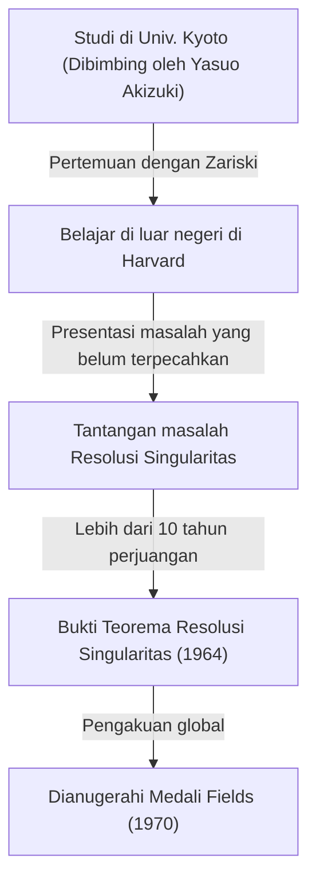
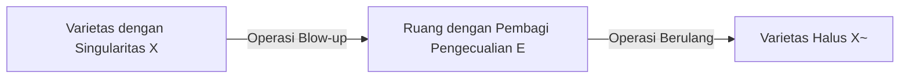
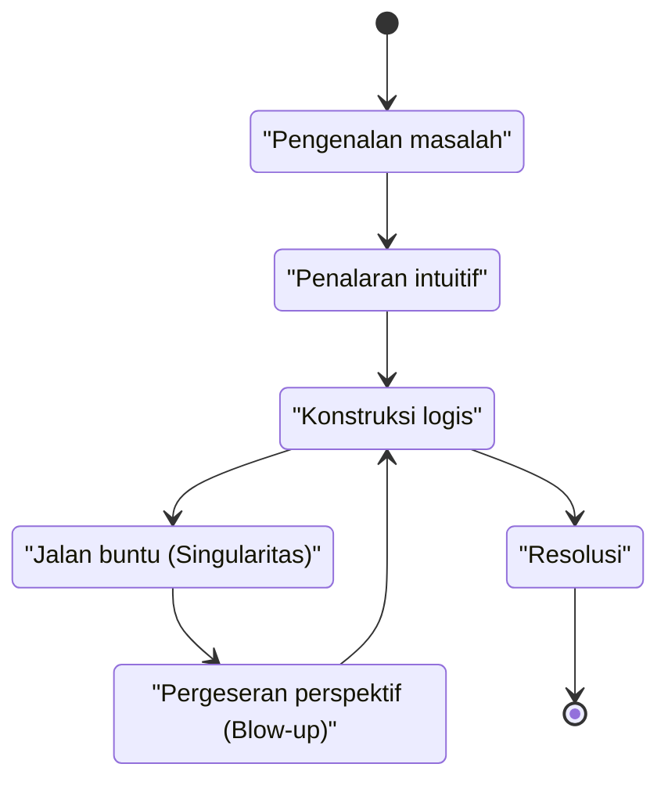

## Pengantar

 **Heisuke Hironaka** adalah seorang matematikawan Jepang yang meninggalkan jejak revolusioner dalam dunia matematika pada akhir abad ke-20, khususnya di bidang geometri aljabar. Medali Fields yang ia terima pada tahun 1970 adalah penghargaan tertinggi dalam matematika, diberikan atas solusinya untuk "resolusi singularitas varietas aljabar di atas lapangan dengan karakteristik nol"—sebuah masalah monumental yang pada saat itu dianggap mustahil oleh semua orang.

Dalam artikel ini, kita menyelami lebih dalam kehidupan dramatis Hironaka dari masa kecilnya hingga penghargaan Medali Fields-nya, latar belakang matematis dari "Teorema Resolusi Singularitas" yang identik dengannya, dan filosofi unik mengenai "kreativitas" yang terus ia advokasi.

## Masa Kecil dan Minat yang Beragam

Lahir pada tahun 1931 di Prefektur Yamaguchi, Jepang, Hironaka tumbuh dalam keluarga besar dengan 15 bersaudara. Selama masa kecilnya, Hironaka tidak langsung menonjol sebagai jenius matematika. Sebaliknya, ia memiliki hasrat yang dalam pada musik, membenamkan dirinya dalam bermain piano, dan banyak membaca sastra serta filosofi, menunjukkan minat yang sangat beragam. Keingintahuan yang beragam dan kepekaan yang kaya ini menjadi sumber yang kemudian menghasilkan pemikirannya yang bebas di dunia abstrak matematika.

## Pertemuan Bersejarah di Universitas Kyoto

Momen menentukan ketika ia memilih matematika sebagai jalan hidupnya adalah pendaftarannya di Fakultas Sains di Universitas Kyoto. Di sana, di bawah bimbingan Profesor **Yasuo Akizuki** , yang memimpin aljabar Jepang, ia menjadi terpesona oleh dunia geometri aljabar yang mendalam.

Selama waktunya di Universitas Kyoto, Hironaka berkesempatan bertemu dengan para peneliti kelas satu seperti matematikawan Prancis **René Thom** , yang nantinya akan berbagi Medali Fields dengannya, dan master global geometri aljabar, **Oscar Zariski** . Zariski, secara khusus, sangat mengevaluasi bakat Hironaka dan mengundangnya ke Universitas Harvard.

## Menantang Masalah Monumental: "Resolusi Singularitas"

Saat belajar di luar negeri di Universitas Harvard, Zariski mempercayakan Hironaka dengan "masalah resolusi singularitas," yang Zariski sendiri telah kerjakan selama bertahun-tahun tanpa mencapai solusi lengkap. Ini adalah salah satu masalah terbesar yang belum terpecahkan dalam geometri aljabar, yang coba dipecahkan oleh matematikawan jenius di seluruh dunia namun gagal.

### Apa itu Singularitas?

Sebuah varietas aljabar (sebuah bentuk atau ruang yang didefinisikan oleh sistem persamaan polinomial) tidak selalu memiliki permukaan yang halus (dapat didiferensiasi). Ia dapat memiliki titik puncak (cusp) atau titik dengan persimpangan mandiri, yang disebut "singularitas".

Misalnya, pertimbangkan kurva berikut (kurva kuspidal) pada bidang 2D:

$$ y^2 = x^3 $$

Kurva ini memiliki titik tajam (sebuah singularitas) pada titik asal $ (0, 0) $. Pada titik tersebut, garis singgung tidak ditentukan secara unik, sehingga sulit untuk menerapkan metode analitik secara langsung seperti kalkulus.

### Definisi Matematis dari Resolusi Singularitas

Resolusi singularitas secara intuitif adalah "mengubah ruang dengan singularitas sesuai dengan aturan tertentu untuk menciptakan ruang yang benar-benar halus."

Dinyatakan secara ketat menggunakan rumus matematika, untuk varietas aljabar $ X $ dengan singularitas, ini adalah operasi untuk menemukan varietas aljabar non-singular (halus) $ \tilde{X} $ dan morfisme birasional yang tepat $ \pi: \tilde{X} \to X $.

$$ \pi : \tilde{X} \to X $$

Di sini, jika himpunan singularitas $ X $ dilambangkan sebagai $ \text{Singularitas}(X) $, maka $ \pi $ adalah isomorfisme pada subset di luarnya. Dengan kata lain, dengan hanya "mengurai" bagian singularitas, ia diubah menjadi varietas yang halus.

### Metode Blow-up

Operasi geometris utama yang digunakan Hironaka adalah "blow-up".

Dengan mengulangi blow-up pada tempat yang tepat, singularitas yang kompleks disederhanakan langkah demi langkah. Namun, dalam dimensi yang lebih tinggi, menentukan urutan dalam melakukan blow-up menjadi sangat sulit, dan satu operasi yang salah membawa risiko jatuh ke dalam loop tak terbatas.

## Bukti Terobosan dan Medali Fields

Sementara bukti resolusi singularitas dalam dimensi $ n $ umum dianggap tanpa harapan, Hironaka sangat mengabstraksi teori cincin lokal dan menggunakan induksi yang sangat kompleks untuk membuktikan bahwa resolusi singularitas dimungkinkan untuk varietas aljabar dimensi berapa pun di atas lapangan dengan karakteristik nol.

Diterbitkan dalam "Annals of Mathematics" pada tahun 1964, makalah sepanjang ratusan halaman itu mencengangkan para matematikawan di seluruh dunia, dan Hironaka dianugerahi Medali Fields pada tahun 1970.

## Kreativitas dan Filosofi "Singularitas Intelektual"

Hironaka juga dikenal karena pernyataan filosofisnya mengenai metode berpikir dan kreativitasnya yang unik.

Dalam bukunya "The Discovery of Scholarship," ia menggambarkan dirinya bukan sebagai "jenius" tetapi sebagai "orang yang berusaha." "Daya tahan" untuk terus berpikir selama ratusan jam adalah senjatanya.

Bagi Hironaka, menemui jalan buntu dalam berpikir (sebuah singularitas intelektual) bukanlah sebuah kegagalan, melainkan kesempatan sempurna untuk memperkenalkan perspektif baru (sebuah blow-up). Filosofi ini beresonansi indah dengan pencapaian matematisnya sendiri.

## Kesimpulan

Teorema Resolusi Singularitas Heisuke Hironaka mengubah lanskap geometri aljabar dan tetap menjadi alat yang sangat diperlukan dalam berbagai bidang seperti teori superstring. Ketika dihadapkan pada dinding yang sulit, sikapnya "mengurai" keterikatan yang kompleks terus mempesona banyak orang hingga saat ini.
