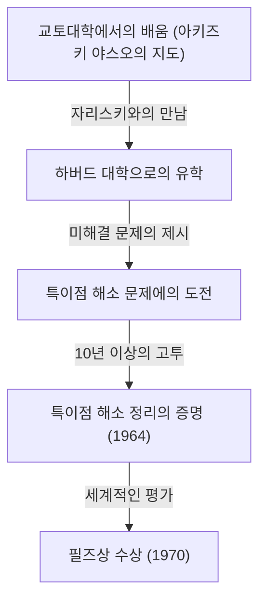
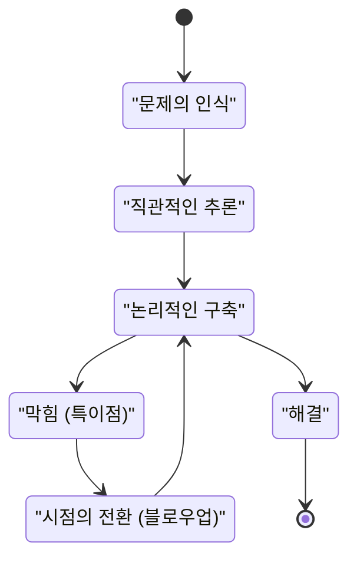

## 서론

 **히로나카 헤이스케** 는 20세기 후반 수학계, 특히 대수기하학 분야에서 혁명적인 업적을 남긴 일본의 수학자입니다. 그가 1970년에 수상한 필즈상은 수학계 최고의 영예이며, 수상 이유는 당시 모두가 불가능하다고 생각했던 초난제인 "표수 0인 체 위의 대수 다양체에서 특이점 해소"를 해결했기 때문입니다.

본 기사에서는 히로나카의 어린 시절부터 필즈상 수상에 이르기까지의 극적인 생애, 그의 대명사라고도 할 수 있는 '특이점 해소 정리'의 수학적 배경, 그리고 그가 지속적으로 주창한 '창조성'에 관한 독자적인 철학에 대해 깊이 파헤쳐 봅니다.

## 소년 시절과 다양한 관심사

1931년 야마구치현에서 태어난 히로나카는 15남매의 대가족 속에서 자랐습니다. 어린 시절의 히로나카는 처음부터 수학 천재로서 두각을 나타낸 것은 아니었습니다. 오히려 음악에 대한 열정이 깊어 피아노 연주에 몰두하거나, 문학과 철학 책을 탐독하는 등 관심사가 매우 다양했습니다. 이러한 다양한 관심과 풍부한 감수성이 훗날 직면하게 될 추상적인 수학의 세계에서 자유로운 발상을 낳는 원천이 되었습니다.

## 교토대학에서의 운명적인 만남

그가 수학을 평생의 길로 선택하게 된 결정적인 계기는 교토대학 이학부로의 진학이었습니다. 그곳에서 일본의 대수학을 이끌던 **아키즈키 야스오** 교수의 지도를 받으며 대수기하학의 심오한 세계에 매료되어 갔습니다.

교토대학 시절, 히로나카는 훗날 함께 필즈상을 수상하게 되는 프랑스의 수학자 **르네 톰** 이나, 대수기하학의 세계적인 거장 **오스카 자리스키** 와 같은 일류 연구자들과 만날 기회를 얻게 됩니다. 특히 자리스키는 히로나카의 재능을 높이 평가하여 그를 하버드 대학으로 초청했습니다.

## 초난제 '특이점 해소 문제'에의 도전

하버드 대학으로 유학 온 히로나카에게, 자리스키는 자신이 오랫동안 연구했지만 완전한 해결에 이르지 못했던 '특이점 해소 문제'를 맡겼습니다. 이것은 당시 전 세계의 천재 수학자들이 도전했다가 실패했던 대수기하학 최대의 난제 중 하나였습니다.

### 특이점이란 무엇인가?

대수 다양체(다항식의 방정식계에 의해 정의되는 도형이나 공간)가 항상 매끄러운(미분 가능한) 표면을 가지고 있는 것은 아닙니다. 뾰족한 점(커스프)이나 자기 교차를 가진 점이 존재할 수 있으며, 이를 '특이점'이라고 부릅니다.

예를 들어, 다음의 2차원 평면상의 곡선(커스프 곡선)을 생각해 봅시다.

$$ y^2 = x^3 $$

이 곡선은 원점 $ (0, 0) $ 에서 뾰족한 점(특이점)을 가집니다. 이러한 점에서는 접선이 유일하게 결정되지 않아 미적분 등의 해석적 기법을 직접 적용하기가 매우 어렵습니다.

### 특이점 해소의 수학적 정의

특이점 해소란 직관적으로 말하면 "특이점을 가진 공간을 어떤 규칙에 따라 변형하여 완전히 매끄러운 공간을 만들어내는 것"입니다.

수식을 사용하여 엄밀하게 표현하면, 특이점을 가진 대수 다양체 $ X $ 에 대해 비특이(매끄러운) 대수 다양체 $ \tilde{X} $ 와 고유 쌍유리 사상 $ \pi: \tilde{X} \to X $ 를 찾아내는 조작입니다.

$$ \pi : \tilde{X} \to X $$

여기서 $ X $ 의 특이점 집합을 $ \text{특이점}(X) $ 라고 했을 때, 그 바깥쪽 부분집합에서는 $ \pi $ 가 동형 사상이 됩니다. 즉, 특이점 부분만을 "풀어해침"으로써 매끄러운 다양체로 변환하는 것입니다.

### 블로우업(폭발)이라는 기법

히로나카가 구사한 주요 기하학적 조작이 '블로우업(폭발)'입니다.

블로우업을 적절한 장소에서 반복함으로써 복잡한 특이점을 단계적으로 단순화합니다. 그러나 고차원에서는 어느 순서로 블로우업해야 할지 결정하는 것이 극히 어려우며, 잘못된 조작을 하면 무한 루프에 빠질 위험이 있었습니다.

## 획기적인 증명과 필즈상

일반적인 $ n $ 차원에서의 특이점 해소 증명은 절망적인 것으로 여겨졌으나, 히로나카는 국소환의 이론을 고도로 추상화하고 복잡하기 짝이 없는 귀납법을 구사하여 표수 0인 임의의 차원의 대수 다양체에서 특이점 해소가 가능함을 마침내 증명했습니다.

1964년 『Annals of Mathematics』에 게재된 수백 페이지에 달하는 논문은 전 세계의 수학자들을 경탄하게 했으며, 히로나카는 이로 인해 1970년에 필즈상을 수여받았습니다.

## 창조성과 '지적 특이점'의 철학

히로나카는 독특한 사고법이나 창조성에 관한 철학적인 발언으로도 잘 알려져 있습니다.

그는 저서 『학문의 발견』에서 스스로를 결코 '천재'가 아니라 '노력하는 사람'이라고 말하고 있습니다. 수백 시간이고 계속 생각할 수 있는 '지속력'이야말로 그의 무기였습니다.

히로나카에게 있어 사고가 막히는 것(지적인 특이점)은 실패가 아니라 새로운 시점(블로우업)을 도입하기 위한 절호의 기회였습니다. 이 철학은 그의 수학적 업적인 특이점 해소 정리 그 자체와 아름답게 공명하고 있습니다.

## 결론

히로나카 헤이스케의 특이점 해소 정리는 대수기하학의 풍경을 완전히 바꾸어 놓았으며, 초끈이론 등 다방면에 걸친 분야에서 필수불가결한 도구가 되었습니다. 곤란한 벽에 직면했을 때 복잡하게 얽힌 것을 "풀어해치는" 그의 자세는 오늘날에도 많은 사람들을 매료시키고 있습니다.
