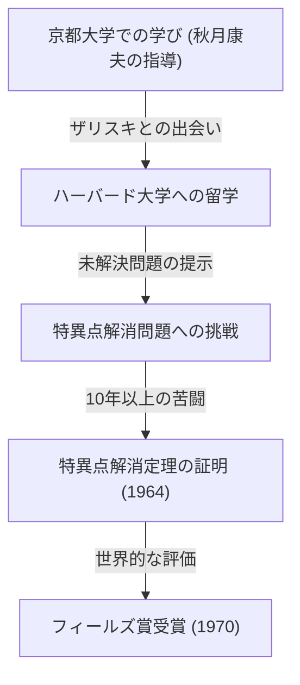
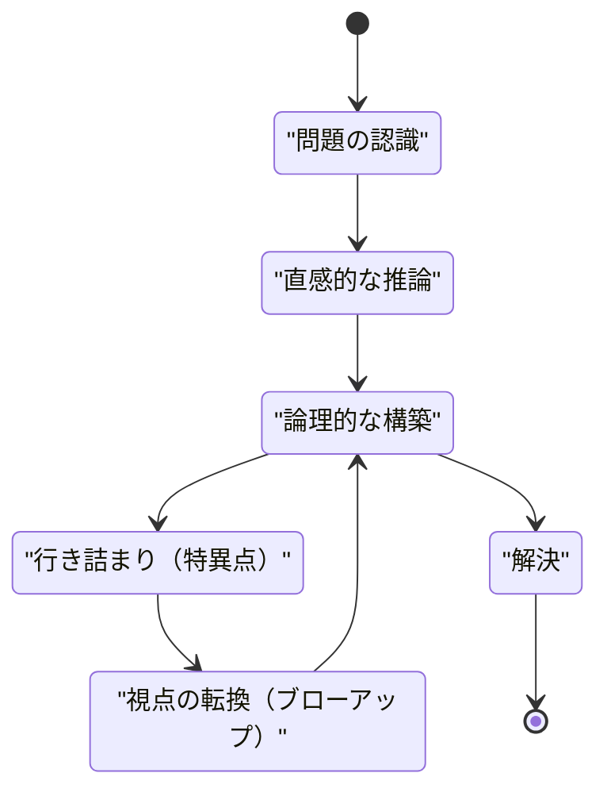

## はじめに

 **広中平祐** （ひろなか へいすけ）は、20世紀後半の数学界、特に代数幾何学の分野において革命的な業績を残した日本の数学者です。彼が1970年に受賞したフィールズ賞は、数学界における最高の栄誉であり、その受賞理由は「標数0の体上の代数多様体における特異点の解消」という、当時誰もが不可能だと考えていた超難問の解決でした。

本記事では、広中の幼少期からフィールズ賞受賞に至るまでの劇的な生涯、彼の代名詞とも言える「特異点解消定理」の数学的背景、そして彼が提唱し続けた「創造性」に関する独自の哲学について、深く掘り下げていきます。

## 少年時代と多様な興味

1931年（昭和6年）、山口県に生まれた広中は、15人兄弟の大家族の中で育ちました。少年時代の広中は、最初から数学の天才として頭角を現していたわけではありません。むしろ、音楽に対する情熱が深く、ピアノの演奏に没頭したり、文学や哲学の本を読み漁るなど、関心は多岐にわたっていました。この多様な興味と豊かな感受性が、後に直面する抽象的な数学の世界において、自由な発想を生み出す源泉となりました。

## 京都大学での運命的な出会い

彼が数学を生涯の道として選ぶ決定的な契機となったのは、京都大学理学部への進学です。そこで日本の代数学を牽引していた **秋月康夫** 教授の指導を受け、代数幾何学の深遠な世界に魅了されていきました。

京都大学時代、広中は後に共にフィールズ賞を受賞する **ルネ・トム** や、代数幾何学の世界的巨匠である **オスカー・ザリスキ** といった一流の研究者たちと出会います。特にザリスキは広中の才能を高く評価し、彼をハーバード大学へと招き入れました。

## 超難問「特異点解消問題」への挑戦

ハーバード大学へ留学した広中に対し、ザリスキは自身が長年取り組み完全な解決に至っていなかった「特異点解消問題」を託しました。これは当時の世界中の天才数学者たちが挑み、敗退していた最大の難問の一つでした。

### 特異点とは何か？

代数多様体（多項式の方程式系によって定義される図形や空間）は、常に滑らかな表面を持っているとは限りません。尖点（カスプ）や自己交叉を持つ点が存在することがあり、これを「特異点」と呼びます。

例えば、次の2次元平面上の曲線（カスプ曲線）を考えます。

$$ y^2 = x^3 $$

この曲線は原点 $ (0, 0) $ において尖った特異点を持ちます。このような点では接線が一意に定まらず、微積分などの解析的手法を直接適用することが困難になります。

### 特異点解消の数学的定義

特異点解消とは、「特異点を持つ空間を、ある規則に従って変形し、完全に滑らかな空間を作り出すこと」です。

数式で厳密に表現すると、特異点を持つ代数多様体 $ X $ に対して、非特異な代数多様体 $ \tilde{X} $ と、固有な双有理射 $ \pi: \tilde{X} \to X $ を見つけ出す操作です。

$$ \pi : \tilde{X} \to X $$

ここで、$ X $ の特異点集合を $ \text{特異点}(X) $ としたとき、その外側の部分集合においては、$ \pi $ は同型写像となります。つまり、特異点の部分だけを「解きほぐす」ことによって、滑らかな多様体へと変換します。

### 爆発（ブローアップ）という手法

広中が駆使した主要な幾何学的操作が「ブローアップ（爆発）」です。

ブローアップを適切な場所で繰り返すことで、複雑な特異点を段階的に単純化します。しかし高次元では、どの順番でブローアップすべきか決定することが極めて困難であり、誤った操作を行うと無限ループに陥る危険がありました。

## 画期的な証明とフィールズ賞

一般の $ n $ 次元における特異点解消の証明は絶望的とされていましたが、広中は局所環の理論を高度に抽象化し、複雑極まる帰納法を駆使して、標数0の任意の次元の代数多様体において特異点解消が可能であることを証明しました。

1964年に『Annals of Mathematics』に掲載された数百ページに及ぶ論文は世界中の数学者を驚嘆させ、広中は1970年にフィールズ賞を授与されました。

## 創造性と「知的な特異点」の哲学

広中は独特の思考法や創造性に関する哲学的な発言でも知られています。

彼は著書『学問の発見』の中で、自らを「天才」ではなく「努力の人」と語っています。何百時間も考え続けることができる「持続力」こそが彼の武器でした。

広中にとって、思考が行き詰まること（知的な特異点）は失敗ではなく、新たな視点（ブローアップ）を導入するための絶好の機会でした。この哲学は、彼の数学的業績そのものと美しく共鳴しています。

## 結論

広中平祐の特異点解消定理は代数幾何学の風景を一変させ、超弦理論などの多岐にわたる分野で不可欠なツールとなっています。困難な壁に直面したとき、複雑に絡み合ったものを「解きほぐす」彼の姿勢は、今日でも多くの人々を魅了し続けています。
