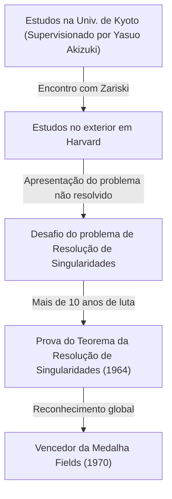
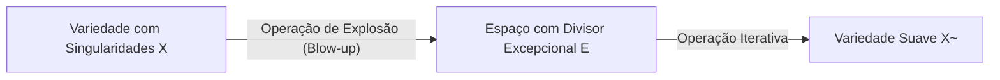
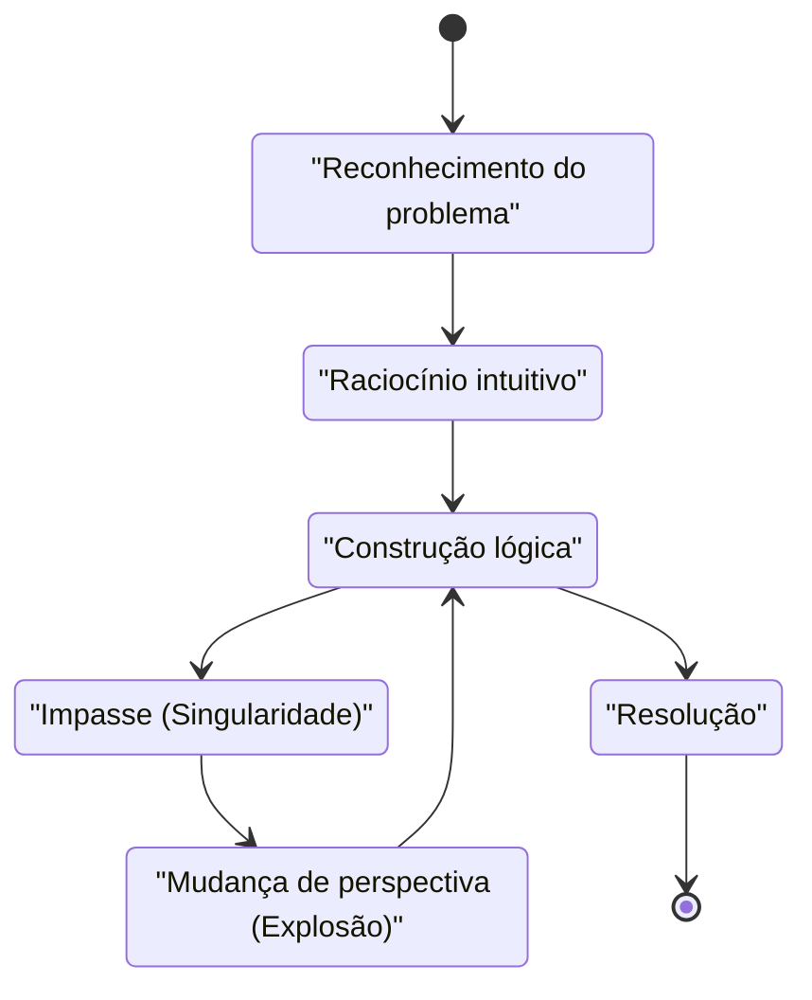

## Introdução

 **Heisuke Hironaka** é um matemático japonês que deixou uma marca revolucionária no mundo matemático no final do século 20, particularmente no campo da geometria algébrica. A Medalha Fields que ele recebeu em 1970 é a mais alta honraria da matemática, concedida por sua solução para a "resolução de singularidades de uma variedade algébrica sobre um corpo de característica zero" — um problema monumental que todos na época consideravam impossível.

Neste artigo, nos aprofundamos na vida dramática de Hironaka desde sua infância até o prêmio da Medalha Fields, o contexto matemático de seu homônimo "Teorema da Resolução de Singularidades", e a filosofia única sobre a "criatividade" que ele defendia continuamente.

## Infância e Interesses Diversos

Nascido em 1931 na província de Yamaguchi, no Japão, Hironaka cresceu em uma família grande de 15 irmãos. Durante sua infância, Hironaka não se destacou imediatamente como um gênio matemático. Em vez disso, ele tinha uma paixão profunda pela música, imergindo-se em tocar piano, e leu extensivamente literatura e filosofia, mostrando uma grande variedade de interesses. Essa curiosidade diversa e rica sensibilidade tornaram-se a fonte que mais tarde produziu seu pensamento livre no mundo abstrato da matemática.

## Encontros Fatídicos na Universidade de Kyoto

O momento decisivo em que ele escolheu a matemática como seu caminho de vida foi sua matrícula na Faculdade de Ciências da Universidade de Kyoto. Lá, sob a orientação do Professor **Yasuo Akizuki** , que liderava a álgebra japonesa, ele ficou fascinado pelo mundo profundo da geometria algébrica.

Durante seu tempo na Universidade de Kyoto, Hironaka teve a oportunidade de conhecer pesquisadores de primeira classe, como o matemático francês **René Thom** , que mais tarde compartilharia a Medalha Fields com ele, e o mestre mundial da geometria algébrica, **Oscar Zariski** . Zariski, em particular, avaliou muito o talento de Hironaka e o convidou para a Universidade de Harvard.

## Desafiando o Problema Monumental: "Resolução de Singularidades"

Ao estudar no exterior na Universidade de Harvard, Zariski confiou a Hironaka o "problema da resolução de singularidades", no qual o próprio Zariski havia trabalhado por muitos anos sem chegar a uma solução completa. Esse era um dos maiores problemas não resolvidos da geometria algébrica, que gênios matemáticos de todo o mundo haviam tentado e falhado.

### O que é uma Singularidade?

Uma variedade algébrica (uma forma ou espaço definido por um sistema de equações polinomiais) nem sempre tem uma superfície suave (diferenciável). Pode ter cúspides ou pontos com autointerseções, que são chamados de "singularidades".

Por exemplo, considere a seguinte curva (uma curva cuspidal) em um plano 2D:

$$ y^2 = x^3 $$

Esta curva tem um ponto agudo (uma singularidade) na origem $ (0, 0) $. Em tal ponto, a tangente não é determinada de forma única, dificultando a aplicação direta de métodos analíticos, como o cálculo.

### Definição Matemática da Resolução de Singularidades

A resolução de singularidades é, intuitivamente, "transformar um espaço com singularidades de acordo com uma certa regra para criar um espaço completamente suave".

Expresso estritamente usando fórmulas matemáticas, para uma variedade algébrica $ X $ com singularidades, é a operação de encontrar uma variedade algébrica não singular (suave) $ \tilde{X} $ e um morfismo birracional próprio $ \pi: \tilde{X} \to X $.

$$ \pi : \tilde{X} \to X $$

Aqui, se o conjunto de singularidades de $ X $ for denotado como $ \text{Singularidades}(X) $, então $ \pi $ é um isomorfismo no subconjunto fora dele. Em outras palavras, ao "desvendar" apenas as partes da singularidade, ela é transformada em uma variedade suave.

### O Método de Explosão (Blow-up)

A operação geométrica primária que Hironaka utilizou foi a "explosão" (blow-up).

Repetindo as explosões nos locais apropriados, as singularidades complexas são simplificadas passo a passo. No entanto, em dimensões superiores, determinar a ordem na qual explodir tornou-se extremamente difícil, e uma única operação errada acarretava o risco de cair em um loop infinito.

## Prova Inovadora e a Medalha Fields

Enquanto a prova da resolução de singularidades em dimensões $ n $ gerais era considerada sem esperança, Hironaka abstraiu muito a teoria dos anéis locais e utilizou uma indução extremamente complexa para provar que a resolução de singularidades é possível para variedades algébricas de qualquer dimensão sobre um corpo de característica zero.

Publicado no "Annals of Mathematics" em 1964, o artigo de centenas de páginas surpreendeu os matemáticos de todo o mundo, e Hironaka recebeu a Medalha Fields em 1970.

## Criatividade e a Filosofia das "Singularidades Intelectuais"

Hironaka também é conhecido por suas declarações filosóficas sobre seus métodos únicos de pensamento e criatividade.

Em seu livro "A Descoberta da Bolsa de Estudos", ele se descreveu não como um "gênio", mas como uma "pessoa de esforço". A "resistência" de continuar pensando por centenas de horas foi a sua arma.

Para Hironaka, chegar a um beco sem saída no pensamento (uma singularidade intelectual) não era um fracasso, mas uma oportunidade perfeita para introduzir uma nova perspectiva (uma explosão). Esta filosofia ressoa lindamente com sua própria conquista matemática.

## Conclusão

O Teorema da Resolução de Singularidades de Heisuke Hironaka transformou a paisagem da geometria algébrica e continua a ser uma ferramenta indispensável em diversos campos como a teoria das supercordas. Ao enfrentar paredes difíceis, sua atitude de "desvendar" emaranhados complexos continua a fascinar muitas pessoas hoje.
