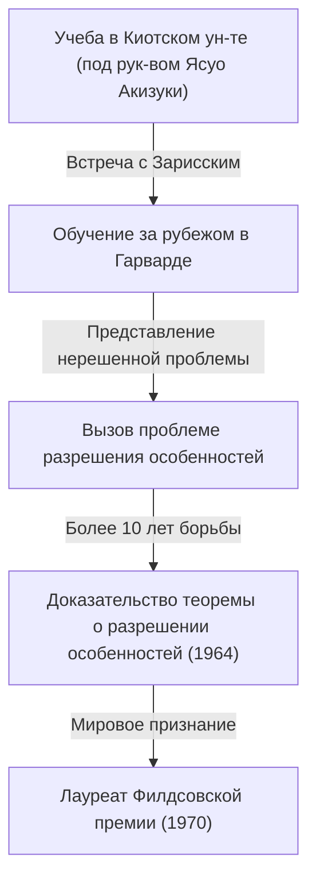
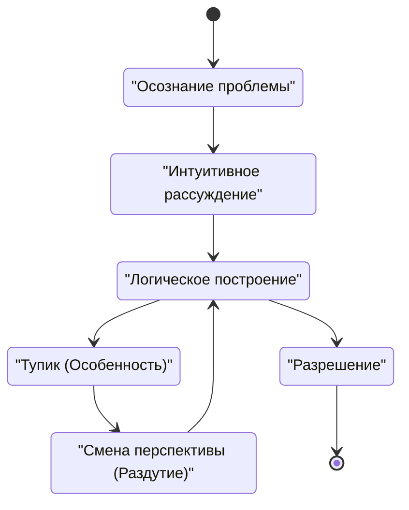

## Введение

 **Хэйсукэ Хиронака** — японский математик, оставивший революционный след в математическом мире в конце 20-го века, особенно в области алгебраической геометрии. Филдсовская премия, которую он получил в 1970 году, является высшей наградой в математике, присужденной за его решение «разрешения особенностей алгебраического многообразия над полем характеристики нуль» — монументальной проблемы, которую все в то время считали неразрешимой.

В этой статье мы глубоко погружаемся в драматичную жизнь Хиронаки от его детства до вручения Филдсовской премии, математическую подоплеку его одноименной «Теоремы о разрешении особенностей» и уникальную философию в отношении «творчества», которую он постоянно защищал.

## Детство и разнообразные интересы

Хиронака родился в 1931 году в префектуре Ямагути, Япония, и вырос в большой семье из 15 братьев и сестер. В детстве Хиронака не сразу выделялся как математический гений. Скорее, он питал глубокую страсть к музыке, погружаясь в игру на пианино, и много читал по литературе и философии, демонстрируя большое разнообразие интересов. Это разнообразное любопытство и богатая чувствительность стали источником, который позже породил его свободомыслие в абстрактном мире математики.

## Судьбоносные встречи в Киотском университете

Решающим моментом, когда он выбрал математику своим жизненным путем, стало его поступление на факультет естественных наук Киотского университета. Там, под руководством профессора **Ясуо Акизуки** , который был ведущим специалистом по алгебре в Японии, он был очарован глубоким миром алгебраической геометрии.

Во время учебы в Киотском университете Хиронака имел возможность встретиться с первоклассными исследователями, такими как французский математик **Рене Том** , который позже разделит с ним Филдсовскую премию, и мировой мастер алгебраической геометрии **Оскар Зарисский** . Зарисский, в частности, высоко оценил талант Хиронаки и пригласил его в Гарвардский университет.

## Вызов монументальной проблеме: «Разрешение особенностей»

Во время обучения за границей в Гарвардском университете Зарисский доверил Хиронаке «проблему разрешения особенностей», над которой сам Зарисский работал много лет, так и не найдя полного решения. Это была одна из величайших нерешенных проблем в алгебраической геометрии, которую пытались решить и потерпели неудачу гениальные математики со всего мира.

### Что такое особенность?

Алгебраическое многообразие (форма или пространство, определяемое системой полиномиальных уравнений) не всегда имеет гладкую (дифференцируемую) поверхность. Оно может иметь каспы или точки с самопересечениями, которые называются «особенностями».

Например, рассмотрим следующую кривую на 2D-плоскости:

$$ y^2 = x^3 $$

Эта кривая имеет острую точку (особенность) в начале координат $ (0, 0) $. В такой точке касательная не определяется однозначно, что затрудняет непосредственное применение аналитических методов, таких как исчисление.

### Математическое определение разрешения особенностей

Разрешение особенностей — это интуитивно «преобразование пространства с особенностями по определенному правилу для создания полностью гладкого пространства».

Выражаясь строго с использованием математических формул, для алгебраического многообразия $ X $ с особенностями это операция поиска неособого (гладкого) алгебраического многообразия $ \tilde{X} $ и собственного бирационального морфизма $ \pi: \tilde{X} \to X $.

$$ \pi : \tilde{X} \to X $$

Здесь, если множество особенностей $ X $ обозначается как $ \text{Особенности}(X) $, то $ \pi $ является изоморфизмом на подмножестве вне его. Другими словами, путем «распутывания» только частей с особенностями, оно преобразуется в гладкое многообразие.

### Метод раздутия (Blow-up)

Основной геометрической операцией, которую использовал Хиронака, было «раздутие» (blow-up).

Повторяя раздутия в соответствующих местах, сложные особенности шаг за шагом упрощаются. Однако в более высоких размерностях определение порядка раздутия стало чрезвычайно сложным, и одна неверная операция несла риск попадания в бесконечный цикл.

## Новаторское доказательство и Филдсовская премия

Хотя доказательство разрешения особенностей в общих $ n $-мерных пространствах считалось безнадежным, Хиронака сильно абстрагировал теорию локальных колец и использовал чрезвычайно сложную индукцию, чтобы доказать, что разрешение особенностей возможно для алгебраических многообразий любой размерности над полем характеристики нуль.

Опубликованная в "Annals of Mathematics" в 1964 году статья объемом в сотни страниц поразила математиков всего мира, и Хиронака был награжден Филдсовской премией в 1970 году.

## Творчество и философия «Интеллектуальных особенностей»

Хиронака также известен своими философскими высказываниями относительно его уникальных методов мышления и творчества.

В своей книге «Открытие науки» он описывал себя не как «гения», а как «человека усилий». «Выносливость», позволяющая продолжать думать сотни часов, была его оружием.

Для Хиронаки попадание в тупик в мышлении (интеллектуальная особенность) было не неудачей, а идеальной возможностью внедрить новую перспективу (раздутие). Эта философия прекрасно резонирует с его собственным математическим достижением.

## Заключение

Теорема о разрешении особенностей Хэйсукэ Хиронаки изменила ландшафт алгебраической геометрии и остается незаменимым инструментом в различных областях, таких как теория суперструн. Столкнувшись с трудными стенами, его позиция «распутывания» сложных хитросплетений продолжает очаровывать многих людей и сегодня.
