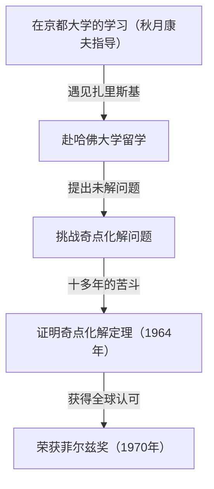
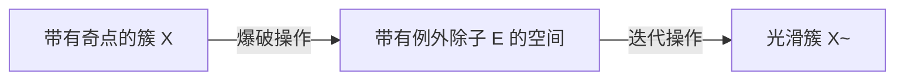
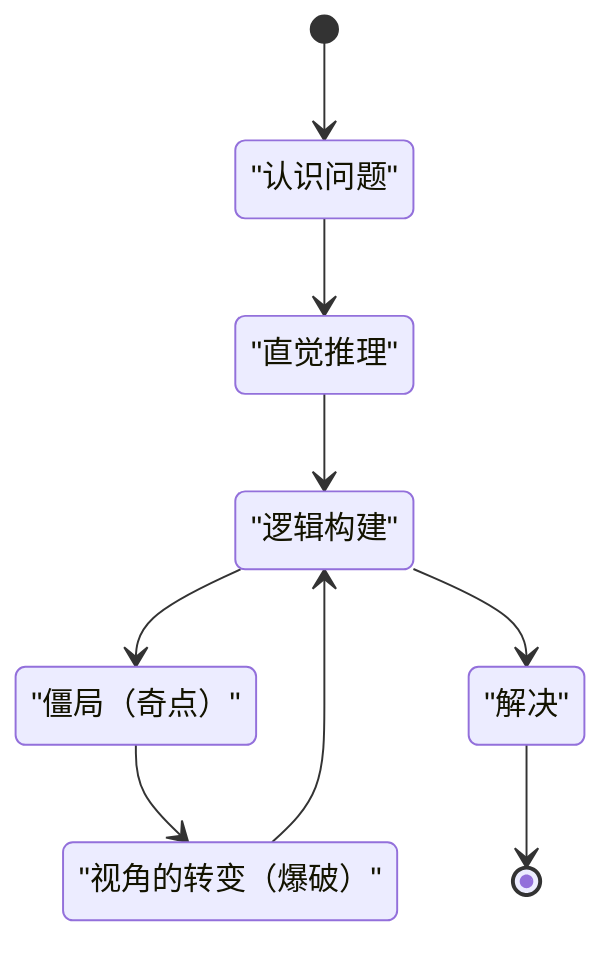

## 引言

 **广中平祐** 是一位在20世纪下半叶的数学界，尤其是在代数几何领域留下了革命性成就的日本数学家。他在1970年荣获的菲尔兹奖是数学界的最高荣誉，获奖理由是解决了当时所有人都认为不可能的超高难度问题——“特征为零的域上代数簇的奇点化解”。

在本文中，我们将深入探讨广中平祐从童年到获得菲尔兹奖的充满戏剧性的一生、作为其代名词的“奇点化解定理”的数学背景，以及他一直提倡的关于“创造力”的独特哲学。

## 童年与多样的兴趣

广中平祐于1931年出生于日本山口县，在一个有15个兄弟姐妹的大家庭中长大。童年时期的广中并非一开始就展现出数学天才的特质。相反，他对音乐有着深厚的热情，曾沉迷于弹奏钢琴，并且广泛阅读文学和哲学书籍，兴趣十分广泛。这种多样的兴趣和丰富的感受力，成为了他日后在抽象的数学世界中产生自由思想的源泉。

## 在京都大学的命运邂逅

促使他决定将数学作为终生道路的决定性契机是进入京都大学理学部学习。在那里，他接受了引领日本代数学的 **秋月康夫** 教授的指导，并被代数几何深奥的世界所吸引。

在京都大学期间，广中有机会结识了后来与他共同获得菲尔兹奖的法国数学家 **勒内·托姆** ，以及代数几何的世界级大师 **奥斯卡·扎里斯基** 等一流研究人员。特别是扎里斯基，他对广中的才华给予了高度评价，并邀请他前往哈佛大学。

## 挑战超级难题“奇点化解问题”

对于在哈佛大学留学的广中，扎里斯基将自己多年来致力于但未能完全解决的“奇点化解问题”托付给了他。这是当时全世界的天才数学家们都曾挑战却纷纷败退的代数几何最大难题之一。

### 什么是奇点？

代数簇（由多项式方程组定义的图形或空间）并不总是拥有光滑的表面。有时会存在尖点或具有自交点的点，这被称为“奇点”。

例如，考虑二维平面上的以下曲线（尖点曲线）：

$$ y^2 = x^3 $$

这条曲线在原点 $ (0, 0) $ 处有一个尖锐的点（奇点）。在这样的点上，切线无法唯一确定，使得微积分等解析方法难以直接应用。

### 奇点化解的数学定义

直观地说，奇点化解就是“按照某种规则使带有奇点的空间变形，从而创造出一个完全光滑的空间”。

用数学公式严格表达，对于带有奇点的代数簇 $ X $，寻找一个非奇异（光滑）的代数簇 $ \tilde{X} $ 和一个真双有理态射 $ \pi: \tilde{X} \to X $ 的操作。

$$ \pi : \tilde{X} \to X $$

这里，如果将 $ X $ 的奇点集合记为 $ \text{奇点}(X) $，那么 $ \pi $ 在其外部子集上是同构映射。换句话说，通过仅将奇点部分“解开”，就可以将其转化为光滑的簇。

### 爆破（Blow-up）方法

广中用于解决该问题的主要几何操作是“爆破”。

通过在适当的位置重复进行爆破，逐步简化复杂的奇点。然而在更高维度中，决定爆破的顺序变得极其困难，一旦操作错误，就有陷入无限循环的危险。

## 划时代的证明与菲尔兹奖

虽然在一般 $ n $ 维中证明奇点化解曾被认为是绝望的，但广中将局部环理论高度抽象化，并运用极其复杂的归纳法，终于证明了在特征为零的任意维度代数簇中奇点化解是可能的。

1964年发表在《数学年刊》上的长达数百页的论文令全世界的数学家惊叹，广中也因此在1970年荣获菲尔兹奖。

## 创造力与“思想奇点”的哲学

广中平祐还因其关于独特的思考方式和创造力的哲学性言论而广为人知。

他在其著作《学问的发现》中，称自己绝非“天才”，而是“努力的人”。能够持续思考几百个小时的“持久力”正是他的武器。

对于广中来说，思考陷入僵局（思想奇点）并非失败，而是引入新视角（爆破）的绝佳机会。这种哲学与他奇点化解定理的数学成就本身产生了美妙的共鸣。

## 结论

广中平祐的奇点化解定理彻底改变了代数几何的面貌，至今在超弦理论等多领域仍是不可或缺的工具。当面临巨大的困难之墙时，他那种“解开”复杂纠葛的态度，在今天依然持续吸引着无数人。
