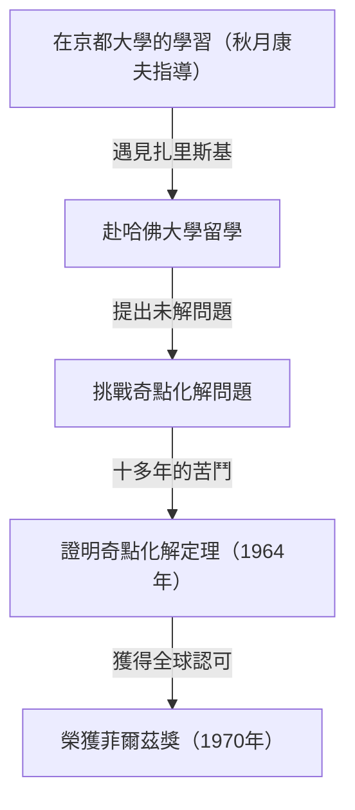
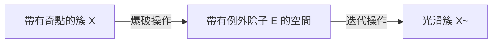
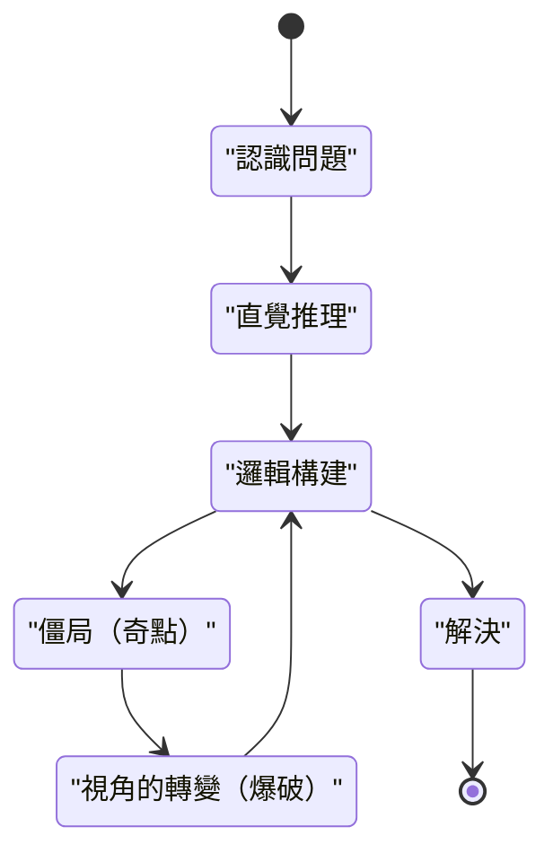

## 引言

 **廣中平祐** 是一位在20世紀下半葉的數學界，尤其是在代數幾何領域留下了革命性成就的日本數學家。他在1970年榮獲的菲爾茲獎是數學界的最高榮譽，獲獎理由是解決了當時所有人都認為不可能的超高難度問題——「特徵為零的域上代數簇的奇點化解」。

在本文中，我們將深入探討廣中平祐從童年到獲得菲爾茲獎的充滿戲劇性的一生、作為其代名詞的「奇點化解定理」的數學背景，以及他一直提倡的關於「創造力」的獨特哲學。

## 童年與多樣的興趣

廣中平祐於1931年出生於日本山口縣，在一個有15個兄弟姐妹的大家庭中長大。童年時期的廣中並非一開始就展現出數學天才的特質。相反，他對音樂有著深厚的熱情，曾沉迷於彈奏鋼琴，並且廣泛閱讀文學和哲學書籍，興趣十分廣泛。這種多樣的興趣和豐富的感受力，成為了他日後在抽象的數學世界中產生自由思想的泉源。

## 在京都大學的命運邂逅

促使他決定將數學作為終生道路的決定性契機是進入京都大學理學部學習。在那裡，他接受了引領日本代數學的 **秋月康夫** 教授的指導，並被代數幾何深奧的世界所吸引。

在京都大學期間，廣中有機會結識了後來與他共同獲得菲爾茲獎的法國數學家 **勒內·托姆** ，以及代數幾何的世界級大師 **奧斯卡·扎里斯基** 等一流研究人員。特別是扎里斯基，他對廣中的才華給予了高度評價，並邀請他前往哈佛大學。

## 挑戰超級難題「奇點化解問題」

對於在哈佛大學留學的廣中，扎里斯基將自己多年來致力於但未能完全解決的「奇點化解問題」託付給了他。這是當時全世界的天才數學家們都曾挑戰卻紛紛敗退的代數幾何最大難題之一。

### 什麼是奇點？

代數簇（由多項式方程式組定義的圖形或空間）並不總是擁有光滑的表面。有時會存在尖點或具有自交點的點，這被稱為「奇點」。

例如，考慮二維平面上的以下曲線（尖點曲線）：

$$ y^2 = x^3 $$

這條曲線在原點 $ (0, 0) $ 處有一個尖銳的點（奇點）。在這樣的點上，切線無法唯一確定，使得微積分等解析方法難以直接應用。

### 奇點化解的數學定義

直觀地說，奇點化解就是「按照某種規則使帶有奇點的空間變形，從而創造出一個完全光滑的空間」。

用數學公式嚴格表達，對於帶有奇點的代數簇 $ X $，尋找一個非奇異（光滑）的代數簇 $ \tilde{X} $ 和一個真雙有理態射 $ \pi: \tilde{X} \to X $ 的操作。

$$ \pi : \tilde{X} \to X $$

這裡，如果將 $ X $ 的奇點集合記為 $ \text{奇點}(X) $，那麼 $ \pi $ 在其外部子集上是同構映射。換句話說，通過僅將奇點部分「解開」，就可以將其轉化為光滑的簇。

### 爆破（Blow-up）方法

廣中用於解決該問題的主要幾何操作是「爆破」。

通過在適當的位置重複進行爆破，逐步簡化複雜的奇點。然而在更高維度中，決定爆破的順序變得極其困難，一旦操作錯誤，就有陷入無限循環的危險。

## 劃時代的證明與菲爾茲獎

雖然在一般 $ n $ 維中證明奇點化解曾被認為是絕望的，但廣中將局部環理論高度抽象化，並運用極其複雜的歸納法，終於證明了在特徵為零的任意維度代數簇中奇點化解是可能的。

1964年發表在《數學年刊》上的長達數百頁的論文令全世界的數學家驚嘆，廣中也因此在1970年榮獲菲爾茲獎。

## 創造力與「思想奇點」的哲學

廣中平祐還因其關於獨特的思考方式和創造力的哲學性言論而廣為人知。

他在其著作《學問的發現》中，稱自己絕非「天才」，而是「努力的人」。能夠持續思考幾百個小時的「持久力」正是他的武器。

對於廣中來說，思考陷入僵局（思想奇點）並非失敗，而是引入新視角（爆破）的絕佳機會。這種哲學與他奇點化解定理的數學成就本身產生了美妙的共鳴。

## 結論

廣中平祐的奇點化解定理徹底改變了代數幾何的面貌，至今在超弦理論等多領域仍是不可或缺的工具。當面臨巨大的困難之牆時，他那種「解開」複雜糾葛的態度，在今天依然持續吸引著無數人。
