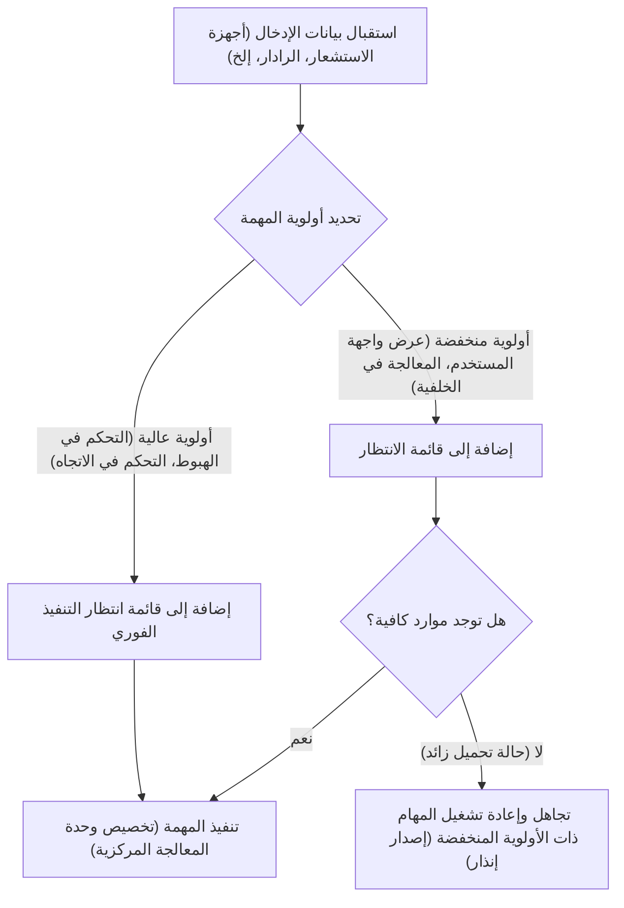
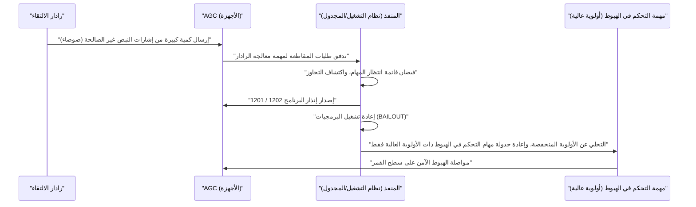

# 1. مقدمة: تحدي الهبوط على سطح القمر غير المسبوق

في 20 يوليو 1969، هبطت مركبة أبولو 11 في بحر الهدوء، وأصبح القائد نيل آرمسترونغ أول إنسان تطأ قدماه سطح القمر. لم يكن هذا الإنجاز التاريخي ثمرة للتقدم في الأجهزة مثل هندسة الصواريخ وعلوم المواد والميكانيكا السماوية فحسب، بل كان أيضاً انتصاراً لـ "البرمجيات" التي كانت ثورية للغاية في ذلك الوقت.

في قلب تطوير تلك البرمجيات كانت **مارغريت هاميلتون (Margaret Hamilton)**، التي قادت تطوير برمجيات حاسوب التوجيه لأبولو (Apollo Guidance Computer، واختصاره AGC) في مختبر الأجهزة التابع لمعهد ماساتشوستس للتكنولوجيا (MIT). في ذلك الوقت، كانت الحواسيب في بداية انتقالها من كتل الأنابيب المفرغة التي تحتل غرفاً ضخمة إلى التصغير باستخدام الترانزستورات. كانت سعة الذاكرة ضئيلة جداً، وسرعة الحساب بطيئة بشكل لا يقارن بالهواتف الذكية الحديثة.

في هذا المقال، سنتعمق بآلاف الكلمات في التفاصيل التقنية المذهلة لـ "شفرة مصدر AGC" التي قادت أبولو 11 إلى القمر، وفي إنجازات مارغريت هاميلتون التي ابتكرت مفهوم "هندسة البرمجيات (Software Engineering)" الذي نستخدمه اليوم كأمر مسلم به.

---

# 2. ما هو حاسوب التوجيه لأبولو (AGC)؟

لإنجاح مشروع أبولو، كان من الضروري وجود نظام للتحكم في الاتجاه في الفضاء، وحساب المدارات، والمساعدة التلقائية في الهبوط على سطح القمر. كان من الممكن التواصل مع الحواسيب الرئيسية على الأرض لتلقي التعليمات، ولكن نظراً لمخاطر تأخير الاتصال أو انقطاعه، كان من الضروري تزويد المركبة الفضائية بحاسوب مستقل. هذا هو **حاسوب التوجيه لأبولو (AGC)**.

## قيود الأجهزة والهندسة المعمارية الفريدة

كان AGC واحداً من أوائل الحواسيب التي اعتمدت بشكل كبير على الدوائر المتكاملة (IC). كانت مواصفاته ضعيفة بشكل مذهل بمعايير اليوم.

- **تردد الساعة**: 2.048 ميجاهرتز
- **ذاكرة الوصول العشوائي (الذاكرة القابلة للمسح)**: 2,048 كلمة (الكلمة الواحدة = 16 بت، أي ما يعادل 4 كيلوبايت فقط فعلياً)
- **ذاكرة القراءة فقط (الذاكرة الثابتة)**: 36,864 كلمة (حوالي 72 كيلوبايت)
- **الوزن**: حوالي 32 كجم

بهذه الموارد المحدودة، كان عليه أداء حسابات المسار في الوقت الفعلي، والتحكم في محركات الدفع، ورسم الشاشات، ومعالجة إدخالات رواد الفضاء في نفس الوقت.

## ذاكرة الحبل الأساسي (Core Rope Memory): شفرة منسوجة مادياً

من أبرز التقنيات المميزة لـ AGC كان **"ذاكرة الحبل الأساسي (Core Rope Memory)"**، وهي عبارة عن ذاكرة قراءة فقط (ROM) لتخزين البرامج.
كانت هذه الآلية تمثل البيانات عن طريق تمرير سلك موصل مادياً عبر قلب مغناطيسي (1) أو عدم تمريره (0). قامت عاملات ماهرات (عُرفن باسم "السيدات العجائز الصغيرات") باستخدام آلة تشبه نول النسيج الضخم لـ "نسج" سلسلة من البتات من الأصفار والآحاد يدوياً وبالمعنى الحرفي للكلمة.
نظراً لأن البرنامج المنسوج كان ثابتاً مادياً، فإن خطر فقدان البيانات (انعكاس البتات) حتى في ظل الإشعاع والبيئة القاسية للفضاء كان منخفضاً للغاية، مما وفر موثوقية عالية. ومع ذلك، بمجرد اكتماله، كان إصلاح الأخطاء (Bugs) صعباً للغاية، مما تطلب كمالاً مطلقاً في البرمجيات.

---

# 3. مارغريت هاميلتون: أم هندسة البرمجيات

في البداية، تخصصت مارغريت هاميلتون في الرياضيات والفلسفة. في أوائل الستينيات، شاركت في تطوير برمجيات التنبؤ بالطقس تحت إشراف إدوارد لورنز، وبعد ذلك انضمت إلى تطوير نظام SAGE (نظام دفاع جوي) في مختبر لينكولن التابع لمعهد ماساتشوستس للتكنولوجيا. ثم في عام 1965، تم تعيينها رئيسة لفريق تطوير برمجيات مشروع أبولو.

## ولادة مصطلح "هندسة البرمجيات"

في ذلك الوقت، لم يكن يُعترف بتطوير البرمجيات كـ "علم" أو "هندسة". في حين كانت هناك أساليب تصميم وعمليات اختبار صارمة لتطوير الأجهزة، كان يُنظر إلى البرمجيات على أنها شيء يتم إنشاؤه بشكل مخصص بواسطة أشخاص يُطلق عليهم اسم "المبرمجين (Coders)".

أدركت هاميلتون بشدة أنه في مهمة مثل مشروع أبولو، حيث تكون الأرواح البشرية والهيبة الوطنية على المحك، فإن الأخطاء البرمجية غير مقبولة. لقد أدخلت الصرامة وطرق الاختبار والتحكم في الإصدار وعمليات ضمان الجودة المماثلة لهندسة الأجهزة إلى تطوير البرمجيات. كانت هي نفسها من اقترح مصطلح **"هندسة البرمجيات"**، مؤسسةً تطوير البرمجيات كمجال هندسي شرعي.

هناك صورة شهيرة لها وهي تقف بجوار جبل من شفرات المصدر المطبوعة الخاصة بأبولو. تلك الحزمة من الأوراق المكدسة بارتفاع يضاهي طولها تقريباً هي ثمرة الدماء والعرق التي كتبوها وتحققوا منها سطراً بسطر.

---

# 4. الصورة الكاملة لشفرة مصدر أبولو 11

في عام 2003، قام باحثون في معهد ماساتشوستس للتكنولوجيا برقمنة شفرة مصدر أبولو 11 (المراجعة المسماة Comanche 55)، وهي متوفرة الآن على GitHub. عند قراءة هذه الشفرة، تتجلى البراعة الاستثنائية والبصيرة للمهندسين في ذلك الوقت.

## بنية لغة التجميع لـ AGC

تمت كتابة شفرة AGC بلغة فريدة تُسمى "لغة التجميع لـ AGC (AGC Assembly Language)". لتوفير الذاكرة المحدودة إلى أقصى حد، تم تحسين مجموعة التعليمات بشكل كبير. بالإضافة إلى ذلك، لتبسيط العمليات الحسابية الرياضية للمتجهات والمصفوفات، تم أيضاً تنفيذ آلية تشبه الآلة الافتراضية تُسمى المفسر (Interpreter). سمح هذا بكتابة حسابات الملاحة المعقدة في شفرة قصيرة.

## جدولة المهام بناءً على الأولوية (البرنامج التنفيذي)

كان الابتكار الأكبر في تصميم برمجيات AGC هو تقديم مفهوم نظام التشغيل في الوقت الفعلي (RTOS) الذي سُمي **"المنفذ غير المتزامن (Asynchronous Executive)"**.

في هذا النظام، الذي يمكن اعتباره نموذجاً أولياً لجدولة مهام أنظمة التشغيل الحديثة، تم تخصيص "أولوية" لكل مهمة.

ضمن دورات وحدة المعالجة المركزية المحدودة، لم يكن ممكناً معالجة جميع المهام بالتسلسل في الوقت المناسب. لذلك، صمم فريق هاميلتون بنية تسمح للمهام الأكثر أهمية (مثل التحكم في محركات دفع الهبوط) بمقاطعة المهام الأقل أهمية (مثل تحديث شاشات العرض لرواد الفضاء) ليتم تنفيذها.

## معالجة الأخطاء وآلية إعادة التشغيل (وظيفة BAILOUT)

علاوة على ذلك، قاموا بدمج آلية أمان من الفشل تُعرف باسم **"BAILOUT (الإنقاذ الطارئ)"** عندما يصبح النظام محملاً بشكل زائد.
تكمن الفكرة في أنه عندما يتلقى الحاسوب مهاماً لا يمكنه معالجتها، بدلاً من تعطل النظام بأكمله، فإنه يحفظ الحالة الحالية ويعيد التشغيل طواعيةً، مستعيداً المهام ذات الأولوية العالية فقط ويستأنف التنفيذ. هذه البصيرة هي التي ستنقذ أبولو 11 لاحقاً من أزمة يائسة.

---

# 5. إنذارات البرنامج المصيرية "1202" و "1201"

في 20 يوليو 1969، في اللحظة التي بدأت فيها الوحدة القمرية لأبولو 11 (إيجل) بالهبوط نحو سطح القمر، وقع حدث تاريخي.
قبل حوالي 3 دقائق من الهبوط، وعلى ارتفاع حوالي 9000 متر، تومض إنذار البرنامج **"1202"** على شاشة AGC. تبعه إطلاق إنذار **"1201"**.

## الأزمة اليائسة وخلل الأجهزة

كاد رائدا الفضاء آرمسترونغ وألدرين، بالإضافة إلى غرفة التحكم في هيوستن، أن يصابوا بالذعر. كان معنى الإنذار هو "تجاوز سعة المنفذ (Executive Overflow)"، وهو تحذير قاتل يعني أن "قدرة معالجة الحاسوب تجاوزت الحد وتفيض المهام".
كان السبب خطأ في إعداد الأجهزة. كان مفتاح رادار الالتقاء (الرادار المستخدم عند الالتحام بوحدة القيادة) في الموضع الخاطئ، وكان الرادار يرسل إشارات مقاطعة لا معنى لها إلى AGC آلاف المرات في الثانية. قفز استخدام وحدة المعالجة المركزية على الفور إلى 100%.

## اللحظة التي أنقذت فيها البرمجيات العالم

في العادة، إذا استمرت مثل هذه المقاطعات غير الطبيعية، فإن الحاسوب سيتجمد أو يتعطل، وستفقد وحدة الهبوط السيطرة وتصطدم بسطح القمر، أو سيضطرون إلى الإجهاض الطارئ للمهمة (Abort).

ولكن، عملت البرمجيات التي صممها فريق مارغريت هاميلتون بشكل لا تشوبه شائبة.

لم يكن إنذار 1202 إشعاراً بأن الحاسوب "قد مات"، بل كان **تقريراً مطمئناً من النظام يفيد بأنه "تم التخلص من المهام غير الضرورية، وتم تخصيص جميع الموارد للتحكم الحاسم في الهبوط وتمت إعادة التشغيل"**.
أدرك المهندسون في غرفة التحكم (جاك جارمان وستيف بيلز) على الفور أن هذا الإنذار يرجع إلى وظيفة الأمان من الفشل، واتخذوا قرار "انطلق (Go)" (مواصلة الهبوط).

نتيجة لذلك، هبطت مركبة إيجل بسلام على سطح القمر. ووصلت الرسالة التاريخية للقائد آرمسترونغ: "هيوستن، هنا قاعدة الهدوء. لقد هبط النسر" إلى الأرض.

---

# 6. التأثير على تطوير البرمجيات الحديثة

تركت شفرة أبولو 11 لنا أكثر من مجرد حقيقة أننا ذهبنا إلى القمر.

## الريادة في المعالجة غير المتزامنة وتصميم الأمان من الفشل
ترتبط مفاهيم معالجة المهام غير المتزامنة والتدهور التدريجي (Graceful Degradation) للوظائف أثناء الحالات الشاذة التي نفذتها هاميلتون وفريقها ارتباطاً مباشراً بتصميم أنظمة مراقبة الحركة الجوية الحديثة، والأجهزة الطبية، والسيارات ذاتية القيادة، وحتى الخدمات المصغرة (Microservices) في البنية التحتية السحابية.
فلسفتها في التصميم المبنية على فرضية أن "الأخطاء غير المتوقعة ستحدث لا محالة" وأنه يجب "الحفاظ على الوظائف المهمة دون إسقاط النظام" تشكل جوهر هندسة موثوقية الموقع (SRE) الحديثة.

## المصادر المفتوحة واستجابة المجتمع
عندما تم تحميل شفرة مصدر أبولو 11 على GitHub في عام 2016، تحمس المبرمجون في جميع أنحاء العالم. كانت هناك تعليقات متبقية في الشفرة تُظهر لمحات من الفكاهة والإنسانية للمطورين في ذلك الوقت (على سبيل المثال، تعليقات تتوسل لرواد الفضاء "أرجوكم لا تفعلوا أشياء غبية"، واقتباسات لشكسبير)، مما أثار إعجاباً عميقاً لدى المهندسين المعاصرين.

---

# 7. الخاتمة: المرأة التي أعادت كتابة الفضاء وإرثها

لم تكتف مارغريت هاميلتون بكتابة الشفرة فحسب، بل ابتكرت النموذج نفسه المسمى "هندسة البرمجيات".
في عام 2016، كرم الرئيس باراك أوباما إنجازاتها ومنحها "وسام الحرية الرئاسي"، وهو أعلى وسام مدني في الولايات المتحدة.

تُعد شفرة مصدر AGC لأبولو 11 واحدة من أجمل الشفرات في تاريخ البشرية، حيث نُسجت حكمة الإنسان وبصيرته وإرادته القوية للتغلب على الفشل في بضعة كيلوبايتات فقط من الذاكرة.
وراء الهواتف الذكية والإنترنت التي نستخدمها كل يوم، تعيش بالتأكيد روح "هندسة البرمجيات" التي ابتكرتها مارغريت هاميلتون ذات يوم عندما تحدت القمر.
