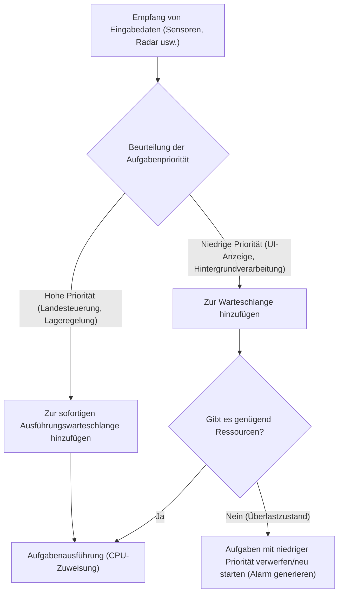
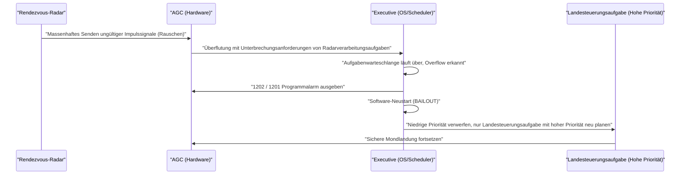

# 1. Einleitung: Die beispiellose Herausforderung der Mondlandung

Am 20. Juli 1969 landete Apollo 11 im Meer der Ruhe und Kommandant Neil Armstrong betrat als erster Mensch den Mond. Diese historische Meisterleistung war das Ergebnis hardwaretechnischer Fortschritte in Raketentechnik, Materialwissenschaft und Himmelsmechanik sowie ein Triumph der für damalige Verhältnisse äußerst innovativen "Software".

Im Zentrum dieser Softwareentwicklung stand **Margaret Hamilton**, die die Softwareentwicklung für den Apollo Guidance Computer (AGC) am Instrumentation Laboratory des MIT (Massachusetts Institute of Technology) leitete. Computer bestanden damals aus Röhren, die riesige Räume füllten, und die Miniaturisierung durch Transistoren hatte gerade erst begonnen. Die Speicherkapazität war winzig und die Rechengeschwindigkeit im Vergleich zu modernen Smartphones unvorstellbar langsam.

In diesem Artikel werden wir uns eingehend mit den erstaunlichen technischen Details des "AGC-Quellcodes", der Apollo 11 zum Mond führte, und den Errungenschaften von Margaret Hamilton befassen, die das Konzept des "Software Engineering", das wir heute für selbstverständlich halten, ins Leben gerufen hat.

---

# 2. Was ist der Apollo Guidance Computer (AGC)?

Um das Apollo-Programm zum Erfolg zu führen, war ein System unerlässlich, das die Lage im Weltraum steuert, Flugbahnen berechnet und die Mondlandung automatisch unterstützt. Zwar hätte man mit Großrechnern auf der Erde kommunizieren können, um Anweisungen zu erhalten, aber aufgrund der Risiken von Kommunikationsverzögerungen (Lags) und -ausfällen war es notwendig, einen autonomen Computer an Bord des Raumschiffs zu haben. Das war der **Apollo Guidance Computer (AGC)**.

## Hardware-Einschränkungen und eine einzigartige Architektur

Der AGC war einer der ersten Computer, der im großen Stil integrierte Schaltkreise (ICs) einsetzte. Seine Spezifikationen waren nach heutigen Maßstäben erschreckend gering:

- **Taktfrequenz**: 2,048 MHz
- **RAM (Erasable Memory)**: 2.048 Wörter (1 Wort = 16 Bit, effektiv nur etwa 4 Kilobyte)
- **ROM (Fixed Memory)**: 36.864 Wörter (ca. 72 Kilobyte)
- **Gewicht**: ca. 32 kg

Mit diesen begrenzten Ressourcen musste er gleichzeitig Echtzeit-Flugbahnberechnungen, Triebwerkssteuerung, das Rendern von Displays und die Verarbeitung von Eingaben der Astronauten bewältigen.

## Core Rope Memory: Physisch gewebter Code

Eine der charakteristischsten Technologien des AGC ist der **"Core Rope Memory"**, ein ROM zur Speicherung von Programmen.
Es handelte sich um ein System, bei dem Daten dadurch dargestellt wurden, ob ein Draht physisch durch einen Magnetkern geführt wurde (1) oder nicht (0). Hochqualifizierte Arbeiterinnen (oft "Little Old Ladies" genannt) verwendeten riesige webstuhlartige Geräte, um die Bitfolgen aus Nullen und Einsen buchstäblich "von Hand zu weben".
Da ein einmal gewebtes Programm physisch fixiert ist, war das Risiko, dass Daten gelöscht werden (Bit-Flipping), selbst in der rauen Umgebung des Weltraums mit Strahlung äußerst gering, was eine hohe Zuverlässigkeit gewährleistete. Einmal fertiggestellt, war die Behebung von Fehlern jedoch extrem schwierig, so dass absolute Perfektion von der Software verlangt wurde.

---

# 3. Margaret Hamilton: Die Mutter der Softwareentwicklung

Margaret Hamilton studierte zunächst Mathematik und Philosophie. In den frühen 1960er Jahren half sie unter Edward Lorenz bei der Entwicklung von Software zur Wettervorhersage und beteiligte sich später an der Entwicklung von SAGE (einem Luftverteidigungssystem) am Lincoln Laboratory des MIT. Und 1965 wurde sie zur Leiterin des Softwareentwicklungsteams für das Apollo-Programm ernannt.

## Die Geburt des Begriffs "Software Engineering"

Damals war die Softwareentwicklung noch nicht als "Wissenschaft" oder "Ingenieurwesen" anerkannt. Während es für die Hardwareentwicklung strenge Entwurfsmethoden und Testverfahren gab, wurde Software als etwas angesehen, das ad hoc von Leuten, die man "Coder" nannte, erstellt wurde.

Hamilton erkannte sehr wohl, dass bei Missionen wie dem Apollo-Programm, bei denen Menschenleben und das nationale Prestige auf dem Spiel standen, Softwarefehler inakzeptabel waren. Sie führte die Strenge, die Testmethoden, die Versionskontrolle und die Qualitätssicherungsprozesse, die der Hardwareentwicklung entsprachen, in die Softwareentwicklung ein. Sie selbst prägte den Begriff **"Software Engineering"** und etablierte die Softwareentwicklung als legitimes Ingenieursgebiet.

Es gibt ein berühmtes Foto, auf dem sie neben einem Stapel ausgedrucktem Apollo-Quellcode steht. Dieser Papierstapel, der so groß ist wie sie selbst, ist das Ergebnis von Blut und Schweiß, das Zeile für Zeile geschrieben und wiederholt getestet wurde.

---

# 4. Der vollständige Quellcode von Apollo 11

Im Jahr 2003 wurde der Quellcode von Apollo 11 (Revision Comanche 55) von Forschern am MIT digitalisiert und ist nun auch auf GitHub verfügbar. Wenn man diesen Code liest, wird der außergewöhnliche Einfallsreichtum und die Weitsicht der damaligen Ingenieure deutlich.

## AGC-Assembly-Struktur

Der AGC-Code ist in einer eigenen Sprache namens "AGC Assembly Language" geschrieben. Um den extrem begrenzten Speicherplatz zu sparen, wurde der Befehlssatz stark optimiert. Um zudem mathematische Vektor- und Matrixberechnungen zu vereinfachen, wurde eine Art virtueller Maschinenmechanismus namens Interpreter implementiert. Dies ermöglichte es, komplexe Navigationsberechnungen in kurzem Code zu schreiben.

## Prioritätsbasierte Aufgabenplanung (Executive Program)

Die revolutionärste Entwicklung im Software-Design des AGC war die Einführung des Konzepts eines Echtzeit-Betriebssystems (RTOS), das als **"Asynchronous Executive"** bezeichnet wird.

In diesem System, das man als Prototyp moderner OS-Taskplaner bezeichnen kann, wurde jeder Aufgabe eine "Priorität" zugewiesen.

Es war nicht möglich, alle Aufgaben nacheinander innerhalb der begrenzten CPU-Zyklen zu verarbeiten. Daher entwarf Hamiltons Team eine Architektur, in der wichtigere Aufgaben (wie die Steuerung der Landetriebwerke) weniger wichtige Aufgaben (wie die Aktualisierung des Displays für die Astronauten) unterbrechen konnten.

## Fehlerbehandlung und Neustartmechanismus (BAILOUT-Funktion)

Darüber hinaus bauten sie einen ausfallsicheren Mechanismus namens **"BAILOUT (Notausstieg)"** ein, der eingreift, wenn das System überlastet ist.
Wenn der Computer mit Aufgaben überlastet war, die er nicht verarbeiten konnte, ließ er das gesamte System nicht abstürzen. Stattdessen speicherte er den aktuellen Zustand, führte selbstständig einen Neustart durch und stellte nur die Aufgaben mit hoher Priorität wieder her, um die Ausführung fortzusetzen. Diese Weitsicht sollte Apollo 11 später vor einer verzweifelten Krise bewahren.

---

# 5. Die schicksalhaften Programmalarme "1202" und "1201"

Am 20. Juli 1969, genau in dem Moment, als die Mondlandefähre (Eagle) von Apollo 11 ihren Abstieg zur Mondoberfläche begann, ereignete sich ein historischer Vorfall.
Etwa 3 Minuten vor der Landung, in einer Höhe von etwa 9.000 Metern, blinkte auf dem AGC-Display ein Programmalarm mit der Nummer **"1202"** auf. Darauf folgte der Alarm **"1201"**.

## Eine verzweifelte Krise und Hardwareanomalie

Die Astronauten Armstrong und Aldrin sowie die Flugkontrolle in Houston gerieten fast in Panik. Die Alarme bedeuteten "Executive Overflow", also eine tödliche Warnung, dass "die Verarbeitungskapazität des Computers überschritten ist und die Aufgaben überlaufen".
Die Ursache war ein Fehler in der Hardwarekonfiguration. Ein Schalter für das Rendezvous-Radar (das Radar, das beim Andocken an das Kommandomodul verwendet wird) befand sich in der falschen Position und schickte Tausende von sinnlosen Unterbrechungssignalen pro Sekunde an den AGC. Die CPU-Auslastung sprang sofort auf 100 %.

## Der Moment, in dem Software die Welt rettete

Normalerweise würde der Computer bei derart vielen ungewöhnlichen Unterbrechungen einfrieren oder abstürzen, und die Landefähre würde außer Kontrolle geraten, auf den Mond stürzen oder zu einem Notabbruch gezwungen sein.

Die von Margaret Hamiltons Team entwickelte Software funktionierte jedoch einwandfrei.

Der 1202-Alarm war keine Nachricht, dass der Computer "tot" war, sondern ein **zuverlässiger Bericht des Systems, dass es unnötige Aufgaben verworfen und neu gestartet hatte, wobei alle Ressourcen auf die wichtige Landesteuerung konzentriert wurden**.
Die Ingenieure im Kontrollraum (Jack Garman und Steve Bales) verstanden sofort, dass dieser Alarm auf eine ausfallsichere Funktion zurückzuführen war, und trafen die Entscheidung zum "Go" (Fortsetzung der Landung).

Infolgedessen landete die Eagle sicher auf dem Mond. Die historische Botschaft von Kommandant Armstrong erreichte die Erde: "Houston, Tranquility Base here. The Eagle has landed."

---

# 6. Auswirkungen auf die moderne Softwareentwicklung

Der Code von Apollo 11 hat uns mehr hinterlassen als nur die Tatsache, dass wir zum Mond geflogen sind.

## Vorreiter der asynchronen Verarbeitung und ausfallsicheren Gestaltung
Die von Hamilton und ihrem Team implementierten Konzepte der asynchronen Aufgabenverarbeitung und der Graceful Degradation (schrittweise Funktionseinschränkung im Fehlerfall) sind direkt in das Design moderner Flugsicherungssysteme, medizinischer Geräte, selbstfahrender Autos und sogar von Microservices in Cloud-Infrastrukturen eingeflossen.
Ihre Designphilosophie, die auf der Prämisse "Unerwartete Fehler passieren immer" basiert und das Ziel verfolgt, "wichtige Funktionen aufrechtzuerhalten, ohne das System zum Absturz zu bringen", bildet den Kern des modernen SRE (Site Reliability Engineering).

## Open Source und die Reaktion der Community
Als der Quellcode von Apollo 11 im Jahr 2016 auf GitHub hochgeladen wurde, waren Programmierer auf der ganzen Welt begeistert. Der Code enthielt Kommentare, die Einblicke in den Humor und die Menschlichkeit der damaligen Entwickler gaben (wie z.B. ein Kommentar, der die Astronauten bat: "Bitte macht nichts Dummes", oder ein Zitat von Shakespeare), was bei modernen Ingenieuren tiefe Emotionen auslöste.

---

# 7. Fazit: Die Frau, die den Weltraum umschrieb, und ihr Vermächtnis

Margaret Hamilton hat nicht nur Code geschrieben, sondern das Paradigma des "Software Engineering" selbst erschaffen.
Im Jahr 2016 ehrte Präsident Barack Obama ihre Errungenschaften, indem er ihr die Presidential Medal of Freedom verlieh, die höchste zivile Auszeichnung in den Vereinigten Staaten.

Der AGC-Quellcode von Apollo 11 ist einer der schönsten Codes in der Geschichte der Menschheit, der in nur wenigen Kilobyte Speicher menschliche Weisheit, Weitsicht und den starken Willen, Fehler zu überwinden, einwebt.
Selbst hinter den Smartphones und dem Internet, die wir jeden Tag nutzen, lebt der Geist des "Software Engineering", den Margaret Hamilton einst bei der Herausforderung des Mondes ins Leben rief, unbestreitbar weiter.
