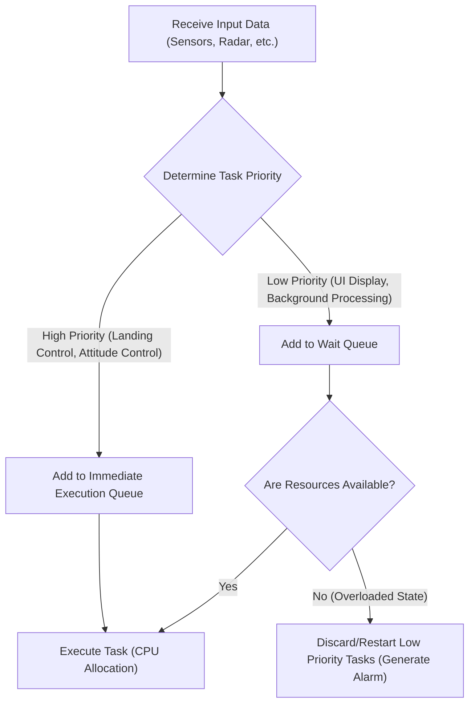
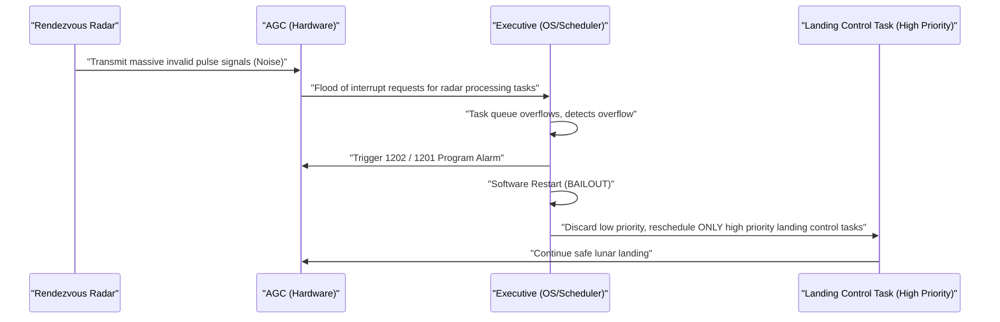

# 1. Introduction: The Unprecedented Challenge of a Lunar Landing

On July 20, 1969, Apollo 11 landed on the Sea of Tranquility, and Commander Neil Armstrong became the first human to step onto the lunar surface. This historic achievement was the result of hardware advancements in rocket engineering, materials science, and celestial mechanics, but it was also a triumph of highly innovative "software" for its time.

At the center of this software development was **Margaret Hamilton**, who directed the software development for the Apollo Guidance Computer (AGC) at MIT's (Massachusetts Institute of Technology) Instrumentation Laboratory. At a time when computers were massive blocks of vacuum tubes taking up entire rooms, miniaturization using transistors had only just begun. Memory capacity was miniscule, and processing speeds were incomparably slower than modern smartphones.

In this article, we will thoroughly delve into the astonishing technical details of the "AGC source code" that guided Apollo 11 to the moon, and the achievements of Margaret Hamilton, who created the concept of "software engineering"—something we take for granted today—over thousands of words.

---

# 2. What is the Apollo Guidance Computer (AGC)?

To make the Apollo program a success, a system that could control attitude in space, calculate orbits, and automatically assist in landing on the lunar surface was indispensable. While they could communicate with mainframe computers on Earth for instructions, considering the risks of communication delays (time lag) and communication loss, it was necessary to install an autonomous computer on board the spacecraft. That was the **Apollo Guidance Computer (AGC)**.

## Hardware Limitations and a Unique Architecture

The AGC was one of the earliest computers to extensively adopt integrated circuits (ICs). Its specifications were astonishingly meager by modern standards.

- **Clock Frequency**: 2.048 MHz
- **RAM (Erasable Memory)**: 2,048 words (1 word = 16 bits, effectively just 4 kilobytes)
- **ROM (Fixed Memory)**: 36,864 words (about 72 kilobytes)
- **Weight**: Approximately 32 kg

With these limited resources, it had to simultaneously handle real-time orbit calculations, thruster control, display rendering, and processing input from astronauts.

## Core Rope Memory: Physically Woven Code

One of the most distinctive technologies of the AGC is the **"Core Rope Memory,"** which served as the ROM for storing programs.
This was a mechanism that represented data physically by either passing a wire through a magnetic core (1) or bypassing it (0). Skilled female workers (known as "Little Old Ladies") literally "hand-wove" sequences of zeros and ones using a device resembling a massive loom.
Once woven, the program was physically fixed, making the risk of data loss (bit flipping) extremely low even in the harsh environment of radiation and space, boasting high reliability. However, because fixing bugs after completion was incredibly difficult, absolute perfection was required of the software.

---

# 3. Margaret Hamilton: The Mother of Software Engineering

Margaret Hamilton initially majored in mathematics and philosophy. In the early 1960s, she was involved in developing weather prediction software under Edward Lorenz, and later participated in the development of SAGE (an air defense system) at MIT's Lincoln Laboratory. Then, in 1965, she was appointed head of the software development team for the Apollo program.

## The Birth of the Term "Software Engineering"

At the time, software development was not recognized as a "science" or "engineering." While rigorous design methods and testing processes existed for hardware development, software was considered something created ad-hoc by people called "coders."

Hamilton strongly recognized that in a mission like the Apollo program, where human lives and national prestige were on the line, software bugs were unacceptable. She introduced the same level of rigor, testing methodologies, version control, and quality assurance processes to software development as those used in hardware engineering. She herself coined the term **"software engineering"** and established software development as a legitimate engineering discipline.

There is a famous photo of her standing next to a stack of printed Apollo source code. That bundle of paper, stacked as tall as she is, is the crystallization of the blood and sweat they poured into writing and repeatedly verifying the code line by line.

---

# 4. The Full Picture of the Apollo 11 Source Code

In 2003, the Apollo 11 source code (revision Comanche 55) was digitized by MIT researchers, and it is now publicly available on GitHub. Reading this code reveals the extraordinary ingenuity and foresight of the engineers of that era.

## The Structure of AGC Assembly

The AGC code is written in a proprietary language called "AGC Assembly Language." To conserve limited memory to the absolute maximum, the instruction set was highly optimized. Additionally, a virtual machine-like mechanism called the Interpreter was implemented to simplify mathematical vector and matrix calculations. This allowed complex navigation calculations to be written in short code.

## Priority-Based Task Scheduling (Executive Program)

The most groundbreaking aspect of the AGC's software design was the introduction of the concept of a real-time operating system (RTOS) called the **"Asynchronous Executive."**

In this system, which can be called the prototype of modern OS task schedulers, a "priority" was assigned to each task.

Within limited CPU cycles, processing all tasks sequentially would not be fast enough. Therefore, Hamilton's team designed an architecture where more important tasks (like controlling the landing thrusters) could interrupt and execute over less important tasks (like updating the astronauts' displays).

## Error Handling and the Restart Mechanism (BAILOUT Function)

Furthermore, they incorporated a fail-safe mechanism, **"BAILOUT,"** for when the system became overloaded.
When the computer took on more tasks than it could process, rather than crashing the entire system, the mechanism saved the current state, voluntarily rebooted, restored only the high-priority tasks, and resumed execution. This foresight would later save Apollo 11 from a desperate crisis.

---

# 5. The Fateful "1202" and "1201" Program Alarms

On July 20, 1969, just as the Apollo 11 lunar module (Eagle) began its descent toward the lunar surface, a historic incident occurred.
About 3 minutes before landing, at an altitude of approximately 9,000 meters, a **"1202"** program alarm flashed on the AGC display. This was followed by a **"1201"** alarm.

## A Desperate Crisis and Hardware Anomaly

Astronauts Armstrong and Aldrin, and the Mission Control room in Houston, almost panicked. The meaning of the alarm was "Executive Overflow," a fatal warning meaning "the computer's processing capacity has exceeded its limit, and tasks are overflowing."
The cause was a hardware configuration error. The rendezvous radar (used for docking with the command module) switch was in the wrong position, causing the radar to continuously send thousands of meaningless interrupt signals per second to the AGC. CPU usage instantly spiked to 100%.

## The Moment Software Saved the World

Normally, if such abnormal interrupts continued, the computer would freeze or crash, and the lunar module would lose control and crash into the moon, or be forced to execute an emergency escape (abort).

However, the software designed by Margaret Hamilton's team functioned perfectly.

The 1202 alarm was not a notification that the computer was "dead," but **a reassuring report from the system saying, "I have discarded unnecessary tasks and rebooted, allocating all resources to critical landing control."**
The engineers in Mission Control (Jack Garman and Steve Bales) instantly understood that this alarm was due to the fail-safe function and made the decision to "Go" (continue landing).

As a result, the Eagle landed safely on the moon. Commander Armstrong's historic message, "Houston, Tranquility Base here. The Eagle has landed," was delivered to Earth.

---

# 6. Impact on Modern Software Development

The Apollo 11 code left us with more than just the fact that we went to the moon.

## Pioneering Asynchronous Processing and Fail-Safe Design
The concepts of asynchronous task processing and graceful degradation during anomalies implemented by Hamilton and her team lead directly to the design of modern air traffic control systems, medical devices, autonomous vehicles, and even microservices in cloud infrastructure.
Her design philosophy, based on the premise that "unexpected errors will always occur," and aiming to "maintain critical functions without bringing down the system," forms the foundation of modern SRE (Site Reliability Engineering).

## Open Source and Community Reaction
When the Apollo 11 source code was uploaded to GitHub in 2016, programmers worldwide were ecstatic. Left in the code were comments offering glimpses of the humor and humanity of the developers at the time (for example, a prayer-like comment pleading with astronauts, "Please don't do anything stupid," and quotes from Shakespeare), deeply moving modern engineers.

---

# 7. Conclusion: The Woman Who Rewrote Space and Her Legacy

Margaret Hamilton did not merely write code; she created the very paradigm of "software engineering."
In 2016, President Barack Obama honored her achievements by awarding her the Presidential Medal of Freedom, the highest civilian award in the United States.

The AGC source code of Apollo 11, woven into mere kilobytes of memory, is one of the most beautiful codes in human history, containing human wisdom, foresight, and a strong will to overcome failure.
Behind the smartphones and the internet we use every day, the spirit of "software engineering" coined by Margaret Hamilton when she challenged the moon certainly lives on.
