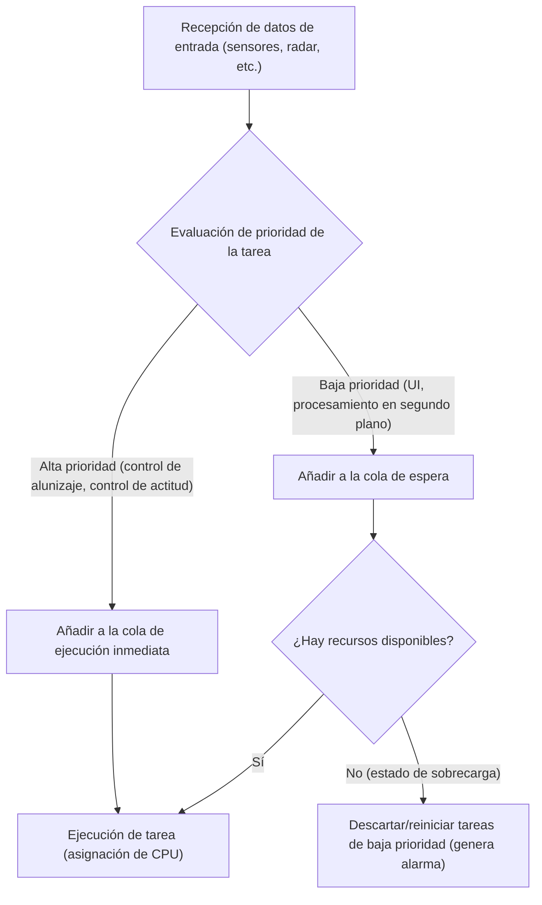
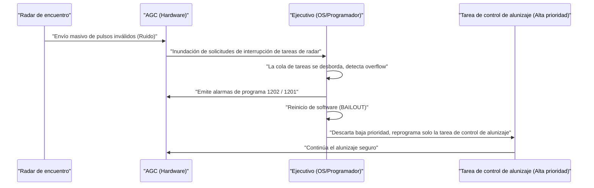

# 1. Introducción: El desafío sin precedentes del alunizaje

El 20 de julio de 1969, el Apolo 11 aterrizó en el Mar de la Tranquilidad, y el comandante Neil Armstrong se convirtió en el primer ser humano en pisar la Luna. Esta hazaña histórica fue el resultado de avances en hardware como la ingeniería de cohetes, la ciencia de materiales y la mecánica celeste, pero al mismo tiempo, fue el triunfo de un "software" extremadamente innovador para la época.

En el centro del desarrollo de ese software estaba **Margaret Hamilton**, quien dirigió el desarrollo del software para el Computador de Navegación del Apolo (Apollo Guidance Computer, abreviado AGC) en el Laboratorio de Instrumentación del MIT (Instituto de Tecnología de Massachusetts). En aquella época, las computadoras eran enormes masas de tubos de vacío que ocupaban habitaciones enteras, y recién comenzaba la miniaturización mediante transistores. La capacidad de memoria era minúscula y la velocidad de cálculo era incomparablemente más lenta que la de los teléfonos inteligentes actuales.

En este artículo, exploraremos en profundidad, a lo largo de miles de palabras, los sorprendentes detalles técnicos del "código fuente del AGC" que guio al Apolo 11 a la Luna, y los logros de Margaret Hamilton, quien creó el concepto de "ingeniería de software", algo que hoy en día damos por sentado.

---

# 2. ¿Qué es el Computador de Navegación del Apolo (AGC)?

Para que el programa Apolo tuviera éxito, era imprescindible contar con un sistema que controlara la actitud en el espacio, calculara las órbitas y asistiera automáticamente en el alunizaje. Era posible comunicarse con las computadoras centrales en la Tierra para recibir instrucciones, pero considerando el riesgo de retrasos en la comunicación (time lag) e interrupciones, era necesario llevar una computadora autónoma a bordo de la nave espacial. Ese es el **Computador de Navegación del Apolo (AGC)**.

## Restricciones de hardware y arquitectura única

El AGC fue una de las primeras computadoras en adoptar masivamente circuitos integrados (IC). Sus especificaciones eran sorprendentemente pobres para los estándares modernos.

- **Frecuencia de reloj**: 2.048 MHz
- **RAM (Memoria borrable)**: 2.048 palabras (1 palabra = 16 bits, efectivamente solo unos 4 kilobytes)
- **ROM (Memoria fija)**: 36.864 palabras (aproximadamente 72 kilobytes)
- **Peso**: Aproximadamente 32 kg

Con estos recursos limitados, tenía que manejar simultáneamente el cálculo de órbitas en tiempo real, el control de los propulsores, el renderizado de la pantalla y el procesamiento de la entrada de los astronautas.

## Memoria de núcleos magnéticos (Core Rope Memory): Código tejido físicamente

Una de las tecnologías más distintivas del AGC es la ROM utilizada para almacenar programas, conocida como **"Core Rope Memory" (Memoria de núcleos magnéticos)**.
Era un mecanismo que representaba datos según si un cable conductor pasaba físicamente (1) o no (0) a través de un núcleo magnético. Hábiles trabajadoras (conocidas como las "Little Old Ladies") utilizaron un dispositivo similar a un enorme telar para literalmente "tejer a mano" secuencias de bits de ceros y unos.
Una vez tejido el programa, quedaba fijado físicamente, por lo que el riesgo de pérdida de datos (inversión de bits) debido a la radiación o al duro entorno espacial era extremadamente bajo, ofreciendo una alta confiabilidad. Sin embargo, una vez completado, corregir errores (bugs) era muy difícil, por lo que se exigía una perfección absoluta en el software.

---

# 3. Margaret Hamilton: La madre de la ingeniería de software

Inicialmente, Margaret Hamilton se especializó en matemáticas y filosofía. A principios de la década de 1960, se involucró en el desarrollo de software de predicción meteorológica con Edward Lorenz, y posteriormente participó en el desarrollo del sistema de defensa aérea SAGE en el Laboratorio Lincoln del MIT. Y en 1965, fue nombrada directora del equipo de desarrollo de software para el programa Apolo.

## El nacimiento del término "Ingeniería de software"

En ese entonces, el desarrollo de software no era reconocido como "ciencia" o "ingeniería". Existían métodos rigurosos de diseño y procesos de prueba para el desarrollo de hardware, pero el software se consideraba algo que personas llamadas "codificadores" creaban de manera ad hoc.

Hamilton era muy consciente de que los errores de software eran inaceptables en una misión como el programa Apolo, donde estaban en juego vidas humanas y el prestigio nacional. Introdujo en el desarrollo de software el mismo nivel de rigor, métodos de prueba, control de versiones y procesos de garantía de calidad que en la ingeniería de hardware. Ella misma acuñó el término **"Ingeniería de software"** y estableció el desarrollo de software como un campo de la ingeniería legítimo.

Hay una foto famosa en la que está de pie junto a una montaña impresa con el código fuente del Apolo. Ese montón de papel, apilado casi a su altura, es el fruto de sangre y sudor, escrito línea por línea y verificado repetidamente.

---

# 4. Toda la verdad del código fuente del Apolo 11

En 2003, investigadores del MIT digitalizaron el código fuente del Apolo 11 (la revisión llamada Comanche 55), y ahora está disponible en GitHub. Al leer este código, se revela el extraordinario ingenio y previsión de los ingenieros de la época.

## La estructura del ensamblador del AGC

El código del AGC está escrito en un lenguaje propietario llamado "Lenguaje ensamblador del AGC". Para ahorrar la limitada memoria al máximo, el conjunto de instrucciones estaba altamente optimizado. Además, para simplificar cálculos matemáticos de vectores y matrices, se implementó un mecanismo similar a una máquina virtual llamado Intérprete (Interpreter). Esto permitió escribir complejos cálculos de navegación en un código corto.

## Programación de tareas basada en prioridad (Executive Program)

El avance más revolucionario en el diseño de software del AGC fue la introducción del concepto de un Sistema Operativo de Tiempo Real (RTOS) llamado **"Ejecutivo asíncrono (Asynchronous Executive)"**.

En este sistema, que puede considerarse el prototipo de los programadores de tareas de los SO modernos, a cada tarea se le asignaba una "prioridad".

Con los limitados ciclos de CPU, procesar todas las tareas secuencialmente no sería lo suficientemente rápido. Por ello, el equipo de Hamilton diseñó una arquitectura donde las tareas más críticas (como controlar los propulsores de aterrizaje) podían interrumpir tareas menos críticas (como actualizar las pantallas de los astronautas) para ejecutarse.

## Manejo de errores y mecanismo de reinicio (Función BAILOUT)

Además, integraron un mecanismo a prueba de fallas llamado **"BAILOUT (Escape de emergencia)"** para cuando el sistema se sobrecargara.
Si la computadora recibía más tareas de las que podía procesar, en lugar de colapsar todo el sistema, guardaba el estado actual, se reiniciaba voluntariamente, restauraba solo las tareas de alta prioridad y reanudaba la ejecución. Esta previsión salvaría más tarde al Apolo 11 de una crisis inminente.

---

# 5. Las alarmas de programa "1202" y "1201" del destino

El 20 de julio de 1969, justo cuando el módulo lunar del Apolo 11 (el Eagle) comenzó su descenso hacia la superficie lunar, ocurrió un incidente histórico.
Aproximadamente 3 minutos antes del aterrizaje, a unos 9.000 metros de altitud, parpadeó una alarma de programa **"1202"** en la pantalla del AGC. Poco después sonó también la alarma **"1201"**.

## Una crisis desesperada y la anomalía del hardware

Los astronautas Armstrong y Aldrin, y la sala de control en Houston casi entraron en pánico. El significado de la alarma era "Executive Overflow" (Desbordamiento del Ejecutivo), una advertencia fatal que indicaba que "la capacidad de procesamiento de la computadora había excedido su límite y las tareas se estaban desbordando".
La causa fue un error en la configuración del hardware. El interruptor del radar de encuentro (el radar utilizado para acoplarse con el módulo de mando) estaba en una posición incorrecta y enviaba continuamente miles de señales de interrupción sin sentido por segundo al AGC. El uso de la CPU se disparó instantáneamente al 100%.

## El momento en que el software salvó al mundo

Normalmente, si tales interrupciones anómalas continuaran, la computadora se congelaría o colapsaría, y el módulo lunar perdería el control y se estrellaría contra la luna, o se vería obligado a abortar la misión.

Sin embargo, el software diseñado por el equipo de Margaret Hamilton funcionó a la perfección.

La alarma 1202 no era un anuncio de que la computadora había "muerto", sino **un informe tranquilizador del sistema indicando que "se han descartado las tareas innecesarias, se han destinado todos los recursos al control crítico del alunizaje y se ha reiniciado"**.
Los ingenieros de la sala de control (Jack Garman y Steve Bales) comprendieron al instante que esta alarma era un mecanismo a prueba de fallos y tomaron la decisión de dar el "Go" (continuar con el alunizaje).

Como resultado, el Eagle aterrizó de forma segura en la Luna. El histórico mensaje del Comandante Armstrong, "Houston, aquí Base Tranquilidad. El Eagle ha aterrizado", llegó a la Tierra.

---

# 6. Impacto en el desarrollo de software moderno

El código del Apolo 11 nos dejó mucho más que el simple hecho de haber ido a la Luna.

## Pioneros en procesamiento asíncrono y diseño a prueba de fallos
Los conceptos de procesamiento asíncrono de tareas y la degradación elegante de funciones (graceful degradation) durante anomalías implementados por Hamilton y su equipo, se conectan directamente con el diseño moderno de sistemas de control de tráfico aéreo, equipos médicos, vehículos autónomos e incluso microservicios en infraestructuras en la nube.
La filosofía de diseño basada en la premisa de que "los errores imprevistos inevitablemente ocurrirán" y "mantener las funciones críticas sin que el sistema colapse" forma la base de la Ingeniería de Confiabilidad del Sitio (SRE) actual.

## Código abierto y la reacción de la comunidad
Cuando el código fuente del Apolo 11 se subió a GitHub en 2016, programadores de todo el mundo se emocionaron. En el código, se pueden vislumbrar comentarios que muestran el humor y la humanidad de los desarrolladores de aquella época (por ejemplo, comentarios rogando a los astronautas "por favor, no hagan ninguna estupidez", o citas de Shakespeare), lo que conmovió profundamente a los ingenieros de hoy.

---

# 7. Conclusión: La mujer que reescribió el espacio y su legado

Margaret Hamilton no solo escribió código; ella creó el paradigma de la "Ingeniería de software" en sí mismo.
En 2016, el presidente Barack Obama honró sus logros otorgándole la Medalla Presidencial de la Libertad, el más alto honor civil en los Estados Unidos.

El código fuente del AGC del Apolo 11 es uno de los códigos más hermosos de la historia de la humanidad, tejido con sabiduría humana, previsión y una fuerte voluntad de superar el fracaso, todo en unos pocos kilobytes de memoria.
Detrás de los teléfonos inteligentes e Internet que usamos todos los días, sin duda sigue vivo el espíritu de la "Ingeniería de software" que Margaret Hamilton forjó cuando desafió a la Luna.
