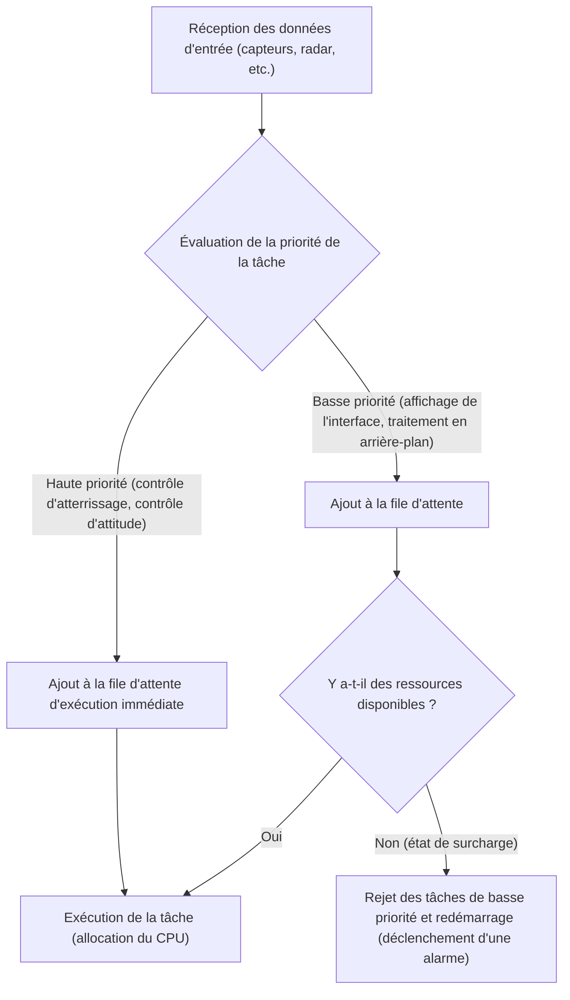
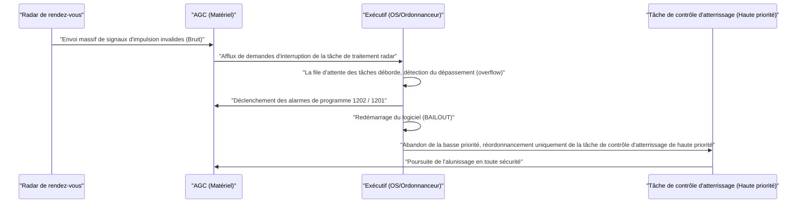

# 1. Introduction : Le défi sans précédent de l'alunissage

Le 20 juillet 1969, Apollo 11 a atterri dans la mer de la Tranquillité, et le commandant Neil Armstrong est devenu le premier humain à poser le pied sur la Lune. Cet exploit historique était le résultat d'avancées matérielles telles que l'ingénierie des fusées, la science des matériaux et la mécanique céleste, mais c'était aussi le triomphe d'un "logiciel" extrêmement innovant pour l'époque.

Au centre du développement de ce logiciel se trouvait **Margaret Hamilton**, qui a dirigé le développement du logiciel de l'Apollo Guidance Computer (AGC) au Instrumentation Laboratory du MIT (Massachusetts Institute of Technology). À cette époque, les ordinateurs commençaient tout juste à être miniaturisés avec des transistors, passant d'énormes masses de tubes à vide occupant des pièces entières. La capacité de mémoire était minuscule et la vitesse de calcul était incomparablement plus lente que celle des smartphones modernes.

Dans cet article, nous explorerons en profondeur les détails techniques étonnants du code source de l'AGC qui a guidé Apollo 11 vers la Lune, et les réalisations de Margaret Hamilton qui ont créé le concept d'"ingénierie logicielle" (génie logiciel) que nous utilisons aujourd'hui comme une évidence, à travers un texte détaillé de plusieurs milliers de mots.

---

# 2. Qu'est-ce que l'Apollo Guidance Computer (AGC) ?

Pour assurer le succès du programme Apollo, il était essentiel de disposer d'un système capable de contrôler l'attitude dans l'espace, de calculer les trajectoires et d'assister automatiquement l'atterrissage sur la Lune. Bien qu'il ait été possible de communiquer avec des ordinateurs centraux sur Terre pour recevoir des instructions, en tenant compte des risques de délais de communication (décalage) et de perte de communication, il était nécessaire d'embarquer un ordinateur autonome à l'intérieur du vaisseau spatial. C'est l'**Apollo Guidance Computer (AGC)**.

## Contraintes matérielles et architecture unique

L'AGC est l'un des premiers ordinateurs à avoir adopté massivement les circuits intégrés (CI). Ses spécifications étaient incroyablement faibles par rapport aux normes modernes.

- **Fréquence d'horloge** : 2,048 MHz
- **RAM (Erasable Memory)** : 2 048 mots (1 mot = 16 bits, soit à peine 4 kilo-octets)
- **ROM (Fixed Memory)** : 36 864 mots (environ 72 kilo-octets)
- **Poids** : environ 32 kg

Avec ces ressources limitées, il devait effectuer simultanément des calculs de trajectoire en temps réel, le contrôle des propulseurs, le rendu de l'affichage et le traitement des entrées des astronautes.

## Mémoire à tores magnétiques tressés (Core Rope Memory) : Un code physiquement tissé

L'une des technologies les plus distinctives de l'AGC est la **"Core Rope Memory"**, une ROM utilisée pour stocker les programmes.
C'était un système où les données étaient représentées physiquement en faisant passer (1) ou ne pas passer (0) des fils conducteurs à travers des tores magnétiques. Des ouvrières qualifiées (surnommées les "Little Old Ladies") ont littéralement "tissé à la main" les chaînes de bits de zéros et de uns en utilisant un appareil ressemblant à un métier à tisser géant.
Une fois le programme tissé, il était physiquement fixé, de sorte que le risque que les données soient effacées (inversion de bit) même dans l'environnement hostile des radiations et de l'espace était extrêmement faible, offrant une grande fiabilité. Cependant, une fois terminé, il était très difficile de corriger les bugs, c'est pourquoi une perfection absolue était requise pour le logiciel.

---

# 3. Margaret Hamilton : La mère du génie logiciel

Margaret Hamilton s'était initialement spécialisée en mathématiques et en philosophie. Au début des années 1960, elle s'est impliquée dans le développement de logiciels de prévision météorologique sous la direction d'Edward Lorenz, puis a rejoint le Lincoln Laboratory du MIT pour développer le système de défense aérienne SAGE. Puis, en 1965, elle a été nommée responsable de l'équipe de développement logiciel pour le programme Apollo.

## La naissance du terme "Génie logiciel" (Software Engineering)

À l'époque, le développement de logiciels n'était pas reconnu comme une "science" ou une "ingénierie". Bien qu'il y ait eu des méthodes de conception et des processus de test stricts pour le développement matériel, le logiciel était considéré comme quelque chose de créé de manière ad hoc par des personnes appelées "codeurs".

Hamilton était fermement convaincue que les bugs logiciels étaient inacceptables dans des missions comme le programme Apollo, où des vies humaines et le prestige national étaient en jeu. Elle a introduit dans le développement de logiciels des processus de rigueur, de test, de contrôle de version et d'assurance qualité équivalents à ceux de l'ingénierie matérielle. Elle a elle-même inventé le terme **"Software Engineering"** (ingénierie logicielle) et a établi le développement de logiciels comme un domaine d'ingénierie légitime.

Sur une photo célèbre, on la voit debout à côté d'une montagne de code source Apollo imprimé. Cette pile de papier, presque aussi grande qu'elle, est la cristallisation du sang et de la sueur de leur travail acharné pour écrire et vérifier chaque ligne.

---

# 4. Vue d'ensemble du code source d'Apollo 11

En 2003, les chercheurs du MIT ont numérisé le code source d'Apollo 11 (la révision appelée Comanche 55), qui est maintenant disponible sur GitHub. La lecture de ce code révèle l'ingéniosité extraordinaire et la prévoyance des ingénieurs de l'époque.

## La structure de l'assembleur AGC

Le code de l'AGC est écrit dans un langage spécifique appelé "langage assembleur AGC". Pour économiser au maximum la mémoire limitée, le jeu d'instructions était hautement optimisé. De plus, pour simplifier les calculs vectoriels et matriciels complexes, un mécanisme de type machine virtuelle appelé interpréteur (Interpreter) a été implémenté. Cela permettait d'écrire des calculs de navigation complexes avec un code plus court.

## Ordonnancement des tâches basé sur la priorité (Executive Program)

Ce qui était le plus révolutionnaire dans la conception logicielle de l'AGC, c'est l'introduction du concept de système d'exploitation temps réel (RTOS) appelé **"Exécutif Asynchrone" (Asynchronous Executive)**.

Dans ce système, qui peut être considéré comme le prototype des ordonnanceurs de tâches des systèmes d'exploitation modernes, une "priorité" était attribuée à chaque tâche.

Il n'était pas possible de traiter toutes les tâches l'une après l'autre dans les cycles CPU limités. L'équipe d'Hamilton a donc conçu une architecture dans laquelle les tâches plus importantes (comme le contrôle des propulseurs d'atterrissage) pouvaient interrompre et s'exécuter avant les tâches moins importantes (comme la mise à jour de l'affichage des astronautes).

## Traitement des erreurs et mécanisme de redémarrage (Fonction BAILOUT)

De plus, elles ont intégré un mécanisme de sécurité intrinsèque (fail-safe) appelé **"BAILOUT" (évacuation d'urgence)** en cas de surcharge du système.
Si l'ordinateur était confronté à plus de tâches qu'il ne pouvait en traiter, au lieu de planter l'ensemble du système, il sauvegardait son état actuel et redémarrait volontairement, en ne restaurant et en ne reprenant l'exécution que des tâches très prioritaires. Cette prévoyance a plus tard sauvé Apollo 11 d'une crise désespérée.

---

# 5. Les alarmes de programme fatidiques "1202" et "1201"

Le 20 juillet 1969, au moment même où le module lunaire (Eagle) d'Apollo 11 commençait sa descente vers la surface lunaire, un incident historique s'est produit.
Environ trois minutes avant l'atterrissage, à une altitude d'environ 9 000 mètres, l'alarme de programme **"1202"** a clignoté sur l'écran de l'AGC. Elle a été suivie de l'alarme **"1201"**.

## Crise désespérée et anomalie matérielle

Les astronautes Armstrong et Aldrin, ainsi que le centre de contrôle de Houston, ont frôlé la panique. La signification de l'alarme était "Executive Overflow", c'est-à-dire un avertissement fatal signifiant que "la capacité de traitement de l'ordinateur a dépassé sa limite et que les tâches débordent".
La cause était une erreur de configuration matérielle. L'interrupteur du radar de rendez-vous (le radar utilisé pour s'amarrer au module de commande) était dans la mauvaise position, et le radar a continué d'envoyer à l'AGC des milliers de signaux d'interruption inutiles par seconde. L'utilisation du processeur a instantanément bondi à 100 %.

## Le moment où le logiciel a sauvé le monde

Normalement, si de telles interruptions anormales se poursuivaient, l'ordinateur gèlerait ou planterait, et le module lunaire perdrait le contrôle et s'écraserait sur la surface lunaire, ou serait forcé de procéder à une évacuation d'urgence (abandon).

Cependant, le logiciel conçu par l'équipe de Margaret Hamilton a fonctionné parfaitement.

L'alarme 1202 n'était pas un avis que l'ordinateur était "mort", mais **un rapport rassurant du système indiquant qu'il avait "rejeté les tâches inutiles, alloué toutes les ressources au contrôle crucial de l'atterrissage et redémarré"**.
Les ingénieurs de la salle de contrôle (Jack Garman et Steve Bales) ont immédiatement compris que cette alarme était due à la fonction de sécurité (fail-safe) et ont pris la décision de "Go" (poursuivre l'atterrissage).

En conséquence, l'Eagle a atterri en toute sécurité sur la Lune. Le message historique du commandant Armstrong, "Houston, ici la base de la Tranquillité. L'Aigle a atterri", a été transmis à la Terre.

---

# 6. L'impact sur le développement logiciel moderne

Le code d'Apollo 11 nous a laissé bien plus que le simple fait que nous sommes allés sur la Lune.

## Précurseur du traitement asynchrone et de la conception de sécurité intégrée (fail-safe)
Les concepts de traitement des tâches asynchrones et de dégradation gracieuse en cas d'anomalie mis en œuvre par Hamilton et son équipe sont directement liés à la conception des systèmes modernes de contrôle du trafic aérien, des équipements médicaux, des voitures autonomes, et même des microservices dans les infrastructures cloud.
Son principe de conception consistant à "maintenir les fonctions importantes sans faire planter le système", basé sur la prémisse que "des erreurs inattendues se produiront toujours", est au cœur de la discipline moderne SRE (Site Reliability Engineering).

## L'open source et la réaction de la communauté
Lorsque le code source d'Apollo 11 a été mis en ligne sur GitHub en 2016, les programmeurs du monde entier ont été enthousiasmés. Le code contient des commentaires qui laissent entrevoir l'humour et l'humanité des développeurs de l'époque (par exemple, des commentaires priant les astronautes de "s'il vous plaît, ne faites rien de stupide", et des citations de Shakespeare), ce qui a profondément ému les ingénieurs modernes.

---

# 7. Conclusion : La femme qui a réécrit l'espace et son héritage

Margaret Hamilton n'a pas seulement écrit du code ; elle a créé le paradigme même de "l'ingénierie logicielle".
En 2016, le président Barack Obama a honoré ses réalisations en lui décernant la Médaille présidentielle de la Liberté, la plus haute distinction civile aux États-Unis.

Le code source de l'AGC d'Apollo 11 est l'un des plus beaux codes de l'histoire humaine, tissé de sagesse humaine, de prévoyance et d'une forte volonté de surmonter l'échec dans seulement quelques kilo-octets de mémoire.
Même derrière les smartphones et Internet que nous utilisons tous les jours, l'esprit de "l'ingénierie logicielle", que Margaret Hamilton a inventé lorsqu'elle a défié la Lune, est bel et bien vivant.
