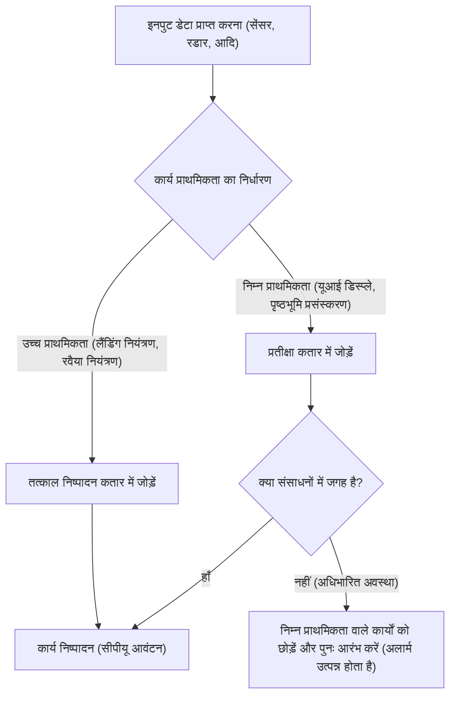
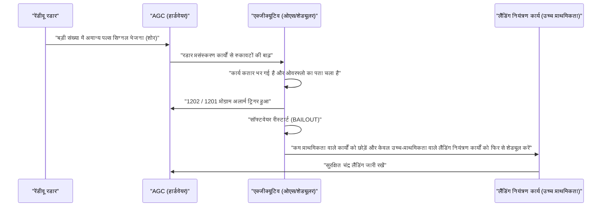

# 1. परिचय: चंद्र लैंडिंग की अभूतपूर्व चुनौती

20 जुलाई, 1969 को अपोलो 11 सी ऑफ ट्रैंक्विलिटी पर उतरा, और कमांडर नील आर्मस्ट्रांग चंद्रमा पर कदम रखने वाले पहले इंसान बने। यह ऐतिहासिक उपलब्धि रॉकेट इंजीनियरिंग, सामग्री विज्ञान और खगोलीय यांत्रिकी में हार्डवेयर प्रगति का परिणाम थी, लेकिन साथ ही यह उस समय के लिए एक अत्यधिक नवीन "सॉफ्टवेयर" की भी जीत थी।

सॉफ्टवेयर विकास के केंद्र में **मार्गरेट हैमिल्टन (Margaret Hamilton)** थीं, जिन्होंने एमआईटी (मैसाचुसेट्स इंस्टीट्यूट ऑफ टेक्नोलॉजी) इंस्ट्रूमेंटेशन लेबोरेटरी में अपोलो गाइडेंस कंप्यूटर (AGC) के सॉफ्टवेयर विकास का नेतृत्व किया। उस समय के कंप्यूटर विशाल कमरों में रखे वैक्यूम ट्यूबों के समूह से लेकर ट्रांजिस्टर का उपयोग करके छोटे किए जाने की शुरुआत के दौर में थे। मेमोरी क्षमता बहुत कम थी, और गणना की गति आज के स्मार्टफोन की तुलना में बहुत धीमी थी।

इस लेख में, हम अपोलो 11 को चंद्रमा तक ले जाने वाले "AGC स्रोत कोड" के अद्भुत तकनीकी विवरण और मार्गरेट हैमिल्टन की उन उपलब्धियों के बारे में गहराई से चर्चा करेंगे जिन्होंने "सॉफ्टवेयर इंजीनियरिंग" की अवधारणा को जन्म दिया, जिसे हम आज सामान्य मानते हैं।

---

# 2. अपोलो गाइडेंस कंप्यूटर (AGC) क्या है

अपोलो मिशन के सफल होने के लिए, एक ऐसी प्रणाली आवश्यक थी जो अंतरिक्ष में रवैया (attitude) को नियंत्रित कर सके, कक्षाओं की गणना कर सके, और स्वचालित रूप से चंद्र लैंडिंग में सहायता कर सके। पृथ्वी पर मेनफ्रेम कंप्यूटरों के साथ संचार करना और निर्देश प्राप्त करना संभव था, लेकिन संचार में देरी (टाइम लैग) या नुकसान के जोखिमों पर विचार करते हुए, अंतरिक्ष यान के अंदर एक स्वायत्त कंप्यूटर का होना आवश्यक था। वह **अपोलो गाइडेंस कंप्यूटर (AGC)** था।

## हार्डवेयर की सीमाएं और अद्वितीय वास्तुकला

AGC बड़े पैमाने पर एकीकृत सर्किट (IC) का उपयोग करने वाले शुरुआती कंप्यूटरों में से एक था। आधुनिक मानकों के अनुसार इसकी विशिष्टताएँ आश्चर्यजनक रूप से कमजोर थीं।

- **क्लॉक फ्रीक्वेंसी**: 2.048 MHz
- **रैम (Erasable Memory)**: 2,048 शब्द (1 शब्द = 16 बिट, वास्तव में केवल 4 किलोबाइट)
- **रोम (Fixed Memory)**: 36,864 शब्द (लगभग 72 किलोबाइट)
- **वजन**: लगभग 32 किग्रा

इन सीमित संसाधनों के साथ, इसे एक ही समय में वास्तविक समय की कक्षा गणना, थ्रस्टर नियंत्रण, डिस्प्ले रेंडरिंग और अंतरिक्ष यात्रियों से इनपुट प्रोसेसिंग को संभालना था।

## कोर रोप मेमोरी: भौतिक रूप से बुना हुआ कोड

AGC की सबसे विशिष्ट तकनीकों में से एक प्रोग्राम को स्टोर करने के लिए इसका ROM, **"कोर रोप मेमोरी (Core Rope Memory)"** था।
यह एक ऐसी प्रणाली थी जो भौतिक रूप से एक चुंबकीय कोर के माध्यम से तार को पास करने (1) या पास नहीं करने (0) द्वारा डेटा का प्रतिनिधित्व करती थी। कुशल महिला श्रमिकों (जिन्हें लिटिल ओल्ड लेडीज़ कहा जाता है) ने सचमुच एक विशाल करघे जैसी मशीन का उपयोग करके शून्य और एक की बिट स्ट्रिंग्स को "हाथ से बुना" था।
चूँकि एक बार बुना हुआ प्रोग्राम भौतिक रूप से स्थिर होता था, इसलिए विकिरण या अंतरिक्ष के कठोर वातावरण में भी डेटा के खोने (बिट फ्लिपिंग) का जोखिम बेहद कम था, और इसमें अत्यधिक विश्वसनीयता थी। हालाँकि, एक बार पूरा होने के बाद बग्स को ठीक करना बहुत मुश्किल था, इसलिए सॉफ्टवेयर से पूर्णता की मांग की गई थी।

---

# 3. मार्गरेट हैमिल्टन: सॉफ्टवेयर इंजीनियरिंग की जननी

मार्गरेट हैमिल्टन ने शुरुआत में गणित और दर्शनशास्त्र में पढ़ाई की। 1960 के दशक की शुरुआत में, उन्होंने एडवर्ड लोरेंज के अधीन मौसम पूर्वानुमान सॉफ्टवेयर के विकास में काम किया और बाद में एमआईटी की लिंकन प्रयोगशाला में SAGE (वायु रक्षा प्रणाली) के विकास में भाग लिया। फिर 1965 में, उन्हें अपोलो मिशन के सॉफ्टवेयर विकास टीम का प्रमुख नियुक्त किया गया।

## "सॉफ्टवेयर इंजीनियरिंग" शब्द का जन्म

उस समय सॉफ्टवेयर विकास को "विज्ञान" या "इंजीनियरिंग" के रूप में मान्यता नहीं थी। हार्डवेयर के विकास के लिए सख्त डिज़ाइन विधियाँ और परीक्षण प्रक्रियाएँ मौजूद थीं, लेकिन सॉफ्टवेयर को "कोडर्स" नामक लोगों द्वारा तदर्थ रूप से बनाई जाने वाली चीज़ माना जाता था।

हैमिल्टन इस बात से पूरी तरह वाकिफ थीं कि अपोलो जैसे मिशन में, जहाँ मानव जीवन और राष्ट्रीय प्रतिष्ठा दांव पर हो, सॉफ्टवेयर बग अस्वीकार्य हैं। उन्होंने सॉफ्टवेयर विकास में हार्डवेयर इंजीनियरिंग के समान कठोरता, परीक्षण के तरीके, संस्करण नियंत्रण और गुणवत्ता आश्वासन प्रक्रियाओं को पेश किया। उन्होंने स्वयं **"सॉफ्टवेयर इंजीनियरिंग"** शब्द का प्रस्ताव रखा और सॉफ्टवेयर विकास को एक वैध इंजीनियरिंग अनुशासन के रूप में स्थापित किया।

एक प्रसिद्ध तस्वीर है जिसमें वह अपोलो के स्रोत कोड के मुद्रित ढेर के बगल में खड़ी हैं। उसके कद के बराबर कागज़ों का वह ढेर उनके खून और पसीने का क्रिस्टलीकरण है जिसे उन्होंने लाइन दर लाइन लिखा और सत्यापित किया।

---

# 4. अपोलो 11 स्रोत कोड की पूरी तस्वीर

2003 में, अपोलो 11 के स्रोत कोड (कोमांचे 55 नामक संशोधन) को एमआईटी के शोधकर्ताओं द्वारा डिजिटल किया गया था, और अब यह गिटहब (GitHub) पर भी उपलब्ध है। इस कोड को पढ़ने से उस समय के इंजीनियरों की असाधारण सरलता और दूरदर्शिता का पता चलता है।

## AGC असेंबली की संरचना

AGC कोड "AGC असेंबली भाषा" नामक एक अनूठी भाषा में लिखा गया है। सीमित मेमोरी को बचाने के लिए निर्देश सेट अत्यधिक अनुकूलित था। इसके अलावा, गणितीय वेक्टर और मैट्रिक्स गणनाओं को सरल बनाने के लिए इंटरप्रेटर नामक एक वर्चुअल मशीन जैसा तंत्र लागू किया गया था। इसने जटिल नेविगेशन गणनाओं को छोटे कोड में लिखना संभव बना दिया।

## प्राथमिकता आधारित कार्य शेड्यूलिंग (कार्यकारी कार्यक्रम)

AGC के सॉफ्टवेयर डिज़ाइन का सबसे महत्वपूर्ण पहलू **"एसिंक्रोनस एक्जीक्यूटिव"** नामक रीयल-टाइम ऑपरेटिंग सिस्टम (RTOS) की अवधारणा का परिचय था।

इस प्रणाली में, जिसे आधुनिक ओएस कार्य शेड्यूलर का प्रोटोटाइप कहा जा सकता है, प्रत्येक कार्य को "प्राथमिकता" सौंपी गई थी।

सीमित सीपीयू चक्रों के साथ, सभी कार्यों को क्रमिक रूप से संसाधित करना संभव नहीं होगा। इसलिए हैमिल्टन की टीम ने एक ऐसा आर्किटेक्चर डिज़ाइन किया जहाँ अधिक महत्वपूर्ण कार्य (जैसे लैंडिंग थ्रस्टर्स को नियंत्रित करना) कम महत्वपूर्ण कार्यों (जैसे अंतरिक्ष यात्री डिस्प्ले को अपडेट करना) को बाधित कर सकते हैं।

## त्रुटि प्रबंधन और पुनरारंभ तंत्र (BAILOUT फ़ंक्शन)

इसके अलावा, उन्होंने सिस्टम के अतिभारित होने पर फेल-सेफ तंत्र **"BAILOUT (आपातकालीन निकास)"** को शामिल किया।
यदि कंप्यूटर उन कार्यों को प्राप्त करता है जिन्हें वह संसाधित नहीं कर सकता, तो पूरे सिस्टम को क्रैश करने के बजाय, यह अपनी वर्तमान स्थिति को सहेजते हुए स्वेच्छा से रीबूट (पुनरारंभ) करता है, और केवल उच्च प्राथमिकता वाले कार्यों को पुनर्स्थापित करके निष्पादन को फिर से शुरू करता है। यह दूरदर्शिता ही बाद में अपोलो 11 को गंभीर खतरे से बचाएगी।

---

# 5. भाग्य के "1202" और "1201" प्रोग्राम अलार्म

20 जुलाई 1969 को, जब अपोलो 11 लूनर मॉड्यूल (ईगल) ने चंद्रमा की सतह की ओर अपना अवतरण शुरू किया, तभी एक ऐतिहासिक घटना घटी।
लैंडिंग से लगभग 3 मिनट पहले, लगभग 9,000 मीटर की ऊंचाई पर, AGC के डिस्प्ले पर **"1202"** प्रोग्राम अलार्म चमका। इसके बाद **"1201"** अलार्म भी बजने लगा।

## गंभीर खतरा और हार्डवेयर असामान्यताएं

अंतरिक्ष यात्री आर्मस्ट्रांग और एल्ड्रिन, साथ ही ह्यूस्टन में नियंत्रण कक्ष, लगभग घबरा गए। अलार्म का मतलब "एक्जीक्यूटिव ओवरफ्लो" था, एक घातक चेतावनी जिसका अर्थ है कि "कंप्यूटर की प्रसंस्करण क्षमता अपनी सीमा को पार कर गई है और कार्य अतिप्रवाह कर रहे हैं।"
कारण एक हार्डवेयर कॉन्फ़िगरेशन त्रुटि थी। रेंडीवू रडार (कमांड मॉड्यूल के साथ डॉक करने के लिए उपयोग किया जाने वाला रडार) स्विच गलत स्थिति में था, और रडार AGC को प्रति सेकंड हजारों बार अर्थहीन व्यवधान संकेत भेज रहा था। सीपीयू का उपयोग तुरंत 100% तक उछल गया।

## वह क्षण जब सॉफ्टवेयर ने दुनिया को बचाया

आम तौर पर, यदि इस तरह के असामान्य व्यवधान जारी रहते हैं, तो कंप्यूटर हैंग या क्रैश हो जाएगा, और लैंडर नियंत्रण खो देगा और चंद्रमा की सतह पर दुर्घटनाग्रस्त हो जाएगा, या आपातकालीन निकास (एबॉर्ट) के लिए मजबूर हो जाएगा।

हालाँकि, मार्गरेट हैमिल्टन की टीम द्वारा डिज़ाइन किए गए सॉफ़्टवेयर ने पूरी तरह से काम किया।

1202 अलार्म यह संकेत नहीं था कि कंप्यूटर "मर गया", बल्कि **सिस्टम से एक आश्वस्त रिपोर्ट थी कि "इसने अनावश्यक कार्यों को छोड़ दिया और महत्वपूर्ण लैंडिंग नियंत्रण के लिए सभी संसाधनों को आवंटित करके पुनरारंभ किया"**।
नियंत्रण कक्ष के इंजीनियरों (जैक गार्मन और स्टीव बेल्स) ने तुरंत समझा कि अलार्म एक फेल-सेफ सुविधा के कारण था और उन्होंने "गो (लैंडिंग जारी रखें)" का निर्णय लिया।

परिणामस्वरूप, ईगल सुरक्षित रूप से चंद्रमा पर उतरा। कमांडर आर्मस्ट्रांग का ऐतिहासिक संदेश "ह्यूस्टन, यह ट्रैंक्विलिटी बेस है। ईगल उतर चुका है" पृथ्वी पर दिया गया था।

---

# 6. आधुनिक सॉफ्टवेयर विकास पर प्रभाव

अपोलो 11 के कोड ने हमें केवल इस तथ्य से कहीं अधिक दिया कि वह चंद्रमा पर गया था।

## एसिंक्रोनस प्रोसेसिंग और फेल-सेफ डिज़ाइन का अग्रदूत
हैमिल्टन और उनकी टीम द्वारा लागू एसिंक्रोनस कार्य प्रसंस्करण और असामान्यताओं के दौरान क्रमिक गिरावट (ग्रेसफुल डिग्रेडेशन) की अवधारणाएं सीधे आधुनिक हवाई यातायात नियंत्रण प्रणालियों, चिकित्सा उपकरणों, स्वायत्त वाहनों और यहां तक ​​कि क्लाउड इंफ्रास्ट्रक्चर में माइक्रोसर्विसेज के डिजाइन की ओर ले जाती हैं।
उनका डिज़ाइन दर्शन कि "अप्रत्याशित त्रुटियाँ निश्चित रूप से होंगी" और "सिस्टम को कम किए बिना महत्वपूर्ण कार्यों को बनाए रखना" आधुनिक SRE (साइट रिलायबिलिटी इंजीनियरिंग) का आधार बनता है।

## ओपन सोर्स और समुदाय की प्रतिक्रिया
जब 2016 में अपोलो 11 के स्रोत कोड को गिटहब (GitHub) पर अपलोड किया गया था, तो दुनिया भर के प्रोग्रामर उत्साहित हो गए थे। कोड में ऐसे कमेंट्स थे जो उस समय के डेवलपर्स के हास्य और मानवता को दर्शाते थे (जैसे अंतरिक्ष यात्रियों से "कृपया कुछ भी मूर्खतापूर्ण न करें" और शेक्सपियर के उद्धरणों की प्रार्थना करने वाली टिप्पणियाँ), जिसने आधुनिक इंजीनियरों को गहराई से प्रभावित किया।

---

# 7. निष्कर्ष: वह महिला जिसने ब्रह्मांड को फिर से लिखा और उसकी विरासत

मार्गरेट हैमिल्टन ने न केवल कोड लिखा, बल्कि "सॉफ्टवेयर इंजीनियरिंग" का प्रतिमान भी बनाया।
2016 में, राष्ट्रपति बराक ओबामा ने उनकी उपलब्धियों को सम्मानित किया और उन्हें संयुक्त राज्य अमेरिका में नागरिकों के लिए सर्वोच्च सम्मान "राष्ट्रपति पदक स्वतंत्रता (Presidential Medal of Freedom)" से सम्मानित किया।

अपोलो 11 का AGC स्रोत कोड मानव इतिहास के सबसे खूबसूरत कोड में से एक है, जिसमें मानवीय ज्ञान, दूरदर्शिता और विफलताओं को दूर करने की एक मजबूत इच्छाशक्ति को केवल कुछ किलोबाइट मेमोरी में पिरोया गया है।
हम हर दिन जिन स्मार्टफोन और इंटरनेट का उपयोग करते हैं, उनके पीछे "सॉफ्टवेयर इंजीनियरिंग" की भावना जीवित है, जिसे मार्गरेट हैमिल्टन ने तब बनाया था जब उन्होंने चंद्रमा को चुनौती दी थी।
