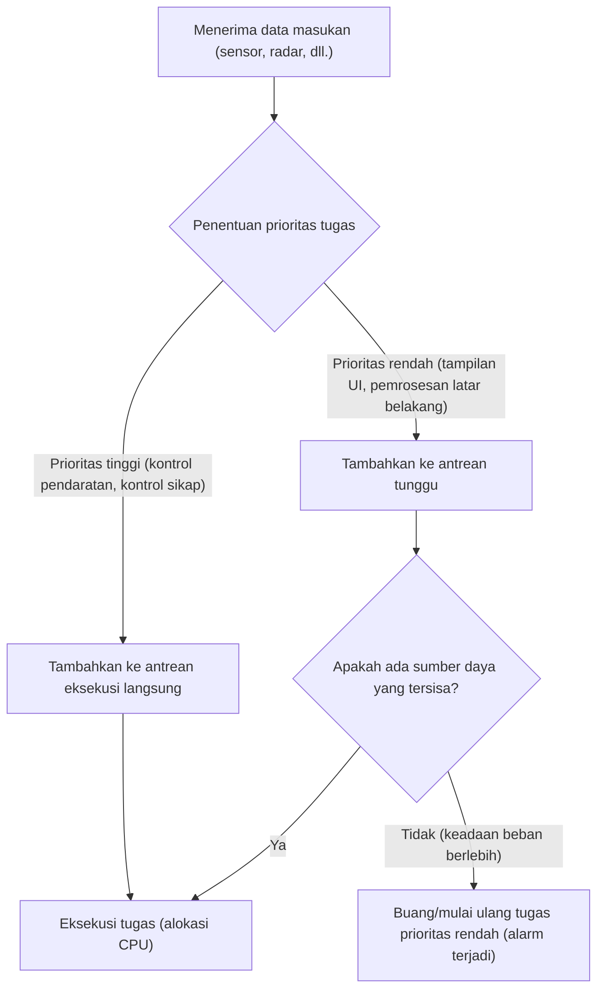
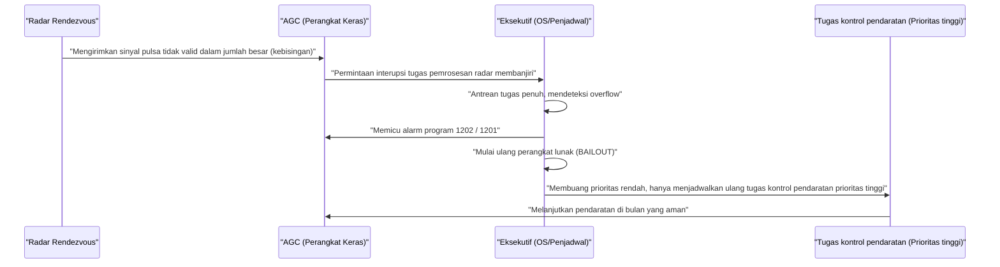

# 1. Pendahuluan: Tantangan yang Belum Pernah Terjadi Sebelumnya untuk Mendarat di Bulan

Pada tanggal 20 Juli 1969, Apollo 11 mendarat di Sea of Tranquility, dan Komandan Neil Armstrong menjadi manusia pertama yang menginjakkan kaki di bulan. Pencapaian bersejarah ini tidak hanya merupakan hasil dari kemajuan perangkat keras seperti rekayasa roket, ilmu material, dan mekanika langit, tetapi juga merupakan kemenangan "perangkat lunak" yang sangat inovatif pada saat itu.

Di pusat pengembangan perangkat lunak ini adalah **Margaret Hamilton**, yang memimpin pengembangan perangkat lunak Apollo Guidance Computer (AGC) di Instrument Laboratory MIT (Massachusetts Institute of Technology). Pada masa itu, komputer adalah sekumpulan tabung vakum yang memenuhi ruangan besar, dan era miniaturisasi menggunakan transistor baru saja dimulai. Kapasitas memori sangat minim, dan kecepatan perhitungannya jauh lebih lambat dibandingkan dengan ponsel pintar modern.

Dalam artikel ini, kita akan menggali ribuan kata secara mendalam tentang rincian teknis yang menakjubkan dari "kode sumber AGC" yang memandu Apollo 11 ke bulan, dan pencapaian Margaret Hamilton, yang menciptakan konsep "rekayasa perangkat lunak (software engineering)" yang sekarang kita gunakan dengan sangat wajar.

---

# 2. Apa itu Apollo Guidance Computer (AGC)?

Untuk mensukseskan misi Apollo, diperlukan sebuah sistem yang dapat mengendalikan sikap di luar angkasa, menghitung orbit, dan secara otomatis membantu pendaratan di bulan. Meskipun dimungkinkan untuk berkomunikasi dengan komputer mainframe di bumi dan meminta instruksi, risiko penundaan komunikasi (time lag) atau terputusnya komunikasi mengharuskan adanya komputer otonom di dalam pesawat ruang angkasa. Itulah **Apollo Guidance Computer (AGC)**.

## Batasan Perangkat Keras dan Arsitektur Unik

AGC adalah salah satu komputer terawal yang secara luas mengadopsi sirkuit terpadu (IC). Spesifikasinya sangat minim jika dibandingkan dengan standar modern.

- **Frekuensi Clock**: 2.048 MHz
- **RAM (Erasable Memory)**: 2,048 word (1 word = 16 bit, pada dasarnya hanya 4 kilobyte)
- **ROM (Fixed Memory)**: 36,864 word (sekitar 72 kilobyte)
- **Berat**: Sekitar 32 kg

Dengan sumber daya yang terbatas ini, ia harus melakukan perhitungan orbit waktu nyata, kontrol pendorong, rendering tampilan, dan pemrosesan input dari astronot secara bersamaan.

## Core Rope Memory: Kode yang Dianyam Secara Fisik

Salah satu teknologi AGC yang paling khas adalah ROM yang disebut **"Core Rope Memory"** untuk menyimpan program.
Ini adalah mekanisme untuk merepresentasikan data dengan secara fisik melewatkan kabel melalui inti magnetik (1) atau tidak melewatinya (0). Para pekerja wanita yang terampil (dikenal sebagai Little Old Ladies) menggunakan perangkat yang menyerupai alat tenun besar untuk secara harfiah "menganyam dengan tangan" rangkaian bit nol dan satu.
Karena program yang dianyam secara fisik ditetapkan secara fisik, risiko kehilangan data (bit flip) bahkan di lingkungan ruang angkasa yang keras dan radiasi sangat rendah, dan memiliki keandalan yang tinggi. Namun, karena memperbaiki bug setelah selesai sangat sulit, kesempurnaan mutlak dituntut dari perangkat lunak tersebut.

---

# 3. Margaret Hamilton: Ibu dari Rekayasa Perangkat Lunak

Margaret Hamilton awalnya mengambil jurusan matematika dan filsafat. Pada awal 1960-an, ia terlibat dalam pengembangan perangkat lunak prediksi cuaca di bawah Edward Lorenz, dan kemudian berpartisipasi dalam pengembangan SAGE (sistem pertahanan udara) di Lincoln Laboratory MIT. Dan pada tahun 1965, ia diangkat sebagai kepala tim pengembangan perangkat lunak untuk misi Apollo.

## Lahirnya Istilah "Rekayasa Perangkat Lunak"

Pada waktu itu, pengembangan perangkat lunak belum diakui sebagai "sains" atau "rekayasa (engineering)". Meskipun metode desain yang ketat dan proses pengujian ada untuk pengembangan perangkat keras, perangkat lunak dipandang sebagai sesuatu yang dibuat secara ad-hoc oleh orang-orang yang disebut "pembuat kode (coder)".

Hamilton sangat menyadari bahwa bug perangkat lunak tidak dapat diterima dalam misi seperti program Apollo, di mana nyawa manusia dan prestise nasional dipertaruhkan. Ia memperkenalkan ketelitian, metodologi pengujian, kontrol versi, dan proses jaminan kualitas yang setara dengan rekayasa perangkat keras ke dalam pengembangan perangkat lunak. Dialah yang mencetuskan istilah **"rekayasa perangkat lunak"** dan menetapkan pengembangan perangkat lunak sebagai bidang rekayasa yang sah.

Sebuah foto terkenal menunjukkan dirinya berdiri di samping tumpukan kode sumber Apollo yang dicetak. Tumpukan kertas yang setinggi dirinya itu adalah kristalisasi dari darah dan keringat yang mereka tulis dan verifikasi baris demi baris.

---

# 4. Keseluruhan Kode Sumber Apollo 11

Pada tahun 2003, kode sumber Apollo 11 (revisi yang disebut Comanche 55) didigitalkan oleh para peneliti MIT dan sekarang tersedia di GitHub. Membaca kode ini mengungkapkan kecerdikan yang luar biasa dan pandangan ke depan dari para insinyur saat itu.

## Struktur Perakitan AGC

Kode AGC ditulis dalam bahasa eksklusif yang disebut "bahasa perakitan AGC". Untuk menghemat memori yang terbatas sebanyak mungkin, set instruksi sangat dioptimalkan. Selain itu, mekanisme mesin virtual yang disebut Interpreter diimplementasikan untuk menyederhanakan perhitungan vektor dan matriks matematis. Ini memungkinkan perhitungan navigasi yang kompleks ditulis dengan kode pendek.

## Penjadwalan Tugas Berbasis Prioritas (Executive Program)

Hal yang paling inovatif dari desain perangkat lunak AGC adalah pengenalan konsep sistem operasi waktu nyata (RTOS) yang disebut **"Asynchronous Executive (Eksekutif Asinkron)"**.

Sistem ini, yang dapat dikatakan sebagai prototipe penjadwal tugas dari OS modern, memberikan "prioritas" ke setiap tugas.

Dengan siklus CPU yang terbatas, mustahil untuk memproses semua tugas secara berurutan pada waktu yang tepat. Jadi tim Hamilton merancang arsitektur di mana tugas yang lebih penting (seperti mengendalikan pendorong pendaratan) dapat mengganggu tugas yang kurang penting (seperti memperbarui tampilan astronot) untuk dieksekusi.

## Penanganan Kesalahan dan Mekanisme Restart (Fungsi BAILOUT)

Selain itu, mereka menggabungkan mekanisme fail-safe **"BAILOUT"** saat sistem kelebihan beban.
Ketika komputer memegang tugas yang tidak dapat diproses, alih-alih merusak seluruh sistem, ia secara sukarela melakukan booting ulang (restart) setelah menyimpan status saat ini, dan memulihkan serta melanjutkan hanya tugas yang diprioritaskan secara tinggi. Pandangan ke depan inilah yang kemudian akan menyelamatkan Apollo 11 dari krisis yang mematikan.

---

# 5. Alarm Program "1202" dan "1201" yang Menentukan

Pada 20 Juli 1969, tepat pada saat Modul Bulan Apollo 11 (Eagle) mulai turun menuju bulan, sebuah peristiwa bersejarah terjadi.
Sekitar 3 menit sebelum pendaratan, di ketinggian sekitar 9.000 meter, sebuah alarm program dengan label **"1202"** berkedip di layar AGC. Diikuti oleh alarm **"1201"**.

## Krisis Putus Asa dan Kelainan Perangkat Keras

Astronot Armstrong dan Aldrin, serta pusat kendali Houston, hampir panik. Arti dari alarm tersebut adalah "Executive Overflow", peringatan fatal yang berarti "kapasitas pemrosesan komputer telah melampaui batas dan tugas-tugas melimpah."
Penyebabnya adalah kesalahan konfigurasi perangkat keras. Saklar untuk Radar Rendezvous (radar yang digunakan untuk berlabuh dengan Command Module) berada di posisi yang salah, secara terus-menerus mengirimkan ribuan sinyal interupsi yang tidak berarti ke AGC setiap detik. Penggunaan CPU melonjak menjadi 100% secara instan.

## Saat Perangkat Lunak Menyelamatkan Dunia

Biasanya, jika interupsi tidak normal ini berlanjut, komputer akan membeku atau macet, dan modul bulan akan kehilangan kendali dan menabrak bulan, atau terpaksa membatalkan pendaratan darurat (abort).

Namun, perangkat lunak yang dirancang oleh tim Margaret Hamilton berfungsi dengan sempurna.

Alarm 1202 bukanlah tanda bahwa komputer "mati", melainkan **laporan yang meyakinkan dari sistem bahwa "telah membuang tugas yang tidak perlu dan mengalihkan semua sumber daya ke kontrol pendaratan penting dan dimulai ulang."**
Para insinyur di ruang kendali (Jack Garman dan Steve Bales) langsung mengerti bahwa alarm ini adalah hasil dari fitur fail-safe, dan membuat keputusan untuk "Go (Lanjutkan pendaratan)".

Hasilnya, Eagle berhasil mendarat di bulan. Pesan bersejarah dari Komandan Armstrong, "Houston, Tranquility Base di sini. The Eagle has landed," dikirimkan ke Bumi.

---

# 6. Pengaruh terhadap Pengembangan Perangkat Lunak Modern

Kode Apollo 11 meninggalkan lebih dari sekadar fakta bahwa kita telah pergi ke bulan.

## Pelopor Pemrosesan Asinkron dan Desain Fail-Safe
Pemrosesan tugas asinkron dan konsep degradasi yang anggun (graceful degradation) selama keadaan tidak normal yang diimplementasikan oleh Hamilton dan timnya secara langsung terhubung ke desain sistem kontrol lalu lintas udara modern, perangkat medis, mobil tanpa pengemudi, dan bahkan layanan mikro (microservices) dalam infrastruktur cloud.
Filosofi desainnya, yang didasarkan pada asumsi bahwa "kesalahan tak terduga pasti akan terjadi" dan bertujuan untuk "mempertahankan fungsi penting tanpa menjatuhkan sistem," membentuk fondasi SRE (Site Reliability Engineering) modern.

## Reaksi Open Source dan Komunitas
Ketika kode sumber Apollo 11 diunggah ke GitHub pada tahun 2016, pemrogram di seluruh dunia menjadi sangat antusias. Di dalam kode tersebut terdapat komentar-komentar yang memperlihatkan selera humor dan kemanusiaan dari para pengembang pada saat itu (misalnya, komentar yang memohon kepada astronot "tolong jangan lakukan hal-hal bodoh," dan kutipan dari Shakespeare), yang sangat menyentuh para insinyur modern.

---

# 7. Kesimpulan: Wanita yang Menulis Ulang Alam Semesta dan Warisannya

Margaret Hamilton tidak hanya menulis kode, tetapi juga menciptakan paradigma "rekayasa perangkat lunak" itu sendiri.
Pada tahun 2016, Presiden Barack Obama memberikannya Medali Kebebasan Presiden (Presidential Medal of Freedom), penghargaan sipil tertinggi di Amerika Serikat, atas kontribusinya.

Kode sumber AGC Apollo 11 adalah salah satu kode paling indah dalam sejarah manusia, dijalin ke dalam memori hanya beberapa kilobyte, berisi kebijaksanaan manusia, pandangan ke depan, dan tekad yang kuat untuk mengatasi kegagalan.
Di balik ponsel pintar dan internet yang kita gunakan setiap hari, semangat "rekayasa perangkat lunak" yang pernah dianyam oleh Margaret Hamilton saat ia menantang bulan, masih tetap hidup dengan pasti.
