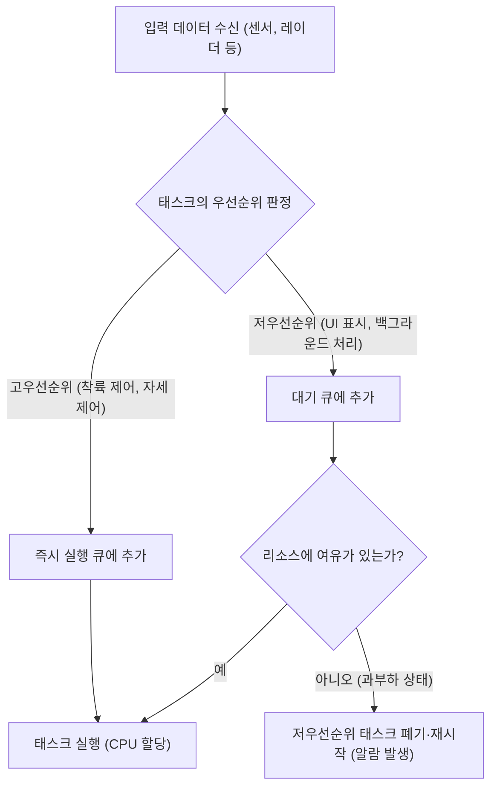
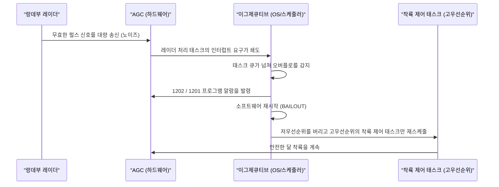

# 1. 서론: 달 착륙이라는 전대미문의 도전

1969년 7월 20일, 아폴로 11호는 고요의 바다에 착륙했고, 닐 암스트롱 선장이 인류 최초로 달 표면에 발을 디뎠습니다. 이 역사적인 위업은 로켓 공학, 재료 과학, 천체 역학 같은 하드웨어적인 진보의 결실인 동시에, 당시로서는 극히 혁신적이었던 '소프트웨어'의 승리이기도 했습니다.

그 소프트웨어 개발의 중심에 있던 인물이 바로 MIT(매사추세츠 공과대학교) 계기 연구소에서 아폴로 유도 컴퓨터(Apollo Guidance Computer, 약칭 AGC)의 소프트웨어 개발을 지휘한 **마거릿 해밀턴(Margaret Hamilton)**입니다. 당시의 컴퓨터는 거대한 방을 차지하는 진공관 덩어리에서 이제 막 트랜지스터를 이용한 소형화가 시작되던 시대였습니다. 메모리 용량은 아주 적었고, 계산 속도도 현대의 스마트폰과는 비교할 수 없을 정도로 느렸습니다.

본 기사에서는 아폴로 11호를 달로 이끈 'AGC 소스 코드'의 놀라운 기술적 세부 사항과 현재 우리가 당연하게 사용하는 '소프트웨어 엔지니어링(소프트웨어 공학)'이라는 개념을 탄생시킨 마거릿 해밀턴의 업적에 대해 수천 자에 걸쳐 철저하게 깊이 파헤쳐 봅니다.

---

# 2. 아폴로 유도 컴퓨터(AGC)란 무엇인가

아폴로 계획을 성공시키기 위해서는 우주 공간에서 자세를 제어하고, 궤도를 계산하며, 달 표면 착륙을 자동으로 보조하는 시스템이 필수 불가결했습니다. 지구상의 메인프레임 컴퓨터와 통신하여 지시를 받을 수도 있었지만, 통신 지연(타임랙)이나 통신 두절의 위험을 고려하면 우주선 내에 자율형 컴퓨터를 탑재할 필요가 있었습니다. 그것이 바로 **아폴로 유도 컴퓨터(AGC)**입니다.

## 하드웨어의 제약과 독자적인 아키텍처

AGC는 집적회로(IC)를 대대적으로 채택한 초창기 컴퓨터 중 하나입니다. 그 사양은 현대의 기준에서 보면 놀라울 정도로 빈약했습니다.

- **클럭 주파수**: 2.048 MHz
- **RAM (Erasable Memory)**: 2,048워드(1워드 = 16비트, 실질적으로 불과 4킬로바이트)
- **ROM (Fixed Memory)**: 36,864워드(약 72킬로바이트)
- **무게**: 약 32kg

이 제한된 리소스로 실시간 궤도 계산, 스러스터 제어, 디스플레이 묘사, 우주비행사의 입력 처리를 동시에 해내야만 했습니다.

## 코어 로프 메모리: 물리적으로 엮인 코드

AGC의 가장 특징적인 기술 중 하나가 프로그램을 저장하기 위한 ROM인 **'코어 로프 메모리(Core Rope Memory)'**입니다.
이것은 자기 코어에 도선을 물리적으로 통과시키거나(1) 통과시키지 않는(0) 방식으로 데이터를 표현하는 구조였습니다. 숙련된 여성 작업자들(리틀 올드 레이디스라고 불렸습니다)이 거대한 베틀 같은 장치를 사용하여 0과 1의 비트열을 말 그대로 '수작업으로 엮어' 나간 것입니다.
한 번 엮인 프로그램은 물리적으로 고정되기 때문에, 방사선이나 우주 공간의 가혹한 환경에서도 데이터가 지워질(비트가 반전될) 위험이 극히 낮아 높은 신뢰성을 자랑했습니다. 하지만 한 번 완성되면 버그 수정이 매우 어려웠기 때문에 소프트웨어에는 절대적인 완벽함이 요구되었습니다.

---

# 3. 마거릿 해밀턴: 소프트웨어 공학의 어머니

마거릿 해밀턴은 애초에 수학과 철학을 전공했습니다. 1960년대 초반, 그녀는 에드워드 로렌츠 밑에서 기상 예측 소프트웨어 개발에 참여했고, 이후 MIT의 링컨 연구소에서 SAGE(방공 시스템) 개발에 합류합니다. 그리고 1965년, 그녀는 아폴로 계획의 소프트웨어 개발 팀 책임자로 임명되었습니다.

## '소프트웨어 엔지니어링'이라는 단어의 탄생

당시 소프트웨어 개발은 '과학'이나 '공학'으로 인지되지 않았습니다. 하드웨어 개발에는 엄격한 설계 기법이나 테스트 프로세스가 존재했지만, 소프트웨어는 '코더'라고 불리는 사람들이 임시방편(애드혹)으로 만드는 것으로 여겨졌던 것입니다.

해밀턴은 아폴로 계획처럼 인명과 국가의 위신이 걸린 미션에서 소프트웨어의 버그는 용납될 수 없다고 강하게 인식했습니다. 그녀는 하드웨어 공학과 동등한 엄격함, 테스트 기법, 버전 관리, 품질 보증 프로세스를 소프트웨어 개발에 도입했습니다. 그녀 자신이 **'소프트웨어 엔지니어링'**이라는 단어를 제창하여 소프트웨어 개발을 정당한 공학 분야로 확립시킨 것입니다.

유명한 사진 중에 그녀가 출력된 아폴로의 소스 코드 산 옆에 서 있는 것이 있습니다. 그녀의 키만큼이나 높이 쌓인 그 종이 뭉치야말로 그녀들이 한 줄 한 줄 작성하고 검증을 거듭한 피와 땀의 결정체입니다.

---

# 4. 아폴로 11호 소스 코드의 전모

2003년, MIT의 연구자들에 의해 아폴로 11호의 소스 코드(Comanche 55라는 리비전)가 디지털화되어, 현재는 GitHub에서도 공개되어 있습니다. 이 코드를 읽어보면 당시 엔지니어들의 남다른 궁리와 선견지명이 떠오릅니다.

## AGC 어셈블리의 구조

AGC의 코드는 'AGC 어셈블리어'라고 불리는 독자적인 언어로 작성되었습니다. 제한된 메모리를 극한까지 절약하기 위해 명령어 세트는 고도로 최적화되어 있었습니다. 또한 수학적인 벡터 계산이나 행렬 계산을 간략화하기 위해 인터프리터(Interpreter)라고 불리는 가상 머신적인 메커니즘도 구현되어 있었습니다. 이를 통해 복잡한 내비게이션 계산을 짧은 코드로 작성하는 것이 가능했습니다.

## 우선순위에 기반한 태스크 스케줄링(Executive Program)

AGC의 소프트웨어 설계에서 가장 획기적이었던 것은 **'비동기 이그제큐티브(Asynchronous Executive)'**라고 불리는 실시간 운영체제(RTOS)의 개념을 도입한 것입니다.

현대 OS의 태스크 스케줄러의 원형이라고도 할 수 있는 이 시스템에서는 각 태스크에 '우선순위'가 할당되어 있었습니다.

제한된 CPU 사이클 내에서 모든 태스크를 순서대로 처리해서는 늦습니다. 그래서 해밀턴의 팀은 더 중요한 태스크(착륙 스러스터 제어 등)가 중요하지 않은 태스크(우주비행사의 디스플레이 업데이트 등)에 끼어들어 실행될 수 있는 아키텍처를 설계했습니다.

## 오류 처리와 재시작 메커니즘(BAILOUT 기능)

나아가 그녀들은 시스템이 과부하에 빠졌을 때의 페일세이프 메커니즘인 **'BAILOUT(긴급 탈출)'**을 도입했습니다.
컴퓨터가 다 처리할 수 없는 태스크를 떠안은 경우 시스템 전체를 크래시시키는 것이 아니라, 현재 상태를 저장한 후 자발적으로 리부트(재시작)하여 고우선순위의 태스크만 복원하고 실행을 재개하는 구조입니다. 이 선견지명이 훗날 아폴로 11호를 절체절명의 위기에서 구하게 됩니다.

---

# 5. 운명의 '1202'와 '1201' 프로그램 알람

1969년 7월 20일, 아폴로 11호의 달 착륙선(이글호)이 달 표면을 향해 강하를 시작한 바로 그때, 역사적인 사건이 발생합니다.
착륙 약 3분 전, 고도 약 9,000미터 부근에서 AGC의 디스플레이에 **'1202'**라는 프로그램 알람이 깜박인 것입니다. 이어서 **'1201'** 알람도 울려 퍼졌습니다.

## 절체절명의 위기와 하드웨어 이상

우주비행사 암스트롱과 올드린, 그리고 휴스턴의 관제실은 패닉에 빠질 뻔했습니다. 알람의 의미는 '이그제큐티브 오버플로', 즉 '컴퓨터의 처리 능력이 한계를 넘어 태스크가 넘치고 있다'는 치명적인 경고였습니다.
원인은 하드웨어의 설정 오류였습니다. 랑데부 레이더(사령선과 도킹할 때 사용하는 레이더)의 스위치가 잘못된 위치에 있어, 레이더에서 AGC로 의미 없는 인터럽트 신호가 1초에 수천 번이나 계속 전송되고 있었던 것입니다. CPU 사용률은 순식간에 100%로 치솟았습니다.

## 소프트웨어가 세계를 구한 순간

통상적이라면 이런 비정상적인 인터럽트가 지속될 경우 컴퓨터는 멈추거나 크래시되고, 착륙선은 통제력을 잃고 달 표면에 격돌하거나 긴급 탈출(어보트)을 강요받았을 것입니다.

하지만 마거릿 해밀턴의 팀이 설계한 소프트웨어는 완벽하게 작동했습니다.

1202 알람은 컴퓨터가 '죽었다'는 알림이 아니라, **'불필요한 태스크를 폐기하고 중요한 착륙 제어에 리소스를 전부 쏟아부어 재시작했다'는 시스템으로부터의 든든한 보고**였던 것입니다.
관제실의 엔지니어(잭 가먼과 스티브 베일스)는 이 알람이 페일세이프 기능에 의한 것임을 순식간에 이해하고 'Go(착륙 속행)'라는 결단을 내렸습니다.

결과적으로 이글호는 무사히 달 표면에 착륙했습니다. 암스트롱 선장의 "휴스턴, 여기는 고요의 기지. 이글은 내려앉았다"라는 역사적인 메시지가 지구에 전달되었습니다.

---

# 6. 현대 소프트웨어 개발에 미친 영향

아폴로 11호의 코드는 단순히 달에 갔다는 사실 이상의 것을 우리에게 남겼습니다.

## 비동기 처리와 페일세이프 설계의 선구자
해밀턴과 그녀의 팀이 구현한 비동기 태스크 처리나 이상 시의 단계적인 기능 축소(그레이스풀 디그레이데이션) 개념은 현대의 항공 관제 시스템, 의료 기기, 자율주행차, 나아가 클라우드 인프라스트럭처의 마이크로서비스 설계에까지 직접적으로 이어져 있습니다.
'예기치 않은 오류는 반드시 일어난다'는 전제에 서서 '시스템을 다운시키지 않고 중요 기능을 유지한다'는 그녀의 설계 사상은 현대 SRE(사이트 신뢰성 공학)의 근간을 이루고 있습니다.

## 오픈소스와 커뮤니티의 반응
2016년에 아폴로 11호의 소스 코드가 GitHub에 업로드되었을 때 전 세계의 프로그래머들이 열광했습니다. 코드 속에는 당시 개발자들의 유머나 인간미를 엿볼 수 있는 주석(예를 들어 우주비행사에게 "제발 바보 같은 짓은 하지 말아줘"라고 기도하는 듯한 주석이나 셰익스피어의 인용 등)이 남아 있어, 현대의 엔지니어들에게 깊은 감동을 주었습니다.

---

# 7. 결론: 우주를 다시 쓴 여성과 그 유산

마거릿 해밀턴은 단순히 코드를 작성한 것뿐만 아니라 '소프트웨어 공학'이라는 패러다임 그 자체를 창조해 냈습니다.
2016년, 버락 오바마 대통령은 그녀의 업적을 기리며 미국에서 민간인에게 수여하는 최고 훈장인 '대통령 자유 훈장'을 수여했습니다.

아폴로 11호의 AGC 소스 코드는 불과 몇 킬로바이트의 메모리 속에 인간의 지혜, 선견지명, 그리고 실패를 극복하려는 강한 의지가 엮여 있는 인류 역사상 가장 아름다운 코드 중 하나입니다.
우리가 매일 사용하고 있는 스마트폰이나 인터넷 이면에도 과거 마거릿 해밀턴이 달에 도전했을 때 만들어낸 '소프트웨어 엔지니어링'의 정신이 분명하게 살아 숨쉬고 있습니다.
