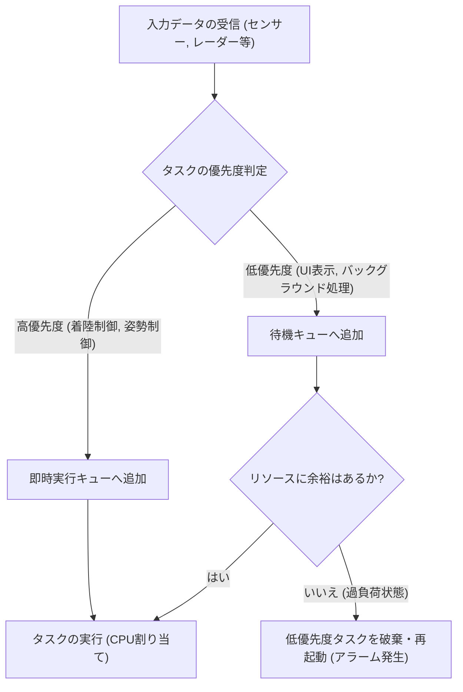
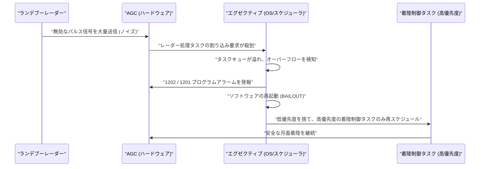

# 1. はじめに：月面着陸という前代未聞の挑戦

1969年7月20日、アポロ11号は静かの海に着陸し、ニール・アームストロング船長が人類で初めて月面に足を踏み入れました。この歴史的な偉業は、ロケット工学、材料科学、天体力学といったハードウェア的な進歩の賜物であると同時に、当時としては極めて革新的な「ソフトウェア」の勝利でもありました。

そのソフトウェア開発の中心にいたのが、MIT（マサチューセッツ工科大学）の計器研究所でアポロ誘導コンピュータ（Apollo Guidance Computer, 略称AGC）のソフトウェア開発を指揮した**マーガレット・ハミルトン（Margaret Hamilton）**です。当時のコンピュータは巨大な部屋を占有する真空管の塊から、ようやくトランジスタを用いた小型化が始まったばかりの時代。メモリ容量はごくわずかで、計算速度も現代のスマートフォンとは比べ物にならないほど遅いものでした。

本記事では、アポロ11号を月に導いた「AGCソースコード」の驚くべき技術的詳細と、現在私たちが当たり前のように使っている「ソフトウェアエンジニアリング（ソフトウェア工学）」という概念を生み出したマーガレット・ハミルトンの功績について、数千文字にわたって徹底的に深掘りします。

---

# 2. アポロ誘導コンピュータ（AGC）とは何か

アポロ計画を成功させるためには、宇宙空間で姿勢を制御し、軌道を計算し、月面への着陸を自動的にアシストするシステムが必要不可欠でした。地球上のメインフレームコンピュータと通信して指示を仰ぐこともできましたが、通信遅延（タイムラグ）や通信途絶のリスクを考慮すると、宇宙船内に自律型のコンピュータを搭載する必要がありました。それが**アポロ誘導コンピュータ（AGC）**です。

## ハードウェアの制約と独自のアーキテクチャ

AGCは、集積回路（IC）を大々的に採用した最初期のコンピュータの一つです。その仕様は現代の基準からすると驚くほど貧弱でした。

- **クロック周波数**: 2.048 MHz
- **RAM (Erasable Memory)**: 2,048ワード（1ワード = 16ビット、実質わずか4キロバイト）
- **ROM (Fixed Memory)**: 36,864ワード（約72キロバイト）
- **重量**: 約32kg

この限られたリソースで、リアルタイムの軌道計算、スラスターの制御、ディスプレイの描画、宇宙飛行士からの入力処理を同時にこなさなければなりませんでした。

## コアロープメモリ：物理的に編み込まれたコード

AGCの最も特徴的な技術の一つが、プログラムを格納するためのROMである**「コアロープメモリ（Core Rope Memory）」**です。
これは磁気コアに導線を物理的に通す（1）か、通さない（0）かによってデータを表現する仕組みでした。熟練の女性作業員たち（リトル・オールド・レディーズと呼ばれました）が、巨大な機織り機のような装置を使って、ゼロとイチのビット列を文字通り「手作業で編み込んで」いったのです。
一度編み込まれたプログラムは物理的に固定されるため、放射線や宇宙空間の過酷な環境でもデータが消える（ビット反転する）リスクが極めて低く、高い信頼性を誇りました。しかし、一度完成するとバグの修正が非常に困難になるため、ソフトウェアには絶対的な完璧さが求められました。

---

# 3. マーガレット・ハミルトン：ソフトウェア工学の母

マーガレット・ハミルトンは、当初は数学と哲学を専攻していました。1960年代初頭、彼女はエドワード・ローレンツの下で気象予測ソフトウェアの開発に関わり、その後MITのリンカーン研究所でSAGE（防空システム）の開発に参加します。そして1965年、彼女はアポロ計画のソフトウェア開発チームの責任者に任命されました。

## 「ソフトウェアエンジニアリング」という言葉の誕生

当時、ソフトウェア開発は「科学」や「工学」としては認知されていませんでした。ハードウェアの開発には厳格な設計手法やテストプロセスが存在しましたが、ソフトウェアは「コーダー」と呼ばれる人々がアドホックに作成するものとみなされていたのです。

ハミルトンは、アポロ計画のような人命と国家の威信がかかったミッションにおいて、ソフトウェアのバグは許されないと強く認識していました。彼女はハードウェア工学と同等の厳格さ、テスト手法、バージョン管理、品質保証のプロセスをソフトウェア開発に導入しました。彼女自身が**「ソフトウェアエンジニアリング」**という言葉を提唱し、ソフトウェア開発を正当な工学分野として確立させたのです。

有名な写真に、彼女がプリントアウトされたアポロのソースコードの山の隣に立っているものがあります。彼女の身長と同じくらいの高さに積み上げられたその紙の束こそが、彼女たちが一行一行記述し、検証を重ねた血と汗の結晶です。

---

# 4. アポロ11号ソースコードの全貌

2003年、MITの研究者らによってアポロ11号のソースコード（Comanche 55というリビジョン）がデジタル化され、現在ではGitHubでも公開されています。このコードを読むと、当時のエンジニアたちの並外れた工夫と先見性が浮かび上がってきます。

## AGCアセンブリの構造

AGCのコードは「AGCアセンブリ言語」と呼ばれる独自言語で書かれています。限られたメモリを極限まで節約するため、命令セットは高度に最適化されていました。また、数学的なベクトル計算や行列計算を簡略化するために、インタプリタ（Interpreter）と呼ばれる仮想マシン的な仕組みも実装されていました。これにより、複雑なナビゲーション計算を短いコードで記述することが可能でした。

## 優先度に基づくタスクスケジューリング（Executive Program）

AGCのソフトウェア設計で最も画期的だったのは、**「非同期のエグゼクティブ（Asynchronous Executive）」**と呼ばれるリアルタイムオペレーティングシステム（RTOS）の概念を導入したことです。

現代のOSのタスクスケジューラの原型とも言えるこのシステムでは、各タスクに「優先度」が割り当てられていました。

限られたCPUサイクルの中で、すべてのタスクを順番に処理していては間に合いません。そこでハミルトンのチームは、より重要なタスク（着陸スラスターの制御など）が、重要でないタスク（宇宙飛行士のディスプレイ更新など）を割り込んで実行できるアーキテクチャを設計しました。

## エラー処理と再起動メカニズム（BAILOUT機能）

さらに彼女たちは、システムが過負荷に陥った際のフェイルセーフメカニズム**「BAILOUT（緊急脱出）」**を組み込みました。
コンピュータが処理しきれないタスクを抱え込んだ場合、システム全体をクラッシュさせるのではなく、現在の状態を保存した上で自発的にリブート（再起動）し、高優先度のタスクだけをリストアして実行を再開するという仕組みです。この先見の明が、後にアポロ11号を絶体絶命の危機から救うことになります。

---

# 5. 運命の「1202」と「1201」プログラムアラーム

1969年7月20日、アポロ11号の月着陸船（イーグル号）が月面に向けて降下を開始したまさにその時、歴史的な事件が発生します。
着陸の約3分前、高度約9,000メートル付近で、AGCのディスプレイに**「1202」**というプログラムアラームが点滅したのです。続いて**「1201」**アラームも鳴り響きました。

## 絶体絶命の危機とハードウェアの異常

宇宙飛行士のアームストロングとオルドリン、そしてヒューストンの管制室はパニックに陥りかけました。アラームの意味は「エグゼクティブ・オーバーフロー」、つまり「コンピュータの処理能力が限界を超え、タスクが溢れている」という致命的な警告でした。
原因はハードウェアの設定ミスでした。ランデブーレーダー（司令船とドッキングする際に使うレーダー）のスイッチが間違った位置にあり、レーダーからAGCに対して、無意味な割り込み信号が1秒間に何千回も送られ続けていたのです。CPU使用率は瞬時に100%に跳ね上がりました。

## ソフトウェアが世界を救った瞬間

通常であれば、このような異常な割り込みが続けばコンピュータはフリーズするかクラッシュし、着陸船は制御を失って月面に激突するか、緊急脱出（アボート）を余儀なくされます。

しかし、マーガレット・ハミルトンのチームが設計したソフトウェアは完璧に機能しました。

1202アラームは、コンピュータが「死んだ」知らせではなく、**「不要なタスクを破棄し、重要な着陸制御にリソースを全振りして再起動した」というシステムからの頼もしい報告**だったのです。
管制室のエンジニア（ジャック・ガーマンやスティーブ・ベイルズ）は、このアラームがフェイルセーフ機能によるものであることを瞬時に理解し、「Go（着陸続行）」の決断を下しました。

結果として、イーグル号は無事に月面に着陸。アームストロング船長の「ヒューストン、こちら静かの基地。イーグルは舞い降りた」という歴史的メッセージが地球に届けられました。

---

# 6. 現代のソフトウェア開発への影響

アポロ11号のコードは、単に月へ行ったという事実以上のものを私たちに残しました。

## 非同期処理とフェイルセーフ設計の先駆け
ハミルトンたちが実装した非同期タスク処理や、異常時の段階的な機能縮退（グレースフル・デグラデーション）の概念は、現代の航空管制システム、医療機器、自動運転車、さらにはクラウドインフラストラクチャにおけるマイクロサービスの設計にまで直接的に通じています。
「予期せぬエラーは必ず起こる」という前提に立ち、「システムを落とさずに重要機能を維持する」という彼女の設計思想は、現代のSRE（サイト・リライアビリティ・エンジニアリング）の根幹を成すものです。

## オープンソースとコミュニティの反応
2016年にアポロ11号のソースコードがGitHubにアップロードされた際、世界中のプログラマーが熱狂しました。コードの中には、当時の開発者たちのユーモアや人間味が垣間見えるコメント（例えば、宇宙飛行士に「お願いだからバカなことはしないでくれ」と祈るようなコメントや、シェイクスピアの引用など）が残されており、現代のエンジニアたちに深い感動を与えました。

---

# 7. 結論：宇宙を書き換えた女性とその遺産

マーガレット・ハミルトンは、単にコードを書いただけでなく、「ソフトウェア工学」というパラダイムそのものを創り出しました。
2016年、バラク・オバマ大統領は彼女の功績を称え、アメリカ合衆国における文民向けの最高位の勲章である「大統領自由勲章」を授与しました。

アポロ11号のAGCソースコードは、わずか数キロバイトのメモリの中に、人間の知恵、先見性、そして失敗を乗り越えようとする強い意志が編み込まれた、人類史上最も美しいコードの一つです。
私たちが日々利用しているスマートフォンやインターネットの背後にも、かつてマーガレット・ハミルトンが月に挑んだ時に編み出した「ソフトウェアエンジニアリング」の精神が、確かに息づいているのです。
