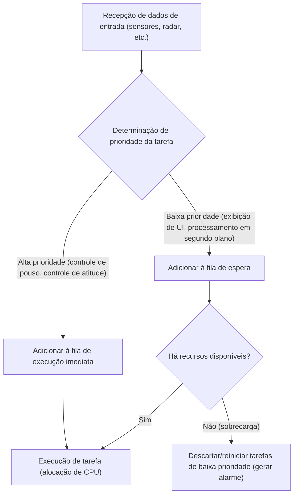
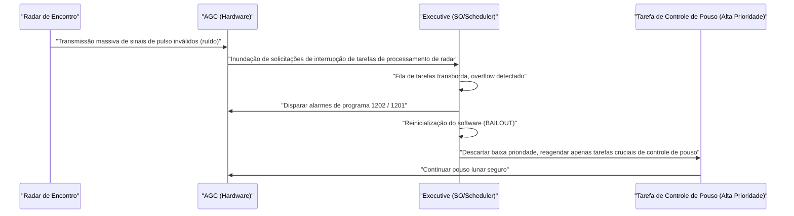

# 1. Introdução: O desafio sem precedentes de pousar na Lua

Em 20 de julho de 1969, a Apollo 11 pousou no Mar da Tranquilidade, e o comandante [Neil Armstrong](/pt/p/biography-neil-armstrong/) se tornou o primeiro ser humano a pisar na superfície lunar. Este feito histórico foi o resultado de avanços de hardware em engenharia de foguetes, ciência dos materiais e mecânica celeste, mas ao mesmo tempo, foi também um triunfo do "software", que era extremamente inovador para a época.

No centro desse desenvolvimento de software estava **Margaret Hamilton**, que liderou o desenvolvimento de software para o Apollo Guidance Computer (AGC) no Instrumentation Laboratory do MIT (Instituto de Tecnologia de Massachusetts). Os computadores da época estavam apenas começando a fazer a transição de massas de tubos de vácuo que ocupavam salas inteiras para sistemas miniaturizados usando transistores. A capacidade de memória era minúscula, e a velocidade de computação era incomparavelmente mais lenta do que a dos smartphones modernos.

Neste artigo, exploraremos a fundo, ao longo de milhares de palavras, os incríveis detalhes técnicos do "código-fonte do AGC" que guiou a Apollo 11 à Lua, e as conquistas de Margaret Hamilton, que cunhou o conceito de "engenharia de software" (software engineering) que consideramos natural hoje em dia.

---

# 2. O que é o Apollo Guidance Computer (AGC)?

Para que o programa Apollo fosse bem-sucedido, era absolutamente necessário um sistema que pudesse controlar a atitude da espaçonave no espaço, calcular trajetórias e auxiliar automaticamente no pouso lunar. Embora fosse possível comunicar-se com computadores mainframe na Terra para receber instruções, considerando os riscos de atrasos (time lag) ou perda de comunicação, era necessário ter um computador autônomo a bordo da espaçonave. Esse era o **Apollo Guidance Computer (AGC)**.

## Restrições de hardware e arquitetura única

O AGC foi um dos primeiros computadores a adotar em grande escala os circuitos integrados (ICs). Suas especificações eram surpreendentemente fracas para os padrões modernos.

- **Frequência de clock**: 2,048 MHz
- **RAM (Erasable Memory)**: 2.048 palavras (1 palavra = 16 bits, efetivamente apenas 4 kilobytes)
- **ROM (Fixed Memory)**: 36.864 palavras (cerca de 72 kilobytes)
- **Peso**: cerca de 32 kg

Com esses recursos limitados, ele tinha que realizar cálculos de trajetória em tempo real, controle de propulsores, renderização de tela e processamento de entrada dos astronautas simultaneamente.

## Core Rope Memory: Código fisicamente tecido

Uma das tecnologias mais distintivas do AGC foi a **"Core Rope Memory"**, a ROM usada para armazenar programas.
Este era um sistema em que os dados eram representados por fios condutores sendo fisicamente passados (1) ou não passados (0) através de núcleos magnéticos. Trabalhadoras experientes (conhecidas como Little Old Ladies) literalmente "teceram à mão" as sequências de bits de zeros e uns usando máquinas que pareciam teares gigantes.
Como os programas, uma vez tecidos, eram fisicamente fixados, o risco de perda de dados (bit flip) mesmo em ambientes severos de radiação no espaço era extremamente baixo, ostentando alta confiabilidade. No entanto, uma vez concluído, corrigir bugs tornava-se muito difícil, exigindo perfeição absoluta do software.

---

# 3. Margaret Hamilton: A mãe da engenharia de software

Margaret Hamilton inicialmente se especializou em matemática e filosofia. No início dos anos 1960, ela se envolveu no desenvolvimento de software de previsão do tempo sob a orientação de Edward Lorenz, e depois ingressou no Lincoln Laboratory do MIT para trabalhar no sistema de defesa aérea SAGE. E em 1965, ela foi nomeada diretora da equipe de desenvolvimento de software para o programa Apollo.

## O nascimento do termo "Engenharia de Software"

Naquela época, o desenvolvimento de software não era reconhecido como uma "ciência" ou "engenharia". Embora o desenvolvimento de hardware tivesse metodologias de design e processos de teste rigorosos, o software era considerado algo criado ad hoc por pessoas chamadas de "codificadores".

Hamilton reconheceu fortemente que bugs de software não poderiam ser tolerados em uma missão como o programa Apollo, onde vidas humanas e o prestígio nacional estavam em jogo. Ela introduziu o mesmo rigor, métodos de teste, controle de versão e processos de garantia de qualidade da engenharia de hardware no desenvolvimento de software. Ela mesma propôs o termo **"engenharia de software"** e estabeleceu o desenvolvimento de software como um campo legítimo da engenharia.

Há uma foto famosa dela em pé ao lado de uma montanha do código-fonte da Apollo impresso. Aquela pilha de papel, quase da altura dela, é o cristal de sangue e suor de linhas de código que elas escreveram e testaram extensivamente, linha por linha.

---

# 4. A visão completa do código-fonte da Apollo 11

Em 2003, o código-fonte da Apollo 11 (uma revisão chamada Comanche 55) foi digitalizado por pesquisadores do MIT, e agora está disponível até no GitHub. Lendo este código, a engenhosidade extraordinária e a visão dos engenheiros da época vêm à tona.

## A estrutura do AGC Assembly

O código do AGC foi escrito em uma linguagem exclusiva chamada "AGC Assembly Language". Para economizar a memória limitada ao extremo, o conjunto de instruções foi altamente otimizado. Além disso, para simplificar cálculos vetoriais matemáticos e matrizes, um mecanismo semelhante a uma máquina virtual chamado Interpreter foi implementado. Isso tornou possível escrever cálculos de navegação complexos em código curto.

## Agendamento de tarefas baseado em prioridade (Executive Program)

A parte mais inovadora do design de software do AGC foi a introdução do conceito de um sistema operacional de tempo real (RTOS) chamado **"Asynchronous Executive"**.

Neste sistema, que pode ser considerado o protótipo dos agendadores de tarefas (task schedulers) de SOs modernos, uma "prioridade" foi atribuída a cada tarefa.

Com ciclos de CPU limitados, o processamento sequencial de todas as tarefas não seria rápido o suficiente. Portanto, a equipe de Hamilton projetou uma arquitetura em que tarefas mais cruciais (como o controle dos propulsores de pouso) pudessem interromper tarefas menos importantes (como as atualizações dos displays dos astronautas).

## Tratamento de erros e mecanismo de reinicialização (BAILOUT)

Além disso, eles incorporaram um mecanismo de fail-safe chamado **"BAILOUT"** (escape de emergência) para quando o sistema estivesse sobrecarregado.
Se o computador recebesse mais tarefas do que pudesse processar, em vez de travar o sistema inteiro, ele reiniciaria (reboot) voluntariamente após salvar o estado atual e, em seguida, restauraria e retomaria a execução apenas das tarefas de alta prioridade. Essa visão salvou a Apollo 11 de uma crise desesperadora mais tarde.

---

# 5. Os fatídicos alarmes de programa "1202" e "1201"

Em 20 de julho de 1969, exatamente quando o módulo lunar (Eagle) da Apollo 11 começou sua descida para a superfície lunar, ocorreu um incidente histórico.
Cerca de 3 minutos antes do pouso, a uma altitude de cerca de 9.000 metros, um alarme de programa chamado **"1202"** piscou no display do AGC. Ele foi seguido por um alarme **"1201"**.

## Uma crise desesperadora e anomalia de hardware

Os astronautas Armstrong e Aldrin, juntamente com o controle da missão em Houston, quase entraram em pânico. O significado dos alarmes era "overflow executivo" (executive overflow), um aviso fatal de que "a capacidade de processamento do computador excedeu seu limite e as tarefas estão transbordando".
A causa foi um erro de configuração de hardware. O interruptor do radar de encontro (o radar usado ao acoplar ao módulo de comando) estava na posição errada e o radar continuava enviando milhares de sinais de interrupção sem sentido para o AGC a cada segundo. O uso da CPU disparou instantaneamente para 100%.

## O momento em que o software salvou o mundo

Normalmente, se interrupções tão anormais continuassem, o computador congelaria ou travaria, e o módulo lunar perderia o controle e colidiria com a Lua, ou um aborto de emergência (abort) seria forçado.

No entanto, o software projetado pela equipe de Margaret Hamilton funcionou perfeitamente.

O alarme 1202 não era um aviso de que o computador havia "morrido", mas sim um **relatório confiável do sistema afirmando: "Descartei tarefas desnecessárias, dediquei todos os recursos ao controle crucial de pouso e reiniciei"**.
Os engenheiros na sala de controle (Jack Garman e Steve Bales) entenderam instantaneamente que esse alarme se devia ao recurso fail-safe e tomaram a decisão "Go" (continuar o pouso).

Como resultado, a Eagle pousou em segurança na superfície lunar. A mensagem histórica do Comandante Armstrong, "Houston, aqui Base da Tranquilidade. A Águia pousou", foi transmitida para a Terra.

---

# 6. O impacto no desenvolvimento de software moderno

O código da Apollo 11 nos deixou muito mais do que apenas o fato de que fomos à Lua.

## Pioneirismo em processamento assíncrono e design fail-safe
Os conceitos de processamento assíncrono de tarefas (asynchronous task processing) e degradação gradual (graceful degradation) em anomalias implementados por Hamilton e sua equipe estão diretamente ligados ao design de sistemas modernos de controle de tráfego aéreo, dispositivos médicos, carros autônomos e até microserviços em infraestrutura em nuvem.
A filosofia de design de que "erros inesperados sempre ocorrerão" e "manter funções críticas sem derrubar o sistema" é a base da Engenharia de Confiabilidade de Site (SRE) moderna.

## Código aberto e a resposta da comunidade
Quando o código-fonte da Apollo 11 foi carregado no GitHub em 2016, programadores de todo o mundo ficaram entusiasmados. O código continha comentários que deixavam transparecer o humor e a humanidade dos desenvolvedores da época (como um comentário rezando para os astronautas "por favor, não façam nenhuma bobagem" e citações de Shakespeare), o que comoveu profundamente os engenheiros modernos.

---

# 7. Conclusão: A mulher que reescreveu o espaço e seu legado

Margaret Hamilton não apenas escreveu código, ela criou o próprio paradigma da "engenharia de software".
Em 2016, o presidente Barack Obama concedeu a ela a "Medalha Presidencial da Liberdade" (Presidential Medal of Freedom), a maior honraria civil dos Estados Unidos, em reconhecimento às suas conquistas.

O código-fonte do AGC da Apollo 11 é um dos códigos mais bonitos da história da humanidade, tecido com sabedoria humana, visão e uma forte vontade de superar falhas, dentro de meros kilobytes de memória.
Atrás dos smartphones e da internet que usamos todos os dias, o espírito de "engenharia de software" que Margaret Hamilton idealizou ao desafiar a Lua, certamente ainda vive.
