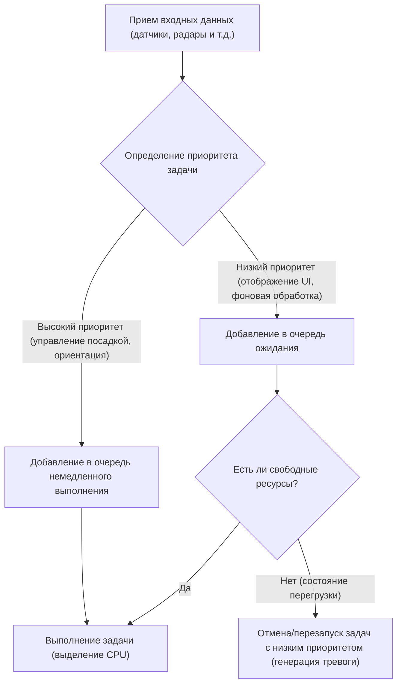
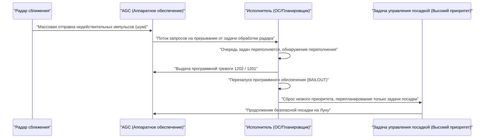

# 1. Введение: Беспрецедентный вызов высадки на Луну

20 июля 1969 года Аполлон-11 приземлился в Море Спокойствия, и командир [Нил Армстронг](/ru/p/biography-neil-armstrong/) стал первым человеком, ступившим на поверхность Луны. Это историческое достижение стало результатом прогресса в области ракетной техники, материаловедения и небесной механики, а также триумфом "программного обеспечения", которое по тем временам было чрезвычайно инновационным.

В центре разработки этого программного обеспечения была **Маргарет Гамильтон (Margaret Hamilton)**, которая руководила созданием программного обеспечения для управляющего компьютера Аполлона (Apollo Guidance Computer, сокращенно AGC) в Лаборатории приборостроения Массачусетского технологического института (MIT). В то время компьютеры только начали переходить от громоздких машин на электронных лампах, занимавших целые комнаты, к более компактным транзисторным устройствам. Объем памяти был ничтожным, а скорость вычислений — несравнимо медленнее, чем у современных смартфонов.

В этой статье мы подробно, на нескольких тысячах символов, рассмотрим удивительные технические детали "исходного кода AGC", который привел Аполлон-11 на Луну, а также достижения Маргарет Гамильтон, породившие концепцию "программной инженерии (software engineering)", которую мы сегодня принимаем как должное.

---

# 2. Что такое управляющий компьютер Аполлона (AGC)

Для успеха программы Аполлон была абсолютно необходима система, которая могла бы управлять положением в космосе, рассчитывать орбиту и автоматически помогать при посадке на Луну. Хотя можно было связаться с наземными мейнфреймами для получения инструкций, учитывая риск задержки (лага) или потери связи, космическому кораблю требовался автономный бортовой компьютер. Этим компьютером и стал **управляющий компьютер Аполлона (AGC)**.

## Аппаратные ограничения и уникальная архитектура

AGC был одним из первых компьютеров, в которых широко использовались интегральные схемы (ИС). Его характеристики были удивительно скромными по современным меркам:

- **Тактовая частота**: 2,048 МГц
- **ОЗУ (Стираемая память)**: 2048 слов (1 слово = 16 бит, фактически всего 4 килобайта)
- **ПЗУ (Фиксированная память)**: 36 864 слова (около 72 килобайт)
- **Вес**: около 32 кг

С этими ограниченными ресурсами компьютер должен был одновременно выполнять расчеты орбиты в реальном времени, управлять двигателями, отрисовывать информацию на дисплее и обрабатывать ввод от астронавтов.

## Память на магнитных сердечниках: Физически вплетенный код

Одной из самых характерных технологий AGC была **"память на магнитных сердечниках (Core Rope Memory)"** — ПЗУ для хранения программ.
Это был механизм, представляющий данные путем физического пропускания (1) или непропускания (0) проводов через магнитные сердечники. Опытные работницы (их называли "Маленькими старушками") буквально "вплетали вручную" последовательности нулей и единиц с помощью устройства, похожего на гигантский ткацкий станок.
Однажды вплетенная программа становилась физически фиксированной, поэтому риск потери данных (инверсии битов) был крайне низок даже в условиях радиации и сурового космоса, что обеспечивало высокую надежность. Однако, поскольку исправление ошибок после завершения было крайне сложным, от программного обеспечения требовалось абсолютное совершенство.

---

# 3. Маргарет Гамильтон: Мать программной инженерии

Изначально Маргарет Гамильтон изучала математику и философию. В начале 1960-х годов она занималась разработкой программного обеспечения для прогнозирования погоды под руководством Эдварда Лоренца, а затем присоединилась к разработке SAGE (системы противовоздушной обороны) в Лаборатории Линкольна MIT. И в 1965 году она была назначена руководителем группы разработки программного обеспечения программы Аполлон.

## Рождение термина "программная инженерия"

В то время разработка программного обеспечения не признавалась "наукой" или "инженерией". В то время как для разработки аппаратного обеспечения существовали строгие методы проектирования и процессы тестирования, программное обеспечение считалось чем-то, что создавалось ситуативно людьми, называемыми "кодерами".

Гамильтон четко понимала, что в такой миссии, как программа Аполлон, где на карту поставлены человеческие жизни и национальный престиж, ошибки в программном обеспечении недопустимы. Она внедрила в разработку программного обеспечения те же строгие методы, методы тестирования, контроль версий и процессы обеспечения качества, что и в аппаратной инженерии. Именно она ввела термин **"программная инженерия (software engineering)"** и утвердила разработку программного обеспечения как законную инженерную дисциплину.

На известной фотографии она стоит рядом с распечатками исходного кода Аполлона, стопка которых достигает ее роста. Эта стопка бумаги — результат крови и пота ее команды, которая писала и проверяла код строчка за строчкой.

---

# 4. Обзор исходного кода Аполлона-11

В 2003 году исследователи из MIT оцифровали исходный код Аполлона-11 (версия под названием Comanche 55), и теперь он доступен на GitHub. При чтении этого кода становятся очевидными невероятная изобретательность и дальновидность инженеров того времени.

## Структура ассемблера AGC

Код AGC написан на проприетарном языке, называемом "языком ассемблера AGC". Чтобы максимально сэкономить ограниченную память, набор инструкций был сильно оптимизирован. Кроме того, для упрощения математических векторных и матричных вычислений был реализован механизм виртуальной машины, называемый интерпретатором (Interpreter). Это позволяло записывать сложные навигационные вычисления коротким кодом.

## Планирование задач на основе приоритетов (Executive Program)

Самым революционным решением в архитектуре программного обеспечения AGC стало внедрение концепции операционной системы реального времени (RTOS), называемой **"Асинхронный исполнитель (Asynchronous Executive)"**.

В этой системе, которую можно назвать прототипом планировщиков задач в современных ОС, каждой задаче назначался "приоритет".

В рамках ограниченных циклов процессора последовательная обработка всех задач была бы слишком медленной. Поэтому команда Гамильтон разработала архитектуру, в которой более важные задачи (например, управление посадочными двигателями) могли прерывать менее важные задачи (например, обновление дисплея для астронавтов) и выполняться немедленно.

## Обработка ошибок и механизм перезапуска (Функция BAILOUT)

Кроме того, они встроили отказоустойчивый механизм **"BAILOUT (Аварийное спасение)"** на случай перегрузки системы.
Если компьютер брал на себя больше задач, чем мог обработать, вместо того, чтобы обрушить всю систему, он сохранял текущее состояние, добровольно перезагружался (перезапускался), восстанавливал только высокоприоритетные задачи и возобновлял выполнение. Эта дальновидность позже спасла Аполлон-11 от неминуемой катастрофы.

---

# 5. Роковые программные тревоги "1202" и "1201"

20 июля 1969 года, когда лунный модуль Аполлона-11 ("Орел") начал спуск к поверхности Луны, произошел исторический инцидент.
Примерно за 3 минуты до посадки, на высоте около 9 000 метров, на дисплее AGC замигала программная тревога **"1202"**. За ней последовала тревога **"1201"**.

## Отчаянный кризис и аппаратная аномалия

Астронавты Армстронг и Олдрин, а также центр управления в Хьюстоне были на грани паники. Смысл тревоги заключался в "переполнении исполнителя", то есть фатальном предупреждении о том, что "вычислительные мощности компьютера превысили предел, и задачи переполнены".
Причиной стала ошибка в настройке оборудования. Переключатель радара сближения (радара, используемого при стыковке с командным модулем) находился в неправильном положении, и радар продолжал посылать бессмысленные сигналы прерывания в AGC тысячи раз в секунду. Загрузка процессора мгновенно подскочила до 100%.

## Момент, когда программное обеспечение спасло мир

В обычных условиях, если бы такие аномальные прерывания продолжались, компьютер бы завис или разбился, посадочный модуль потерял бы управление и врезался в Луну, или пришлось бы совершить аварийное прерывание миссии (аборт).

Однако программное обеспечение, разработанное командой Маргарет Гамильтон, сработало безупречно.

Тревога 1202 была не вестью о том, что компьютер "мертв", а **обнадеживающим отчетом от системы, что она "отбросила ненужные задачи, направила все ресурсы на критически важное управление посадкой и перезагрузилась"**.
Инженеры в центре управления (Джек Гарман и Стив Бэйлз) мгновенно поняли, что эта тревога была вызвана отказоустойчивой функцией, и приняли решение "Go (продолжать посадку)".

В результате "Орел" благополучно приземлился на Луну. На Землю было доставлено историческое сообщение командира Армстронга: "Хьюстон, база Спокойствия здесь. Орел приземлился".

---

# 6. Влияние на современную разработку программного обеспечения

Код Аполлона-11 оставил нам нечто большее, чем просто факт полета на Луну.

## Пионер асинхронной обработки и отказоустойчивого проектирования
Концепции асинхронной обработки задач и постепенной деградации функциональности (graceful degradation) в случае аномалий, реализованные Гамильтон и ее командой, имеют прямое отношение к проектированию современных систем управления воздушным движением, медицинских приборов, беспилотных автомобилей и даже микросервисов в облачной инфраструктуре.
Ее философия проектирования, основанная на предпосылке, что "непредвиденные ошибки обязательно произойдут", и направленная на "сохранение критических функций без остановки системы", является основой современной инженерии надежности сайтов (SRE).

## Открытый исходный код и реакция сообщества
Когда в 2016 году исходный код Аполлона-11 был загружен на GitHub, программисты по всему миру были в восторге. В коде остались комментарии, в которых сквозит юмор и человечность разработчиков того времени (например, комментарии-молитвы астронавтам "пожалуйста, не делайте глупостей" или цитаты из Шекспира), что глубоко тронуло современных инженеров.

---

# 7. Заключение: Женщина, переписавшая космос, и ее наследие

Маргарет Гамильтон не просто писала код, она создала саму парадигму "программной инженерии".
В 2016 году президент Барак Обама наградил ее Президентской медалью Свободы — высшей гражданской наградой в Соединенных Штатах — в знак признания ее заслуг.

Исходный код AGC Аполлона-11 — один из самых красивых кодов в истории человечества, в котором всего на нескольких килобайтах памяти вплетены человеческая мудрость, дальновидность и сильная воля к преодолению неудач.
Даже за смартфонами и интернетом, которыми мы пользуемся каждый день, определенно живет дух "программной инженерии", придуманный Маргарет Гамильтон, когда она бросила вызов Луне.
