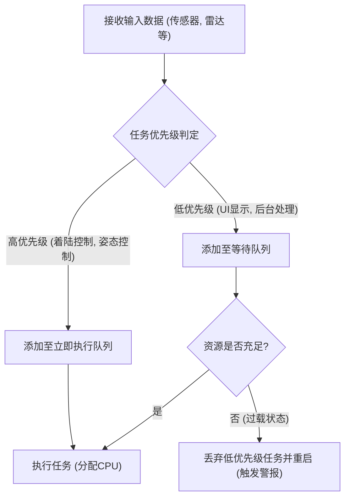
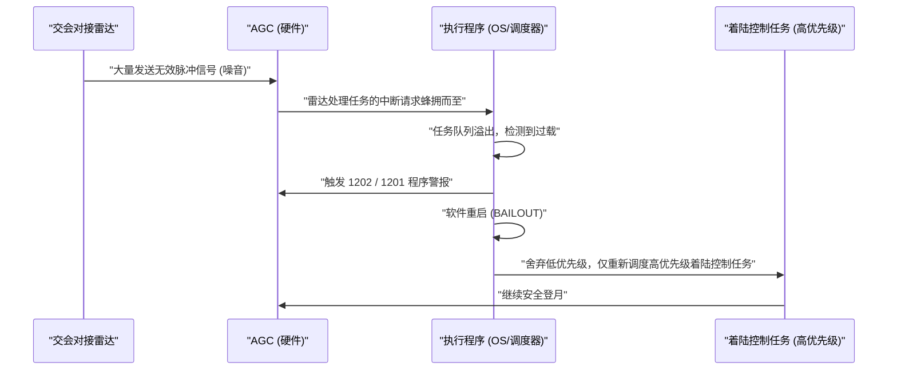

# 1. 简介：前所未有的登月挑战

1969年7月20日，阿波罗11号在静海着陆，尼尔·阿姆斯特朗船长成为首位踏上月球的人类。这一历史性壮举不仅是火箭工程、材料科学和天体力学等硬件进步的结晶，也是当时极具创新性的“软件”的胜利。

在软件开发的核心位置，是麻省理工学院（MIT）仪器实验室负责指挥阿波罗制导计算机（Apollo Guidance Computer，简称AGC）软件开发的**玛格丽特·汉密尔顿（Margaret Hamilton）**。在那个计算机从占据整个房间的真空管庞然大物刚刚开始使用晶体管实现小型化的时代，内存容量微乎其微，计算速度也远远落后于现代智能手机。

本文将通过数千字的篇幅，深入探讨指引阿波罗11号登月的“AGC源代码”中令人惊叹的技术细节，以及玛格丽特·汉密尔顿在创立我们今天习以为常的“软件工程”概念方面的卓越贡献。

---

# 2. 什么是阿波罗制导计算机（AGC）

为了使阿波罗计划取得成功，一个能够控制太空姿态、计算轨道并自动辅助月面着陆的系统是必不可少的。虽然可以通过与地球上的大型计算机通信来获取指令，但考虑到通信延迟和中断的风险，飞船内必须配备一台自主型计算机。这就是**阿波罗制导计算机（AGC）**。

## 硬件限制与独特的架构

AGC是最早大量采用集成电路（IC）的计算机之一。以现代标准来看，其配置极其简陋。

- **时钟频率**: 2.048 MHz
- **RAM (可擦写内存)**: 2,048字（1字 = 16位，实际仅约4KB）
- **ROM (固定内存)**: 36,864字（约72KB）
- **重量**: 约32kg

在这样有限的资源下，AGC必须同时处理实时的轨道计算、推进器控制、显示器绘制以及来自宇航员的输入。

## 磁芯绳内存：物理编织的代码

AGC最具特色的技术之一是用于存储程序的ROM——**“磁芯绳内存（Core Rope Memory）”**。
它的原理是通过导线是否穿过磁芯（1或0）来表示数据。熟练的女工们（被称为“Little Old Ladies”）使用类似巨大织布机的设备，字面意义上地将0和1的比特流“手工编织”进去。
程序一旦编织完成就被物理固定，即使在充满辐射和恶劣太空环境中，数据丢失（比特翻转）的风险也极低，具有极高的可靠性。然而，一旦完成，修复Bug就变得极其困难，因此对软件的完美度要求极高。

---

# 3. 玛格丽特·汉密尔顿：软件工程之母

玛格丽特·汉密尔顿最初主修数学和哲学。20世纪60年代初，她在爱德华·洛伦兹的指导下参与了天气预报软件的开发，随后加入MIT林肯实验室，参与了SAGE（防空系统）的开发。1965年，她被任命为阿波罗计划软件开发团队的负责人。

## “软件工程”一词的诞生

当时，软件开发并未被视为一门“科学”或“工程”。虽然硬件开发有严格的设计方法和测试流程，但软件被认为是被称为“编码员”的人们临时编写的东西。

汉密尔顿深刻认识到，在像阿波罗计划这样关乎人命和国家威望的任务中，软件的Bug是不可容忍的。她将与硬件工程同等严格的测试方法、版本控制和质量保证流程引入到软件开发中。她亲自提出了**“软件工程”**一词，使软件开发确立为一门正当的工程学科。

在一张著名的照片中，她站在堆积如山的阿波罗源代码打印件旁。那一摞和她身高差不多的纸张，正是她们一行一行编写、反复验证的心血结晶。

---

# 4. 阿波罗11号源代码全貌

2003年，MIT的研究人员将阿波罗11号的源代码（修订版Comanche 55）数字化，目前已在GitHub上公开。阅读这段代码，我们可以深刻体会到当时工程师们非凡的智慧与远见。

## AGC汇编的结构

AGC的代码是用被称为“AGC汇编语言”的专属语言编写的。为了极度节省有限的内存，指令集被高度优化。此外，为了简化数学上的向量和矩阵计算，还实现了一个类似虚拟机的机制，称为解释器（Interpreter）。这使得用简短的代码编写复杂的导航计算成为可能。

## 基于优先级的任务调度（Executive Program）

AGC软件设计中最具革命性的一点是引入了实时操作系统（RTOS）概念，即**“异步执行程序（Asynchronous Executive）”**。

这个系统可以说是现代OS任务调度器的雏形，每个任务都被分配了“优先级”。

在有限的CPU周期内，按顺序处理所有任务是来不及的。因此，汉密尔顿的团队设计了一种架构，允许更重要的任务（如着陆推进器的控制）中断并优先于次要任务（如宇航员显示器的更新）执行。

## 错误处理与重启机制（BAILOUT功能）

此外，她们还内置了当系统过载时的故障安全机制**“BAILOUT（紧急逃生）”**。
当计算机面临无法处理的任务量时，与其让整个系统崩溃，不如保存当前状态并自动重启，仅恢复高优先级的任务继续执行。这一远见卓识后来在阿波罗11号面临绝境时拯救了整个任务。

---

# 5. 命运的“1202”与“1201”程序警报

1969年7月20日，正当阿波罗11号登月舱（鹰号）开始向月面下降时，发生了一件历史性事件。
在着陆前约3分钟，高度约9,000米处，AGC显示器上闪烁出**“1202”**程序警报。紧接着又响起了**“1201”**警报。

## 绝命危机与硬件异常

宇航员阿姆斯特朗、奥尔德林以及休斯顿的控制室险些陷入恐慌。警报的含义是“执行程序溢出”，即“计算机处理能力达到极限，任务溢出”的致命警告。
原因是硬件设置错误。交会对接雷达（与指令舱对接时使用的雷达）的开关处于错误位置，雷达每秒向AGC发送数千次无意义的中断信号。CPU使用率瞬间飙升至100%。

## 软件拯救世界的瞬间

通常情况下，如果这种异常中断持续，计算机会死机或崩溃，登月舱将失控坠毁在月面上，或者被迫紧急中止（Abort）。

然而，玛格丽特·汉密尔顿团队设计的软件发挥了完美的功效。

1202警报并非宣告计算机“死亡”，而是**系统发出的可靠报告：“已丢弃不必要的任务，将所有资源倾注于重要的着陆控制并重启”**。
控制室的工程师（杰克·加曼和史蒂夫·贝尔斯）瞬间明白这是故障安全机制在起作用，并下达了“Go（继续着陆）”的决定。

结果，鹰号安全着陆在月面上。阿姆斯特朗船长那句历史性名言“休斯顿，这里是静海基地。鹰已着陆”传回了地球。

---

# 6. 对现代软件开发的影响

阿波罗11号的代码留给我们的，不仅仅是登月这一事实。

## 异步处理与故障安全设计的先驱
汉密尔顿等人实现的异步任务处理和异常时的渐进式功能降级（Graceful Degradation）概念，直接影响了现代航空管制系统、医疗设备、自动驾驶汽车，甚至云基础设施中微服务的设计。
建立在“意外错误必然发生”前提下，“不让系统宕机并维持重要功能”的设计理念，构成了现代SRE（站点可靠性工程）的核心。

## 开源与社区反响
2016年阿波罗11号源代码上传至GitHub时，引发了全世界程序员的狂热。代码中保留了反映当时开发者幽默感和人情味的注释（例如祈求宇航员“拜托别做傻事”的注释，以及引用莎士比亚的名言等），让现代工程师们深受感动。

---

# 7. 结论：改写宇宙的女性及其遗产

玛格丽特·汉密尔顿不仅编写了代码，更是创造了“软件工程”这一范式本身。
2016年，巴拉克·奥巴马总统为表彰她的功绩，授予她美国平民最高荣誉“总统自由勋章”。

阿波罗11号的AGC源代码，在仅几KB的内存中，编织了人类的智慧、远见以及克服失败的顽强意志，是人类历史上最美的代码之一。
在我们日常使用的智能手机和互联网背后，玛格丽特·汉密尔顿在挑战月球时创造的“软件工程”精神，依然在真切地跳动着。
