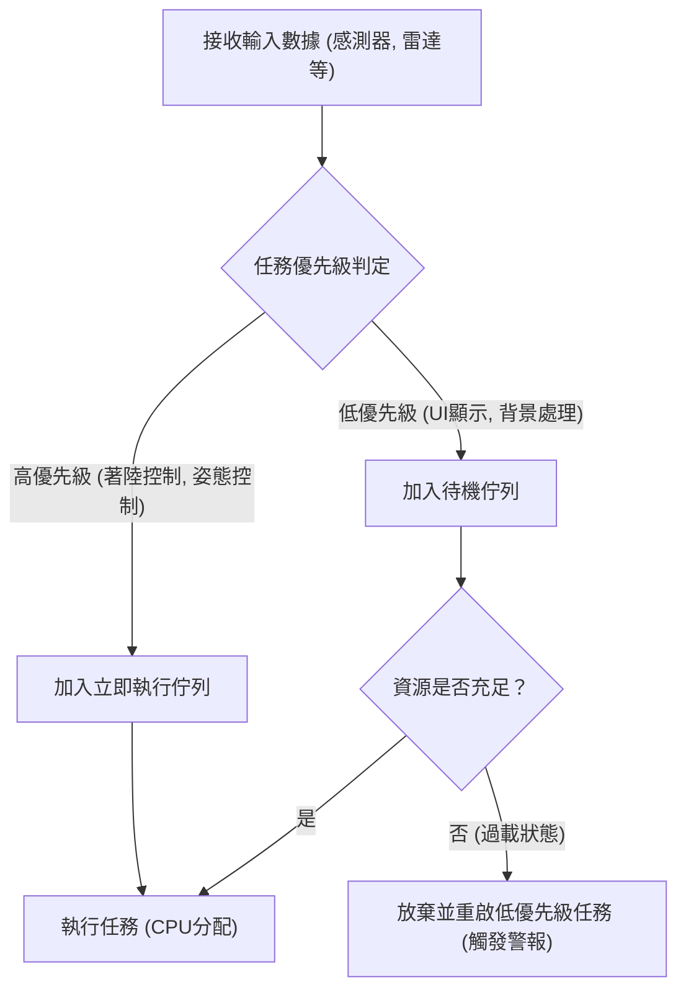
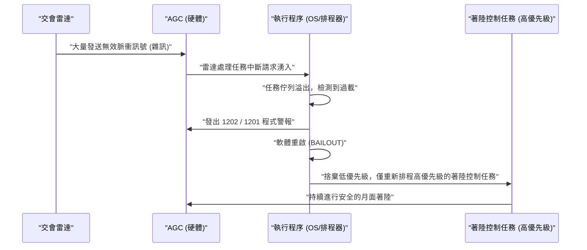

# 1. 前言：登月這項史無前例的挑戰

1969年7月20日，阿波羅11號降落於靜海，尼爾·阿姆斯壯指令長成為人類史上第一位踏上月球表面的人。這項歷史性的偉大成就，不僅是火箭工程、材料科學、天體力學等硬體進步的結晶，同時也是在當時極具革命性的「軟體」的勝利。

處於軟體開發核心的，是在MIT（麻省理工學院）儀器實驗室負責領導阿波羅導航電腦（Apollo Guidance Computer，簡稱AGC）軟體開發的**瑪格麗特·漢密爾頓（Margaret Hamilton）**。當時的電腦剛從佔據巨大房間的真空管機器，開始過渡到使用電晶體的微型化時代。記憶體容量極小，計算速度與現代的智慧型手機更是無法相提並論。

本文將用數千字的篇幅，深入探討引領阿波羅11號登月的「AGC原始碼」中令人驚嘆的技術細節，以及瑪格麗特·漢密爾頓創造了我們現在習以為常的「軟體工程（Software Engineering）」概念的偉大功績。

---

# 2. 阿波羅導航電腦（AGC）是什麼

為了讓阿波羅計畫取得成功，在太空中控制姿態、計算軌道並自動輔助月面著陸的系統是不可或缺的。雖然也可以透過與地球上的大型電腦通訊來獲取指示，但考慮到通訊延遲（time lag）和通訊中斷的風險，必須在太空船內搭載自主型的電腦。那就是**阿波羅導航電腦（AGC）**。

## 硬體限制與獨特的架構

AGC 是最早大量採用積體電路（IC）的電腦之一。以現代的標準來看，其規格簡陋得令人吃驚。

- **時脈頻率**: 2.048 MHz
- **RAM (Erasable Memory)**: 2,048字組（1字組 = 16位元，實際僅約4 KB）
- **ROM (Fixed Memory)**: 36,864字組（約72 KB）
- **重量**: 約32公斤

在這樣有限的資源下，它必須同時處理即時的軌道計算、推進器控制、顯示器繪圖以及來自太空人的輸入。

## 磁芯繩記憶體：物理編織的程式碼

AGC 最具特色的技術之一，是用於儲存程式的 ROM，被稱為**「磁芯繩記憶體（Core Rope Memory）」**。
這是一種根據導線是否物理性穿過（1）或不穿過（0）磁芯來表示資料的機制。熟練的女工們（被稱為 Little Old Ladies）使用類似巨大織布機的裝置，將由 0 和 1 組成的位元串字面意義上「手工編織」進去。
一旦程式被編織完成，便在物理上固定下來，因此即使在輻射或太空嚴酷的環境下，資料遺失（位元翻轉）的風險也極低，具有高度的可靠性。然而，一旦完成，修正 bug 就會變得非常困難，因此軟體被要求必須具備絕對的完美。

---

# 3. 瑪格麗特·漢密爾頓：軟體工程之母

瑪格麗特·漢密爾頓最初主修數學和哲學。1960年代初，她在愛德華·羅倫茲（Edward Lorenz）麾下參與了氣象預測軟體的開發，之後又在 MIT 的林肯實驗室參與了 SAGE（防空系統）的開發。到了 1965 年，她被任命為阿波羅計畫軟體開發團隊的負責人。

## 「軟體工程」一詞的誕生

在當時，軟體開發並沒有被視為一門「科學」或「工程」。硬體的開發有著嚴格的設計手法和測試流程，但軟體卻被認為是由稱為「編碼員（Coder）」的人們以臨時（ad-hoc）方式編寫的東西。

漢密爾頓深刻體認到，在像阿波羅計畫這種關乎人命與國家威信的任務中，軟體的 bug 是絕對不被允許的。她將與硬體工程同等嚴格的測試手法、版本控制以及品質保證流程引入了軟體開發中。正是她親自提倡了**「軟體工程（Software Engineering）」**一詞，並確立了軟體開發作為一門正當工程領域的地位。

在一張著名的照片中，她站在堆積如山的阿波羅原始碼列印紙旁。那疊幾乎與她身高相仿的紙束，正是她們一行一行編寫並反覆驗證的血汗結晶。

---

# 4. 阿波羅11號原始碼的全貌

2003年，MIT 的研究人員將阿波羅11號的原始碼（版本 Comanche 55）數位化，現在也在 GitHub 上公開。閱讀這份程式碼，當時工程師們非凡的巧思與遠見便躍然紙上。

## AGC 組合語言的結構

AGC 的程式碼是用被稱為「AGC 組合語言」的專屬語言編寫的。為了將有限的記憶體節省到極致，指令集經過了高度最佳化。此外，為了簡化數學上的向量與矩陣計算，還實作了一個稱為直譯器（Interpreter）的虛擬機器機制。這使得他們能夠用簡短的程式碼來描述複雜的導航計算。

## 基於優先級的任務排程（Executive Program）

AGC 軟體設計中最具革命性的一點，是引入了被稱為**「非同步執行程序（Asynchronous Executive）」**的即時作業系統（RTOS）概念。

這個系統可以說是現代 OS 任務排程器的雛形，為每個任務分配了「優先級」。

在有限的 CPU 週期內，依序處理所有任務是來不及的。因此，漢密爾頓的團隊設計了一種架構，讓更重要的任務（如著陸推進器控制）能夠中斷並優先於不重要的任務（如更新太空人的顯示器）執行。

## 錯誤處理與重啟機制（BAILOUT功能）

此外，她們還加入了一個在系統過載時的失效安全（Fail-safe）機制——**「BAILOUT（緊急逃生）」**。
當電腦承載了無法處理的任務量時，系統不會全面崩潰，而是保存當前狀態後主動重啟（Reboot），並且只還原高優先級的任務來恢復執行。這個先見之明，後來在阿波羅11號面臨絕命危機時拯救了它。

---

# 5. 命運的「1202」與「1201」程式警報

1969年7月20日，正當阿波羅11號的登月艙（鷹號）開始向月面降落時，歷史性的事件發生了。
在著陸前約3分鐘，高度約9,000公尺處，AGC 的顯示器上閃爍起**「1202」**的程式警報。緊接著，**「1201」**警報也響起了。

## 絕命危機與硬體異常

太空人阿姆斯壯和艾德林，以及休士頓的控制室差點陷入恐慌。警報的意思是「執行程序溢出（Executive Overflow）」，這是一個致命的警告，意味著「電腦的處理能力超出極限，任務已經滿溢」。
原因是硬體的設定錯誤。交會雷達（在與指令艙對接時使用的雷達）的開關處於錯誤的位置，導致雷達每秒向 AGC 發送數千次無意義的中斷訊號。CPU 使用率瞬間飆升至 100%。

## 軟體拯救世界的瞬間

在正常情況下，如果這種異常的中斷持續發生，電腦會凍結或崩潰，登月艙將失去控制並墜毀在月面上，或者被迫進行緊急逃生（中止任務）。

然而，瑪格麗特·漢密爾頓團隊設計的軟體卻完美地發揮了作用。

1202 警報並不是電腦「死機」的通知，而是系統傳來的一份可靠報告，告訴大家**「已捨棄不必要的任務，將所有資源集中於重要的著陸控制並重新啟動」**。
控制室的工程師（傑克·加曼和史蒂夫·貝爾斯）瞬間明白這是失效安全功能所引發的警報，並做出了「Go（繼續著陸）」的決定。

最終，鷹號平安降落於月球表面。阿姆斯壯指令長那句歷史性的名言「休士頓，這裡是靜海基地。鷹號已著陸」順利傳回了地球。

---

# 6. 對現代軟體開發的影響

阿波羅11號的程式碼留給我們的，不僅僅是登月這個事實。

## 非同步處理與失效安全設計的先驅
漢密爾頓等人實作的非同步任務處理，以及在異常時階段性降低功能（優雅降級，Graceful Degradation）的概念，直接影響了現代航空管制系統、醫療設備、自動駕駛汽車，甚至是雲端基礎設施中的微服務設計。
建立在「無法預期的錯誤一定會發生」的前提下，採用「不讓系統崩潰並維持重要功能」的設計理念，正是現代 SRE（網站可靠性工程）的核心基礎。

## 開源與社群的反響
2016年阿波羅11號的原始碼被上傳到 GitHub 時，全世界的程式設計師都為之狂熱。在程式碼中，留有能窺見當時開發者幽默感與人情味的註解（例如，祈求太空人「拜託別做傻事」的註解，以及引用莎士比亞名言等），深深地感動了現代的工程師們。

---

# 7. 結論：改寫宇宙的女性與其遺產

瑪格麗特·漢密爾頓不僅僅是編寫了程式碼，她更創造了「軟體工程」這個典範本身。
2016年，巴拉克·歐巴馬總統為表彰她的功績，授予了她美國平民最高榮譽的「總統自由勳章」。

阿波羅11號的 AGC 原始碼，在短短幾 KB 的記憶體中，編織進了人類的智慧、遠見，以及克服失敗的堅強意志，是人類史上最美麗的程式碼之一。
在我們每天使用的智慧型手機和網際網路背後，昔日瑪格麗特·漢密爾頓在挑戰月球時所孕育出的「軟體工程」精神，至今確實依然生生不息。
