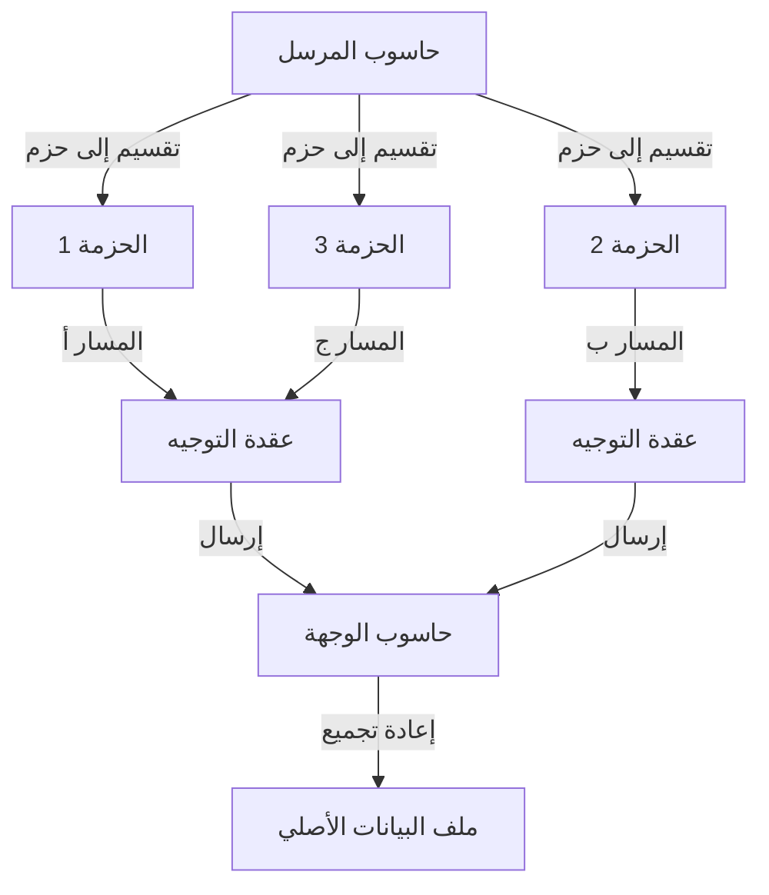
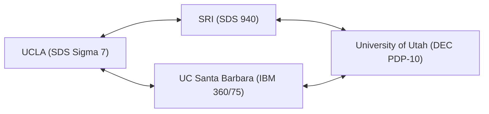

في حياتنا المعاصرة، أصبح الإنترنت أمرًا بديهيًا كالماء والهواء. بمجرد النقر على هاتفك الذكي، يمكنك تبادل البيانات على الفور مع خوادم في الجانب الآخر من الكرة الأرضية، وبث مقاطع الفيديو، والتواصل مع أشخاص من جميع أنحاء العالم في الوقت الفعلي. ومع ذلك، لم تظهر هذه الشبكة العالمية الضخمة والمعقدة فجأة مكتملة في يوم من الأيام. عند تتبع أصولها، نصل إلى مشروع طموح ظهر في ظل الظروف التاريخية الفريدة للحرب الباردة. هذا المشروع هو "ARPANET" (أربانت).

في هذا المقال، سنتعمق في التاريخ التفصيلي والخلفية التقنية لكيفية تصور ARPANET، السلف المباشر للإنترنت، والتطورات التقنية التي أدت إلى بنائها، وكيف تطورت إلى الإنترنت الذي نستخدمه اليوم.

## 1. الخلفية التاريخية: صدمة سبوتنيك وتأسيس ARPA

لفهم تاريخ ARPANET، يجب أن نعود بالزمن إلى أواخر الخمسينيات في ذروة الحرب الباردة. بعد الحرب العالمية الثانية، انخرطت الولايات المتحدة الأمريكية والاتحاد السوفيتي في منافسة شرسة في كل المجالات، من استكشاف الفضاء إلى تطوير الأسلحة النووية.

في 4 أكتوبر 1957، نجح الاتحاد السوفيتي في إطلاق أول قمر صناعي بشري "سبوتنيك 1". كان هذا يعني بالنسبة لأمريكا أكثر من مجرد هزيمة في سباق الفضاء. لقد اجتاح أمريكا بأكملها خوف من أن "الاتحاد السوفيتي قد أسس تقنية الصواريخ النووية التي يمكنها مهاجمة البر الرئيسي الأمريكي مباشرة من الفضاء". هذا ما يُعرف باسم "صدمة سبوتنيك".

لتعويض هذا التخلف التكنولوجي، أنشأ الرئيس آنذاك دوايت أيزنهاور وكالة أبحاث داخل وزارة الدفاع الأمريكية (DoD) لتطبيق العلوم والتكنولوجيا المتطورة للأغراض العسكرية. كانت هذه هي "وكالة مشاريع البحوث المتقدمة" (ARPA). كمنظمة مرنة غير مقيدة بالأطر العسكرية الحالية، قامت ARPA (التي أصبحت لاحقًا DARPA) بتمويل العديد من الأبحاث المبتكرة.

## 2. ج. ك. ليكلايدر و"شبكة حواسيب المجرات"

في أوائل الستينيات، تم إنشاء مكتب تقنيات معالجة المعلومات (IPTO) داخل ARPA، وتم تعيين ج. ك. ليكلايدر (J.C.R. Licklider) كأول مدير له. كان يتمتع بخلفية فريدة، حيث تحول من عالم نفس صوتي إلى عالم حاسوب، ونشر ورقة بحثية رائدة بعنوان "التعايش بين الإنسان والحاسوب" (Man-Computer Symbiosis).

كان ليكلايدر غير راضٍ عن حقيقة أن أجهزة الحاسوب في ذلك الوقت كانت تُستخدم فقط كآلات حسابية ضخمة، وكان ينظر إلى الحواسيب كأدوات تفاعلية لتوسيع النشاط الفكري البشري. لقد تصور بناء شبكة تربط أجهزة الحاسوب المنتشرة في المؤسسات البحثية في جميع أنحاء الولايات المتحدة، مما يسمح للباحثين بمشاركة البيانات والبرامج وحتى الأفكار. وأطلق على هذه الرؤية الكبرى، مازحاً إلى حد ما، اسم "شبكة حواسيب المجرات" (Intergalactic Computer Network).

غادر ليكلايدر نفسه IPTO قبل إجراء تصميم تقني محدد للشبكة، لكن رؤيته انتقلت إلى علماء بارزين خلفوه مثل بوب تايلور ولورانس روبرتس، وأصبحت قوة دافعة قوية لتطوير ARPANET.

## 3. ولادة تقنية تبديل الحزم

كان التحدي التقني الأكبر في بناء الشبكة هو "كيفية إرسال واستقبال البيانات بكفاءة وموثوقية". كانت الطريقة السائدة في شبكات الاتصالات في ذلك الوقت هي "التبديل المداري" (Circuit Switching) المستخدمة في شبكات الهاتف. وهي طريقة تحتكر خطًا ماديًا مخصصًا بين طرفي الاتصال. ومع ذلك، كانت هذه الطريقة غير فعالة للغاية لاتصالات البيانات المتقطعة بين أجهزة الحاسوب، وكانت تعاني من نقطة ضعف تتمثل في توقف الاتصال بالكامل إذا تم تدمير جزء من الخط (من منظور عسكري أيضًا، كانت هناك حاجة إلى شبكة قوية يمكنها تحمل الهجمات النووية).

لحل هذه المشكلة، تم ابتكار مفهوم اتصالات جديد تمامًا في نفس الوقت في أماكن مختلفة. كان هذا المفهوم هو "تبديل الحزم" (Packet Switching).

قام بول باران، الذي كان يعمل في مؤسسة راند في الولايات المتحدة، ببناء نظرية "الشبكة الموزعة" لزيادة بقاء الاتصالات العسكرية، حيث يتم تقسيم البيانات إلى أجزاء صغيرة ونقلها عبر مسارات مختلفة من خلال شبكة متداخلة.

من ناحية أخرى، توصل دونالد ديفيز من المختبر الفيزيائي الوطني (NPL) في المملكة المتحدة بشكل مستقل إلى مفهوم مماثل، وأطلق على كتل البيانات المقسمة اسم "حزم" (Packets). بالإضافة إلى ذلك، أثبت ليونارد كلينروك من معهد ماساتشوستس للتكنولوجيا (MIT) كفاءة طريقة نقل البيانات هذه باستخدام نظرية الطوابير الرياضية.

(الشكل: المفهوم الأساسي لتبديل الحزم)

في تبديل الحزم، يتم تقسيم الرسالة إلى "حزم" بحجم معين، ويتم إرفاق معلومات الوجهة بكل منها. يتم نقل كل حزمة عبر الشبكة مع البحث الذاتي عن المسارات المتاحة، ويتم إعادة تجميعها في الرسالة الأصلية في الوجهة النهائية. أدى ذلك إلى تحقيق مشاركة فعالة لخطوط الاتصال وتحمل عالي للأعطال الجزئية.

## 4. تطوير IMP (معالج رسائل الواجهة)

قرر لورانس روبرتس، الذي أصبح مسؤولاً عن تصميم ARPANET، أنه من الصعب تقنياً توصيل أنواع مختلفة من الحواسيب المركزية في جميع أنحاء الولايات المتحدة مباشرة. لذلك، ابتكر بنية يتم فيها وضع حاسوب صغير متخصص في معالجة توجيه الشبكة في كل موقع، وتتواصل الحواسيب المركزية مع ذلك الحاسوب الصغير فقط.

أُطلق على هذا الحاسوب المخصص اسم "IMP" (معالج رسائل الواجهة). إنه النموذج الأولي لـ "الموجه" (Router) في الإنترنت الحديث.

في عام 1968، أجرت ARPA مناقصة تنافسية لتطوير IMP، وفازت بها شركة الاستشارات BBN Technologies (Bolt Beranek and Newman) في ماساتشوستس. قام فريق BBN بقيادة فرانك هارت بتعديل حاسوب صغير من نوع "DDP-516" من شركة هانيويل، وحقق إنجازاً هندسياً مذهلاً بإكمال أجهزة وبرامج IMP في فترة زمنية قصيرة للغاية.

## 5. عام 1969: أول اتصال لـ ARPANET والرسالة التاريخية "LO"

في خريف عام 1969، تم تسليم أول IMP إلى مختبر ليونارد كلينروك في جامعة كاليفورنيا، لوس أنجلوس (UCLA). بعد ذلك، تم تركيب وحدات IMP تباعاً في معهد ستانفورد للأبحاث (SRI)، وجامعة كاليفورنيا، سانتا باربرا (UCSB)، وجامعة يوتا، لتشكيل أول 4 عقد.

(الشكل: تكوين العقد الأربع الأولى لـ ARPANET في عام 1969)

في الساعة 10:30 مساءً يوم 29 أكتوبر 1969، حلت اللحظة التاريخية. حاول تشارلي كلاين، وهو مبرمج طالب في جامعة كاليفورنيا (UCLA)، تسجيل الدخول عن بُعد إلى حاسوب في SRI. كان الإجراء يتضمن إرسال كلمة "LOGIN".

كتب كلاين على لوحة المفاتيح بينما كان يتحدث مع شخص في SRI عبر سماعة الهاتف.
كتب حرف "L"، وأكد الجانب الخاص بـ SRI الاستلام.
ثم كتب حرف "O"، وأكد الجانب الخاص بـ SRI الاستلام.
وفي اللحظة التي كتب فيها حرف "G"... تعطل نظام SRI.

نتيجة لذلك، كانت أول رسالة تم إرسالها عبر ARPANET هي الكلمة الرمزية "LO" (والتي تشبه عبارة "Lo and behold" بمعنى: انظر، شيء مذهل). تمت استعادة النظام على الفور، وتم تحقيق تسجيل دخول كامل عن بُعد بنجاح بعد بضع ساعات. كانت هذه صرخة الميلاد للفضاء الإلكتروني الذي يغطي العالم الآن.

## 6. نمو الشبكة وولادة TCP/IP

مع دخول السبعينيات، توسعت شبكة ARPANET بسرعة، وتم توصيل المؤسسات البحثية والمنشآت العسكرية على الساحل الشرقي للولايات المتحدة. وفي عام 1973، تم توصيلها أيضًا بهاواي والنرويج والمملكة المتحدة عبر الأقمار الصناعية، وتطورت إلى شبكة دولية.

ومع ذلك، مع توسع ARPANET، ظهرت مشاكل جديدة. ففي جميع أنحاء العالم، بالإضافة إلى ARPANET، تم بناء شبكات مختلفة أخرى تعمل ببروتوكولاتها الخاصة واحدة تلو الأخرى، مثل شبكة الراديو المعتمدة على الحزم (PRNET) وشبكة الأقمار الصناعية (SATNET). أصبح التحدي الأكبر هو كيفية ربط هذه "الشبكات ذات القواعد المختلفة" مع بعضها البعض.

الذين نهضوا لحل هذه المشكلة وتحقيق "شبكة الشبكات" (Internetwork) هم فينت سيرف وروبرت كان. في عام 1974، نشرا ورقة بحثية رائدة اقترحا فيها "TCP" (بروتوكول التحكم في الإرسال)، وهو لغة مشتركة لربط الشبكات المختلفة ببعضها البعض بسلاسة. هذه المجموعة من بروتوكولات الاتصال، التي تم تقسيمها لاحقًا إلى TCP و IP (بروتوكول الإنترنت)، هي التقنية الأساسية للإنترنت اليوم.

تميز تصميم TCP/IP بالقوة والقابلية للتوسع العالية، حيث فصل بوضوح بين دور ضمان موثوقية نقل البيانات (TCP) ودور التوجيه إلى الوجهة (IP).

## 7. نهاية ARPANET وفجر الإنترنت

في 1 يناير 1983 (المعروف باسم يوم العَلم)، تم تحويل البروتوكول القياسي لـ ARPANET بالكامل من NCP (برنامج تحكم الشبكة) السابق إلى TCP/IP. اعتبارًا من هذا اليوم، تحولت ARPANET لتصبح جزءًا من "الإنترنت" بالمعنى الحقيقي للكلمة.

في نفس الوقت تقريبًا، تم فصل العقد المتعلقة بالجيش والدفاع كـ MILNET، واستمر تشغيل ARPANET كشبكة أكاديمية وبحثية خالصة. بعد ذلك، برزت NSFNET، وهي شبكة أساسية أسرع بنتها مؤسسة العلوم الوطنية (NSF) في الولايات المتحدة، وانتقل التيار الرئيسي للمجتمع الأكاديمي إليها.

وفي عام 1990، بعد أن أنهت ARPANET مهمتها التاريخية، تم إيقاف تشغيلها وتفكيكها رسميًا.

## 8. إرث ARPANET

كان لـ ARPANET فترة تشغيل قصيرة بلغت 20 عامًا، لكن إرثها لا يُقدر بثمن. جميع النماذج الأولية للبنية التحتية للاتصالات التي لا غنى عنها في مجتمع اليوم، مثل تقنية تبديل الحزم، والتوجيه الموزع عبر IMP، وتسجيل الدخول عن بُعد (Telnet)، ونقل الملفات (FTP)، وقبل كل شيء البريد الإلكتروني (E-mail)، ولدت وتم صقلها على ARPANET.

الفلسفة الكامنة وراء ARPANET والمتمثلة في "شبكة مرنة ليس لها مركز محدد، ومقاومة للأعطال، ويمكن لأي شخص الانضمام إليها"، تم نقلها كما هي إلى الإنترنت الحالي عبر TCP/IP. ولدت ARPANET من المتطلبات القصوى للأمن القومي خلال الحرب الباردة، ورعاها شغف العديد من العلماء ذوي الرؤى وثقافة القراصنة (الهاكرز). إنه ليس مجرد تاريخ لتقنية الاتصالات، بل هو دراما ملحمية لكيفية اكتساب البشرية "جهاز عصبي جديد" لمشاركة المعلومات وربط المعرفة.
