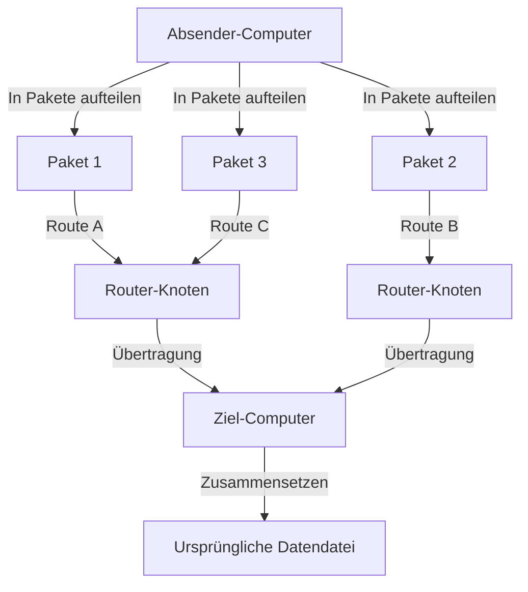
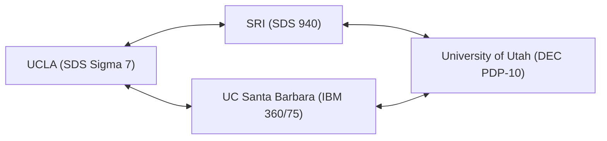

In unserem heutigen Leben ist das Internet so selbstverständlich wie Luft und Wasser geworden. Mit einem einfachen Tippen auf ein Smartphone können wir in Echtzeit Daten mit Servern auf der anderen Seite der Erde austauschen, Videos streamen und mit Menschen auf der ganzen Welt kommunizieren. Dieses riesige und komplexe globale Netzwerk erschien jedoch nicht plötzlich in seiner fertigen Form. Verfolgt man seine Ursprünge zurück, stößt man auf ein ehrgeiziges Projekt vor dem einzigartigen Hintergrund des Kalten Krieges: das "ARPANET".

Dieser Artikel geht detailliert auf die Geschichte und die technischen Hintergründe ein, wie das ARPANET, der direkte Vorfahre des Internets, konzipiert wurde, welche technologischen Durchbrüche zu seinem Aufbau führten und wie es sich zu dem Internet entwickelte, das wir heute nutzen.

## 1. Historischer Hintergrund: Sputnik-Schock und die Gründung der ARPA

Um die Geschichte des ARPANET zu verstehen, müssen wir die Uhr in die späten 1950er Jahre, mitten in den Kalten Krieg, zurückdrehen. Nach dem Zweiten Weltkrieg lieferten sich die Vereinigten Staaten und die Sowjetunion einen erbitterten Wettbewerb in allen Bereichen, von der Erforschung des Weltraums bis zur Entwicklung von Atomwaffen.

Am 4. Oktober 1957 startete die Sowjetunion erfolgreich den ersten künstlichen Satelliten der Menschheit, "Sputnik 1". Für die Vereinigten Staaten bedeutete dies mehr als nur eine Niederlage im Wettlauf ins All. Die Angst, dass "die Sowjetunion die Raketentechnologie etabliert hat, um das amerikanische Festland direkt aus dem Weltraum mit Atomraketen anzugreifen", erfasste ganz Amerika. Dies ist der berühmte "Sputnik-Schock".

Um diesen technologischen Rückstand aufzuholen, gründete der damalige Präsident Dwight D. Eisenhower innerhalb des US-Verteidigungsministeriums (DoD) eine Forschungseinrichtung für die militärische Anwendung modernster Wissenschaft und Technologie. Dies war die "Advanced Research Projects Agency" (ARPA). Die ARPA (später DARPA) sollte zahlreiche innovative Forschungen als flexible Organisation außerhalb des traditionellen militärischen Rahmens finanzieren.

## 2. J.C.R. Licklider und das "Intergalaktische Computernetzwerk"

In den frühen 1960er Jahren wurde in der ARPA das Information Processing Techniques Office (IPTO) gegründet, dessen erster Direktor J.C.R. Licklider wurde. Er hatte einen ungewöhnlichen Werdegang vom Psychoakustiker zum Informatiker absolviert und ein wegweisendes Paper mit dem Titel "Man-Computer Symbiosis" veröffentlicht.

Licklider war unzufrieden damit, dass Computer damals nur als riesige Rechenmaschinen (Number Cruncher) eingesetzt wurden, und sah Computer als interaktive Werkzeuge zur Erweiterung menschlicher intellektueller Aktivitäten. Er stellte sich den Aufbau eines Netzwerks vor, das Computer in Forschungseinrichtungen in den gesamten USA miteinander verbinden und es Forschern ermöglichen würde, Daten, Programme und sogar Ideen auszutauschen. Er nannte diese große Vision scherzhaft das "Intergalactic Computer Network" (Intergalaktisches Computernetzwerk).

Licklider selbst verließ das IPTO, bevor der spezifische technische Entwurf des Netzwerks erstellt wurde, aber seine Vision wurde von brillanten Wissenschaftlern wie Bob Taylor und Lawrence Roberts, die ihm folgten, weitergeführt und wurde zu einer starken treibenden Kraft für die Entwicklung des ARPANET.

## 3. Die Geburt der Paketvermittlungstechnologie

Die größte technische Herausforderung beim Aufbau des Netzwerks bestand darin, "wie Daten effizient und zuverlässig übertragen und empfangen werden können". Die damals vorherrschende Technologie für Kommunikationsnetzwerke war das in Telefonnetzen verwendete "Leitungsvermittlungsverfahren" (Circuit Switching). Dabei wird eine dedizierte physische Leitung zwischen den beiden kommunizierenden Parteien belegt. Dieses Verfahren war jedoch für die diskontinuierliche Datenkommunikation zwischen Computern (Burst-Traffic) äußerst ineffizient und hatte die Schwachstelle, dass die gesamte Kommunikation unterbrochen wurde, wenn ein Teil der Leitung zerstört wurde (auch aus militärischer Sicht war ein robustes Netzwerk erforderlich, das einem nuklearen Angriff standhalten konnte).

Um dieses Problem zu lösen, wurde gleichzeitig und unabhängig voneinander ein völlig neues Kommunikationskonzept entwickelt: das "Paketvermittlungsverfahren" (Packet Switching).

Paul Baran, der für die RAND Corporation in den USA arbeitete, entwickelte die Theorie eines "verteilten Netzwerks", in dem Daten in kleine Stücke zerlegt und über verschiedene Pfade durch ein maschenartiges Netzwerk übertragen werden, um die Überlebensfähigkeit der militärischen Kommunikation zu erhöhen.
Unabhängig davon gelangte auch Donald Davies vom National Physical Laboratory (NPL) in Großbritannien zu einem ähnlichen Konzept und nannte die Datenblöcke "Pakete". Darüber hinaus bewies Leonard Kleinrock vom Massachusetts Institute of Technology (MIT) die Effizienz dieser Datenübertragungsmethode mathematisch mithilfe der Warteschlangentheorie.

(Abbildung: Grundkonzept der Paketvermittlung)

Bei der Paketvermittlung werden Nachrichten in "Pakete" fester Größe aufgeteilt, denen jeweils Zielinformationen hinzugefügt werden. Jedes Paket wird autonom durch das Netzwerk über verfügbare Pfade übertragen und am endgültigen Ziel wieder zur ursprünglichen Nachricht zusammengesetzt. Dies ermöglichte eine effiziente gemeinsame Nutzung von Kommunikationsleitungen und eine hohe Fehlertoleranz gegenüber Teilausfällen.

## 4. Die Entwicklung des IMP (Interface Message Processor)

Lawrence Roberts, der Hauptarchitekt des ARPANET, hielt es für technisch schwierig, verschiedene Arten von Großrechnern im ganzen Land direkt miteinander zu verbinden. Daher entwickelte er eine Architektur, bei der kleine Computer, die sich auf das Netzwerk-Routing spezialisierten, an jedem Standort platziert wurden und die Großrechner nur mit diesen kleinen Computern kommunizierten.

Dieser dedizierte Computer wurde "IMP" (Interface Message Processor) genannt. Er ist der Prototyp des "Routers" im heutigen Internet.

1968 führte die ARPA eine Ausschreibung für die Entwicklung des IMP durch, die von BBN Technologies (Bolt Beranek and Newman), einem Beratungsunternehmen in Massachusetts, gewonnen wurde. Das Team von BBN unter der Leitung von Frank Heart modifizierte den Minicomputer "DDP-516" von Honeywell und vollbrachte das erstaunliche Kunststück der Ingenieurskunst, die Hardware und Software für das IMP in extrem kurzer Zeit fertigzustellen.

## 5. 1969: Die erste ARPANET-Verbindung und das historische "LO"

Im Herbst 1969 wurde das erste IMP an das Labor von Leonard Kleinrock an der University of California, Los Angeles (UCLA) geliefert. Danach wurden nacheinander IMPs am Stanford Research Institute (SRI), an der University of California, Santa Barbara (UCSB) und an der University of Utah installiert, wodurch die ersten vier Knoten gebildet wurden.

(Abbildung: Die ersten vier ARPANET-Knoten im Jahr 1969)

Am 29. Oktober 1969 um 22:30 Uhr war der historische Moment gekommen. Charley Kline, ein studentischer Programmierer an der UCLA, versuchte, sich remote auf dem Computer des SRI einzuloggen. Der Vorgang bestand darin, das Wort "LOGIN" zu senden.

Kline tippte auf die Tastatur, während er am Telefon mit einem Kollegen vom SRI sprach.
Er tippte ein "L" und bestätigte den Empfang auf der SRI-Seite.
Dann tippte er ein "O" und bestätigte den Empfang auf der SRI-Seite.
In dem Moment, als er das "G" tippte, ... stürzte das SRI-System ab.

Infolgedessen war die erste Nachricht, die jemals über das ARPANET gesendet wurde, das symbolische Wort "LO" (in Anlehnung an "Lo and behold" = siehe da!). Das System wurde bald wiederhergestellt und wenige Stunden später war der vollständige Remote-Login erfolgreich. Dies war die Geburt des Cyberspace, der die Welt umspannen sollte.

## 6. Das Wachstum des Netzwerks und die Entstehung von TCP/IP

In den 1970er Jahren expandierte das ARPANET rasant, und auch Forschungseinrichtungen und militärische Einrichtungen an der Ostküste der USA wurden angeschlossen. 1973 wurde es über Satellitenverbindungen mit Hawaii, Norwegen und Großbritannien verbunden und entwickelte sich zu einem internationalen Netzwerk.

Mit der Ausweitung des ARPANET tauchte jedoch ein neues Problem auf. Neben dem ARPANET wurden auf der ganzen Welt verschiedene Netzwerke aufgebaut, wie z.B. Paketfunknetze (PRNET) und Satellitennetzwerke (SATNET), die mit ihren eigenen Protokollen arbeiteten. Die größte Herausforderung bestand nun darin, diese "Netzwerke mit unterschiedlichen Regeln" miteinander zu verbinden.

Vinton Cerf und Robert Kahn stellten sich der Aufgabe, dieses Problem zu lösen und ein "Netzwerk von Netzwerken" (Internetwork) zu realisieren. 1974 veröffentlichten sie ein bahnbrechendes Paper, in dem sie "TCP" (Transmission Control Protocol) vorschlugen, eine gemeinsame Sprache zur nahtlosen Verbindung verschiedener Netzwerke. Diese Kommunikationsprotokolle, die später in TCP und IP (Internet Protocol) unterteilt wurden, bilden die grundlegende Technologie des heutigen Internets.

TCP/IP zeichnete sich durch ein robustes und hochgradig skalierbares Design aus, das die Rolle der Gewährleistung der Zuverlässigkeit der Datenübertragung (TCP) und die Rolle des Routings zum Ziel (IP) klar trennte.

## 7. Das Ende des ARPANET und die Morgendämmerung des Internets

Am 1. Januar 1983 (bekannt als "Flag Day") wurde das Standardprotokoll des ARPANET vollständig vom bisherigen NCP (Network Control Program) auf TCP/IP umgestellt. An diesem Tag verwandelte sich das ARPANET in einen Teil des "Internets" im wahren Sinne des Wortes.

Etwa zur gleichen Zeit wurden die mit Militär und Verteidigung verbundenen Knoten als MILNET abgetrennt, und das ARPANET wurde als reines akademisches und Forschungsnetzwerk weiterbetrieben. Später gewann das NSFNET, ein von der National Science Foundation (NSF) aufgebautes schnelleres Backbone-Netzwerk, an Bedeutung, und der Mainstream der akademischen Gemeinschaft verlagerte sich dorthin.

1990 beendete das ARPANET offiziell seinen Betrieb, nachdem es seine historische Mission erfüllt hatte, und wurde abgebaut.

## 8. Das Erbe des ARPANET

Obwohl das ARPANET nur 20 Jahre in Betrieb war, ist sein Erbe unermesslich. Die Prototypen der für die moderne Gesellschaft unverzichtbaren Kommunikationsinfrastruktur, wie Paketvermittlungstechnologie, dezentrales Routing über IMPs, Remote-Login (Telnet), Dateiübertragung (FTP) und vor allem elektronische Post (E-Mail), wurden alle auf dem ARPANET entwickelt und verfeinert.

Die dem ARPANET zugrunde liegende Philosophie eines "flexiblen Netzwerks ohne ein spezifisches Zentrum, das resistent gegen Ausfälle ist und an dem jeder teilnehmen kann", wurde durch TCP/IP direkt an das heutige Internet weitergegeben. Das ARPANET entstand aus den extremen Anforderungen der nationalen Sicherheit während des Kalten Krieges und wurde durch die Leidenschaft und Hackerkultur zahlreicher visionärer Wissenschaftler gefördert. Es ist nicht nur die Geschichte einer Kommunikationstechnologie, sondern ein großartiges Drama darüber, wie die Menschheit ein "neues Nervensystem" erlangte, um Informationen auszutauschen und Wissen zu verbinden.
