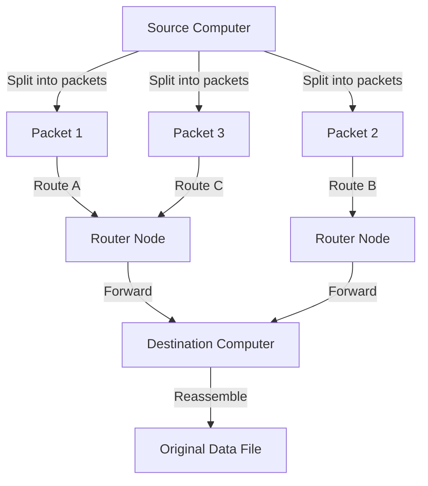
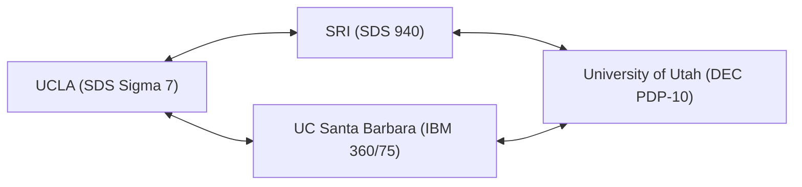

In our modern lives, the Internet has become as natural and ubiquitous as air and water. With just a tap on a smartphone, we can instantaneously exchange data with servers on the other side of the globe, stream videos, and communicate in real-time with people all around the world. However, this massive, complex global network did not suddenly appear in its completed form one day. Tracing its origins leads us to an ambitious project conceived amidst the unique historical context of the Cold War. That project is the "ARPANET".

In this article, we will delve deeply into the detailed history and technical background of how ARPANET, the direct ancestor of the Internet, was envisioned, the technical breakthroughs that led to its construction, and how it evolved into the Internet we use today.

## 1. Historical Background: The Sputnik Shock and the Establishment of ARPA

To understand the history of ARPANET, we must turn back the clock to the late 1950s, at the height of the Cold War. After World War II, the United States and the Soviet Union engaged in fierce competition in every field, from space exploration to nuclear weapons development.

On October 4, 1957, the Soviet Union successfully launched "Sputnik 1," humanity's first artificial satellite. For the United States, this meant more than just a defeat in the space race. A wave of fear swept across America: "The Soviet Union has established ballistic missile technology capable of directly attacking the US mainland from space." This is the famous "Sputnik Shock."

To recover from this technological disadvantage, then-President Dwight D. Eisenhower established a research agency within the US Department of Defense (DoD) dedicated to applying cutting-edge science and technology to military purposes. This was the "Advanced Research Projects Agency" (ARPA). ARPA (later DARPA) was designed as a flexible organization, unconstrained by existing military frameworks, and would go on to fund numerous innovative research projects.

## 2. J.C.R. Licklider and the "Intergalactic Computer Network"

In the early 1960s, ARPA established the Information Processing Techniques Office (IPTO), and J.C.R. Licklider was appointed as its first director. He had an unusual background, transitioning from a psychoacoustician to a computer scientist, and had published the groundbreaking paper "Man-Computer Symbiosis."

Licklider was dissatisfied with the fact that computers at the time were merely used as giant calculating machines (number crunchers). He envisioned computers as interactive tools that could augment human intellectual activities. He conceived of building a network that would interconnect computers scattered across research institutions nationwide, allowing researchers to share data, programs, and even ideas. He jokingly called this grand vision the "Intergalactic Computer Network."

Although Licklider left IPTO before undertaking the specific technical design of the network, his vision was inherited by brilliant scientists who followed him, such as Bob Taylor and Lawrence Roberts, becoming a powerful driving force behind the development of ARPANET.

## 3. The Birth of Packet Switching Technology

The biggest technical challenge in building the network was "how to transmit and receive data efficiently and reliably." The mainstream communication networks at the time used a "circuit switching system," similar to the telephone network. This system involved occupying a dedicated physical circuit between the two communicating parties. However, this method was highly inefficient for intermittent data communication (burst traffic) between computers. Furthermore, it possessed a critical vulnerability: if part of the circuit was destroyed, the entire communication would be cut off (from a military perspective, a robust network capable of surviving a nuclear attack was required).

To solve this problem, an entirely new communication concept was independently conceived by multiple researchers simultaneously. This was the "packet switching system."

Paul Baran, working at the RAND Corporation in the US, developed the theory of a "distributed network" to enhance the survivability of military communications. His idea was to divide data into small pieces and transmit each piece over different paths through a web-like network.
Meanwhile, Donald Davies of the National Physical Laboratory (NPL) in the UK independently arrived at a similar concept and named the divided blocks of data "packets." Furthermore, Leonard Kleinrock of the Massachusetts Institute of Technology (MIT) mathematically proved the efficiency of this data transfer method using [queuing theory](/en/p/queuing-theory-basics/).

(Figure: Basic Concept of Packet Switching)

In packet switching, messages are divided into fixed-size "packets," each carrying destination information. Each packet is transmitted autonomously through the network, finding available paths, and is reassembled into the original message at the final destination. This realized the efficient sharing of communication lines and high fault tolerance against partial network failures.

## 4. Development of the IMP (Interface Message Processor)

Lawrence Roberts, who became the chief architect of ARPANET, determined that directly interconnecting different types of mainframe computers across the country would be technically difficult. Therefore, he devised an architecture in which small computers dedicated to network routing would be placed at each site, and the mainframes would only communicate with these small computers.

This dedicated computer was named the "IMP" (Interface Message Processor). It is the prototype of the modern internet "router."

In 1968, ARPA held a competitive bidding process for the development of the IMP, which was won by BBN Technologies (Bolt Beranek and Newman), a consulting firm in Massachusetts. The BBN team, led by Frank Heart, achieved a remarkable engineering feat by modifying a Honeywell DDP-516 minicomputer and completing both the hardware and software for the IMP in an extremely short period.

## 5. 1969: The First ARPANET Connection and the Historic "LO"

In the fall of 1969, the first IMP was delivered to Leonard Kleinrock's laboratory at the University of California, Los Angeles (UCLA). Subsequently, IMPs were installed at the Stanford Research Institute (SRI), the University of California, Santa Barbara (UCSB), and the University of Utah, forming the first four nodes.

(Figure: Initial 4-Node Configuration of ARPANET in 1969)

A historic moment arrived at 10:30 PM on October 29, 1969. Charley Kline, a student programmer at UCLA, attempted to remotely log in to the SRI computer. The procedure involved transmitting the word "LOGIN."

Kline typed on his keyboard while speaking on the phone with an SRI staff member.
He typed "L" and confirmed its receipt at SRI.
Next, he typed "O" and confirmed its receipt at SRI.
And the moment he typed "G"... the SRI system crashed.

As a result, the first message ever transmitted over ARPANET became the symbolic word "LO" (akin to "Lo and behold"). The system was quickly restored, and a complete remote login succeeded a few hours later. This was the birth cry of the cyberspace that now covers the world.

## 6. Network Growth and the Birth of TCP/IP

Entering the 1970s, ARPANET expanded rapidly, connecting research institutions and military facilities on the US East Coast as well. By 1973, it connected to Hawaii, Norway, and the UK via satellites, developing into an international network.

However, with the expansion of ARPANET, a new problem emerged. Worldwide, other networks operating on different protocols, such as the Packet Radio Network (PRNET) and the Satellite Network (SATNET), were being constructed alongside ARPANET. The biggest challenge became how to connect these "networks with different rules" to each other.

To solve this problem and realize an "Internetwork" (a network of networks), Vinton Cerf and Robert Kahn stepped up. In 1974, they published a groundbreaking paper proposing "TCP" (Transmission Control Protocol), a common language for seamlessly interconnecting different networks. This suite of communication protocols, later divided into TCP and IP (Internet Protocol), is the foundational technology of the current Internet.

TCP/IP featured a robust and highly scalable design that clearly separated the role of ensuring data transfer reliability (TCP) from the role of routing to the destination (IP).

## 7. The End of ARPANET and the Dawn of the Internet

On January 1, 1983 (known as "Flag Day"), the standard protocol for ARPANET was completely switched from the traditional NCP (Network Control Program) to TCP/IP. From this day forward, ARPANET transformed into a part of the "Internet" in the truest sense.

Around the same time, military and defense-related nodes were separated as MILNET, while ARPANET continued operating as a purely academic and research network. Subsequently, NSFNET, a faster backbone network built by the National Science Foundation (NSF), emerged, and the mainstream academic community shifted there.

Finally, in 1990, having fulfilled its historical mission, ARPANET officially ceased operations and was decommissioned.

## 8. The Legacy of ARPANET

Although ARPANET was only operational for a short period of 20 years, its legacy is immeasurable. Prototypes of communication infrastructure essential to modern society—such as packet switching technology, distributed routing via IMPs, remote login (Telnet), file transfer (FTP), and most notably, electronic mail (E-mail)—were all born and refined on ARPANET.

The philosophy underlying ARPANET—"a flexible network with no specific center, resilient to failures, and open to anyone"—has been passed down entirely to the present Internet through TCP/IP. Born from the extreme demands of national security during the Cold War and nurtured by the passion of visionary scientists and hacker culture, ARPANET is not merely a history of communication technology. It is a grand drama of how humanity acquired a "new nervous system" for sharing information and connecting knowledge.
