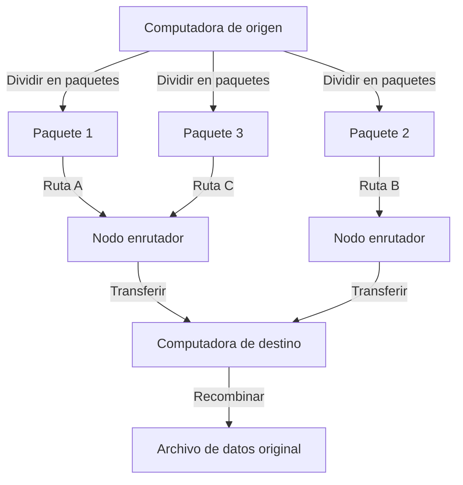
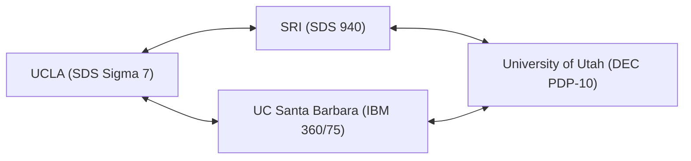

En nuestras vidas modernas, Internet se ha convertido en algo tan natural como el aire o el agua. Con solo un toque en un teléfono inteligente, podemos intercambiar datos instantáneamente con servidores al otro lado del mundo, transmitir videos y comunicarnos en tiempo real con personas de todo el planeta. Sin embargo, esta enorme y compleja red global no apareció de repente en una forma completa. Si rastreamos sus orígenes, llegamos a un ambicioso proyecto en el contexto único de la Guerra Fría. Eso es "ARPANET".

En este artículo, profundizaremos en la historia detallada y los antecedentes técnicos de ARPANET, el ancestro directo de Internet, cómo se concibió, a través de qué avances técnicos se construyó y cómo evolucionó hacia el Internet que usamos hoy.

## 1. Contexto histórico: El shock del Sputnik y la creación de ARPA

Para entender la historia de ARPANET, necesitamos retroceder el reloj a finales de la década de 1950, en plena Guerra Fría. Después de la Segunda Guerra Mundial, Estados Unidos y la Unión Soviética estaban envueltos en una feroz competencia en todos los campos, desde la exploración espacial hasta el desarrollo de armas nucleares.

El 4 de octubre de 1957, la Unión Soviética lanzó con éxito el primer satélite artificial de la humanidad, el "Sputnik 1". Esto significó mucho más que una simple derrota en la carrera espacial para Estados Unidos. El temor de que "la Unión Soviética ha establecido la tecnología de misiles nucleares que puede atacar directamente el territorio estadounidense desde el espacio" cubrió todo Estados Unidos. Esto es el famoso "Shock del Sputnik".

Para recuperarse de esta desventaja tecnológica, el entonces presidente Dwight D. Eisenhower estableció una agencia de investigación dentro del Departamento de Defensa de EE. UU. (DoD) para la aplicación militar de ciencia y tecnología de vanguardia. Esta fue la "Agencia de Proyectos de Investigación Avanzados (ARPA)". ARPA (más tarde DARPA), como una organización flexible que no estaba limitada por el marco militar existente, financiaría numerosas investigaciones innovadoras.

## 2. J. C. R. Licklider y la "Red de Computadoras Intergaláctica"

A principios de la década de 1960, se estableció la Oficina de Técnicas de Procesamiento de Información (IPTO) dentro de ARPA, y su primer director fue J. C. R. Licklider. Tenía una carrera única, pasando de psicoacústico a científico de la computación, y había publicado un artículo innovador titulado "Simbiosis Hombre-Computadora (Man-Computer Symbiosis)".

Licklider estaba insatisfecho con el hecho de que las computadoras de la época solo se usaran como calculadoras gigantes (number crunchers) y veía a la computadora como una herramienta interactiva para expandir la actividad intelectual humana. Él concibió la construcción de una red que conectaría computadoras dispersas en instituciones de investigación de todo el país, permitiendo a los investigadores compartir datos, programas e incluso ideas. Llamó a esta gran visión, en parte en broma, la "Red de Computadoras Intergaláctica (Intergalactic Computer Network)".

Aunque Licklider dejó la IPTO antes del diseño técnico concreto de la red, su visión fue heredada por científicos brillantes como Bob Taylor y Lawrence Roberts, convirtiéndose en una poderosa fuerza motriz para el desarrollo de ARPANET.

## 3. El nacimiento de la tecnología de conmutación de paquetes

El mayor desafío técnico al construir la red era "cómo enviar y recibir datos de manera eficiente y confiable". La principal red de comunicaciones en ese momento era el método de "conmutación de circuitos" utilizado en la red telefónica. Este método ocupa una línea física dedicada entre las dos partes que se comunican. Sin embargo, este método era extremadamente ineficiente para la comunicación intermitente de datos entre computadoras (tráfico a ráfagas), y tenía la vulnerabilidad de que si una parte de la línea se destruía, toda la comunicación se cortaba (desde una perspectiva militar, se requería una red robusta capaz de resistir un ataque nuclear).

Para resolver este problema, se ideó un concepto de comunicación completamente nuevo simultáneamente. Este es el método de "conmutación de paquetes".

Paul Baran, del RAND Corporation en EE. UU., construyó la teoría de una "red distribuida" que divide los datos en partes pequeñas y los transfiere a través de rutas separadas en una red en forma de malla, con el fin de aumentar la supervivencia de las comunicaciones militares.
Por otro lado, Donald Davies del Laboratorio Nacional de Física (NPL) en el Reino Unido llegó de forma independiente a un concepto similar y nombró a las agrupaciones de datos divididos como "paquetes". Además, Leonard Kleinrock del Instituto de Tecnología de Massachusetts (MIT) demostró matemáticamente la eficiencia de este método de transferencia de datos utilizando la [teoría de colas](/es/p/queuing-theory-basics/).

(Figura: Concepto básico de la conmutación de paquetes)

En la conmutación de paquetes, un mensaje se divide en "paquetes" de un tamaño fijo, y a cada uno se le asigna información de destino. Cada paquete se transfiere de forma autónoma buscando rutas vacías en la red, y se reconstruye en el mensaje original en el destino final. Esto permitió compartir eficientemente las líneas de comunicación y lograr una alta tolerancia a fallos parciales.

## 4. Desarrollo del IMP (Interface Message Processor)

Lawrence Roberts, el diseñador jefe de ARPANET, determinó que era técnicamente difícil interconectar directamente los diferentes tipos de computadoras mainframe en todo el país. Por ello, ideó una arquitectura en la que una pequeña computadora especializada en el enrutamiento de la red se colocaría en cada sitio, y el mainframe solo se comunicaría con esa pequeña computadora.

Esta computadora dedicada se denominó "IMP (Interface Message Processor)". Es el prototipo del "enrutador" en la Internet moderna.

En 1968, ARPA realizó una licitación competitiva para el desarrollo del IMP, y la empresa de consultoría BBN Technologies (Bolt Beranek and Newman), ubicada en Massachusetts, ganó el contrato. El equipo de BBN, liderado por Frank Heart, modificó la minicomputadora "DDP-516" de Honeywell y logró la asombrosa hazaña de ingeniería de completar el hardware y el software del IMP en un período muy corto.

## 5. 1969: La primera conexión de ARPANET y el histórico "LO"

En el otoño de 1969, el primer IMP fue entregado en el laboratorio de Leonard Kleinrock en la Universidad de California, Los Ángeles (UCLA). Posteriormente, se instalaron sucesivamente IMP en el Instituto de Investigación de Stanford (SRI), la Universidad de California, Santa Bárbara (UCSB) y la Universidad de Utah, formando los primeros cuatro nodos.

(Figura: Los primeros cuatro nodos de ARPANET en 1969)

El 29 de octubre de 1969, a las 10:30 p.m., llegó el momento histórico. Charley Kline, un estudiante de programación en UCLA, intentó iniciar sesión de forma remota en la computadora del SRI. El procedimiento consistía en transmitir la palabra "LOGIN".

Kline escribió en el teclado mientras hablaba por teléfono con un representante de SRI.
Escribió "L", y confirmaron la recepción en SRI.
Luego escribió "O", y confirmaron la recepción en SRI.
Y en el momento en que escribió "G"... el sistema de SRI se bloqueó.

Como resultado, el primer mensaje transmitido en ARPANET fue la palabra simbólica "LO" (en alusión a la expresión "Lo and behold", que significa "He aquí" o "Mira y asómbrate"). El sistema se recuperó rápidamente, y unas horas más tarde se logró con éxito el inicio de sesión remoto completo. Este fue el nacimiento del ciberespacio que cubriría el mundo.

## 6. Crecimiento de la red y el nacimiento de TCP/IP

A principios de la década de 1970, ARPANET se expandió rápidamente, conectando instituciones de investigación y bases militares en la costa este de los Estados Unidos. En 1973, se conectó a Hawái, Noruega y el Reino Unido vía satélite, convirtiéndose en una red internacional.

Sin embargo, con la expansión de ARPANET, surgió un nuevo problema. En todo el mundo se estaban construyendo sucesivamente redes diferentes a ARPANET, operando con sus propios protocolos, como la Red de Radio de Paquetes (PRNET) o redes por satélite (SATNET). Cómo conectar estas "redes con reglas diferentes" entre sí se convirtió en el mayor desafío.

Vinton Cerf y Robert Kahn se levantaron para resolver este problema y realizar una "red de redes" (Internetwork). En 1974, publicaron un artículo innovador proponiendo un lenguaje común para interconectar redes diferentes sin problemas: "TCP (Transmission Control Protocol)". Esta suite de protocolos de comunicación, que posteriormente se dividiría en TCP e IP (Internet Protocol), es la tecnología fundamental de la Internet actual.

TCP/IP fue diseñado como una arquitectura robusta y altamente escalable que separaba claramente el papel de asegurar la fiabilidad de la transferencia de datos (TCP) del papel del enrutamiento hacia el destino (IP).

## 7. El fin de ARPANET y el amanecer de Internet

El 1 de enero de 1983 (conocido como Flag Day), los protocolos estándar de ARPANET cambiaron completamente del antiguo NCP (Network Control Program) a TCP/IP. A partir de este día, ARPANET se transformó en una parte de la "Internet" en el verdadero sentido.

En esa misma época, los nodos militares y de defensa se separaron como MILNET, y ARPANET continuó operando puramente como una red académica y de investigación. Más tarde, surgió NSFNET, una red troncal de mayor velocidad construida por la Fundación Nacional de Ciencias de EE. UU. (NSF), y la corriente principal de la comunidad académica migró hacia allí.

Luego, en 1990, habiendo completado su misión histórica, ARPANET cesó sus operaciones oficialmente y fue desmantelada.

## 8. El legado de ARPANET

Aunque ARPANET tuvo un corto período operativo de 20 años, su legado es inmensurable. La tecnología de conmutación de paquetes, el enrutamiento distribuido a través de IMP, el inicio de sesión remoto (Telnet), la transferencia de archivos (FTP) y, sobre todo, el correo electrónico (E-mail): los prototipos de la infraestructura de comunicación esencial para la sociedad moderna nacieron y se perfeccionaron en ARPANET.

La filosofía subyacente de ARPANET de una "red flexible, sin un centro específico, resistente a fallas y abierta a todos" se ha transmitido intacta a la Internet actual a través de TCP/IP. ARPANET nació de las extremas exigencias de seguridad nacional durante la Guerra Fría, alimentada por la pasión de científicos visionarios y la cultura hacker. No es solo una historia de tecnología de comunicaciones, sino un drama épico de la humanidad logrando un "nuevo sistema nervioso" para compartir información y conectar conocimientos.
