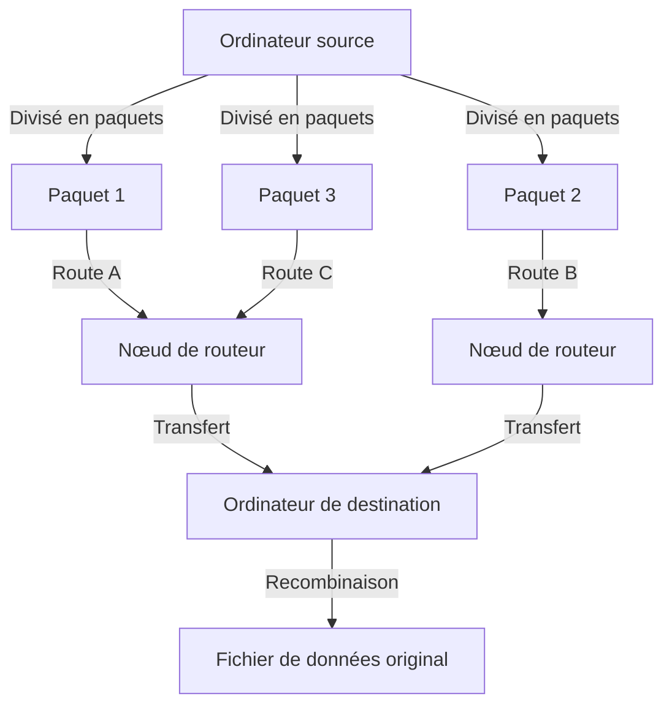
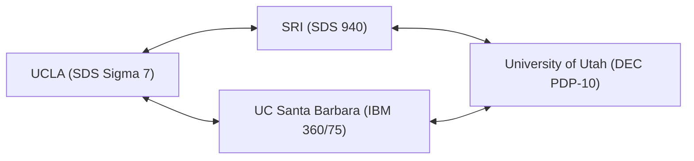

Dans notre vie moderne, Internet est devenu aussi naturel que l'air ou l'eau. D'un simple toucher sur un smartphone, nous pouvons échanger instantanément des données avec des serveurs situés à l'autre bout du monde, diffuser des vidéos et communiquer en temps réel avec des personnes du monde entier. Cependant, cet immense et complexe réseau mondial n'est pas apparu soudainement sous sa forme achevée. En retraçant ses origines, nous arrivons à un projet ambitieux dans le contexte unique de la guerre froide. C'est l'« ARPANET ».

Dans cet article, nous explorerons en profondeur l'histoire détaillée et le contexte technique de la façon dont ARPANET, l'ancêtre direct d'Internet, a été conçu, les avancées technologiques qui ont permis sa construction, et comment il a évolué pour devenir l'Internet que nous utilisons aujourd'hui.

## 1. Contexte historique : Le choc Spoutnik et la création de l'ARPA

Pour comprendre l'histoire d'ARPANET, il faut remonter le temps jusqu'au cœur de la guerre froide, à la fin des années 1950. Après la Seconde Guerre mondiale, les États-Unis et l'Union soviétique se livraient à une concurrence féroce dans tous les domaines, de l'exploration spatiale au développement d'armes nucléaires.

Le 4 octobre 1957, l'Union soviétique a réussi le lancement du premier satellite artificiel de l'humanité, « Spoutnik 1 ». Cela signifiait pour l'Amérique bien plus qu'une simple défaite dans la course à l'espace. La peur que « l'Union soviétique ait établi une technologie de missiles nucléaires capable d'attaquer directement le territoire américain depuis l'espace » s'est répandue dans toute l'Amérique. C'est le célèbre « choc Spoutnik ».

Pour surmonter cette infériorité technologique, le président de l'époque, Dwight D. Eisenhower, a créé une institution de recherche au sein du Département de la Défense des États-Unis (DoD) pour appliquer les technologies scientifiques de pointe à des fins militaires. Il s'agit de l'« Advanced Research Projects Agency (ARPA) ». L'ARPA (plus tard DARPA), en tant qu'organisation flexible non limitée par les cadres militaires existants, allait financer de nombreuses recherches innovantes.

## 2. J.C.R. Licklider et le « Réseau informatique intergalactique »

Au début des années 1960, le Bureau des techniques de traitement de l'information (IPTO) a été créé au sein de l'ARPA, avec J.C.R. Licklider nommé comme son premier directeur. Il avait un parcours atypique, passant de psycho-acousticien à informaticien, et avait publié un article révolutionnaire intitulé « La symbiose homme-machine (Man-Computer Symbiosis) ».

Licklider était insatisfait du fait que les ordinateurs de l'époque n'étaient utilisés que comme des machines à calculer géantes (number crunchers) et considérait les ordinateurs comme des outils interactifs pour étendre les activités intellectuelles humaines. Il a imaginé la construction d'un réseau connectant les ordinateurs dispersés dans les instituts de recherche à travers les États-Unis, permettant aux chercheurs de partager des données, des programmes et même des idées. Il appelait cette vision grandiose, à moitié pour plaisanter, le « Réseau informatique intergalactique (Intergalactic Computer Network) ».

Bien que Licklider ait quitté l'IPTO avant de concevoir la technologie spécifique du réseau, sa vision a été reprise par des scientifiques brillants comme Bob Taylor et Lawrence Roberts, devenant un puissant moteur du développement d'ARPANET.

## 3. Naissance de la technologie de commutation de paquets

Le plus grand défi technique dans la construction du réseau était : « Comment transmettre et recevoir des données de manière efficace et fiable ? » À l'époque, le principal réseau de communication était le système de « commutation de circuits » utilisé dans le réseau téléphonique. Il s'agit d'une méthode où une ligne physique dédiée est occupée entre deux parties communiquant. Cependant, cette méthode était extrêmement inefficace pour la communication intermittente de données (trafic en rafale) entre ordinateurs et présentait la vulnérabilité que si une partie de la ligne était détruite, toute la communication serait coupée (d'un point de vue militaire, un réseau robuste capable de résister à une attaque nucléaire était requis).

Pour résoudre ce problème, un concept de communication totalement nouveau a été inventé simultanément en plusieurs endroits. C'est la « commutation de paquets ».

Paul Baran, chercheur à la RAND Corporation aux États-Unis, a développé la théorie d'un « réseau distribué » dans lequel les données sont divisées en petits morceaux et transférées par des chemins distincts à travers un réseau maillé afin d'augmenter la capacité de survie des communications militaires.
D'autre part, Donald Davies du National Physical Laboratory (NPL) au Royaume-Uni est arrivé indépendamment au même concept et a nommé les blocs de données divisés « paquets ». De plus, Leonard Kleinrock du Massachusetts Institute of Technology (MIT) a prouvé l'efficacité de cette méthode de transfert de données à l'aide de la théorie mathématique des files d'attente.

(Figure : Concept de base de la commutation de paquets)

Dans la commutation de paquets, un message est divisé en « paquets » d'une taille fixe, chacun étant doté d'informations de destination. Chaque paquet est transféré tout en recherchant de manière autonome un chemin disponible dans le réseau, et est reconstruit dans le message d'origine à la destination finale. Cela a permis un partage efficace des lignes de communication et une grande tolérance aux pannes contre les défaillances partielles.

## 4. Développement de l'IMP (Interface Message Processor)

Lawrence Roberts, qui est devenu l'ingénieur en chef d'ARPANET, a déterminé qu'il était techniquement difficile de connecter directement les différents types d'ordinateurs centraux (mainframes) à travers les États-Unis. Il a donc conçu une architecture dans laquelle un petit ordinateur dédié au routage réseau serait placé sur chaque site, et le mainframe communiquerait uniquement avec ce petit ordinateur.

Cet ordinateur dédié a été nommé « IMP (Interface Message Processor) ». C'est le prototype du « routeur » de l'Internet moderne.

En 1968, l'ARPA a organisé un appel d'offres pour le développement de l'IMP, qui a été remporté par BBN Technologies (Bolt Beranek and Newman), une société de conseil basée dans le Massachusetts. L'équipe BBN dirigée par Frank Heart a accompli un exploit d'ingénierie étonnant en modifiant le mini-ordinateur « DDP-516 » de Honeywell et en achevant le matériel et les logiciels de l'IMP dans un laps de temps extrêmement court.

## 5. 1969 : La première connexion d'ARPANET et le "LO" historique

À l'automne 1969, le premier IMP a été livré au laboratoire de Leonard Kleinrock à l'Université de Californie à Los Angeles (UCLA). Par la suite, des IMP ont été installés successivement au Stanford Research Institute (SRI), à l'Université de Californie à Santa Barbara (UCSB) et à l'Université de l'Utah, formant les 4 premiers nœuds.

(Figure : Configuration des 4 premiers nœuds d'ARPANET en 1969)

Le 29 octobre 1969 à 22h30, un moment historique est arrivé. Charley Kline, un étudiant programmeur de l'UCLA, a tenté de se connecter à distance à l'ordinateur du SRI. La procédure consistait à envoyer le mot « LOGIN ».

Kline a tapé sur le clavier tout en parlant au téléphone avec la personne en charge au SRI.
Il a tapé « L » et a confirmé la réception du côté SRI.
Ensuite, il a tapé « O » et a confirmé la réception du côté SRI.
Et au moment où il a tapé « G »...... le système du SRI a planté.

En conséquence, le premier message envoyé sur ARPANET a été le mot symbolique « LO » (qui ressemble à "Lo and behold" = voyez, c'est une chose merveilleuse). Le système a été rapidement restauré et, quelques heures plus tard, une connexion à distance complète a réussi. C'était le cri de naissance du cyberespace qui allait recouvrir le monde.

## 6. Croissance du réseau et naissance de TCP/IP

Au début des années 1970, ARPANET s'est rapidement étendu et les instituts de recherche et les installations militaires de la côte Est américaine y ont également été connectés. En 1973, il a été connecté à Hawaï, la Norvège et le Royaume-Uni via des satellites artificiels, se développant en un réseau international.

Cependant, avec l'expansion d'ARPANET, un nouveau problème est apparu. En plus d'ARPANET, différents réseaux fonctionnant avec leurs propres protocoles, tels que les réseaux radio par paquets (PRNET) et les réseaux par satellite (SATNET), étaient construits l'un après l'autre dans le monde entier. Comment connecter ces réseaux avec « différentes règles » entre eux est devenu le plus grand défi.

Ceux qui se sont levés pour résoudre ce problème et réaliser le « réseau des réseaux (Internetwork) » étaient Vinton Cerf et Robert Kahn. Ils ont publié un article révolutionnaire en 1974 proposant un langage commun, le « TCP (Transmission Control Protocol) », pour interconnecter de manière transparente différents réseaux. Cette suite de protocoles de communication, qui a ensuite été divisée en TCP et IP (Internet Protocol), est exactement la technologie de base de l'Internet actuel.

TCP/IP avait une conception robuste et hautement évolutive qui séparait clairement le rôle de garantir la fiabilité du transfert de données (TCP) et le rôle de routage vers la destination (IP).

## 7. La fin d'ARPANET et l'aube d'Internet

Le 1er janvier 1983 (communément appelé Flag Day), le protocole standard d'ARPANET a été entièrement basculé du précédent NCP (Network Control Program) vers TCP/IP. Ce jour-là, ARPANET s'est transformé en une partie d'« Internet » au sens véritable.

À peu près à la même époque, les nœuds liés à l'armée et à la défense ont été séparés sous le nom de MILNET, et ARPANET a continué à fonctionner comme un réseau purement académique et de recherche. Plus tard, le NSFNET, un réseau dorsal plus rapide construit par la National Science Foundation (NSF) américaine, est apparu, et le courant dominant de la communauté universitaire a migré vers celui-ci.

Et en 1990, ayant terminé sa mission historique, ARPANET a officiellement mis fin à ses opérations et a été démantelé.

## 8. L'héritage d'ARPANET

Bien qu'ARPANET ait eu une courte période d'exploitation de 20 ans, son héritage est incommensurable. Les prototypes des infrastructures de communication essentielles à la société moderne, telles que la technologie de commutation de paquets, le routage distribué via IMP, la connexion à distance (Telnet), le transfert de fichiers (FTP), et surtout le courrier électronique (E-mail), sont tous nés et ont été perfectionnés sur ARPANET.

La philosophie qui sous-tend ARPANET, à savoir un « réseau flexible sans centre spécifique, très résistant aux pannes et auquel tout le monde peut participer », a été directement transmise à l'Internet actuel via TCP/IP. Né de l'exigence extrême de la sécurité nationale pendant la guerre froide et nourri par la passion et la culture hacker de nombreux scientifiques visionnaires, ARPANET n'est pas seulement l'histoire de la technologie de la communication, mais un drame épique de l'humanité acquérant un « nouveau système nerveux » pour partager l'information et combiner les connaissances.
