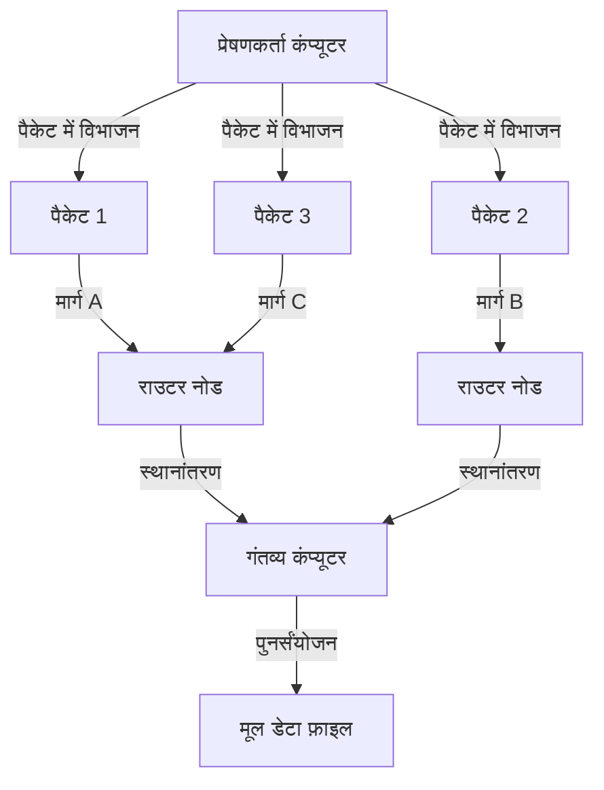
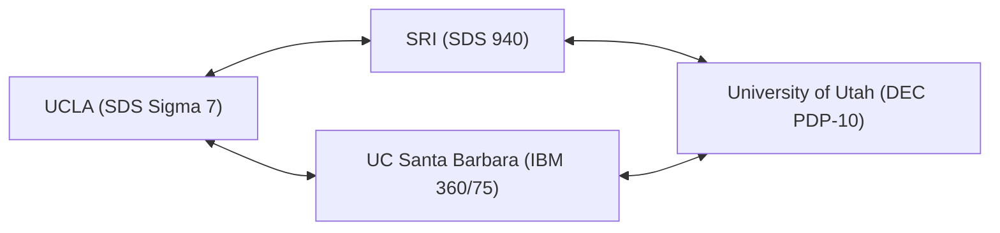

हमारे आधुनिक जीवन में, इंटरनेट हवा और पानी की तरह एक स्वाभाविक उपस्थिति बन गया है। बस एक स्मार्टफोन पर टैप करके, हम दुनिया के दूसरे छोर पर स्थित सर्वर के साथ तुरंत डेटा का आदान-प्रदान कर सकते हैं, वीडियो स्ट्रीम कर सकते हैं, और दुनिया भर के लोगों के साथ रीयल-टाइम में संवाद कर सकते हैं। हालाँकि, यह विशाल और जटिल वैश्विक नेटवर्क एक दिन अचानक पूर्ण रूप में प्रकट नहीं हुआ था। इसके उद्भव का पता लगाने पर, हम शीत युद्ध के विशिष्ट ऐतिहासिक संदर्भ में एक महत्वाकांक्षी परियोजना तक पहुँचते हैं। वह "ARPANET (अर्पानेट)" है।

इस लेख में, हम इंटरनेट के प्रत्यक्ष पूर्वज ARPANET की कल्पना कैसे की गई, किन तकनीकी सफलताओं के माध्यम से इसे बनाया गया, और यह उस इंटरनेट में कैसे विकसित हुआ जिसका हम आज उपयोग करते हैं, इसके विस्तृत इतिहास और तकनीकी पृष्ठभूमि की गहराई से पड़ताल करेंगे।

## 1. ऐतिहासिक पृष्ठभूमि: स्पुतनिक शॉक और ARPA की स्थापना

ARPANET के इतिहास को समझने के लिए, हमें 1950 के दशक के अंत में शीत युद्ध के बीच वापस जाने की आवश्यकता है। द्वितीय विश्व युद्ध के बाद, संयुक्त राज्य अमेरिका और सोवियत संघ अंतरिक्ष अन्वेषण से लेकर परमाणु हथियार विकास तक हर क्षेत्र में भयंकर प्रतिस्पर्धा में थे।

4 अक्टूबर 1957 को, सोवियत संघ ने मानव जाति के पहले कृत्रिम उपग्रह "स्पुतनिक 1" का सफलतापूर्वक प्रक्षेपण किया। अमेरिका के लिए, इसका मतलब अंतरिक्ष की दौड़ में हारने से कहीं अधिक था। "सोवियत संघ ने ऐसी परमाणु मिसाइल तकनीक स्थापित कर ली है जो अंतरिक्ष से सीधे अमेरिकी मुख्य भूमि पर हमला कर सकती है," इस डर ने पूरे अमेरिका को अपनी चपेट में ले लिया। इसे प्रसिद्ध "स्पुतनिक शॉक" के रूप में जाना जाता है।

इस तकनीकी नुकसान से उबरने के लिए, तत्कालीन राष्ट्रपति ड्वाइट डी. आइजनहावर ने सैन्य अनुप्रयोगों के लिए अत्याधुनिक वैज्ञानिक तकनीक को लागू करने के लिए अमेरिकी रक्षा विभाग (DoD) के भीतर एक शोध संस्थान की स्थापना की। वह "उन्नत अनुसंधान परियोजना एजेंसी (ARPA: Advanced Research Projects Agency)" थी। ARPA (बाद में DARPA), मौजूदा सैन्य ढांचे से बंधा नहीं एक लचीला संगठन होने के नाते, कई नवीन शोधों को निधि देगा।

## 2. जे. सी. लिक्लाइडर और "इंटरगैलेक्टिक कंप्यूटर नेटवर्क"

1960 के दशक की शुरुआत में, ARPA के भीतर सूचना प्रसंस्करण तकनीक कार्यालय (IPTO) की स्थापना की गई थी, और जे. सी. लिक्लाइडर (J.C.R. Licklider) ने इसके पहले निदेशक के रूप में कार्यभार संभाला। एक ध्वनिक मनोवैज्ञानिक से कंप्यूटर वैज्ञानिक में बदलने के उनके असामान्य करियर प्रक्षेपवक्र ने उन्हें "मानव-कंप्यूटर सहजीवन (Man-Computer Symbiosis)" नामक एक युगांतकारी शोध पत्र प्रकाशित करने के लिए प्रेरित किया।

लिक्लाइडर इस बात से असंतुष्ट थे कि उस समय के कंप्यूटरों का उपयोग केवल विशाल कैलकुलेटर (नंबर क्रंचर) के रूप में किया जाता था, और वे कंप्यूटर को मानव बौद्धिक गतिविधियों का विस्तार करने के लिए एक इंटरैक्टिव टूल के रूप में देखते थे। उन्होंने एक ऐसे नेटवर्क के निर्माण की कल्पना की जो पूरे अमेरिका में अनुसंधान संस्थानों में बिखरे हुए कंप्यूटरों को आपस में जोड़ सके, जिससे शोधकर्ता डेटा, प्रोग्राम और यहां तक कि विचारों को भी साझा कर सकें। उन्होंने इस भव्य दृष्टि को, थोड़ा मजाक में, "इंटरगैलेक्टिक कंप्यूटर नेटवर्क (Intergalactic Computer Network)" कहा।

हालाँकि नेटवर्क का कोई विशिष्ट तकनीकी डिज़ाइन बनाने से पहले लिक्लाइडर ने IPTO छोड़ दिया, लेकिन उनका विजन बॉब टेलर और लॉरेंस रॉबर्ट्स जैसे उत्कृष्ट वैज्ञानिकों के उत्तराधिकारियों को सौंप दिया गया, और यह ARPANET के विकास के लिए एक शक्तिशाली प्रेरक शक्ति बन गया।

## 3. पैकेट स्विचिंग तकनीक का जन्म

नेटवर्क बनाने में सबसे बड़ी तकनीकी चुनौती यह थी कि "डेटा को कुशलतापूर्वक और मज़बूती से कैसे भेजा और प्राप्त किया जाए।" उस समय संचार नेटवर्क की मुख्यधारा "सर्किट स्विचिंग" थी, जिसका उपयोग टेलीफोन नेटवर्क में किया जाता था। यह एक ऐसी विधि है जो संचार करने वाले दो पक्षों के बीच एक समर्पित भौतिक रेखा पर एकाधिकार कर लेती है। हालाँकि, यह विधि कंप्यूटरों के बीच रुक-रुक कर होने वाले डेटा संचार (बर्स्ट ट्रैफ़िक) के लिए अत्यंत अक्षम थी, और इसमें यह भेद्यता थी कि यदि लाइन का कोई हिस्सा नष्ट हो गया तो पूरा संचार बाधित हो जाएगा (सैन्य दृष्टिकोण से भी, एक मजबूत नेटवर्क की आवश्यकता थी जो परमाणु हमले का सामना कर सके)।

इस समस्या को हल करने के लिए, संचार की एक पूरी तरह से नई अवधारणा एक साथ तैयार की गई थी। वह "पैकेट स्विचिंग" है।

अमेरिका के RAND कॉर्पोरेशन से जुड़े पॉल बैरन ने सैन्य संचार की उत्तरजीविता को बढ़ाने के लिए "वितरित नेटवर्क" का सिद्धांत विकसित किया, जो डेटा को छोटे टुकड़ों में विभाजित करता है और उन्हें एक जालीदार नेटवर्क के माध्यम से अलग-अलग मार्गों से स्थानांतरित करता है।
दूसरी ओर, यूके की राष्ट्रीय भौतिक प्रयोगशाला (NPL) के डोनाल्ड डेविस स्वतंत्र रूप से एक समान अवधारणा पर पहुंचे और डेटा के विभाजित समूहों का नाम "पैकेट" रखा। इसके अलावा, मैसाचुसेट्स इंस्टीट्यूट ऑफ टेक्नोलॉजी (MIT) के लियोनार्ड क्लेनरॉक ने गणितीय कतारबद्ध सिद्धांत का उपयोग करके इस डेटा स्थानांतरण पद्धति की दक्षता साबित की।

(चित्र: पैकेट स्विचिंग की मूल अवधारणा)

पैकेट स्विचिंग में, संदेशों को निश्चित आकार के "पैकेट" में विभाजित किया जाता है, और प्रत्येक को गंतव्य जानकारी दी जाती है। प्रत्येक पैकेट नेटवर्क के भीतर एक खाली मार्ग की स्वायत्त रूप से खोज करते हुए स्थानांतरित किया जाता है, और अंतिम गंतव्य पर मूल संदेश में फिर से जोड़ा जाता है। इसने संचार लाइनों के कुशल साझाकरण और कुछ विफलताओं के खिलाफ उच्च दोष सहिष्णुता को सक्षम किया।

## 4. IMP (इंटरफ़ेस मैसेज प्रोसेसर) का विकास

लॉरेंस रॉबर्ट्स, जो ARPANET के डिज़ाइन के लिए जिम्मेदार बने, ने फैसला किया कि पूरे अमेरिका में विभिन्न प्रकार के मेनफ्रेम कंप्यूटरों को सीधे आपस में जोड़ना तकनीकी रूप से मुश्किल था। इसलिए, उन्होंने एक आर्किटेक्चर तैयार किया जिसमें एक छोटा कंप्यूटर जो नेटवर्क रूटिंग प्रोसेसिंग में माहिर है, प्रत्येक स्थान पर रखा जाता है, और मेनफ्रेम केवल उस छोटे कंप्यूटर के साथ संचार करता है।

इस समर्पित कंप्यूटर का नाम "IMP (इंटरफ़ेस मैसेज प्रोसेसर)" रखा गया। यह आधुनिक इंटरनेट में "राउटर" का प्रोटोटाइप है।

1968 में, ARPA ने IMP के विकास के लिए एक प्रतिस्पर्धी बोली आयोजित की, और मैसाचुसेट्स की एक परामर्श कंपनी BBN टेक्नोलॉजीज (बोल्ट बेरानेक एंड न्यूमैन) ने अनुबंध जीता। फ्रैंक हार्ट के नेतृत्व वाली BBN टीम ने हनीवेल मिनीकंप्यूटर "DDP-516" को संशोधित करके और बहुत ही कम समय में IMP हार्डवेयर और सॉफ्टवेयर को पूरा करके इंजीनियरिंग की एक आश्चर्यजनक उपलब्धि हासिल की।

## 5. 1969: ARPANET का पहला कनेक्शन और ऐतिहासिक "LO"

1969 के पतन में, पहला IMP कैलिफोर्निया विश्वविद्यालय, लॉस एंजिल्स (UCLA) में लियोनार्ड क्लेनरॉक की प्रयोगशाला में दिया गया था। इसके बाद, स्टैनफोर्ड रिसर्च इंस्टीट्यूट (SRI), कैलिफोर्निया विश्वविद्यालय, सांता बारबरा (UCSB), और यूटा विश्वविद्यालय में एक के बाद एक IMP स्थापित किए गए, जिससे पहले 4 नोड्स बने।

(चित्र: 1969 में ARPANET का पहला 4-नोड कॉन्फ़िगरेशन)

29 अक्टूबर 1969 को रात 10:30 बजे एक ऐतिहासिक क्षण आया। UCLA के एक छात्र प्रोग्रामर चार्ली क्लाइन ने SRI के कंप्यूटर में दूरस्थ रूप से लॉग इन करने का प्रयास किया। यह "LOGIN" शब्द भेजने की एक प्रक्रिया थी।

क्लाइन ने रिसीवर पर SRI के प्रभारी व्यक्ति से बात करते हुए कीबोर्ड को टैप किया।
उसने "L" टाइप किया और SRI पक्ष पर इसके स्वागत की पुष्टि की।
अगला, उसने "O" टाइप किया और SRI पक्ष पर स्वागत की पुष्टि की।
और जिस क्षण उसने "G" टाइप किया...... SRI का सिस्टम क्रैश हो गया।

नतीजतन, ARPANET पर भेजा गया पहला संदेश "LO" (Lo and behold = देखो, यह एक आश्चर्यजनक बात है) का प्रतीकात्मक शब्द बन गया। सिस्टम को तुरंत पुनर्प्राप्त किया गया था, और कुछ घंटों बाद पूर्ण रिमोट लॉगिन सफल रहा। यह उस साइबरस्पेस का जन्म था जो दुनिया को कवर करेगा।

## 6. नेटवर्क का विकास और TCP/IP का जन्म

1970 के दशक की शुरुआत में, ARPANET का तेजी से विस्तार हुआ, और पूर्वी तट पर अमेरिकी अनुसंधान संस्थानों और सैन्य प्रतिष्ठानों को भी जोड़ा जाने लगा। 1973 में, इसे उपग्रह के माध्यम से हवाई, नॉर्वे और यूनाइटेड किंगडम से जोड़ा गया, जो एक अंतर्राष्ट्रीय नेटवर्क में विकसित हुआ।

हालाँकि, ARPANET के विस्तार के साथ नई समस्याएँ सामने आईं। ARPANET के अलावा, पैकेट रेडियो नेटवर्क (PRNET) और सैटेलाइट नेटवर्क (SATNET) जैसे अद्वितीय प्रोटोकॉल पर काम करने वाले विभिन्न नेटवर्क दुनिया भर में एक के बाद एक बनाए जा रहे थे। सबसे बड़ी चुनौती यह थी कि "विभिन्न नियमों वाले इन नेटवर्कों" को आपस में कैसे जोड़ा जाए।

इस समस्या को हल करने और "नेटवर्कों के नेटवर्क (Internetwork)" को साकार करने के लिए विंटन सेर्फ़ और रॉबर्ट कान ने कदम बढ़ाया। 1974 में, उन्होंने एक युगांतकारी पेपर प्रकाशित किया जिसमें विभिन्न नेटवर्कों को निर्बाध रूप से जोड़ने के लिए एक सामान्य भाषा, "TCP (Transmission Control Protocol)" का प्रस्ताव दिया गया। संचार प्रोटोकॉल का यह सूट, जिसे बाद में TCP और IP (Internet Protocol) में विभाजित किया गया, आज के इंटरनेट की मूलभूत तकनीक है।

TCP/IP का एक मजबूत और अत्यधिक स्केलेबल डिज़ाइन था जो स्पष्ट रूप से डेटा स्थानांतरण की विश्वसनीयता सुनिश्चित करने की भूमिका (TCP) और गंतव्य तक रूटिंग की भूमिका (IP) को अलग करता है।

## 7. ARPANET का अंत और इंटरनेट की सुबह

1 जनवरी 1983 (आमतौर पर फ्लैग डे के रूप में जाना जाता है) को, ARPANET के मानक प्रोटोकॉल को पूरी तरह से पारंपरिक NCP (नेटवर्क कंट्रोल प्रोग्राम) से TCP/IP में बदल दिया गया था। इस दिन, ARPANET सच्चे अर्थों में "इंटरनेट" के एक हिस्से में बदल गया।

उसी समय, सैन्य और रक्षा संबंधी नोड्स को MILNET के रूप में अलग कर दिया गया था, और ARPANET ने विशुद्ध रूप से एक अकादमिक और अनुसंधान नेटवर्क के रूप में काम करना जारी रखा। इसके बाद, नेशनल साइंस फाउंडेशन (NSF) द्वारा निर्मित एक तेज़ बैकबोन नेटवर्क, NSFNET प्रमुख हो गया, और अकादमिक समुदाय की मुख्यधारा इसमें स्थानांतरित हो गई।

और 1990 में, अपने ऐतिहासिक मिशन को पूरा करने के बाद, ARPANET आधिकारिक तौर पर सेवानिवृत्त हो गया और इसे खत्म कर दिया गया।

## 8. ARPANET की विरासत

हालाँकि ARPANET की केवल 20 वर्षों की एक छोटी परिचालन अवधि थी, लेकिन इसकी विरासत अपार है। पैकेट स्विचिंग तकनीक, IMP के माध्यम से वितरित रूटिंग, रिमोट लॉगिन (Telnet), फ़ाइल ट्रांसफ़र (FTP), और सबसे बढ़कर, आधुनिक समाज के लिए अपरिहार्य संचार अवसंरचना के प्रोटोटाइप, जैसे इलेक्ट्रॉनिक मेल (E-mail), सभी का जन्म और विकास ARPANET पर हुआ था।

ARPANET में अंतर्निहित दर्शन, "एक बिना किसी विशिष्ट केंद्र वाला, लचीला नेटवर्क जो विफलताओं के प्रति प्रतिरोधी है और जिसमें कोई भी भाग ले सकता है," TCP/IP के माध्यम से आज के इंटरनेट में सीधे पारित हो गया है। ARPANET का जन्म शीत युद्ध के दौरान राष्ट्रीय सुरक्षा की चरम मांगों से हुआ था, और इसे दूरदर्शी वैज्ञानिकों के जुनून और हैकर संस्कृति द्वारा पोषित किया गया था। यह केवल संचार प्रौद्योगिकी का इतिहास नहीं है, बल्कि मानवता के लिए जानकारी साझा करने और ज्ञान को जोड़ने के लिए एक "नया तंत्रिका तंत्र" प्राप्त करने तक का एक भव्य नाटक है।
