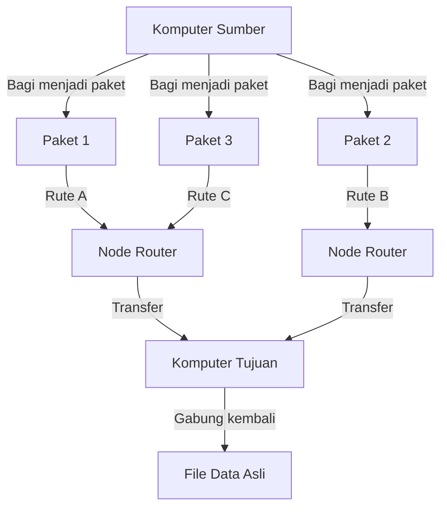
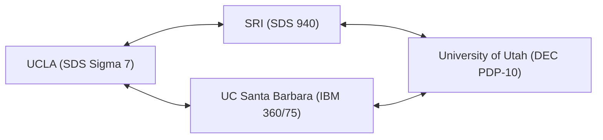

Dalam kehidupan kita saat ini, internet telah menjadi sesuatu yang lazim, seperti udara atau air. Hanya dengan mengetuk ponsel pintar, kita dapat langsung bertukar data dengan server di belahan dunia lain, melakukan streaming video, dan berkomunikasi secara real-time dengan orang-orang di seluruh dunia. Namun, jaringan global yang besar dan kompleks ini tidak muncul dalam bentuk yang sudah sempurna begitu saja pada suatu hari. Jika kita menelusuri asal-usulnya, kita akan sampai pada sebuah proyek ambisius di tengah latar belakang sejarah yang unik pada era Perang Dingin. Proyek tersebut adalah "ARPANET".

Artikel ini akan menggali lebih dalam sejarah dan latar belakang teknologi secara terperinci tentang bagaimana ARPANET, yang merupakan nenek moyang langsung internet, dikonseptualisasikan, melalui terobosan teknologi apa jaringan ini dibangun, dan bagaimana berevolusi menjadi internet yang kita gunakan saat ini.

## 1. Latar Belakang Sejarah: Kejutan Sputnik dan Pendirian ARPA

Untuk memahami sejarah ARPANET, kita perlu memutar kembali waktu ke tengah Perang Dingin pada akhir tahun 1950-an. Setelah Perang Dunia II, Amerika Serikat dan Uni Soviet terlibat dalam persaingan sengit di segala bidang, mulai dari penjelajahan luar angkasa hingga pengembangan senjata nuklir.

Pada 4 Oktober 1957, Uni Soviet berhasil meluncurkan satelit buatan manusia pertama, "Sputnik 1". Bagi Amerika, hal ini memiliki arti lebih dari sekadar kekalahan dalam perlombaan luar angkasa. Ketakutan bahwa "Uni Soviet telah mengembangkan teknologi rudal nuklir yang dapat menyerang daratan Amerika Serikat secara langsung dari luar angkasa" melanda seluruh Amerika. Inilah yang dikenal sebagai "Kejutan Sputnik".

Untuk mengatasi ketertinggalan teknologi ini, Presiden Dwight D. Eisenhower mendirikan lembaga penelitian di dalam Departemen Pertahanan AS (DoD) untuk menerapkan sains dan teknologi mutakhir ke ranah militer. Lembaga itu adalah "Advanced Research Projects Agency" (ARPA). ARPA (yang kemudian menjadi DARPA), sebagai organisasi fleksibel yang tidak terikat oleh kerangka militer tradisional, akan mendanai banyak penelitian inovatif.

## 2. J.C.R. Licklider dan "Jaringan Komputer Antargalaksi"

Pada awal 1960-an, Information Processing Techniques Office (IPTO) didirikan di dalam ARPA, dengan J.C.R. Licklider ditunjuk sebagai direktur pertamanya. Licklider memiliki latar belakang yang tidak biasa, beralih dari seorang psikoakustikawan menjadi ilmuwan komputer, dan telah menerbitkan sebuah makalah inovatif berjudul "Simbiosis Manusia-Komputer" (Man-Computer Symbiosis).

Licklider tidak puas dengan komputer pada masa itu yang hanya digunakan sebagai mesin hitung raksasa (number crunchers) dan menganggap komputer sebagai alat interaktif untuk memperluas aktivitas intelektual manusia. Ia membayangkan pembangunan jaringan yang akan menghubungkan komputer yang tersebar di lembaga penelitian di seluruh AS, sehingga para peneliti dapat saling berbagi data, program, dan bahkan ide. Ia menyebut visi besar ini, setengah bercanda, sebagai "Jaringan Komputer Antargalaksi" (Intergalactic Computer Network).

Licklider sendiri meninggalkan IPTO sebelum melakukan desain teknis spesifik dari jaringan tersebut, namun visinya diteruskan oleh para ilmuwan brilian penerusnya seperti Bob Taylor dan Lawrence Roberts, yang menjadi kekuatan pendorong kuat di balik pengembangan ARPANET.

## 3. Kelahiran Teknologi Packet Switching

Tantangan teknis terbesar dalam membangun jaringan adalah "bagaimana mengirim dan menerima data secara efisien dan andal". Jaringan komunikasi arus utama pada waktu itu adalah "circuit switching" yang digunakan dalam jaringan telepon. Ini adalah metode yang menempati sirkuit fisik khusus antara dua pihak yang berkomunikasi. Namun, metode ini sangat tidak efisien untuk komunikasi data terputus-putus (burst traffic) antar komputer, dan memiliki kerentanan bahwa jika bagian dari sirkuit hancur, seluruh komunikasi akan terputus (dari sudut pandang militer, jaringan kuat yang dapat menahan serangan nuklir sangat dibutuhkan).

Untuk menyelesaikan masalah ini, sebuah konsep komunikasi yang sama sekali baru dirancang secara simultan di beberapa tempat. Konsep itu adalah "packet switching".

Paul Baran, di RAND Corporation AS, mengembangkan teori "jaringan terdesentralisasi" di mana data dibagi menjadi potongan-potongan kecil dan ditransfer melalui rute yang berbeda melalui jaringan seperti jaring laba-laba, untuk meningkatkan survivabilitas komunikasi militer.
Sementara itu, Donald Davies di National Physical Laboratory (NPL) Inggris secara independen mencapai konsep yang sama dan menamai kelompok data yang dibagi tersebut dengan "paket". Selanjutnya, Leonard Kleinrock dari Massachusetts Institute of Technology (MIT) membuktikan efisiensi metode transfer data ini menggunakan teori antrian matematis.

(Gambar: Konsep Dasar Packet Switching)

Dalam packet switching, pesan dibagi menjadi "paket" berukuran tetap, yang masing-masing diberikan informasi tujuan. Setiap paket ditransfer sambil mencari rute kosong dalam jaringan secara mandiri, dan dibangun kembali ke pesan asli pada tujuan akhir. Ini memungkinkan pembagian saluran komunikasi yang efisien dan toleransi kesalahan yang tinggi terhadap beberapa kegagalan.

## 4. Pengembangan IMP (Interface Message Processor)

Lawrence Roberts, yang menjadi kepala desainer ARPANET, menentukan bahwa secara teknis sulit untuk menghubungkan berbagai jenis komputer mainframe di seluruh AS secara langsung satu sama lain. Oleh karena itu, ia merancang arsitektur di mana komputer kecil khusus yang menangani proses routing jaringan ditempatkan di setiap lokasi, dan mainframe hanya akan berkomunikasi dengan komputer kecil tersebut.

Komputer khusus ini diberi nama "IMP" (Interface Message Processor). Ini adalah prototipe dari "router" dalam internet modern.

Pada tahun 1968, ARPA mengadakan lelang kompetitif untuk pengembangan IMP, dan BBN Technologies (Bolt Beranek and Newman), sebuah perusahaan konsultan di Massachusetts, memenangkan tawaran tersebut. Tim BBN, yang dipimpin oleh Frank Heart, memodifikasi komputer mini Honeywell "DDP-516" dan menyelesaikan perangkat keras serta perangkat lunak IMP dalam waktu yang sangat singkat, yang merupakan sebuah pencapaian rekayasa teknik yang luar biasa.

## 5. 1969: Koneksi Pertama ARPANET dan Pesan Bersejarah "LO"

Pada musim gugur tahun 1969, IMP pertama dikirimkan ke laboratorium Leonard Kleinrock di University of California, Los Angeles (UCLA). Selanjutnya, IMP secara berturut-turut dipasang di Stanford Research Institute (SRI), University of California, Santa Barbara (UCSB), dan University of Utah, membentuk konfigurasi 4-node pertama.

(Gambar: Konfigurasi 4-node pertama ARPANET pada tahun 1969)

Pada tanggal 29 Oktober 1969, pukul 22:30, sebuah momen bersejarah tiba. Charley Kline, seorang mahasiswa programmer di UCLA, mencoba untuk masuk dari jarak jauh (remote login) ke komputer di SRI. Prosedurnya adalah dengan mengirimkan kata "LOGIN".

Kline mengetik di keyboard sambil berbicara dengan operator SRI melalui gagang telepon.
Ia mengetik "L", dan pihak SRI mengonfirmasi penerimaan.
Kemudian ia mengetik "O", dan pihak SRI mengonfirmasi penerimaan.
Dan saat ia mengetik "G"...... sistem SRI mengalami crash.

Akibatnya, pesan pertama yang dikirim melalui ARPANET adalah kata simbolis "LO" (merujuk pada kata "Lo and behold" = lihatlah, sesuatu yang menakjubkan). Sistem segera dipulihkan, dan beberapa jam kemudian login jarak jauh berhasil sepenuhnya. Ini adalah tangisan pertama dari dunia maya (cyberspace) yang kini menyelimuti dunia.

## 6. Pertumbuhan Jaringan dan Kelahiran TCP/IP

Memasuki tahun 1970-an, ARPANET meluas dengan cepat, menghubungkan lembaga penelitian dan fasilitas militer di Pantai Timur Amerika. Pada tahun 1973, jaringan ini juga terhubung ke Hawaii, Norwegia, dan Inggris melalui satelit, berkembang menjadi jaringan internasional.

Namun, seiring perluasan ARPANET, masalah baru muncul. Di seluruh dunia, berbagai jaringan yang beroperasi dengan protokol unik mulai dibangun, seperti Packet Radio Network (PRNET) dan Satellite Network (SATNET). "Bagaimana cara menghubungkan jaringan-jaringan dengan aturan yang berbeda" menjadi tantangan terbesar.

Untuk mengatasi masalah ini dan mewujudkan "Jaringan dari jaringan-jaringan" (Internetwork), Vinton Cerf dan Robert Kahn melangkah maju. Mereka menerbitkan makalah terobosan pada tahun 1974, mengusulkan bahasa umum, "TCP" (Transmission Control Protocol), untuk menghubungkan jaringan-jaringan yang berbeda secara mulus. Kumpulan protokol komunikasi ini, yang kemudian dipisahkan menjadi TCP dan IP (Internet Protocol), merupakan teknologi dasar dari internet modern.

TCP/IP memiliki desain yang kuat dan sangat dapat diskalakan yang secara jelas memisahkan peran menjamin keandalan transfer data (TCP) dan peran routing ke tujuan (IP).

## 7. Akhir ARPANET dan Fajar Internet

Pada 1 Januari 1983 (dikenal sebagai Flag Day), protokol standar ARPANET sepenuhnya beralih dari NCP (Network Control Program) ke TCP/IP. Mulai hari itu, ARPANET secara resmi berubah menjadi bagian dari "Internet" dalam arti yang sebenarnya.

Pada waktu yang hampir bersamaan, node terkait militer dan pertahanan dipisahkan menjadi MILNET, sementara ARPANET terus beroperasi sebagai jaringan murni untuk akademik dan penelitian. Setelah itu, NSFNET, jaringan tulang punggung (backbone) berkecepatan tinggi yang dibangun oleh National Science Foundation (NSF) Amerika Serikat, mulai menonjol, dan komunitas akademik perlahan beralih ke sana.

Akhirnya, pada tahun 1990, ARPANET secara resmi mengakhiri operasinya dan dibongkar setelah menyelesaikan misi bersejarahnya.

## 8. Warisan ARPANET

Meskipun ARPANET beroperasi hanya dalam waktu singkat yaitu 20 tahun, warisannya tak ternilai. Prototipe dari infrastruktur komunikasi yang penting untuk masyarakat modern—teknologi packet switching, routing terdistribusi melalui IMP, remote login (Telnet), transfer file (FTP), dan yang terpenting, surat elektronik (E-mail)—semuanya lahir dan disempurnakan di ARPANET.

Filosofi dasar ARPANET, yakni "jaringan fleksibel tanpa pusat tertentu, tahan terhadap kegagalan, dan dapat diikuti oleh siapa saja", telah diwariskan ke internet modern melalui TCP/IP. Lahir dari tuntutan ekstrem keamanan nasional selama Perang Dingin dan dipelihara oleh para ilmuwan visioner serta budaya peretas, ARPANET bukan sekadar sejarah teknologi komunikasi, melainkan sebuah drama epik tentang bagaimana umat manusia memperoleh "sistem saraf baru" untuk berbagi informasi dan menyatukan pengetahuan.
