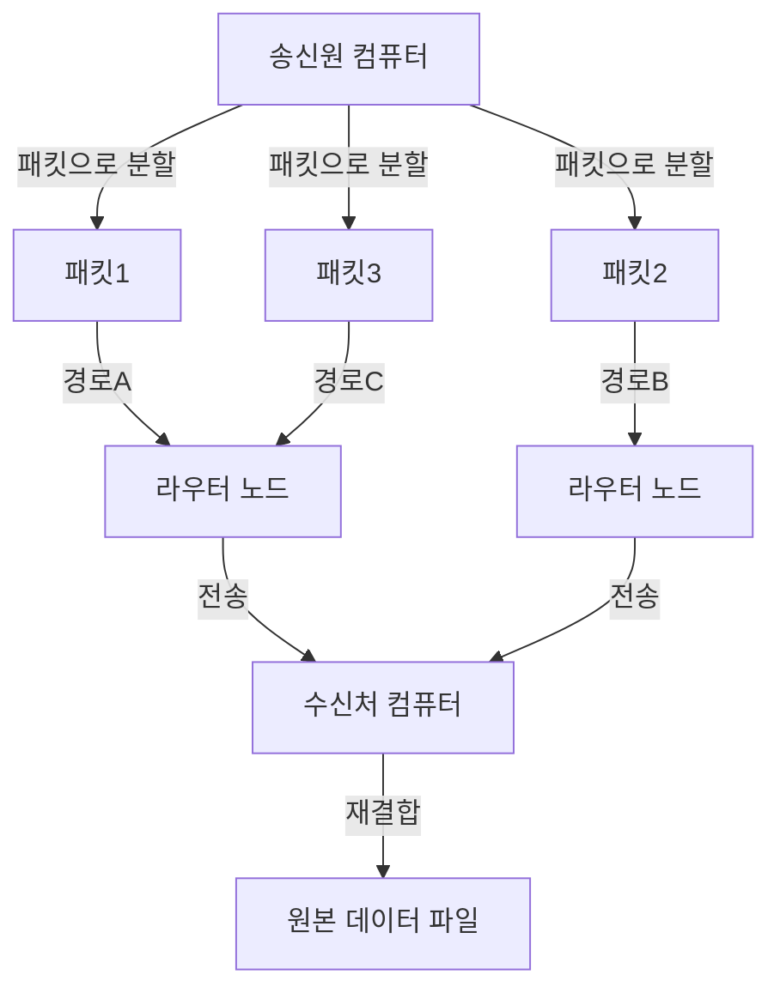
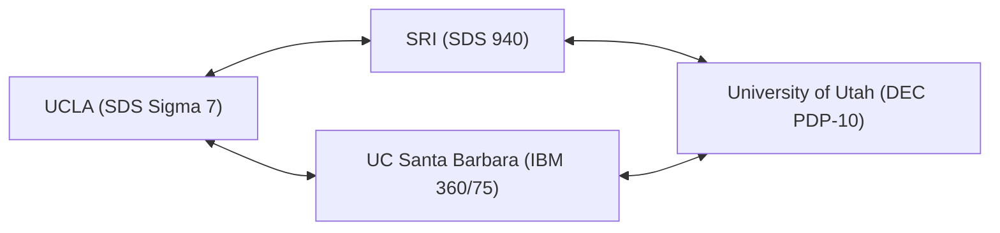

현대의 우리 생활에서 인터넷은 공기나 물처럼 당연한 존재가 되었습니다. 스마트폰을 탭하는 것만으로 지구 반대편에 있는 서버와 순식간에 데이터를 주고받고, 동영상을 스트리밍하며, 전 세계 사람들과 실시간으로 소통할 수 있습니다. 하지만 이 거대하고 복잡한 글로벌 네트워크는 어느 날 갑자기 완성된 형태로 나타난 것이 아닙니다. 그 기원을 추적해 보면 냉전이라는 특이한 시대적 배경 속에서 하나의 야심 찬 프로젝트에 이르게 됩니다. 그것이 바로 'ARPANET(아파넷)'입니다.

본 문서에서는 인터넷의 직접적인 조상인 ARPANET이 어떻게 구상되었고, 어떤 기술적 돌파구를 거쳐 구축되었으며, 그리고 현재 우리가 사용하는 인터넷으로 진화해 나갔는지 그 상세한 역사와 기술적 배경을 깊이 파헤쳐 봅니다.

## 1. 시대적 배경: 스푸트니크 쇼크와 ARPA의 설립

ARPANET의 역사를 이해하기 위해서는 1950년대 후반 냉전이 한창이던 시기로 시계를 되돌려야 합니다. 제2차 세계대전 이후 미국과 소련은 우주 개발부터 핵무기 개발까지 모든 분야에서 치열한 경쟁을 벌이고 있었습니다.

1957년 10월 4일, 소련은 인류 최초의 인공위성 '스푸트니크 1호'의 발사에 성공합니다. 이는 미국에게 단순한 우주 경쟁에서의 패배 이상의 의미를 가졌습니다. "소련이 우주 공간에서 미국 본토를 직접 공격할 수 있는 핵미사일 기술을 확립했다"는 공포가 미국 전역을 뒤덮었습니다. 이것이 그 유명한 '스푸트니크 쇼크'입니다.

이러한 기술적 열세를 만회하기 위해 당시 드와이트 D. 아이젠하워 대통령은 미국 국방부(DoD) 내에 최첨단 과학기술을 군사적으로 응용하기 위한 연구 기관을 설립했습니다. 그것이 '고등연구계획국(ARPA: Advanced Research Projects Agency)'입니다. ARPA(이후 DARPA)는 기존 군의 틀에 얽매이지 않는 유연한 조직으로서 수많은 혁신적인 연구에 자금을 지원하게 됩니다.

## 2. J. C. 릭라이더와 '은하간 컴퓨터 네트워크'

1960년대 초반, ARPA에는 정보처리기술국(IPTO)이 설립되었고, 그 초대 국장으로 취임한 사람이 J. C. 릭라이더(J.C.R. Licklider)였습니다. 그는 음향심리학자에서 컴퓨터 과학자로 전향한 이색적인 경력을 가졌으며, '인간과 컴퓨터의 공생(Man-Computer Symbiosis)'이라는 획기적인 논문을 발표한 바 있습니다.

릭라이더는 당시의 컴퓨터가 거대한 계산기(넘버 크런처)로만 사용되고 있는 것에 불만을 품고, 컴퓨터를 인간의 지적 활동을 확장하기 위한 상호작용적인 도구로 인식했습니다. 그는 미국 전역의 연구 기관에 흩어져 있는 컴퓨터를 상호 연결하여, 연구자들끼리 데이터나 프로그램, 나아가 아이디어를 공유할 수 있는 네트워크의 구축을 구상했습니다. 그는 이 장대한 비전을 반쯤 농담을 섞어 '은하간 컴퓨터 네트워크(Intergalactic Computer Network)'라고 불렀습니다.

릭라이더 자신은 네트워크의 구체적인 기술 설계를 하기 전에 IPTO를 떠났지만, 그의 비전은 후임인 밥 테일러나 로런스 로버츠 같은 우수한 과학자들에게 계승되어 ARPANET 개발의 강력한 원동력이 되었습니다.

## 3. 패킷 교환 기술의 탄생

네트워크를 구축하는 데 있어 가장 큰 기술적 과제는 '어떻게 데이터를 효율적이고 확실하게 송수신할 것인가'였습니다. 당시 통신 네트워크의 주류는 전화망에서 사용되던 '회선 교환 방식'이었습니다. 이는 통신을 하는 양자 간에 전용 물리적 회선을 점유하는 방식입니다. 하지만 이 방식은 컴퓨터 간의 단속적인 데이터 통신(버스트 트래픽)에는 극히 비효율적이었으며, 또한 회선의 일부가 파괴되면 통신 전체가 단절된다는 취약점이 있었습니다(군사적인 관점에서도 핵 공격에 견딜 수 있는 견고한 네트워크가 요구되었습니다).

이 문제를 해결하기 위해 전혀 새로운 통신 개념이 동시다발적으로 고안되었습니다. 그것이 '패킷 교환 방식'입니다.

미국의 랜드 연구소에 소속되어 있던 폴 배런은 군사 통신의 생존성을 높이기 위해 데이터를 잘게 분할하고, 그물망 형태의 네트워크를 통해 각각 서로 다른 경로로 전송하는 '분산형 네트워크'의 이론을 구축했습니다.
한편 영국의 국립물리연구소(NPL)의 도널드 데이비스도 독립적으로 동일한 개념에 도달하여, 분할된 데이터의 묶음을 '패킷'이라고 이름 붙였습니다. 나아가 매사추세츠 공과대학교(MIT)의 레너드 클라인록은 이 데이터 전송 방식의 효율성을 수학적인 큐잉 이론([대기행렬 이론](/ko/p/queuing-theory-basics/))을 사용하여 증명했습니다.

(그림: 패킷 교환의 기본 개념)

패킷 교환에서는 메시지를 일정 크기의 '패킷'으로 분할하고, 각각에 수신처 정보를 부여합니다. 각 패킷은 네트워크 내에서 비어 있는 경로를 자율적으로 찾으며 전송되고, 최종적인 수신처에서 원래의 메시지로 재조립됩니다. 이를 통해 통신 회선의 효율적인 공유와 일부 장애에 대한 높은 내결함성이 실현되었습니다.

## 4. IMP(Interface Message Processor)의 개발

ARPANET의 설계 책임자가 된 로런스 로버츠는 미국 전역의 각기 다른 종류의 메인프레임 컴퓨터를 직접 상호 연결하는 것은 기술적으로 어렵다고 판단했습니다. 그래서 그는 네트워크의 라우팅 처리를 전담하는 소형 컴퓨터를 각 거점에 배치하고, 메인프레임은 그 소형 컴퓨터와만 통신을 수행한다는 아키텍처를 고안했습니다.

이 전용 컴퓨터는 'IMP(Interface Message Processor)'라고 명명되었습니다. 현대 인터넷의 '라우터'의 원형입니다.

1968년, ARPA는 IMP의 개발에 관한 경쟁 입찰을 실시했고, 매사추세츠주에 있는 컨설팅 회사 BBN 테크놀로지스(Bolt Beranek and Newman)가 낙찰을 받았습니다. 프랭크 하트가 이끄는 BBN의 팀은 하니웰사의 미니컴퓨터 'DDP-516'을 개조하여, 극히 짧은 기간 내에 IMP의 하드웨어와 소프트웨어를 완성시키는 놀라운 엔지니어링의 위업을 달성했습니다.

## 5. 1969년: ARPANET의 첫 접속과 역사적인 'LO'

1969년 가을, 최초의 IMP가 캘리포니아 대학교 로스앤젤레스(UCLA)의 레너드 클라인록 연구실에 납품되었습니다. 이어서 스탠퍼드 연구소(SRI), 캘리포니아 대학교 산타바바라(UCSB), 유타 대학교에 차례로 IMP가 설치되어, 최초의 4개 노드가 구성되었습니다.

(그림: 1969년 당시 ARPANET 최초의 4개 노드 구성)

1969년 10월 29일 오후 10시 30분, 역사적인 순간이 찾아옵니다. UCLA의 학생 프로그래머였던 찰리 클라인이 SRI의 컴퓨터에 원격 로그인을 시도했습니다. 'LOGIN'이라는 단어를 전송하는 절차였습니다.

클라인은 수화기 너머로 SRI의 담당자와 통화하며 키보드를 두드렸습니다.
'L'을 타이핑하고 SRI 측에서 수신을 확인.
다음으로 'O'를 타이핑하고 SRI 측에서 수신을 확인.
그리고 'G'를 타이핑한 순간…… SRI의 시스템이 다운되었습니다.

결과적으로 ARPANET에서 처음으로 전송된 메시지는 'LO'(Lo and behold = 보라, 놀라운 일이로다, 라는 뜻과 통함)라는 상징적인 단어가 되었습니다. 시스템은 금방 복구되었고, 몇 시간 후에는 완전한 원격 로그인이 성공했습니다. 이것이 전 세계를 뒤덮는 사이버 공간의 첫 울음소리였습니다.

## 6. 네트워크의 성장과 TCP/IP의 탄생

1970년대에 들어서자 ARPANET은 급속히 확대되어, 미국 동해안의 연구 기관이나 군사 시설도 접속하게 되었습니다. 1973년에는 인공위성을 거쳐 하와이나 노르웨이, 영국과도 연결되어 국제적인 네트워크로 발전했습니다.

하지만 ARPANET의 확대에 따라 새로운 문제가 부상했습니다. 전 세계에는 ARPANET 외에도 패킷 무선망(PRNET)이나 위성 네트워크(SATNET) 등 독자적인 프로토콜로 동작하는 서로 다른 네트워크가 차례로 구축되고 있었습니다. 이러한 '서로 다른 규칙의 네트워크'들을 어떻게 연결할 것인가가 가장 큰 과제가 된 것입니다.

이 문제를 해결하고 '네트워크의 네트워크(Internetwork)'를 실현하기 위해 나선 사람이 빈튼 서프와 로버트 칸입니다. 그들은 1974년에 획기적인 논문을 발표하여, 서로 다른 네트워크를 원활하게 상호 연결하기 위한 공통 언어인 'TCP(Transmission Control Protocol)'를 제안했습니다. 훗날 TCP와 IP(Internet Protocol)로 분할되는 이 통신 프로토콜 군이야말로 현재 인터넷의 기반 기술입니다.

TCP/IP는 데이터 전송의 신뢰성을 담보하는 역할(TCP)과 수신처로의 라우팅을 수행하는 역할(IP)을 명확히 분리한, 견고하고 확장성 높은 설계로 되어 있었습니다.

## 7. ARPANET의 종언과 인터넷의 여명

1983년 1월 1일(통칭: 플래그 데이), ARPANET의 표준 프로토콜이 기존의 NCP(Network Control Program)에서 TCP/IP로 전면적으로 전환되었습니다. 이 날을 기점으로 ARPANET은 진정한 의미에서의 '인터넷'의 일부로 변모를 이루었습니다.

같은 시기, 군사 및 방위 관련 노드는 MILNET으로 분리되었고, ARPANET은 순수한 학술 및 연구용 네트워크로서 운용이 계속되었습니다. 그 후 미국 국립과학재단(NSF)이 구축한 더 고속의 백본 네트워크인 NSFNET이 대두되면서, 학술 커뮤니티의 주류는 그쪽으로 이동해 갔습니다.

그리고 1990년, 그 역사적 사명을 다한 ARPANET은 공식적으로 운용을 종료하고 해체되었습니다.

## 8. ARPANET이 남긴 것

ARPANET은 20년이라는 짧은 운용 기간이었지만, 그 유산은 헤아릴 수 없습니다. 패킷 교환 기술, IMP를 통한 분산 라우팅, 원격 로그인(Telnet), 파일 전송(FTP), 그리고 무엇보다 이메일(E-mail)과 같은 현대 사회에 필수 불가결한 통신 인프라의 프로토타입은 모두 ARPANET 상에서 탄생하고 세련되었습니다.

'특정한 중심을 가지지 않고, 장애에 강하며, 누구나 참여할 수 있는 유연한 네트워크'라는 ARPANET의 기저에 흐르는 철학은 TCP/IP를 통해 현재의 인터넷에 그대로 계승되고 있습니다. 냉전기 국가 안보라는 극한의 요청에서 탄생하여, 수많은 선견지명을 가진 과학자들의 열정과 해커 문화에 의해 길러진 ARPANET. 그것은 단순한 통신 기술의 역사가 아니라, 인류가 정보를 공유하고 지식을 결합하기 위한 '새로운 신경계'를 획득하기까지의 장대한 드라마인 것입니다.
