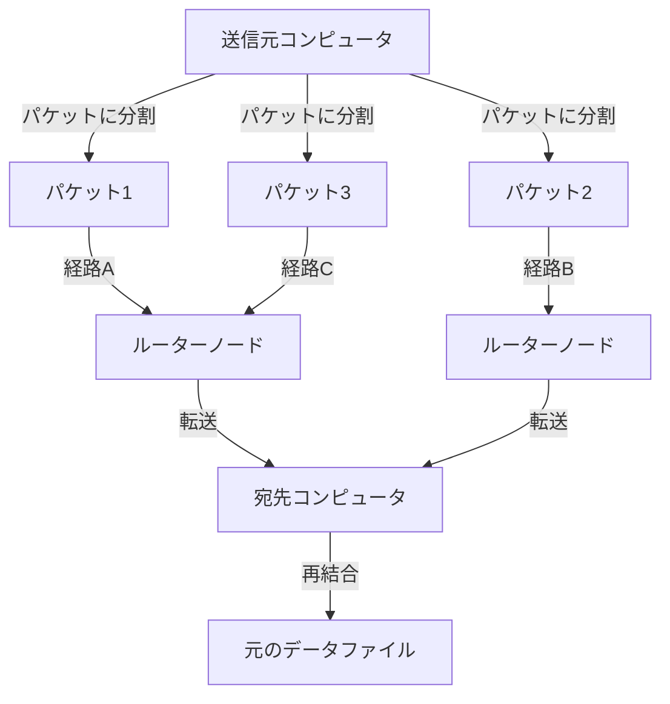
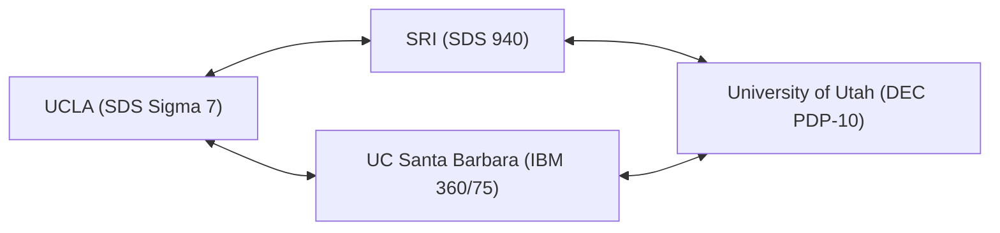

現代の私たちの生活において、インターネットは空気や水のように当たり前の存在となっています。スマートフォンをタップするだけで地球の裏側にあるサーバーと瞬時にデータをやり取りし、動画をストリーミングし、世界中の人々とリアルタイムでコミュニケーションを取ることができます。しかし、この巨大で複雑なグローバルネットワークは、ある日突然完成した形で現れたわけではありません。その起源を辿ると、冷戦という特異な時代背景の中、ひとつの野心的なプロジェクトへと行き着きます。それが「ARPANET（アーパネット）」です。

本記事では、インターネットの直接の祖先であるARPANETがどのようにして構想され、どのような技術的ブレイクスルーを経て構築され、そして現在の私たちが利用するインターネットへと進化していったのか、その詳細な歴史と技術的背景を深掘りしていきます。

## 1. 時代背景：スプートニク・ショックとARPAの設立

ARPANETの歴史を理解するためには、1950年代後半の冷戦の最中に時計の針を戻す必要があります。第二次世界大戦後、アメリカ合衆国とソビエト連邦は、宇宙開発から核兵器開発まで、あらゆる分野で熾烈な競争を繰り広げていました。

1957年10月4日、ソ連は人類初の人工衛星「スプートニク1号」の打ち上げに成功します。これはアメリカにとって単なる宇宙競争での敗北以上の意味を持っていました。「ソ連が宇宙空間からアメリカ本土を直接攻撃できる核ミサイル技術を確立した」という恐怖がアメリカ全土を覆いました。これが有名な「スプートニク・ショック」です。

この技術的劣勢を挽回するため、当時のドワイト・D・アイゼンハワー大統領は、アメリカ国防総省（DoD）内に最先端の科学技術を軍事応用するための研究機関を設立しました。それが「高等研究計画局（ARPA：Advanced Research Projects Agency）」です。ARPA（後のDARPA）は、既存の軍の枠組みにとらわれない柔軟な組織として、数々の革新的な研究に資金を提供することになります。

## 2. J・C・リックライダーと「銀河間コンピュータネットワーク」

1960年代初頭、ARPAには情報処理技術局（IPTO）が設立され、その初代局長に就任したのがJ・C・リックライダー（J.C.R. Licklider）でした。彼は音響心理学者からコンピュータ科学者へと転身した異色の経歴を持ち、「人間とコンピュータの共生（Man-Computer Symbiosis）」という画期的な論文を発表していました。

リックライダーは、当時のコンピュータが巨大な計算機（ナンバークランチャー）としてしか使われていないことに不満を抱き、コンピュータを人間の知的活動を拡張するためのインタラクティブなツールとして捉えていました。彼は、全米の研究機関に散らばるコンピュータを相互に接続し、研究者同士がデータやプログラム、さらにはアイデアを共有できるネットワークの構築を構想しました。彼はこの壮大なビジョンを、半ば冗談を交えて「銀河間コンピュータネットワーク（Intergalactic Computer Network）」と呼びました。

リックライダー自身はネットワークの具体的な技術設計を行う前にIPTOを去りましたが、彼のビジョンは後任のボブ・テイラーやローレンス・ロバーツといった優秀な科学者たちに引き継がれ、ARPANET開発の強力な原動力となりました。

## 3. パケット交換技術の誕生

ネットワークを構築する上で最大の技術的課題は、「いかにしてデータを効率的かつ確実に送受信するか」ということでした。当時の通信ネットワークの主流は、電話網で使われていた「回線交換方式」でした。これは、通信を行う2者間で専用の物理的な回線を占有する方式です。しかし、この方式はコンピュータ間の断続的なデータ通信（バーストトラフィック）には極めて非効率であり、また回線の一部が破壊されると通信全体が途絶してしまうという脆弱性がありました（軍事的な観点からも、核攻撃に耐えうる堅牢なネットワークが求められていました）。

この問題を解決するために、まったく新しい通信概念が同時多発的に考案されました。それが「パケット交換方式」です。

アメリカのランド研究所に所属していたポール・バランは、軍事通信の生存性を高めるために、データを細かく分割し、網の目状のネットワークを通じてそれぞれ別々の経路で転送する「分散型ネットワーク」の理論を構築しました。
一方、イギリスの国立物理学研究所（NPL）のドナルド・デイビースも独立して同様の概念に到達し、分割されたデータのまとまりを「パケット」と名付けました。さらに、マサチューセッツ工科大学（MIT）のレナード・クラインロックは、このデータ転送方式の効率性を数学的な待ち行列理論を用いて証明しました。

（図：パケット交換の基本概念）

パケット交換では、メッセージを一定サイズの「パケット」に分割し、それぞれに宛先情報を付与します。各パケットはネットワーク内を空いている経路を自律的に探しながら転送され、最終的な宛先で元のメッセージに再構築されます。これにより、通信回線の効率的な共有と、一部の障害に対する高い耐障害性が実現されました。

## 4. IMP（Interface Message Processor）の開発

ARPANETの設計責任者となったローレンス・ロバーツは、全米の異なる種類のメインフレームコンピュータを直接相互接続するのは技術的に困難であると判断しました。そこで彼は、ネットワークのルーティング処理を専門に行う小型のコンピュータを各拠点に配置し、メインフレームはその小型コンピュータとだけ通信を行うというアーキテクチャを考案しました。

この専用コンピュータは「IMP（Interface Message Processor）」と名付けられました。現代のインターネットにおける「ルーター」の原型です。

1968年、ARPAはIMPの開発に関する競争入札を実施し、マサチューセッツ州にあるコンサルティング会社BBNテクノロジーズ（Bolt Beranek and Newman）が落札しました。フランク・ハート率いるBBNのチームは、ハネウェル社のミニコンピュータ「DDP-516」を改造し、極めて短期間でIMPのハードウェアとソフトウェアを完成させるという驚異的なエンジニアリングの偉業を成し遂げました。

## 5. 1969年：ARPANETの初接続と歴史的な「LO」

1969年秋、最初のIMPがカリフォルニア大学ロサンゼルス校（UCLA）のレナード・クラインロックの研究室に納入されました。続いて、スタンフォード研究所（SRI）、カリフォルニア大学サンタバーバラ校（UCSB）、ユタ大学に次々とIMPが設置され、最初の4ノードが構成されました。

（図：1969年当時のARPANET最初の4ノード構成）

1969年10月29日午後10時30分、歴史的な瞬間が訪れます。UCLAの学生プログラマーであったチャーリー・クラインが、SRIのコンピュータにリモートログインを試みました。「LOGIN」という単語を送信する手順でした。

クラインは受話器越しにSRIの担当者と通話しながら、キーボードを叩きました。
「L」をタイプし、SRI側で受信を確認。
次に「O」をタイプし、SRI側で受信を確認。
そして「G」をタイプした瞬間……SRIのシステムがクラッシュしました。

結果として、ARPANETで初めて送信されたメッセージは「LO」（Lo and behold＝見よ、驚くべきことだ、の意に通じる）という象徴的な言葉となりました。システムはすぐに復旧され、数時間後には完全なリモートログインが成功しました。これが、世界を覆い尽くすサイバー空間の産声でした。

## 6. ネットワークの成長とTCP/IPの誕生

1970年代に入ると、ARPANETは急速に拡大し、アメリカ東海岸の研究機関や軍事施設も接続されるようになりました。1973年には人工衛星を経由してハワイやノルウェー、イギリスとも接続され、国際的なネットワークへと発展しました。

しかし、ARPANETの拡大に伴い、新たな問題が浮上しました。世界中にはARPANET以外にも、パケット無線網（PRNET）や衛星ネットワーク（SATNET）など、独自のプロトコルで動作する異なるネットワークが次々と構築されていました。これらの「異なるルールのネットワーク」同士をどのようにつなぐかが最大の課題となったのです。

この問題を解決し、「ネットワークのネットワーク（Internetwork）」を実現するために立ち上がったのが、ヴィントン・サーフとロバート・カーンです。彼らは1974年に画期的な論文を発表し、異なるネットワークをシームレスに相互接続するための共通言語、「TCP（Transmission Control Protocol）」を提案しました。後にTCPとIP（Internet Protocol）に分割されるこの通信プロトコル群こそが、現在のインターネットの基盤技術です。

TCP/IPは、データ転送の信頼性を担保する役割（TCP）と、宛先へのルーティングを行う役割（IP）を明確に分離した堅牢で拡張性の高い設計となっていました。

## 7. ARPANETの終焉とインターネットの夜明け

1983年1月1日（通称：フラッグ・デー）、ARPANETの標準プロトコルが従来のNCP（Network Control Program）からTCP/IPへと全面的に切り替えられました。この日をもって、ARPANETは真の意味での「インターネット」の一部へと変貌を遂げました。

同じ頃、軍事・防衛関連のノードはMILNETとして分離され、ARPANETは純粋な学術・研究用ネットワークとして運用が続けられました。その後、アメリカ国立科学財団（NSF）が構築したより高速なバックボーンネットワークであるNSFNETが台頭し、学術コミュニティの主流はそちらへと移行していきました。

そして1990年、その歴史的使命を終えたARPANETは正式に運用を終了し、解体されました。

## 8. ARPANETが遺したもの

ARPANETは20年という短い運用期間でしたが、その遺産は計り知れません。パケット交換技術、IMPを通じた分散ルーティング、リモートログイン（Telnet）、ファイル転送（FTP）、そして何より電子メール（E-mail）といった、現代社会に不可欠な通信インフラのプロトタイプはすべてARPANET上で誕生し、洗練されました。

「特定の中心を持たず、障害に強く、誰もが参加できる柔軟なネットワーク」というARPANETの根底に流れる哲学は、TCP/IPを通じて現在のインターネットにそのまま受け継がれています。冷戦期の国家安全保障という極限の要請から生まれ、数々の先見の明を持つ科学者たちの情熱とハッカー文化によって育まれたARPANET。それは単なる通信技術の歴史ではなく、人類が情報を共有し、知識を結合するための「新しい神経系」を獲得するまでの壮大なドラマなのです。
