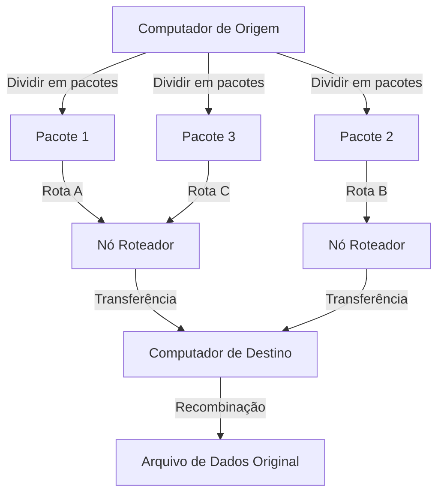
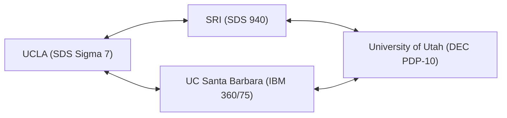

Em nossa vida moderna, a internet se tornou tão natural quanto o ar ou a água. Com um simples toque no smartphone, podemos trocar dados instantaneamente com servidores no outro lado do mundo, transmitir vídeos e nos comunicar em tempo real com pessoas de todo o planeta. No entanto, essa rede global enorme e complexa não surgiu de repente em sua forma completa. Rastrando suas origens, chegamos a um projeto ambicioso em meio ao contexto único da Guerra Fria. Essa é a "ARPANET".

Neste artigo, nos aprofundaremos na história detalhada e no contexto técnico de como a ARPANET, a ancestral direta da internet, foi concebida, os avanços tecnológicos pelos quais passou até ser construída, e como evoluiu para a internet que usamos hoje.

## 1. Contexto Histórico: O Choque do Sputnik e a Fundação da ARPA

Para entender a história da ARPANET, precisamos voltar no tempo até o auge da Guerra Fria no final dos anos 1950. Após a Segunda Guerra Mundial, os Estados Unidos e a União Soviética travavam uma competição acirrada em todas as frentes, da exploração espacial ao desenvolvimento de armas nucleares.

Em 4 de outubro de 1957, a União Soviética lançou com sucesso o "Sputnik 1", o primeiro satélite artificial da humanidade. Para os Estados Unidos, isso significou muito mais do que apenas uma derrota na corrida espacial. O medo de que "a União Soviética havia estabelecido tecnologia de mísseis nucleares capaz de atacar diretamente o território americano a partir do espaço" varreu os Estados Unidos. Este é o famoso "Choque do Sputnik".

Para reverter essa desvantagem tecnológica, o então presidente Dwight D. Eisenhower estabeleceu uma agência de pesquisa dentro do Departamento de Defesa dos EUA (DoD) para aplicar ciência e tecnologia de ponta em usos militares. Essa foi a "Agência de Projetos de Pesquisa Avançada" (ARPA: Advanced Research Projects Agency). A ARPA (mais tarde DARPA) financiaria inúmeras pesquisas inovadoras como uma organização flexível, não vinculada às estruturas militares existentes.

## 2. J.C.R. Licklider e a "Rede Intergaláctica de Computadores"

No início dos anos 1960, o Escritório de Técnicas de Processamento de Informação (IPTO) foi criado dentro da ARPA, e seu primeiro diretor foi J.C.R. Licklider. Ele tinha uma trajetória única, passando de psicoacústico a cientista da computação, e publicou um artigo inovador intitulado "Simbiose Homem-Computador" (Man-Computer Symbiosis).

Licklider estava insatisfeito com o fato de que os computadores da época eram usados apenas como gigantescas máquinas de calcular (number crunchers), e via os computadores como ferramentas interativas para expandir a atividade intelectual humana. Ele imaginou construir uma rede conectando computadores espalhados por instituições de pesquisa em todos os EUA, permitindo que os pesquisadores compartilhassem dados, programas e até ideias entre si. Ele meio brincando chamou essa grande visão de "Rede Intergaláctica de Computadores" (Intergalactic Computer Network).

O próprio Licklider deixou o IPTO antes de fazer o projeto técnico específico da rede, mas sua visão foi levada adiante por cientistas brilhantes como Bob Taylor e Lawrence Roberts, tornando-se a forte força motriz por trás do desenvolvimento da ARPANET.

## 3. O Nascimento da Tecnologia de Comutação de Pacotes

O maior desafio técnico na construção da rede era "como transmitir e receber dados de forma eficiente e confiável". A rede de comunicação predominante da época usava o método de "comutação de circuitos", usado nas redes telefônicas. Era um método no qual uma linha física dedicada era monopolizada entre duas partes que se comunicavam. No entanto, esse método era extremamente ineficiente para a comunicação intermitente de dados (tráfego de rajada) entre computadores, e tinha a vulnerabilidade de que se uma parte da linha fosse destruída, toda a comunicação era interrompida (de uma perspectiva militar, uma rede robusta que pudesse resistir a um ataque nuclear era necessária).

Para resolver este problema, um conceito de comunicação completamente novo foi concebido de forma simultânea e independente. Este foi o método de "comutação de pacotes".

Paul Baran, afiliado à RAND Corporation nos EUA, desenvolveu a teoria de uma "rede distribuída" que dividia os dados em pequenos pedaços e os transferia por diferentes rotas através de uma rede em forma de malha, a fim de aumentar a capacidade de sobrevivência das comunicações militares.
Enquanto isso, Donald Davies, do Laboratório Nacional de Física (NPL) no Reino Unido, chegou independentemente a um conceito semelhante e nomeou os blocos de dados divididos como "pacotes". Além disso, Leonard Kleinrock, do Instituto de Tecnologia de Massachusetts (MIT), provou matematicamente a eficiência deste método de transferência de dados usando a teoria das filas.

(Figura: Conceito básico de comutação de pacotes)

Na comutação de pacotes, a mensagem é dividida em "pacotes" de tamanho fixo, cada um com informações de destino anexadas. Cada pacote é transferido enquanto encontra rotas disponíveis na rede de forma autônoma, e é reconstruído na mensagem original no destino final. Isso alcançou o compartilhamento eficiente das linhas de comunicação e alta tolerância a falhas para algumas interrupções.

## 4. O Desenvolvimento do IMP (Interface Message Processor)

Lawrence Roberts, encarregado de projetar a ARPANET, determinou que seria tecnicamente difícil interconectar diretamente diferentes tipos de computadores mainframe em todos os EUA. Portanto, ele concebeu uma arquitetura onde pequenos computadores dedicados ao processamento de roteamento da rede seriam colocados em cada local, e os mainframes só se comunicariam com esses pequenos computadores.

Este computador dedicado foi nomeado "IMP (Interface Message Processor)". Ele é o protótipo do "roteador" da internet moderna.

Em 1968, a ARPA realizou uma licitação competitiva para o desenvolvimento do IMP, que foi vencida pela BBN Technologies (Bolt Beranek and Newman), uma empresa de consultoria em Massachusetts. A equipe da BBN, liderada por Frank Heart, modificou o minicomputador "DDP-516" da Honeywell e realizou uma surpreendente proeza de engenharia ao completar o hardware e software do IMP em um período de tempo extremamente curto.

## 5. 1969: A Primeira Conexão da ARPANET e o Histórico "LO"

No outono de 1969, o primeiro IMP foi entregue ao laboratório de Leonard Kleinrock na Universidade da Califórnia, Los Angeles (UCLA). Em seguida, os IMPs foram instalados em rápida sucessão no Stanford Research Institute (SRI), na Universidade da Califórnia, Santa Barbara (UCSB), e na Universidade de Utah, formando os quatro primeiros nós.

(Figura: Os primeiros 4 nós da ARPANET em 1969)

O momento histórico chegou às 22h30 do dia 29 de outubro de 1969. Charley Kline, um estudante de programação da UCLA, tentou fazer um login remoto no computador do SRI. O procedimento era enviar a palavra "LOGIN".

Kline digitou no teclado enquanto falava ao telefone com o contato do SRI.
Ele digitou "L", e o SRI confirmou o recebimento.
Em seguida, ele digitou "O", e o SRI confirmou o recebimento.
E no momento em que ele digitou "G"... o sistema do SRI travou.

Como resultado, a primeira mensagem enviada pela ARPANET foi a palavra icônica "LO" (uma abreviação de Lo and behold = Vejam só, maravilhem-se). O sistema foi rapidamente restaurado, e um login remoto completo foi bem-sucedido algumas horas depois. Este foi o nascimento do ciberespaço que envolveria o mundo inteiro.

## 6. O Crescimento da Rede e o Nascimento do TCP/IP

Entrando na década de 1970, a ARPANET se expandiu rapidamente, conectando instituições de pesquisa e instalações militares na costa leste dos Estados Unidos. Em 1973, também se conectou com o Havaí, Noruega e Reino Unido via satélite artificial, evoluindo para uma rede internacional.

No entanto, à medida que a ARPANET se expandia, surgia um novo problema. Em todo o mundo, além da ARPANET, diferentes redes operando com seus próprios protocolos, como a rede de rádio por pacotes (PRNET) e a rede de satélite (SATNET), estavam sendo construídas uma após a outra. O maior desafio tornouse como conectar essas "redes com regras diferentes" entre si.

Vinton Cerf e Robert Kahn deram um passo à frente para resolver esse problema e realizar a "rede de redes" (Internetwork). Em 1974, eles publicaram um artigo inovador propondo o "TCP (Transmission Control Protocol)", uma linguagem comum para interconectar diferentes redes de forma contínua. Essa suíte de protocolos de comunicação, que mais tarde seria dividida em TCP e IP (Internet Protocol), é a própria tecnologia base da internet de hoje.

O TCP/IP tinha um design robusto e altamente escalável que separava claramente a função de garantir a confiabilidade da transferência de dados (TCP) da função de roteamento para o destino (IP).

## 7. O Fim da ARPANET e o Amanhecer da Internet

Em 1º de janeiro de 1983 (conhecido como Flag Day), o protocolo padrão da ARPANET foi totalmente alterado do antigo NCP (Network Control Program) para o TCP/IP. A partir desse dia, a ARPANET se transformou em parte de uma verdadeira "internet".

Mais ou menos na mesma época, os nós relacionados aos militares e à defesa foram separados como MILNET, e a ARPANET continuou a operar puramente como uma rede acadêmica e de pesquisa. Mais tarde, a NSFNET, uma rede de backbone de alta velocidade construída pela Fundação Nacional da Ciência (NSF), ganhou destaque, e a corrente principal da comunidade acadêmica mudou para ela.

E em 1990, tendo cumprido sua missão histórica, a ARPANET encerrou oficialmente suas operações e foi desativada.

## 8. O Legado da ARPANET

Embora a ARPANET tenha estado operacional por um curto período de 20 anos, seu legado é imensurável. Os protótipos para infraestrutura de comunicação essencial da sociedade moderna — incluindo tecnologia de comutação de pacotes, roteamento distribuído através de IMPs, login remoto (Telnet), transferência de arquivos (FTP) e, acima de tudo, correio eletrônico (E-mail) — nasceram e foram refinados na ARPANET.

A filosofia subjacente da ARPANET de "uma rede flexível sem um centro específico, tolerante a falhas, onde todos podem participar" foi transmitida diretamente para a internet atual através do TCP/IP. Nascida da extrema exigência de segurança nacional durante a Guerra Fria, e nutrida pela paixão e cultura hacker de numerosos cientistas visionários, a ARPANET não é apenas uma história de tecnologia de comunicação, mas o drama épico de como a humanidade adquiriu um "novo sistema nervoso" para compartilhar informações e combinar conhecimentos.
