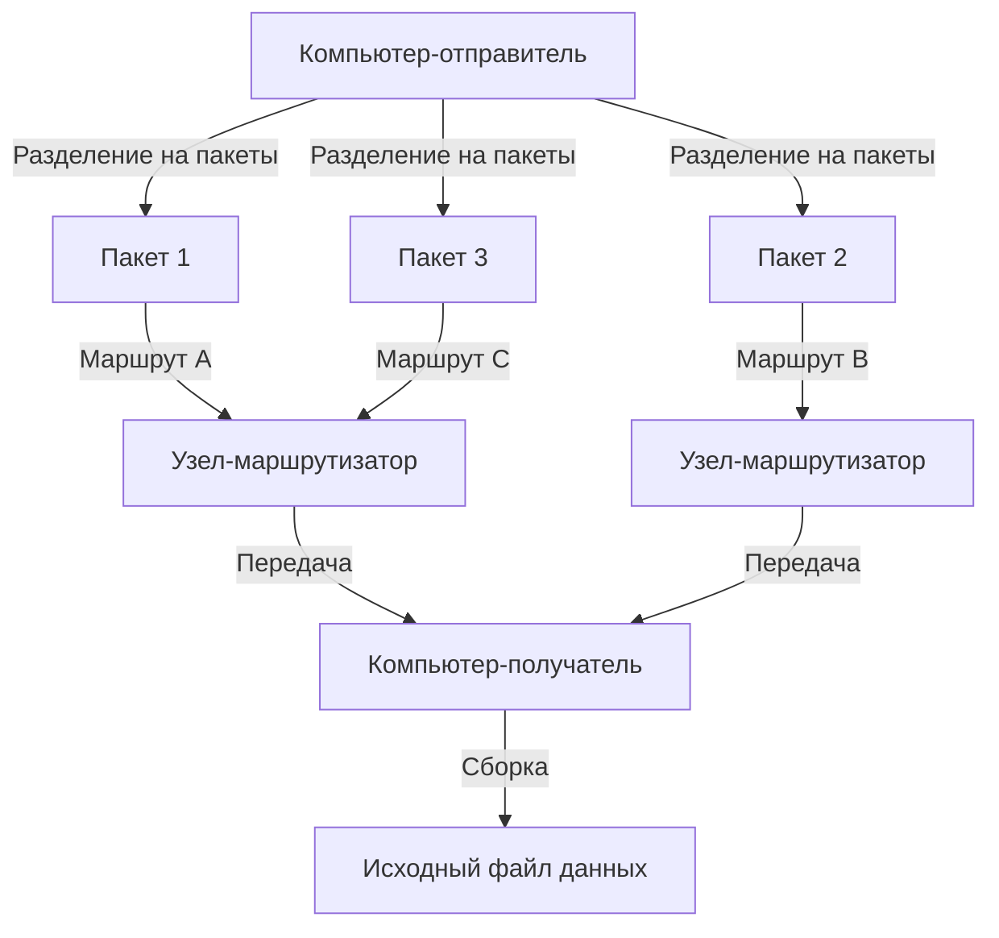
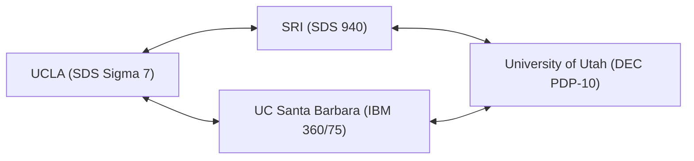

В нашей современной жизни Интернет стал таким же привычным явлением, как воздух или вода. Простым касанием смартфона мы можем мгновенно обмениваться данными с серверами на другом конце планеты, смотреть потоковое видео и общаться с людьми по всему миру в реальном времени. Однако эта огромная и сложная глобальная сеть не появилась в одночасье в уже готовом виде. Если проследить ее истоки, мы вернемся к специфическим условиям холодной войны и одному амбициозному проекту. Это был «ARPANET».

В этой статье мы подробно рассмотрим историю и технологические предпосылки того, как был задуман ARPANET — прямой предок Интернета, через какие технологические прорывы он прошел при создании и как эволюционировал в тот Интернет, которым мы пользуемся сегодня.

## 1. Исторический контекст: шок от запуска «Спутника» и создание ARPA

Чтобы понять историю ARPANET, необходимо вернуться в конец 1950-х годов, в самый разгар холодной войны. После Второй мировой войны Соединенные Штаты Америки и Советский Союз вели ожесточенную конкуренцию во всех сферах — от освоения космоса до разработки ядерного оружия.

4 октября 1957 года СССР успешно запустил первый в истории человечества искусственный спутник Земли — «Спутник-1». Для Америки это означало нечто большее, чем просто поражение в космической гонке. Всю Америку охватил страх: «СССР овладел технологией создания ядерных ракет, способных нанести прямой удар по территории США из космоса». Это событие вошло в историю как знаменитый «Спутниковый кризис» (Sputnik crisis).

Чтобы наверстать технологическое отставание, тогдашний президент Дуайт Эйзенхауэр создал в рамках Министерства обороны США (DoD) исследовательскую организацию по военному применению передовых научных технологий. Ей стало «Агентство передовых исследовательских проектов» (ARPA: Advanced Research Projects Agency). ARPA (позднее DARPA) стала гибкой организацией, не связанной традиционными военными рамками, которая финансировала множество инновационных исследований.

## 2. Дж. К. Ликлайдер и «Межгалактическая компьютерная сеть»

В начале 1960-х годов в составе ARPA было создано Бюро методов обработки информации (IPTO), и его первым директором стал Дж. К. Ликлайдер (J.C.R. Licklider). У него был необычный карьерный путь — от психоакустика до ученого-компьютерщика, и он опубликовал новаторскую статью под названием «Симбиоз человека и компьютера» (Man-Computer Symbiosis).

Ликлайдер был недоволен тем, что компьютеры того времени использовались лишь как гигантские вычислительные машины (number crunchers), и рассматривал их как интерактивные инструменты для расширения интеллектуальной деятельности человека. Он задумал создать сеть, которая соединила бы компьютеры, разбросанные по исследовательским институтам всей страны, чтобы исследователи могли делиться данными, программами и даже идеями. Полушутя он назвал это грандиозное видение «Межгалактической компьютерной сетью» (Intergalactic Computer Network).

Сам Ликлайдер покинул IPTO до того, как началась конкретная техническая разработка сети, но его идеи подхватили такие выдающиеся ученые, как Боб Тейлор и Лоуренс Робертс, ставшие мощной движущей силой в разработке ARPANET.

## 3. Рождение технологии коммутации пакетов

Самой большой технической проблемой при построении сети было то, «как эффективно и надежно передавать и получать данные». Основным направлением в сетях связи того времени была «коммутация каналов», использовавшаяся в телефонных сетях. При этом методе две общающиеся стороны занимают выделенную физическую линию. Однако этот метод был крайне неэффективен для прерывистой передачи данных (пульсирующего трафика) между компьютерами, а также имел уязвимость: при разрушении части линии связь обрывалась полностью (с военной точки зрения требовалась надежная сеть, способная выдержать ядерный удар).

Для решения этой проблемы была практически одновременно изобретена совершенно новая концепция связи. Ею стала «коммутация пакетов» (packet switching).

Пол Бэран (Paul Baran), работавший в американской корпорации RAND, для повышения живучести военных коммуникаций разработал теорию «распределенной сети», в которой данные разбиваются на мелкие части и передаются по разным маршрутам через сеть в виде паутины.
С другой стороны, Дональд Дэвис из британской Национальной физической лаборатории (NPL) независимо пришел к аналогичной концепции и назвал эти блоки разделенных данных «пакетами». Более того, Леонард Кляйнрок из Массачусетского технологического института (MIT) математически доказал эффективность этого метода передачи данных с использованием теории массового обслуживания (теории очередей).

（Рисунок: Базовая концепция коммутации пакетов）

При коммутации пакетов сообщение разбивается на «пакеты» определенного размера, каждому из которых присваивается информация о месте назначения. Каждый пакет передается, автономно находя свободный маршрут в сети, и на конечном пункте они собираются в исходное сообщение. Это позволило добиться эффективного совместного использования линий связи и высокой устойчивости к частичным сбоям в сети.

## 4. Разработка IMP (Interface Message Processor)

Лоуренс Робертс, возглавивший проектирование ARPANET, решил, что технически сложно напрямую соединить разные типы мэйнфреймов по всей территории США. Поэтому он придумал архитектуру, в которой в каждом узле размещается небольшой компьютер, специализированный на маршрутизации в сети, а мэйнфреймы обмениваются данными только с этими малыми компьютерами.

Этот специализированный компьютер получил название «IMP» (Interface Message Processor). Это прототип современного интернет-«маршрутизатора» (роутера).

В 1968 году ARPA провела конкурс на разработку IMP, который выиграла консалтинговая фирма BBN Technologies (Bolt Beranek and Newman) из Массачусетса. Команда BBN под руководством Фрэнка Харта (Frank Heart) совершила невероятный инженерный подвиг, за очень короткий срок разработав аппаратное и программное обеспечение для IMP путем модификации мини-компьютера Honeywell DDP-516.

## 5. 1969 год: Первое подключение ARPANET и историческое «LO»

Осенью 1969 года первый IMP был доставлен в лабораторию Леонарда Кляйнрока в Калифорнийском университете в Лос-Анджелесе (UCLA). Вслед за этим IMP были установлены в Стэнфордском исследовательском институте (SRI), Калифорнийском университете в Санта-Барбаре (UCSB) и Университете Юты, образовав первые 4 узла сети.

（Рисунок: Первоначальная конфигурация из 4 узлов ARPANET в 1969 году）

29 октября 1969 года в 22:30 наступил исторический момент. Чарли Клайн, студент-программист из UCLA, попытался удаленно войти в компьютер SRI. Процедура заключалась в отправке слова «LOGIN».

Клайн печатал на клавиатуре, разговаривая по телефону с оператором в SRI.
Он напечатал «L» и подтвердил получение на стороне SRI.
Затем напечатал «O» и подтвердил получение.
А в момент, когда он напечатал «G»... система SRI дала сбой (крашнулась).

В результате первым сообщением, отправленным по ARPANET, стало символичное слово «LO» (ассоциирующееся с выражением "Lo and behold" — «И о чудо», «Смотри-ка»). Система была быстро восстановлена, и через несколько часов состоялся успешный и полный удаленный вход. Это был первый крик зарождающегося киберпространства, которому предстояло охватить весь мир.

## 6. Рост сети и рождение TCP/IP

В начале 1970-х годов ARPANET стремительно расширялся, подключая исследовательские центры и военные объекты на Восточном побережье США. В 1973 году сеть через спутник соединилась с Гавайями, Норвегией и Великобританией, превратившись в международную.

Однако с расширением ARPANET возникла новая проблема. По всему миру строились другие сети, помимо ARPANET, такие как радиосеть с коммутацией пакетов (PRNET) и спутниковая сеть (SATNET), работающие по собственным протоколам. Главной задачей стало объединение этих «сетей с разными правилами».

Для решения этой проблемы и создания «сети сетей» (Internetwork) выступили Винтон Серф (Vinton Cerf) и Роберт Кан (Robert Kahn). В 1974 году они опубликовали прорывную статью, предложив общий язык для бесшовного соединения различных сетей — «TCP» (Transmission Control Protocol). Этот набор протоколов связи, впоследствии разделенный на TCP и IP (Internet Protocol), и является базовой технологией современного Интернета.

TCP/IP имел надежную и легко масштабируемую архитектуру, которая четко разделяла функции: обеспечение надежности передачи данных (TCP) и маршрутизацию к месту назначения (IP).

## 7. Конец ARPANET и рассвет Интернета

1 января 1983 года (так называемый «День флага» - Flag Day) стандартный протокол ARPANET был полностью переведен с прежнего NCP (Network Control Program) на TCP/IP. С этого дня ARPANET превратился в часть того, что в истинном смысле стало «Интернетом».

Примерно в то же время военные и оборонные узлы были выделены в сеть MILNET, а ARPANET продолжил функционировать как сугубо академическая и исследовательская сеть. Впоследствии появилась более скоростная магистральная сеть NSFNET, созданная Национальным научным фондом США (NSF), и основная масса академического сообщества перешла туда.

В 1990 году, выполнив свою историческую миссию, ARPANET был официально выведен из эксплуатации и расформирован.

## 8. Наследие ARPANET

Хотя период эксплуатации ARPANET составил всего 20 лет, его наследие неисчислимо. Коммутация пакетов, распределенная маршрутизация через IMP, удаленный вход (Telnet), передача файлов (FTP) и, что не менее важно, электронная почта (E-mail) — прототипы всех этих телекоммуникационных инфраструктур, без которых невозможно представить современное общество, родились и совершенствовались в ARPANET.

Заложенная в ARPANET философия «гибкой сети, не имеющей определенного центра, устойчивой к сбоям и открытой для всех», через TCP/IP перешла в современный Интернет в неизменном виде. ARPANET был рожден экстремальными требованиями национальной безопасности времен холодной войны и взращен энтузиазмом прозорливых ученых и хакерской культурой. Это не просто история коммуникационных технологий, но грандиозная драма о том, как человечество обретало «новую нервную систему» для обмена информацией и объединения знаний.
