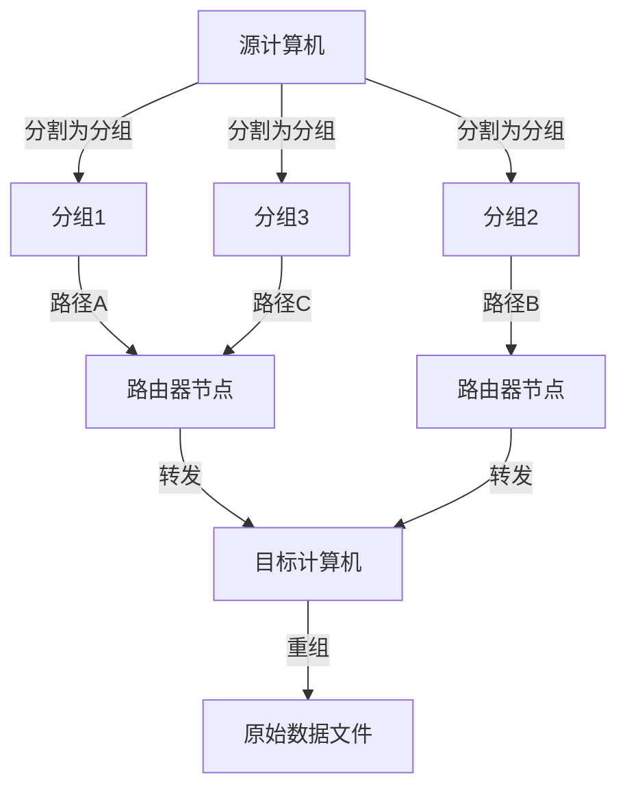
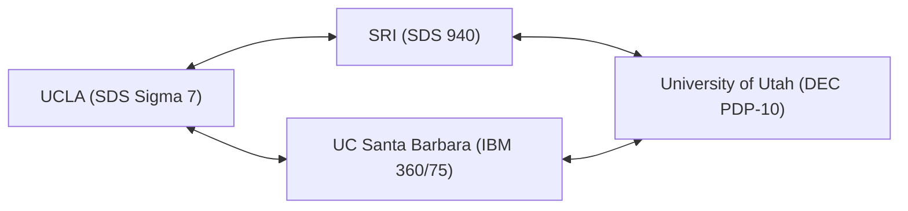

现代的我们的生活中，互联网已经像空气和水一样成为理所当然的存在。只需轻触智能手机，就能瞬间与地球另一端的服务器交换数据，流媒体播放视频，与全世界的人们实时交流。然而，这个巨大而复杂的全球网络，并不是某天突然以完整的形态出现的。追溯其起源，在冷战这一特殊的时代背景下，我们会找到一个雄心勃勃的项目。那就是“ARPANET（阿帕网）”。

本文将详细探讨互联网的直接祖先ARPANET是如何被构想出来的，经历了怎样的技术突破才得以建立，以及它是如何进化成我们现在使用的互联网的，深入挖掘其详细的历史和技术背景。

## 1. 时代背景：斯普特尼克危机与ARPA的设立

要理解ARPANET的历史，我们需要将时钟拨回20世纪50年代后期冷战最激烈的时期。第二次世界大战后，美利坚合众国与苏联在从太空开发到核武器开发的各个领域展开了激烈的竞争。

1957年10月4日，苏联成功发射了人类第一颗人造卫星“斯普特尼克1号”。对美国而言，这不仅仅意味着在太空竞赛中失败。“苏联已经掌握了能从太空直接对美国本土发动攻击的核导弹技术”，这种恐惧笼罩了整个美国。这就是著名的“斯普特尼克危机”。

为了扭转这种技术上的劣势，当时的德怀特·D·艾森豪威尔总统在美国国防部（DoD）内部设立了一个旨在将最先进的科学技术应用于军事的研究机构。这就是“高级研究计划局（ARPA：Advanced Research Projects Agency）”。ARPA（后来的DARPA）作为一个不受现有军队框架限制的灵活组织，将为众多创新性研究提供资金。

## 2. J.C.R.利克莱德与“星际计算机网络”

20世纪60年代初，ARPA成立了信息处理技术办公室（IPTO），J.C.R.利克莱德（J.C.R. Licklider）就任其首任主任。他拥有从声学心理学家转行为计算机科学家的独特经历，并发表了一篇名为《人机共生（Man-Computer Symbiosis）》的划时代论文。

利克莱德对当时的计算机仅仅被用作巨大的计算器（数字粉碎机）感到不满，他将计算机视为扩展人类智力活动的交互式工具。他构想建立一个网络，将散布在全美研究机构中的计算机相互连接起来，使研究人员能够共享数据、程序甚至是想法。他半开玩笑地将这个宏大的愿景称为“星际计算机网络（Intergalactic Computer Network）”。

虽然利克莱德在进行网络的具体技术设计之前就离开了IPTO，但他的愿景被继任的鲍勃·泰勒（Bob Taylor）和劳伦斯·罗伯茨（Lawrence Roberts）等优秀的科学家们继承，成为了开发ARPANET的强大原动力。

## 3. 分组交换技术的诞生

在构建网络时，最大的技术挑战是“如何高效且可靠地发送和接收数据”。当时通信网络的主流是电话网中使用的“电路交换方式”。这是一种在进行通信的双方之间独占专用物理线路的方式。然而，这种方式对于计算机之间断断续续的数据通信（突发流量）来说效率极低，而且如果线路的一部分被破坏，整个通信就会中断，存在这样的脆弱性（从军事角度来看，也需要一个能够承受核打击的坚固网络）。

为了解决这个问题，一种全新的通信概念在多地同时被构想出来。那就是“分组交换（Packet Switching）方式”。

隶属于美国兰德公司（RAND Corporation）的保罗·巴兰（Paul Baran），为了提高军事通信的生存能力，构建了“分布式网络”理论，将数据分割成小块，通过网状网络分别经由不同的路径进行传输。
另一方面，英国国家物理实验室（NPL）的唐纳德·戴维斯（Donald Davies）也独立地得出了类似的概念，并将被分割的数据块命名为“分组（Packet）”。此外，麻省理工学院（MIT）的伦纳德·克莱因罗克（Leonard Kleinrock）运用数学上的排队论，证明了这种数据传输方式的效率。

（图：分组交换的基本概念）

在分组交换中，消息被分割成固定大小的“分组”，并为每个分组附加目标地址信息。每个分组在网络中自主寻找空闲路径进行转发，最终在目的地被重新组合成原始消息。由此，实现了通信线路的高效共享以及对局部故障的高容错性。

## 4. IMP（接口消息处理器）的开发

成为ARPANET设计负责人的劳伦斯·罗伯茨判断，直接将全美种类不同的大型计算机（Mainframe）相互连接在技术上存在困难。因此，他构想出一种架构：在各个节点配置专门进行网络路由处理的小型计算机，大型计算机只与该小型计算机进行通信。

这种专用计算机被命名为“IMP（Interface Message Processor，接口消息处理器）”。它是现代互联网中“路由器”的原型。

1968年，ARPA就IMP的开发进行了竞争性招标，位于马萨诸塞州的咨询公司BBN Technologies（Bolt Beranek and Newman）中标。由弗兰克·哈特（Frank Heart）率领的BBN团队改造了霍尼韦尔（Honeywell）公司的微型计算机“DDP-516”，在极短的时间内完成了IMP的硬件和软件，完成了一项惊人的工程壮举。

## 5. 1969年：ARPANET的首次连接与历史性的“LO”

1969年秋天，第一台IMP被交付给加州大学洛杉矶分校（UCLA）伦纳德·克莱因罗克的实验室。紧接着，斯坦福研究院（SRI）、加州大学圣巴巴拉分校（UCSB）和犹他大学也相继安装了IMP，组成了最初的4个节点。

（图：1969年当时ARPANET最初的4个节点构成）

1969年10月29日晚上10点30分，历史性的时刻到来了。UCLA的学生程序员查理·克莱恩（Charley Kline）尝试远程登录SRI的计算机。步骤是发送“LOGIN”这个单词。

克莱恩一边通过电话听筒与SRI的负责人通话，一边敲击键盘。
输入“L”，SRI方面确认收到。
接着输入“O”，SRI方面确认收到。
然而，就在输入“G”的瞬间……SRI的系统崩溃了。

结果，在ARPANET上发送的第一条消息成了“LO”（与“Lo and behold”——意为“看哪，真令人惊奇”相呼应）这样一个具有象征意义的词汇。系统很快恢复，几个小时后，完整的远程登录成功了。这就是席卷全球的网络空间的初啼。

## 6. 网络的成长与TCP/IP的诞生

进入20世纪70年代，ARPANET迅速扩张，美国东海岸的研究机构和军事设施也开始接入。1973年，通过人造卫星，网络连接到了夏威夷、挪威和英国，发展成为一个国际性的网络。

然而，随着ARPANET的扩张，新的问题浮出水面。世界上除了ARPANET之外，分组无线网（PRNET）和卫星网络（SATNET）等运行在各自独立协议上的不同网络也相继建立起来。如何将这些“规则不同的网络”连接在一起成为了最大的课题。

为了解决这个问题，实现“网络的网络（Internetwork）”，温顿·瑟夫（Vinton Cerf）和罗伯特·卡恩（Robert Kahn）挺身而出。他们在1974年发表了一篇划时代的论文，提出了一种无缝互联不同网络的通用语言——“TCP（传输控制协议）”。后来被分为TCP和IP（网际协议）的这一通信协议群，正是当前互联网的基础技术。

TCP/IP采用了一种稳健且高扩展性的设计，明确分离了确保数据传输可靠性的职责（TCP）和负责路由到目的地的职责（IP）。

## 7. ARPANET的终结与互联网的黎明

1983年1月1日（俗称：国旗日，Flag Day），ARPANET的标准协议从传统的NCP（Network Control Program）全面切换到了TCP/IP。从这一天起，ARPANET真正转变成为了“互联网”的一部分。

同一时期，与军事和国防相关的节点被分离出来作为MILNET，而ARPANET则继续作为纯粹的学术和研究网络运行。此后，美国国家科学基金会（NSF）建立的更高速度的主干网络NSFNET崛起，学术界的主流开始向其转移。

最终在1990年，完成了其历史使命的ARPANET正式停止运行并被解散。

## 8. ARPANET留下的遗产

虽然ARPANET的运行时间只有短短的20年，但其遗产不可估量。分组交换技术、通过IMP实现的分布式路由、远程登录（Telnet）、文件传输（FTP），以及最重要的电子邮件（E-mail）等现代社会不可或缺的通信基础设施的原型，都是在ARPANET上诞生并不断完善的。

ARPANET所蕴含的“没有特定的中心、抗故障能力强、任何人都能参与的灵活网络”的理念，通过TCP/IP原封不动地传承到了现在的互联网中。诞生于冷战时期国家安全保障这一极限要求之下，由众多具有先见之明的科学家的热情和黑客文化共同孕育而成的ARPANET。这不仅仅是通信技术的历史，更是人类为共享信息、连接知识而获得“新神经系统”的一部波澜壮阔的史诗。
