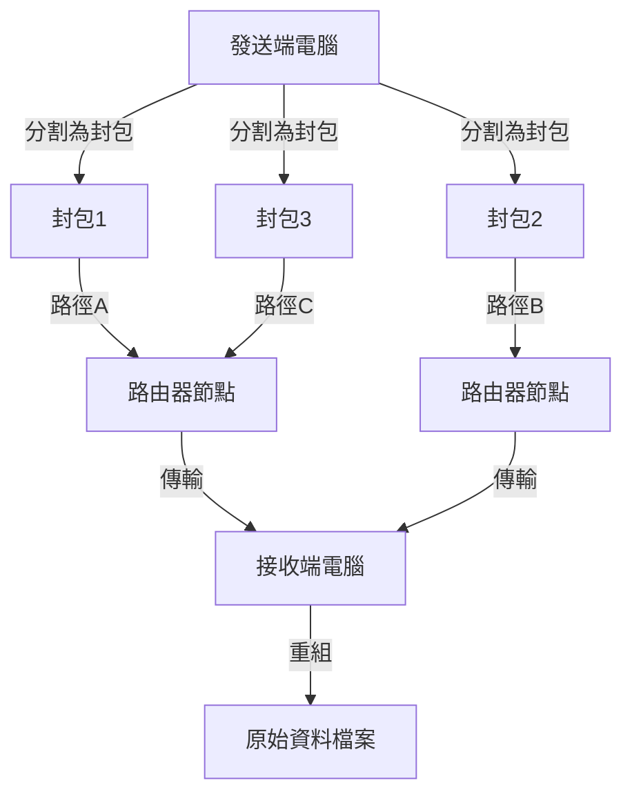
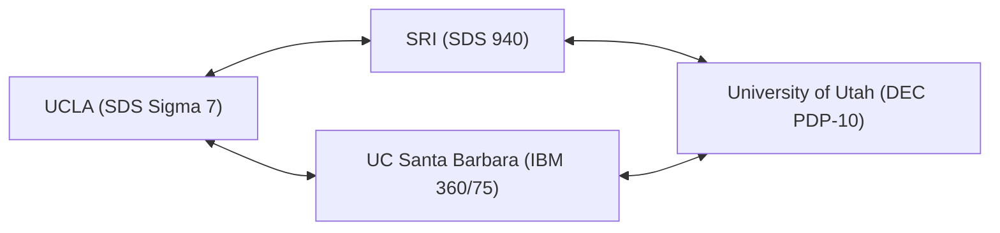

在我們現代的生活中，網際網路已經成為像空氣和水一樣理所當然的存在。只需輕觸智慧型手機，就能瞬間與地球另一端的伺服器交換資料、串流影片，並與世界各地的人們進行即時通訊。然而，這個龐大且複雜的全球網路，並不是某天突然以完整的形態出現的。追溯其起源，在冷戰這個特殊的時代背景下，一切源於一個充滿野心的計畫。那就是「ARPANET」。

本文將深入探討網際網路的直接祖先 ARPANET 是如何被構想出來、經歷了哪些技術突破而建立，以及如何演變成我們現在所使用的網際網路，詳細解析其歷史與技術背景。

## 1. 時代背景：史普尼克危機與 ARPA 的設立

要了解 ARPANET 的歷史，必須將時鐘撥回 1950 年代末期的冷戰時期。第二次世界大戰後，美國和蘇聯在從太空探索到核武開發的各個領域展開了激烈的競爭。

1957 年 10 月 4 日，蘇聯成功發射了人類史上第一顆人造衛星「史普尼克 1 號（Sputnik 1）」。對美國而言，這不僅僅是在太空競賽中的失敗，更意味著「蘇聯已經掌握了從太空直接攻擊美國本土的核子飛彈技術」，這種恐懼籠罩了全美。這就是著名的「史普尼克危機（Sputnik shock）」。

為了挽回這種技術上的劣勢，當時的美國總統德懷特·D·艾森豪在國防部（DoD）內設立了一個致力於將最先進科學技術應用於軍事的研發機構。這就是「高等研究計劃署（ARPA：Advanced Research Projects Agency）」。ARPA（即後來的 DARPA）作為一個不受現有軍隊框架限制的靈活組織，開始為許多創新研究提供資金。

## 2. J.C. licklider 與「星際電腦網路」

1960 年代初期，ARPA 設立了資訊處理技術辦公室（IPTO），其首任主任是 J.C. 利克萊德（J.C.R. Licklider）。他擁有從聲學心理學家轉型為電腦科學家的獨特背景，並發表了一篇名為《人機共生（Man-Computer Symbiosis）》的劃時代論文。

利克萊德對當時電腦僅被用作巨型計算機（Number cruncher）感到不滿，他將電腦視為擴展人類智力活動的互動工具。他構想建立一個網路，將分散在全美研究機構的電腦相互連接起來，讓研究人員可以分享資料、程式甚至是想法。他半開玩笑地將這個宏偉的願景稱為「星際電腦網路（Intergalactic Computer Network）」。

儘管利克萊德在進行網路的具體技術設計之前就離開了 IPTO，但他的願景被接任的鮑勃·泰勒（Bob Taylor）和勞倫斯·羅伯茲（Lawrence Roberts）等優秀科學家所繼承，成為了 ARPANET 開發的強大原動力。

## 3. 封包交換技術的誕生

在建構網路時最大的技術挑戰是「如何高效且確實地傳送和接收資料」。當時通訊網路的主流是電話網所使用的「電路交換（Circuit switching）」方式。這是一種在通訊雙方之間佔用專用實體線路的方式。然而，這種方式對於電腦間斷斷續續的資料通訊（突發流量）極度缺乏效率，而且一旦線路的一部分被破壞，整個通訊就會中斷，存在著脆弱性（從軍事角度來看，也需要一個能夠承受核打擊的堅固網路）。

為了解決這個問題，一種全新的通訊概念幾乎在同一時間被多方提出。這就是「封包交換（Packet switching）」方式。

隸屬於美國蘭德公司（RAND Corporation）的保羅·巴蘭（Paul Baran），為了提高軍事通訊的生存能力，建構了將資料細分，並透過網狀網路分別從不同路徑傳輸的「分散式網路」理論。
另一方面，英國國家物理實驗室（NPL）的唐納德·戴維斯（Donald Davies）也獨立得出類似的概念，並將分割後的資料區塊命名為「封包（Packet）」。此外，麻省理工學院（MIT）的倫納德·克萊因羅克（Leonard Kleinrock）利用數學上的排隊理論（Queueing theory）證明了這種資料傳輸方式的效率。

（圖：封包交換的基本概念）

在封包交換中，訊息被分割成固定大小的「封包」，並在每個封包上附加目的地位址資訊。各個封包在網路中自主尋找空閒路徑進行傳輸，最終在目的地重新組合成原始訊息。這不僅實現了通訊線路的高效共享，也對部分故障具有極高的容錯能力。

## 4. IMP（Interface Message Processor）的開發

成為 ARPANET 設計負責人的勞倫斯·羅伯茲判斷，要直接將全美不同類型的大型電腦相互連接在技術上是非常困難的。因此，他設計了一種架構：在各個據點配置專門處理網路路由的小型電腦，大型電腦只與這台小型電腦進行通訊。

這台專用電腦被命名為「IMP（Interface Message Processor）」。它就是現代網際網路中「路由器」的原型。

1968 年，ARPA 針對 IMP 的開發進行了競標，由位於麻薩諸塞州的顧問公司 BBN 科技（Bolt Beranek and Newman）得標。由法蘭克·哈特（Frank Heart）領導的 BBN 團隊，改造了漢威聯合（Honeywell）的迷你電腦「DDP-516」，在極短的時間內完成了 IMP 的硬體和軟體，完成了一項驚人的工程壯舉。

## 5. 1969年：ARPANET 的初次連線與歷史性的「LO」

1969 年秋天，第一台 IMP 被送到加州大學洛杉磯分校（UCLA）倫納德·克萊因羅克的實驗室。緊接著，史丹佛研究院（SRI）、加州大學聖塔芭芭拉分校（UCSB）和猶他大學也陸續安裝了 IMP，組成了最初的 4 個節點。

（圖：1969年當時 ARPANET 最初的 4 個節點架構）

1969 年 10 月 29 日晚上 10 點 30 分，歷史性的時刻到來。UCLA 的學生程式設計師查理·克萊恩（Charley Kline）嘗試遠端登入 SRI 的電腦。程序是發送「LOGIN」這個單字。

克萊恩透過電話與 SRI 的人員通話，同時敲擊鍵盤。
輸入「L」，SRI 端確認收到。
接著輸入「O」，SRI 端確認收到。
然後就在輸入「G」的瞬間……SRI 的系統崩潰了。

結果，ARPANET 首次發送的訊息成了「LO」（與 Lo and behold＝看哪，多麼令人驚訝 的意思相通）這樣一個具有象徵意義的詞彙。系統很快就恢復了，幾個小時後，完整的遠端登入宣告成功。這就是後來覆蓋全球的網路空間的初啼。

## 6. 網路的成長與 TCP/IP 的誕生

進入 1970 年代，ARPANET 迅速擴張，美國東海岸的研究機構和軍事設施也紛紛連上網路。1973 年更透過人造衛星與夏威夷、挪威和英國連接，發展成為一個國際性的網路。

然而，隨著 ARPANET 的擴張，出現了新的問題。世界上除了 ARPANET 之外，封包無線網路（PRNET）和衛星網路（SATNET）等以獨特協定運作的各種網路也陸續被建立起來。如何將這些「規則不同的網路」相互連接，成為了最大的課題。

為了解決這個問題，實現「網路的網路（Internetwork）」，文頓·瑟夫（Vinton Cerf）和羅伯特·卡恩（Robert Kahn）挺身而出。他們在 1974 年發表了一篇突破性的論文，提出了一個無縫連接不同網路的共通語言：「TCP（Transmission Control Protocol，傳輸控制協定）」。這個後來被分為 TCP 和 IP（Internet Protocol，網際網路協定）的通訊協定群，正是現在網際網路的基礎技術。

TCP/IP 採用了堅固且具備高擴充性的設計，明確分離了確保資料傳輸可靠性的角色（TCP）和負責路由至目的地的角色（IP）。

## 7. ARPANET 的終結與網際網路的黎明

1983 年 1 月 1 日（俗稱：國旗日 Flag Day），ARPANET 的標準協定從傳統的 NCP（Network Control Program）全面轉換為 TCP/IP。從這一天起，ARPANET 蛻變為真正意義上的「網際網路」的一部分。

大約在同一時期，與軍事和國防相關的節點被分離為 MILNET，而 ARPANET 則作為純粹的學術和研究網路繼續運作。之後，由美國國家科學基金會（NSF）建構的高速骨幹網路 NSFNET 崛起，學術界的主流逐漸轉移到那裡。

最終在 1990 年，完成了其歷史使命的 ARPANET 正式停止運作並被解散。

## 8. ARPANET 留下的遺產

ARPANET 雖然只有短短 20 年的運作期間，但其留下的遺產卻是無法估量的。封包交換技術、透過 IMP 進行的分散式路由、遠端登入（Telnet）、檔案傳輸（FTP），以及最重要的電子郵件（E-mail），這些現代社會不可或缺的通訊基礎設施的原型，全都是在 ARPANET 上誕生並不斷完善的。

「沒有特定的中心、具備抗災能力、任何人都能參與的靈活網路」——ARPANET 根深蒂固的理念，透過 TCP/IP 原封不動地傳承給了現代的網際網路。它誕生於冷戰時期國家安全保障的極限需求之中，由眾多具有先見之明的科學家的熱情和駭客文化所孕育。這不僅僅是通訊技術的歷史，更是人類為共享資訊、結合知識而獲得「新神經系統」的宏大史詩。
