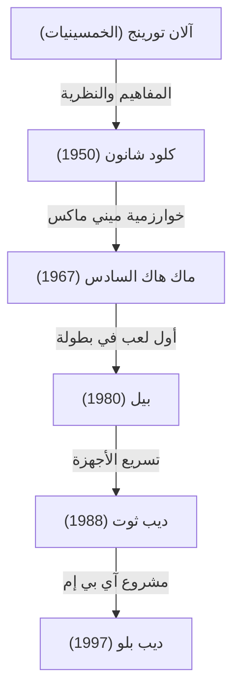
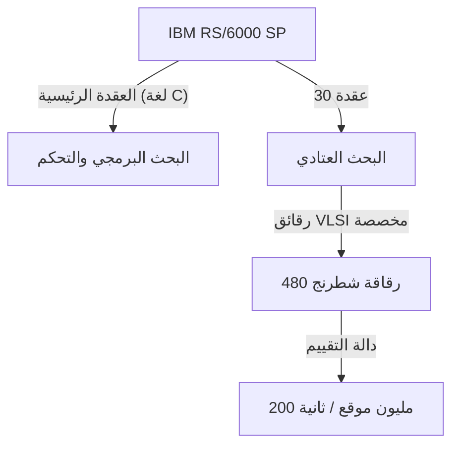

## مقدمة: عام 1997، البشرية تواجه "ذكاءً مجهولاً"

في 11 مايو 1997، أُقيمت مباراة شطرنج في مركز إكويتابل (Equitable Center) في نيويورك تُذكر كنقطة تفرد في تاريخ البشرية. هُزم غاري كاسباروف (Garry Kasparov)، بطل العالم في الشطرنج آنذاك والذي أُشيد به كـ "أقوى لاعب في التاريخ"، أمام الحاسوب الخارق "ديب بلو" (Deep Blue) الذي طورته شركة آي بي إم (IBM).

تجاوز هذا الحدث مجرد الفوز أو الخسارة في لعبة لوحية، ليصبح علامة فارقة قوية في السؤال الفلسفي الطويل: "هل سيأتي اليوم الذي تتجاوز فيه الآلات ذكاء الإنسان؟". في هذا المقال، سنتعمق في تاريخ شطرنج الحواسيب الذي أدى إلى هذه المباراة في عام 1997، ومسار العملاق كاسباروف، والخلفية التقنية لـ ديب بلو، وتفاصيل المواجهة السداسية الأسطورية، لنستكشف المعنى الذي حمله هذا الحدث في تاريخ الذكاء الاصطناعي (AI).

## فجر شطرنج الحواسيب: من تورينج إلى ديب بلو

كانت فكرة جعل الحواسيب تلعب الشطرنج موجودة منذ فجر علوم الحاسوب. اعتبر رواد مثل آلان تورينج (Alan Turing) وكلود شانون (Claude Shannon) الشطرنج "ساحة اختبار مثالية لمحاكاة وفهم عملية التفكير البشري".

في الخمسينيات من القرن الماضي، نشر كلود شانون ورقة بحثية بارزة حول برامج الشطرنج، وأرسى أسس [خوارزميات البحث](/ar/p/search-algorithms-linear-binary-hash-table-principles/) القائمة على طريقة ميني ماكس (Minimax). لاحقاً، من السبعينيات إلى الثمانينيات، بدأت تظهر آلات مجهزة بأجهزة مخصصة للشطرنج. استخدمت آلة "بيل" (Belle) التابعة لمختبرات بيل دوائر متخصصة للبحث في عشرات الآلاف من المواقف في الثانية، متفاخرة بقوة مستوى الأساتذة.

وبعد ذلك، أصبحت "ديب ثوت" (Deep Thought)، التي طورها طلاب في جامعة كارنيجي ميلون، أول حاسوب يهزم أستاذاً كبيراً (Grandmaster). تولت شركة آي بي إم هذا المشروع، واستثمرت أموالاً طائلة وأرقى الهندسات لإنشاء "ديب بلو".

## بنية تحفة آي بي إم "ديب بلو"

كان ديب بلو بلورة لأحدث تقنيات الحوسبة المتوازية في ذلك الوقت. تم بناؤه على أساس الحاسوب الخارق العام "IBM RS/6000 SP"، وتم تزويده بعدد كبير من رقائق VLSI المصممة خصيصاً للشطرنج.

الميزة الأكبر كانت في قوة الحوسبة الساحقة، حيث يمكنه البحث في عدد هائل يصل إلى **200 مليون حركة (200 مليون موقف) في الثانية**، وهو ما يُعرف بـ "القوة الغاشمة" (Brute-force search). بينما يقرأ اللاعب البشري من بضع حركات إلى عشرات الحركات فقط في الثانية (لكنه يضيق الخيارات الواعدة بحدس عالٍ)، اتبع ديب بلو نهج حساب كل الاحتمالات تماماً مثل القصف السجادي. بالإضافة إلى ذلك، انضم أساتذة كبار في الشطرنج، مثل جويل بنجامين (Joel Benjamin)، إلى فريق التطوير لضبط دوال تقييم المواقف (خوارزميات تحدد كمياً أفضلية أو سوء المواقف) بشكل مكثف.

## أقوى بطل في التاريخ، غاري كاسباروف

على الجانب الآخر، غاري كاسباروف هو عبقري مطلق أصبح بطل العالم في سن مبكرة قياسية (22 عاماً)، واحتفظ بالعرش لمدة 15 عاماً متتالية. كان أسلوب لعبه هجومياً للغاية، متمرساً في القراءة العميقة، والحدس المتميز، والحرب النفسية التي تضع ضغطاً هائلاً على الخصوم.

حتى ذلك الحين، كان يقاتل على قدم المساواة أو أكثر ضد أي حاسوب، وكان مقتنعاً بأن الآلة لن تهزم إنساناً (على الأقل طوال حياته). حتى في أول مباراة له ضد ديب بلو في عام 1996 (في فيلادلفيا)، على الرغم من خسارته اللعبة الأولى، فقد فاز في النهاية بـ 3 انتصارات وخسارة واحدة وتعادلين. في ذلك الوقت، أعلن كاسباروف: "لا يمكن للآلات أبداً أن تهزم الذكاء والحدس البشري الحقيقي".

## 1997: مباراة العودة المصيرية (نيويورك)

بعد هزيمة عام 1996، قام فريق تطوير آي بي إم (بما في ذلك فنغ هسيونغ هسو، وموراي كامبل، وآخرون) بتحسين ديب بلو بشكل جذري. ضاعفوا سرعة الحساب، وضبطوا دالة التقييم لتكون أكثر مرونة وأقرب إلى البشر، وجعلوه يتعلم كل مباريات كاسباروف السابقة. صعدت هذه النسخة الجديدة، التي أُطلق عليها أيضاً اسم "ديبر بلو" (Deeper Blue)، إلى مسرح مباراة العودة في مايو 1997.

### اللعبة الأولى: فوز متوقع لكاسباروف
في اللعبة الأولى، التزم كاسباروف بأسلوبه، ودفع المباراة إلى مواقف معقدة وحقق الفوز. على الرغم من أن ديب بلو كان متفوقاً في القوة الحسابية، بدا وكأنه لا يفهم الاستراتيجية طويلة المدى والدقائق التفصيلية للمواقف. اعتقد الجميع، "ستنتهي هذه المرة أيضاً بفوز كاسباروف".

### اللعبة الثانية: الحركة 44 المشبوهة واضطراب كاسباروف
كانت اللعبة الثانية نقطة تحول في التاريخ. هنا، قام ديب بلو بحركة "بشرية" وتؤكد على "الميزة الموقعية طويلة المدى"، وهو أمر لم تفعله الحواسيب التقليدية أبداً. على وجه الخصوص، كانت حركته الـ 44 استراتيجية متطورة للغاية، حيث تخلى عن مكسب مادي فوري (فرصة لأخذ قطعة) من أجل القضاء تماماً على أي فرصة لهجوم مضاد من الخصم.

اهتز كاسباروف بشدة من هذه الحركة. صرح لاحقاً، "شعرت بذكاء بشري متفوق على الجانب الآخر من الرقعة". في حالة ذعر، استسلم كاسباروف في الحركة 45، على الرغم من أنه كان لا يزال هناك احتمال لفرض التعادل. أدت هذه الهزيمة إلى إثارة شكوك لدى كاسباروف بأن "آي بي إم ربما كانت تجعل أساتذة الشطرنج البشريين يتدخلون أثناء المباراة"، ودُفع نفسياً إلى زاوية عميقة.

### الألعاب من 3 إلى 5: تعادلات تحبس الأنفاس
من اللعبة الثالثة إلى الخامسة، حاول كاسباروف تحييد القوة الحسابية لـ ديب بلو من خلال تجنب الفوضى التكتيكية التي تتفوق فيها الحواسيب، وجلب المباريات إلى معارك استراتيجية طويلة المدى (مواقف مغلقة). ونتيجة لذلك، انتهت جميعها بالتعادل. كانت النتيجة تعادلاً 2.5 إلى 2.5. تُرِك كل شيء للعبة السادسة النهائية.

### اللعبة السادسة: انهيار البطل (11 مايو)
اللعبة السادسة المصيرية. اختار كاسباروف اللعب بالقطع السوداء والدفاع بـ (Caro-Kann Defense). ومع ذلك، في الافتتاح، انحرف عن النظريات المعروفة ولعب حركة يمكن اعتبارها مقامرة. كان هذا تكتيكاً لإرباك قاعدة بيانات الافتتاحيات الخاصة بـ ديب بلو، لكن هذا اتضح أنه خطأ قاتل.

شن ديب بلو هجوماً قوياً على الفور بالتضحية بحصان (Knight Sacrifice). في شطرنج الحواسيب، كانت هذه "حركة لا يتم اختيارها عادةً لأن التقييم ينخفض مؤقتاً"، لكن ديب بلو المحسن قد قرأ تماماً التطور اللاحق.

أُجبر كاسباروف، الذي وُضع في موقف دفاعي بحت، على استسلام مهين في 19 حركة قصيرة فقط. كانت النتيجة 3.5 مقابل 2.5. كانت تلك هي اللحظة التي هُزمت فيها أخيراً أقوى بشرية في التاريخ أمام آلة.

## ماذا عنت هذه الهزيمة: تحول نماذج الذكاء الاصطناعي

أرسل فوز ديب بلو موجات صدمة لا تُقاس في جميع أنحاء العالم. ظهر عنوان "الموقف الأخير للدماغ" (The Brain's Last Stand) على غلاف مجلة نيوزويك.

ومع ذلك، من وجهة نظر تقنية، يختلف ديب بلو بشكل أساسي عن الذكاء الاصطناعي الحديث (مثل التعلم العميق). لم يكن ديب بلو "ذكاءً اصطناعياً يتعلم ذاتياً ويفهم المفاهيم"، بل كان الشكل النهائي لـ "نظام خبير" استنتج الحلول المثلى من خلال **البحث الشامل بالقوة الغاشمة** بواسطة أجهزة فائقة السرعة، استناداً إلى قواعد ودوال تقييم حددها خبراء بشريون.

ما أظهره هذا الانتصار هو حقيقة أنه "ضمن إطار لعبة معلومات كاملة بقواعد محدودة مثل الشطرنج، يمكن التغلب حتى على الحدس البشري والرؤية الشاملة من خلال البحث عن الأنماط باستخدام كمية هائلة من الحسابات".

بعد ذلك، تحول بحث الذكاء الاصطناعي من البحث القائم على القواعد إلى التعلم الآلي باستخدام الشبكات العصبية. في عام 2016، فاز برنامج "ألفا غو" (AlphaGo) التابع لـ Google DeepMind، والذي هزم لي سيدول (Lee Sedol)، أفضل لاعب غو في العالم، بنهج أقرب إلى الحدس البشري، حيث "يتعلم دوال التقييم بنفسه" باستخدام التعلم العميق (Deep Learning) والتعلم المعزز (Reinforcement Learning)، بدلاً من القوة الغاشمة مثل ديب بلو. بطريقة ما، كان ديب بلو ذروة "الذكاء الاصطناعي الكلاسيكي الجيد" وشكله المكتمل.

## الخاتمة: حدود البشرية أم إمكانيات جديدة؟

بعد المباراة، كان كاسباروف غاضباً وطالب آي بي إم بنشر السجلات ومباراة إعادة، لكن آي بي إم فككت ديب بلو وتقاعده على الفور بعد تحقيق هدفها. ترك هذا الرد شكاً كبيراً طال أمده داخل كاسباروف.

ومع ذلك، بمرور الوقت، تغيرت طريقة تفكير كاسباروف أيضاً. اليوم، بدلاً من الخوف المفرط من تهديد الذكاء الاصطناعي، أصبح واحداً من المدافعين عن "شطرنج القنطور" (Centaur Chess)، وهو شكل يتعاون فيه الإنسان والذكاء الاصطناعي في اللعب، واعتبار الذكاء الاصطناعي "أداة لتوسيع القدرات البشرية".

لم يكن انتصار ديب بلو في عام 1997 هزيمة للبشرية. كان "انتصاراً للهندسة البشرية"، حيث تجاوزت الأداة التي ابتكرها الذكاء البشري نفسه أخيراً حدود منشئها في مجال واحد. حتى الآن، بعد عقود من هذه المباراة التاريخية، لا يزال السؤال حول كيفية تعايشنا مع الذكاء الاصطناعي وكيف نوسع قدراتنا الخاصة قائماً أمامنا دون أن يتلاشى.
