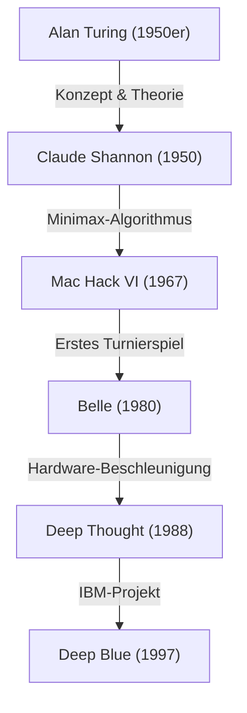
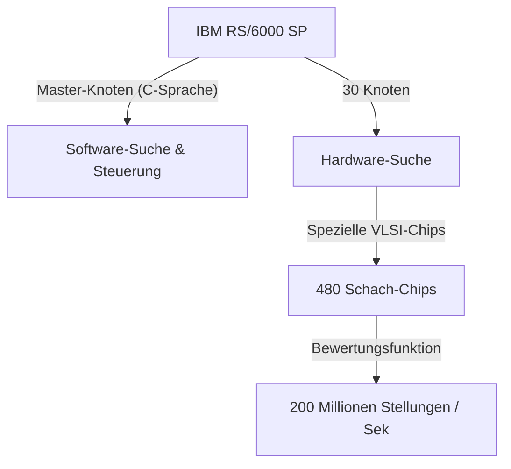

## Einleitung: 1997 – Die Menschheit begegnet einer „unbekannten Intelligenz“

Das Schachmatch, das am 11. Mai 1997 im Equitable Center in New York stattfand, wird als ein Wendepunkt in der Geschichte der Menschheit in Erinnerung bleiben. Garry Kasparov, der damalige Schachweltmeister und gepriesen als „der stärkste Spieler der Geschichte“, erlitt eine Niederlage gegen den von IBM entwickelten Supercomputer „Deep Blue“.

Dieses Ereignis war weit mehr als nur der Ausgang eines Brettspiels; es wurde zu einem gewaltigen Meilenstein für die langjährige philosophische Frage: „Wird der Tag kommen, an dem Maschinen die menschliche Intelligenz übertreffen?“ Dieser Artikel beleuchtet die Geschichte des Computerschachs, die zum Match von 1997 führte, den Weg des Giganten Kasparov, die technischen Hintergründe von Deep Blue sowie die Details des legendären sechs Spielen umfassenden Matches. Dabei gehen wir der Frage auf den Grund, welche Bedeutung dieses Ereignis für die Geschichte der KI (Künstliche Intelligenz) hatte.

## Die Anfänge des Computerschachs: Von Turing bis Deep Blue

Die Idee, einen Computer Schach spielen zu lassen, existiert seit den Anfängen der Informatik. Pioniere wie Alan Turing und Claude Shannon betrachteten Schach als „ideales Testfeld, um menschliche Denkprozesse zu simulieren und zu entschlüsseln“.

In den 1950er Jahren veröffentlichte Claude Shannon eine monumentale Arbeit über Schachprogramme, die den Grundstein für Suchalgorithmen basierend auf der Minimax-Methode legte. In den 1970er und 80er Jahren erschienen dann zunehmend Maschinen mit spezieller Schach-Hardware. „Belle“ von den Bell Labs nutzte dedizierte Schaltkreise, um zehntausende Stellungen pro Sekunde zu durchsuchen, und erreichte die Spielstärke eines Meisters.

Schließlich wurde „Deep Thought“, entwickelt von Studenten der Carnegie Mellon University, der erste Computer, der einen Großmeister besiegen konnte. IBM übernahm dieses Projekt, investierte immense finanzielle Mittel sowie modernste Ingenieurskunst und erschuf so „Deep Blue“.

## Die Architektur von IBMs Meisterwerk „Deep Blue“

Deep Blue war die Krönung der damals fortschrittlichsten Parallel-Computing-Technologie. Basierend auf dem universellen Supercomputer „IBM RS/6000 SP“ war das System mit einer riesigen Anzahl an VLSI-Chips ausgestattet, die speziell für Schach entwickelt worden waren.

Sein größtes Merkmal war seine überwältigende Rechenleistung: Er konnte die unglaubliche Zahl von **200 Millionen Stellungen pro Sekunde** berechnen, was als sogenannter „Brute-Force“-Ansatz (rohe Gewalt) bekannt ist. Während ein menschlicher Spieler nur einige wenige bis dutzende Züge pro Sekunde berechnet (aber vielversprechende Züge durch hochgradige Intuition eingrenzt), berechnete Deep Blue alle Möglichkeiten in einer Art Bombardement. Darüber hinaus schlossen sich Schachgroßmeister wie Joel Benjamin dem Entwicklungsteam an, um die Bewertungsfunktion (einen Algorithmus, der den Vor- oder Nachteil einer Stellung quantifiziert) rigoros zu verfeinern.

## Der stärkste Champion der Geschichte: Garry Kasparov

Auf der anderen Seite stand Garry Kasparov, ein absolutes Genie, der als jüngster Spieler aller Zeiten mit 22 Jahren Weltmeister wurde und seinen Titel 15 Jahre lang verteidigte. Sein Spielstil war extrem aggressiv; er zeichnete sich durch tiefes Vorausrechnen, herausragende Intuition und eine meisterhafte psychologische Kriegsführung aus, die seine Gegner immens unter Druck setzte.

Bis dahin hatte er sich auf Augenhöhe oder besser mit jedem Computer gemessen und war davon überzeugt, dass eine Maschine (zumindest zu seinen Lebzeiten) keinen Menschen besiegen könnte. Auch beim ersten Match gegen Deep Blue 1996 (in Philadelphia) verlor Kasparov zwar die erste Partie, gewann aber letztlich mit 3 Siegen, 1 Niederlage und 2 Remis. Damals erklärte Kasparov: „Eine Maschine wird niemals die wahre menschliche Intelligenz und Intuition schlagen können.“

## 1997: Das schicksalhafte Rückspiel (New York)

Nach der Niederlage von 1996 überarbeitete das IBM-Entwicklungsteam (darunter Feng-Hsiung Hsu und Murray Campbell) Deep Blue von Grund auf. Sie verdoppelten die Rechengeschwindigkeit, passten die Bewertungsfunktion an, um sie flexibler und „menschlicher“ zu machen, und ließen den Computer alle früheren Partien Kasparovs lernen. Diese neue Version, auch als „Deeper Blue“ bezeichnet, trat im Mai 1997 zum Rückspiel an.

### Partie 1: Kasparovs erwarteter Sieg
In der ersten Partie blieb Kasparov seinem Stil treu, schuf komplexe Stellungen und errang den Sieg. Obwohl Deep Blue in der Rechenleistung überlegen war, schien er keine langfristige Strategie oder die Feinheiten der Positionierung zu verstehen. Jeder dachte: „Auch dieses Mal wird Kasparov gewinnen.“

### Partie 2: Der fragwürdige 44. Zug und Kasparovs Erschütterung
Der Wendepunkt der Geschichte war die zweite Partie. Hier spielte Deep Blue einen „menschlichen“ und „auf langfristigen Stellungsvorteil bedachten“ Zug, den herkömmliche Computer niemals gemacht hätten. Insbesondere der 44. Zug von Deep Blue war ein extrem raffinierter, strategischer Zug, bei dem er bewusst auf einen sofortigen materiellen Vorteil (die Chance, eine Figur zu schlagen) verzichtete und stattdessen jeglichen Gegenangriff des Gegners im Keim erstickte.

Kasparov war von diesem Zug tief erschüttert. Er sagte später: „Ich spürte eine überlegene menschliche Intelligenz auf der anderen Seite des Brettes.“ In Panik geraten, gab Kasparov im 45. Zug auf (Resignation), obwohl es noch eine Chance auf ein Unentschieden gegeben hätte. Durch diese Niederlage entwickelte Kasparov den Verdacht, dass „IBM während der Partie menschliche Großmeister eingreifen lässt“, und geriet psychologisch stark unter Druck.

### Partien 3–5: Nervenaufreibende Unentschieden
Von der 3. bis zur 5. Partie versuchte Kasparov, die Rechenkraft von Deep Blue zu neutralisieren, indem er taktische Verwicklungen, in denen Computer glänzen, vermied und stattdessen auf langfristige strategische Kämpfe (geschlossene Stellungen) setzte. Dies führte zu drei Unentschieden (Remis). Der Spielstand war nun 2,5 zu 2,5 unentschieden. Alles hing von der entscheidenden 6. Partie ab.

### Partie 6: Der Zusammenbruch des Champions (11. Mai)
Die schicksalhafte 6. Partie. Kasparov spielte mit Schwarz und wählte die Caro-Kann-Verteidigung. Allerdings machte er früh eine Art riskanten Zug, der von den bekannten Eröffnungen abwich. Dies war eine Taktik, um Deep Blues Eröffnungsdatenbank durcheinanderzubringen, aber es erwies sich als fataler Fehler.

Deep Blue startete sofort einen massiven Angriff, bei dem er einen Springer opferte (Springeropfer). Im Computerschach war dies normalerweise ein Zug, „der nicht gewählt wird, da der Bewertungswert vorübergehend sinkt“, aber der verbesserte Deep Blue hatte die darauffolgende Entwicklung perfekt durchgerechnet.

In die Defensive gedrängt, musste Kasparov nach nur 19 Zügen eine demütigende Aufgabe akzeptieren. Der Endstand lautete 3,5 zu 2,5. Es war der Moment, in dem der stärkste Mensch der Geschichte schließlich einer Maschine unterlag.

## Was diese Niederlage bedeutete: Der Wandel des KI-Paradigmas

Der Sieg von Deep Blue versetzte der ganzen Welt einen unermesslichen Schock. Auf dem Cover des Newsweek-Magazins prangte die Schlagzeile „The Brain's Last Stand“ (Das letzte Gefecht des Gehirns).

Aus technologischer Sicht unterschied sich Deep Blue jedoch grundlegend von der heutigen KI (wie Deep Learning). Deep Blue war keine „KI, die autonom lernt und Konzepte versteht“, sondern die ultimative Form eines „Expertensystems“, das optimale Lösungen durch eine ultraschnelle hardwarebasierte **Brute-Force-Suche** (rohe Gewalt) ableitete, basierend auf von menschlichen Experten definierten Regeln und Bewertungsfunktionen.

Dieser Sieg demonstrierte die Tatsache, dass „im Rahmen der begrenzten Regeln und der vollständigen Information des Schachspiels sogar die menschliche Intuition und das Gesamtverständnis durch eine gigantische Menge an Musterberechnungen übertroffen werden können“.

In den folgenden Jahren verlagerte sich die Forschung zur künstlichen Intelligenz von der regelbasierten Suche hin zum maschinellen Lernen mit neuronalen Netzen. Im Jahr 2016 besiegte „AlphaGo“ von Google DeepMind den weltbesten Go-Spieler Lee Sedol. Anders als Deep Blue nutzte AlphaGo keinen Brute-Force-Ansatz, sondern Deep Learning und Reinforcement Learning, um „seine Bewertungsfunktion selbst zu erlernen“ – ein Ansatz, der der menschlichen Intuition weitaus näher kam. Deep Blue war in gewisser Weise der Höhepunkt und die vollendete Form der „guten alten KI“.

## Fazit: Die Grenze der Menschheit oder neue Möglichkeiten?

Nach dem Match war Kasparov wütend und forderte von IBM die Veröffentlichung der Logs sowie einen Rückkampf, doch IBM demontierte Deep Blue umgehend und legte das Projekt still, da das Ziel erreicht war. Diese Reaktion hinterließ bei Kasparov lange Zeit ein tiefes Misstrauen.

Mit der Zeit änderte sich Kasparovs Einstellung jedoch. Heute fürchtet er die Bedrohung durch KI nicht mehr übermäßig, sondern ist einer der Befürworter des „Zentauren-Schachs“ (ein Format, bei dem Mensch und KI gemeinsam spielen), bei dem er KI als ein „Werkzeug zur Erweiterung der menschlichen Fähigkeiten“ betrachtet.

Der Sieg von Deep Blue im Jahr 1997 war keine Niederlage der Menschheit. Es war ein „Sieg der menschlichen Ingenieurskunst“, als ein vom menschlichen Verstand geschaffenes Werkzeug schließlich in einem Bereich die Grenzen seines Schöpfers überschritt. Auch Jahrzehnte nach diesem historischen Match bleibt die Frage, wie wir mit KI koexistieren und unsere eigenen Fähigkeiten erweitern können, so aktuell wie eh und je.
