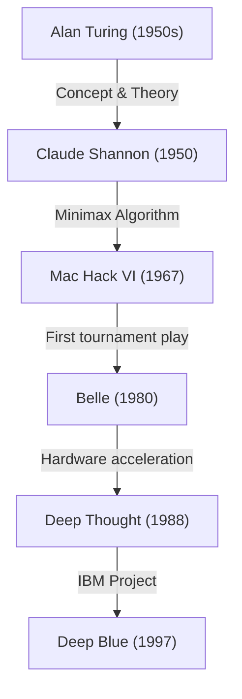
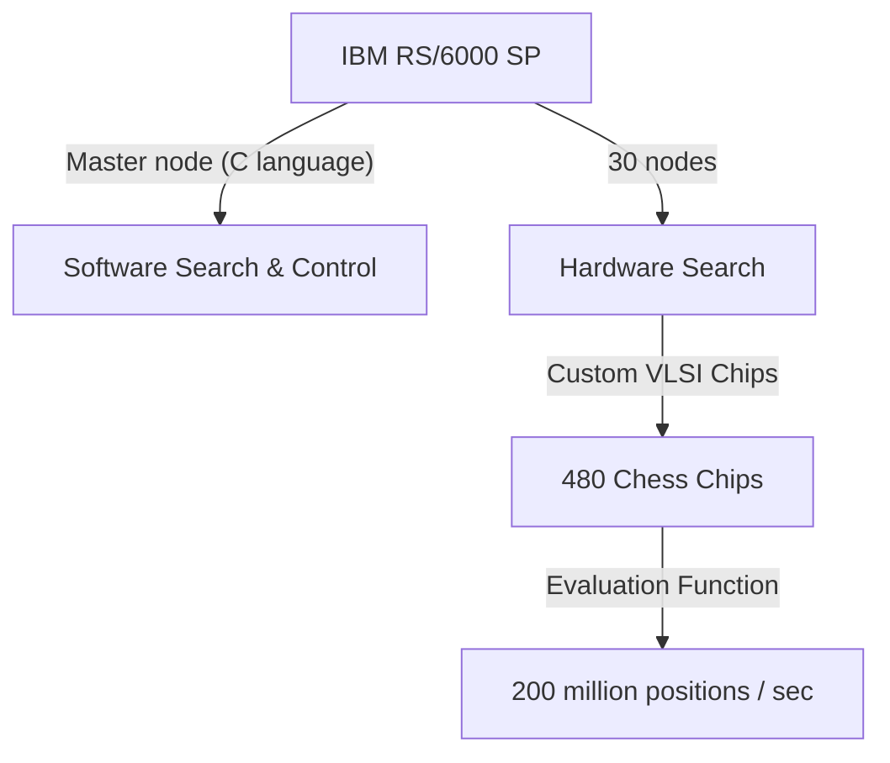

## Introduction: The "Unknown Intelligence" Humanity Faced in 1997

On May 11, 1997, a chess match held at the Equitable Center in New York was remembered as a singularity in human history. Garry Kasparov, the reigning World Chess Champion at the time and hailed as the "greatest player in history," suffered a defeat at the hands of Deep Blue, a supercomputer developed by IBM.

This event went beyond a simple win or loss in a board game, serving as a powerful milestone for the long-standing philosophical question: "Will there ever come a day when machines surpass human intelligence?" In this article, we delve deep into what this incident meant in the history of AI (Artificial Intelligence) by exploring the history of computer chess leading up to this 1997 match, the trajectory of the giant Kasparov, the technical background of Deep Blue, and the details of the legendary six-game series.

## The Dawn of Computer Chess: From Turing to Deep Blue

The idea of having a computer play chess has existed since the dawn of computer science. Pioneers like Alan Turing and Claude Shannon viewed chess as an "ideal testbed to mimic and elucidate the human thought process."

In the 1950s, Claude Shannon published a monumental paper on chess programming, laying the foundation for search algorithms based on the minimax method. Later, from the 1970s through the 1980s, machines equipped with dedicated chess hardware began to emerge. Bell Labs' "Belle" used specialized circuitry to evaluate tens of thousands of positions per second, boasting master-class strength.

Then, "Deep Thought," developed by students at Carnegie Mellon University, became the first computer to defeat a grandmaster. IBM took over this project, pouring massive funding and top-tier engineering into it to create "Deep Blue."

## The Architecture of IBM's Masterpiece "Deep Blue"

Deep Blue was the culmination of cutting-edge parallel computing technology at the time. Based on the general-purpose supercomputer "IBM RS/6000 SP," it was equipped with a massive number of VLSI chips specifically designed for chess.

Its greatest feature was its overwhelming computational power, capable of exploring a staggering **200 million positions per second**, known as "brute force" searching. While human players calculate only a few to a few dozen moves per second (yet rely on high-level intuition to narrow down promising moves), Deep Blue took an approach of calculating every single possibility exhaustively like a carpet-bombing. In addition, chess grandmaster Joel Benjamin and others joined the development team to thoroughly tune the evaluation function (the algorithm that quantifies the advantage or disadvantage of a position).

## The Greatest Champion in History, Garry Kasparov

Facing off against it was Garry Kasparov, an absolute genius who became World Champion at the record-breaking age of 22 and continued to reign over the throne for 15 years. His play style was extremely aggressive; he excelled at deep calculation, outstanding intuition, and psychological warfare that applied tremendous pressure on his opponents.

Up until then, he had fought on more than equal terms against any computer, confident that humans would not lose to machines (at least not in his lifetime). Even in his first match against Deep Blue in 1996 (in Philadelphia), Kasparov dropped the first game but ultimately won with 3 wins, 1 loss, and 2 draws. At that time, Kasparov declared, "Machines can never defeat human's true intelligence and intuition."

## 1997: The Fateful Rematch (New York)

Following their defeat in 1996, the IBM development team (including Feng-hsiung Hsu and Murray Campbell) thoroughly improved Deep Blue. They doubled its computational speed, adjusted the evaluation function to be more flexible and human-like, and had it learn all of Kasparov's past game records. This new version, sometimes dubbed "Deeper Blue," took the stage for the rematch in May 1997.

### Game 1: Kasparov's Expected Victory
In Game 1, Kasparov stuck to his own style, leading the game into a complex position to secure a victory. While Deep Blue was excellent in calculating power, it seemed to lack an understanding of long-term strategy and positional nuances. Everyone thought, "Kasparov is going to win this time as well."

### Game 2: The Suspicious 44th Move and Kasparov's Agitation
The turning point in history was Game 2. Here, Deep Blue played a "human-like" move that "emphasized long-term positional advantage," which traditional computers would never play. In particular, Deep Blue's 44th move was an extremely sophisticated and strategic play that intentionally passed up an immediate material gain (the chance to capture a piece) in order to completely nip the opponent's counterattack in the bud.

Kasparov was severely shaken by this move. He later stated that he "sensed an outstanding human intelligence across the board." Falling into a panic, Kasparov resigned on the 45th move, even though there was still a possibility of forcing a draw. This defeat led Kasparov to suspect that "IBM might be intervening with human grandmasters during the game," driving him deep into a psychological corner.

### Games 3-5: Tense Draws
From Game 3 to Game 5, Kasparov attempted to neutralize Deep Blue's computational power by avoiding tactical brawls, which computers excel at, and instead steering the games into long-term strategic battles (closed positions). As a result, all of these ended in draws. The score was tied at 2.5 to 2.5. Everything rested on the final Game 6.

### Game 6: The Fall of the Champion (May 11)
The fateful Game 6. Playing as Black, Kasparov opted for the Caro-Kann Defense. However, early in the game, he played a move that deviated from known opening theories—a somewhat risky gamble. It was a ploy to throw off Deep Blue's opening database, but it turned out to be a fatal mistake.

Deep Blue immediately launched a powerful attack by sacrificing a knight (Knight Sacrifice). In computer chess, this was "a move usually not chosen because it temporarily lowers the evaluation score," but the improved Deep Blue had perfectly calculated the subsequent developments.

Forced onto the defensive entirely, Kasparov was compelled to resign humiliatingly after a mere 19 moves. The final score was 3.5 to 2.5. It was the moment when the strongest human in history was finally defeated by a machine.

## What This Defeat Meant: The Shift in the AI Paradigm

Deep Blue's victory sent an immeasurable shockwave around the world. The cover of Newsweek magazine boldly featured the headline, "The Brain's Last Stand."

However, from a technical perspective, Deep Blue is fundamentally different from modern AI (such as deep learning). Deep Blue was not an "AI that learns autonomously and understands concepts." Rather, it was the ultimate form of an "expert system" that derived optimal solutions through **brute force full search** using ultra-high-speed hardware, based on rules and evaluation functions defined by human experts.

What this victory demonstrated was the fact that "within the confines of a perfect information game with limited rules like chess, even human intuition and holistic perspective can be surpassed by pattern searching powered by an overwhelming amount of calculation."

Subsequently, artificial intelligence research shifted from rule-based searching to machine learning using neural networks. Google DeepMind's "AlphaGo," which defeated world top Go player Lee Sedol in 2016, achieved its victory not through brute force like Deep Blue, but through a more human-like, intuitive approach of "learning evaluation functions on its own" using deep learning and reinforcement learning. In a sense, Deep Blue was the pinnacle and the completed form of "good old AI."

## Conclusion: The Limits of Humanity, or New Possibilities?

After the match, an infuriated Kasparov demanded that IBM release the logs and agree to a rematch. However, IBM, stating that they had achieved their goal, immediately dismantled and retired Deep Blue. This response left a long-lasting sense of distrust within Kasparov.

However, as time passed, Kasparov's mindset also changed. Today, rather than excessively fearing the threat of AI, he is one of the advocates for "Centaur Chess" (a format where humans and AI team up to play), viewing AI as a "tool to augment human capabilities."

Deep Blue's victory in 1997 was not a defeat for humanity. It was a "victory for human engineering," where a tool created by human intelligence itself finally surpassed its creator's limits in a single domain. Even now, decades after this historic match, the question of how we coexist with AI and how we augment our own capabilities continues to confront us without fading.
