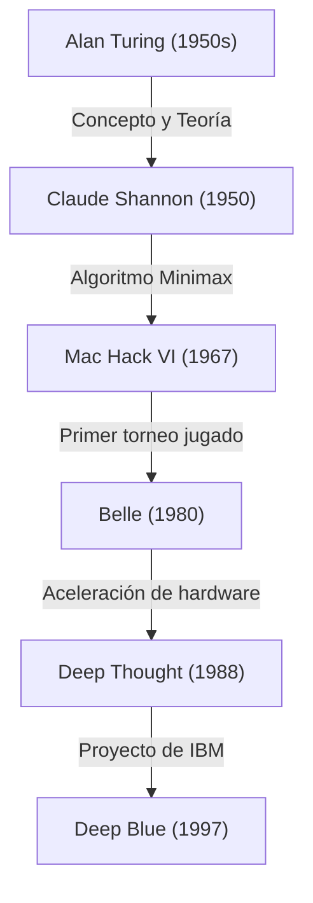
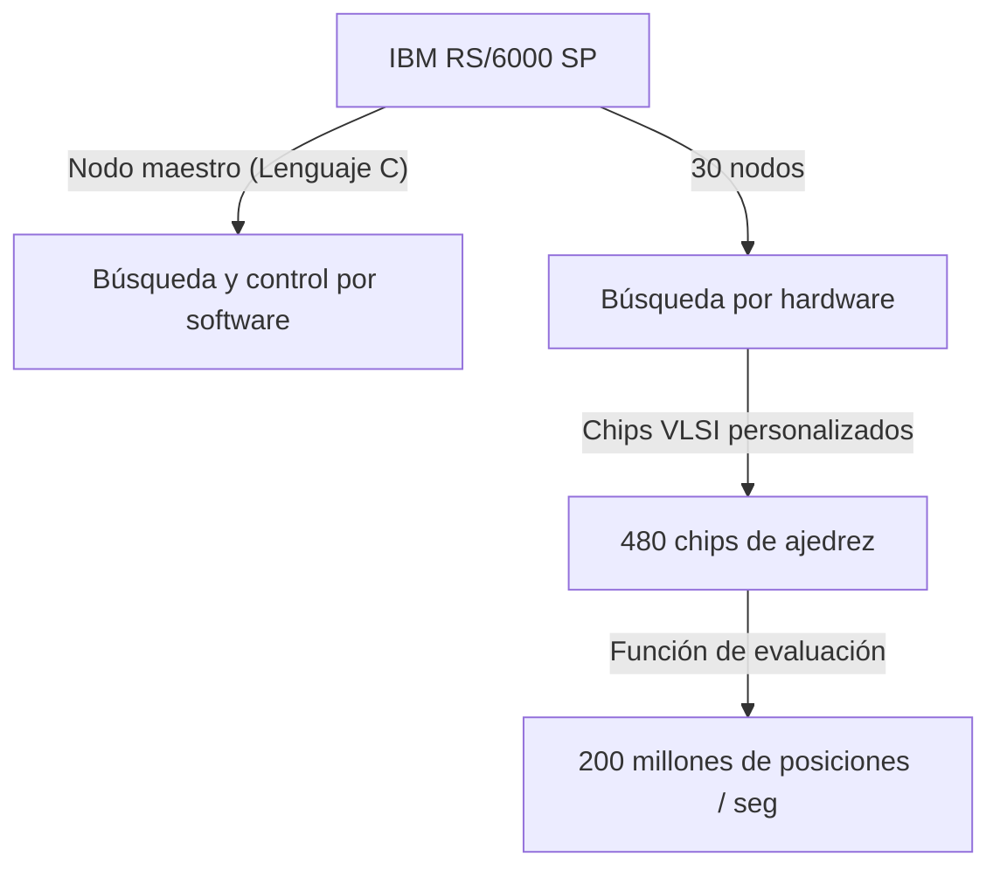

## Introducción: 1997, la "Inteligencia Desconocida" que enfrentó la humanidad

La partida de ajedrez celebrada el 11 de mayo de 1997 en el Equitable Center de Nueva York se recuerda como un punto de singularidad en la historia humana. El entonces campeón mundial de ajedrez, Garry Kasparov, aclamado como el "jugador más fuerte de la historia", fue derrotado por la supercomputadora "Deep Blue" desarrollada por IBM.

Este evento trascendió la simple victoria o derrota en un juego de mesa, convirtiéndose en un poderoso hito ante la larga pregunta filosófica: "¿Llegará el día en que las máquinas superen la inteligencia humana?". En este artículo, exploraremos la historia del ajedrez por computadora hasta el enfrentamiento de 1997, la trayectoria del gigante Kasparov, el trasfondo técnico de Deep Blue y los detalles de esta legendaria serie de seis partidas, para profundizar en el significado de este evento en la historia de la Inteligencia Artificial (IA).

## El amanecer del ajedrez por computadora: De Turing a Deep Blue

La idea de hacer que una computadora juegue al ajedrez existía desde los albores de la informática. Pioneros como Alan Turing y Claude Shannon consideraban el ajedrez como "el banco de pruebas ideal para imitar y desentrañar los procesos de pensamiento humano".

En la década de 1950, Claude Shannon publicó un artículo monumental sobre programas de ajedrez, sentando las bases de los algoritmos de búsqueda basados en el método minimax. Posteriormente, entre los años 70 y 80, comenzaron a aparecer máquinas equipadas con hardware dedicado al ajedrez. "Belle", de los Laboratorios Bell, utilizaba circuitos especializados para explorar decenas de miles de posiciones por segundo, presumiendo de una fuerza al nivel de los maestros.

Luego, "Deep Thought", desarrollada por estudiantes de la Universidad Carnegie Mellon, se convirtió en la primera computadora en derrotar a un Gran Maestro. IBM se hizo cargo de este proyecto, inyectando enormes cantidades de dinero e ingeniería de primer nivel para crear a "Deep Blue".

## La arquitectura de "Deep Blue", la obra maestra de IBM

Deep Blue era la culminación de la tecnología de computación paralela de vanguardia de su época. Basada en la supercomputadora de propósito general "IBM RS/6000 SP", estaba equipada con una gran cantidad de chips VLSI diseñados específicamente para el ajedrez.

Su mayor característica era una abrumadora capacidad de cálculo, la llamada "fuerza bruta", que le permitía explorar un asombroso número de posiciones: **200 millones de jugadas (posiciones) por segundo**. Mientras que un jugador humano calcula desde unas pocas hasta varias decenas de jugadas por segundo (aunque reduce las opciones prometedoras con una gran intuición), Deep Blue adoptó el enfoque de calcular exhaustivamente todas las posibilidades como un bombardeo indiscriminado. Además, Grandes Maestros de ajedrez como Joel Benjamin se unieron al equipo de desarrollo para ajustar minuciosamente la función de evaluación de posiciones (el algoritmo que cuantifica la ventaja o desventaja de una posición).

## El rey más fuerte de la historia, Garry Kasparov

En contraparte, Garry Kasparov fue un genio absoluto que se convirtió en campeón del mundo a la edad récord de 22 años, reinando durante los siguientes 15 años. Su estilo de juego era extremadamente agresivo, dominando el cálculo profundo, una intuición excepcional y la guerra psicológica para ejercer una inmensa presión sobre sus oponentes.

Hasta entonces, había luchado en igualdad de condiciones o superioridad contra cualquier computadora, y estaba convencido de que una máquina nunca vencería al hombre (al menos no mientras él estuviera vivo). En el primer encuentro contra Deep Blue en 1996 (Filadelfia), Kasparov perdió la primera partida, pero finalmente ganó el encuentro con 3 victorias, 1 derrota y 2 empates. En ese momento, Kasparov declaró: "Las máquinas nunca podrán vencer a la verdadera inteligencia y la intuición humanas".

## 1997: La revancha del destino (Nueva York)

Tras la derrota de 1996, el equipo de desarrollo de IBM (que incluía a Feng-hsiung Hsu y Murray Campbell) mejoró drásticamente a Deep Blue. Duplicaron su velocidad de cálculo, ajustaron la función de evaluación para hacerla más flexible y cercana al pensamiento humano, y le enseñaron todas las partidas pasadas de Kasparov. Esta nueva versión, también llamada "Deeper Blue", subió al escenario para la revancha en mayo de 1997.

### Partida 1: Una victoria predecible de Kasparov
En la primera partida, Kasparov mantuvo su estilo, llevando el juego a posiciones complejas y obteniendo la victoria. Aunque Deep Blue destacaba en capacidad de cálculo, parecía no comprender la estrategia a largo plazo ni las sutilezas posicionales. Todos pensaron: "Esta vez, la victoria también será para Kasparov".

### Partida 2: La sospechosa jugada 44 y la conmoción de Kasparov
El punto de inflexión histórico ocurrió en la segunda partida. Aquí, Deep Blue realizó un movimiento "humano" que daba "importancia a la ventaja posicional a largo plazo", algo que las computadoras convencionales nunca harían. En particular, la jugada 44 de Deep Blue fue un movimiento estratégico extremadamente refinado: dejó pasar intencionadamente un beneficio material inmediato (la oportunidad de capturar una pieza) para neutralizar por completo cualquier posibilidad de contraataque del rival.

Kasparov se sintió profundamente perturbado por esta jugada. Más tarde comentó: "Sentí una inteligencia humana sobresaliente al otro lado del tablero". Preso del pánico, Kasparov se rindió voluntariamente en la jugada 45, a pesar de que todavía existía la posibilidad de forzar un empate. Esta derrota le hizo sospechar a Kasparov que "IBM podría estar haciendo intervenir a Grandes Maestros humanos durante la partida", lo que lo llevó a un estado de profunda presión psicológica.

### Partidas 3-5: Empates sofocantes
Desde la tercera hasta la quinta partida, Kasparov intentó neutralizar la capacidad de cálculo de Deep Blue evitando el juego táctico caótico en el que las computadoras destacan, llevando las partidas a enfrentamientos estratégicos a largo plazo (posiciones cerradas). Como resultado, todas estas terminaron en empate (tablas). El marcador quedó empatado 2.5 a 2.5. Todo dependería de la sexta y última partida.

### Partida 6: La caída del rey (11 de mayo)
La fatídica sexta partida. Kasparov jugaba con las piezas negras y eligió la Defensa Caro-Kann. Sin embargo, en la apertura hizo un movimiento que se desviaba de las líneas teóricas conocidas, casi como una apuesta. Fue una táctica para confundir la base de datos de aperturas de Deep Blue, pero resultó ser un error fatal.

Deep Blue lanzó de inmediato un poderoso ataque sacrificando un caballo. Este era un movimiento que, en el ajedrez por computadora, "normalmente no se elige porque el valor de evaluación desciende temporalmente", pero la versión mejorada de Deep Blue había calculado perfectamente el desarrollo posterior.

Obligado a ponerse a la defensiva, Kasparov tuvo que rendirse humillantemente después de solo 19 movimientos. El marcador final fue 3.5 a 2.5. Fue el momento en el que la humanidad, representada por su jugador más fuerte, finalmente fue derrotada por una máquina.

## Lo que significó esta derrota: El cambio de paradigma en la IA

La victoria de Deep Blue causó un impacto incalculable en todo el mundo. La portada de la revista Newsweek tituló: "The Brain's Last Stand" (La última resistencia del cerebro).

Sin embargo, desde una perspectiva técnica, Deep Blue era fundamentalmente diferente de la IA moderna (como el aprendizaje profundo o Deep Learning). Deep Blue no era una "IA que aprendía de forma autónoma y comprendía conceptos", sino la forma definitiva de un "sistema experto" que encontraba la solución óptima a través de una **búsqueda exhaustiva por fuerza bruta** impulsada por hardware de altísima velocidad, basándose en reglas y funciones de evaluación definidas por expertos humanos.

Lo que demostró esta victoria fue el hecho de que, "dentro de los límites de un juego de información perfecta con reglas definidas como el ajedrez, incluso la intuición y la visión global humanas pueden ser superadas mediante la búsqueda de patrones con una cantidad abrumadora de cálculos".

Posteriormente, la investigación en inteligencia artificial pasó de la búsqueda basada en reglas al aprendizaje automático mediante redes neuronales. "AlphaGo" de Google DeepMind, que en 2016 derrotó a Lee Sedol, uno de los mejores jugadores de Go del mundo, no utilizó la fuerza bruta como Deep Blue. En su lugar, utilizó el aprendizaje profundo (Deep Learning) y el aprendizaje por refuerzo para ganar mediante un enfoque más cercano a la intuición humana, "aprendiendo por sí misma las funciones de evaluación". En cierto modo, Deep Blue fue el pináculo y la forma final de la "vieja y buena IA".

## Conclusión: ¿Los límites de la humanidad o nuevas posibilidades?

Después de la partida, Kasparov enfureció y exigió a IBM que publicara los registros y aceptara una revancha, pero IBM desmanteló y retiró de inmediato a Deep Blue, argumentando que habían logrado su objetivo. Esta respuesta dejaría una larga desconfianza en Kasparov.

No obstante, con el paso del tiempo, la perspectiva de Kasparov también cambió. Hoy en día, en lugar de temer excesivamente a la amenaza de la IA, es uno de los defensores del "Ajedrez Centauro" (un formato en el que humanos e IA juegan en equipo), viendo a la IA como "una herramienta para ampliar las capacidades humanas".

La victoria de Deep Blue en 1997 no fue una derrota de la humanidad. Fue un triunfo de la "ingeniería humana", demostrando que una herramienta creada por la propia inteligencia humana finalmente había superado los límites de sus creadores en un ámbito específico. Incluso ahora, décadas después de esta partida histórica, la pregunta de cómo coexistiremos con la IA y cómo expandiremos nuestras propias capacidades sigue vigente y se nos plantea sin desvanecerse.
