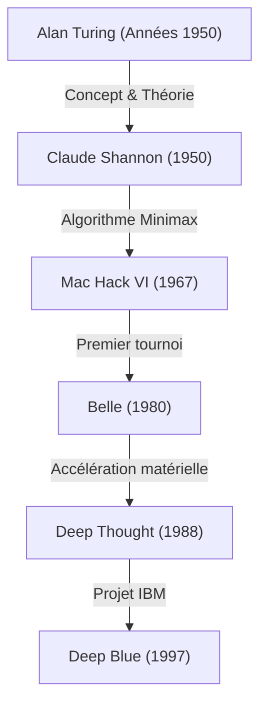
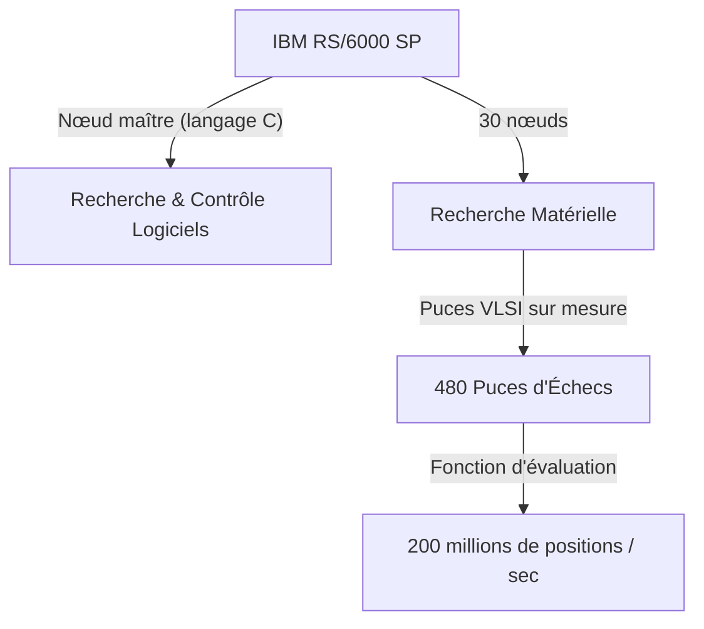

## Introduction : 1997, l'humanité face à une « intelligence inconnue »

Le match d'échecs qui s'est déroulé à l'Equitable Center de New York le 11 mai 1997 reste gravé dans les mémoires comme une singularité dans l'histoire de l'humanité. Le champion du monde d'échecs de l'époque, Garry Kasparov, salué comme le « plus grand joueur de l'histoire », a subi une défaite face au supercalculateur développé par IBM, « Deep Blue ».

Cet événement a dépassé le cadre d'un simple résultat de jeu de société pour devenir un jalon puissant de la question philosophique de longue date : « Viendra-t-il un jour où la machine surpassera l'intelligence humaine ? » Dans cet article, nous explorerons l'histoire des échecs informatiques ayant mené à ce match de 1997, le parcours du géant Kasparov, le contexte technique de Deep Blue et les détails de cette série légendaire de six parties, tout en approfondissant la signification de cet incident dans l'histoire de l'IA (intelligence artificielle).

## L'aube des échecs informatiques : de Turing à Deep Blue

L'idée de faire jouer un ordinateur aux échecs existe depuis les débuts de l'informatique. Des pionniers tels qu'Alan Turing et Claude Shannon considéraient les échecs comme un « banc d'essai idéal pour simuler et comprendre les processus de pensée humaine ».

Dans les années 1950, Claude Shannon a publié un article monumental sur les programmes d'échecs, jetant les bases des [algorithmes de recherche](/fr/p/search-algorithms-linear-binary-hash-table-principles/) fondés sur l'algorithme minimax. Par la suite, dans les années 1970 et 1980, des machines équipées de matériel dédié aux échecs ont commencé à apparaître. « Belle » des Bell Labs utilisait des circuits dédiés pour analyser des dizaines de milliers de positions par seconde, se targuant d'un niveau de maître.

Ensuite, « Deep Thought », développé par des étudiants de l'Université Carnegie Mellon, est devenu le premier ordinateur à vaincre un grand maître. IBM a repris ce projet, y injectant des fonds colossaux et l'ingénierie la plus avancée, pour donner naissance à « Deep Blue ».

## L'architecture de Deep Blue, le chef-d'œuvre d'IBM

Deep Blue était l'aboutissement de la technologie de calcul parallèle de pointe de l'époque. Basé sur le supercalculateur à usage général « IBM RS/6000 SP », il était équipé d'un grand nombre de puces VLSI conçues spécifiquement pour les échecs.

Sa principale caractéristique résidait dans sa puissance de calcul écrasante, capable d'explorer le nombre astronomique de **200 millions de positions par seconde**, une approche connue sous le nom de « force brute ». Alors qu'un joueur humain n'anticipe que de quelques à plusieurs dizaines de coups par seconde (tout en utilisant une intuition avancée pour réduire les coups prometteurs), Deep Blue adoptait une approche de bombardement en tapis, calculant toutes les possibilités de manière exhaustive. De plus, Joel Benjamin, grand maître des échecs, et d'autres ont rejoint l'équipe de développement pour affiner méticuleusement la fonction d'évaluation (l'algorithme quantifiant l'avantage ou le désavantage d'une position).

## Garry Kasparov, le plus grand champion de l'histoire

Face à lui, Garry Kasparov était un génie absolu, devenu le plus jeune champion du monde de l'histoire à 22 ans, et qui a régné sur le trône pendant 15 ans. Son style de jeu était extrêmement agressif ; il excellait dans la lecture profonde, possédait une intuition exceptionnelle et maîtrisait la guerre psychologique, exerçant une pression immense sur ses adversaires.

Jusqu'alors, il avait rivalisé avec n'importe quel ordinateur, convaincu que l'homme ne perdrait jamais face à la machine (du moins de son vivant). Lors de son premier affrontement contre Deep Blue en 1996 (à Philadelphie), bien qu'il ait perdu la première partie, Kasparov l'a finalement emporté avec 3 victoires, 1 défaite et 2 nuls. À cette époque, Kasparov avait déclaré : « La machine ne vaincra jamais la véritable intelligence et l'intuition humaines ».

## 1997 : Le match retour décisif (New York)

Suite à la défaite de 1996, l'équipe de développement d'IBM (dont Feng-hsiung Hsu et Murray Campbell) a radicalement amélioré Deep Blue. Ils ont doublé sa vitesse de calcul, ajusté la fonction d'évaluation pour la rendre plus flexible et plus « humaine », et lui ont fait apprendre toutes les parties antérieures de Kasparov. Cette nouvelle version, parfois appelée « Deeper Blue », est montée sur la scène de la revanche en mai 1997.

### 1ère partie : Une victoire logique de Kasparov
Dans la première partie, Kasparov est resté fidèle à son style, amenant le jeu vers des positions complexes pour remporter la victoire. Deep Blue, bien qu'excellent en puissance de calcul, semblait ne pas comprendre la stratégie à long terme et les subtilités du positionnement. Tout le monde pensait que « cette fois encore, Kasparov remporterait la victoire ».

### 2ème partie : Le 44e coup douteux et le trouble de Kasparov
Le tournant historique fut la deuxième partie. Ici, Deep Blue a joué un coup « humain » et « axé sur l'avantage positionnel à long terme », un coup qu'un ordinateur conventionnel n'aurait jamais joué. En particulier, le 44e coup de Deep Blue ignorait délibérément un gain matériel immédiat (l'opportunité de prendre une pièce) pour anéantir complètement toute possibilité de contre-attaque de l'adversaire, une action stratégique extrêmement sophistiquée.

Kasparov a été profondément troublé par ce coup. Il a déclaré par la suite : « J'ai senti une intelligence humaine transcendante de l'autre côté de l'échiquier ». Pris de panique, Kasparov a abandonné de lui-même au 45e coup, bien qu'il restait une possibilité d'obtenir un match nul. À cause de cette défaite, Kasparov a commencé à soupçonner qu'« IBM faisait intervenir des grands maîtres humains pendant la partie », ce qui l'a poussé psychologiquement dans ses retranchements.

### Parties 3 à 5 : Des nuls étouffants
De la troisième à la cinquième partie, Kasparov a tenté de neutraliser la puissance de calcul de Deep Blue en évitant les batailles tactiques désordonnées, où l'ordinateur excellait, pour amener le jeu vers des batailles stratégiques à long terme (positions fermées). En conséquence, toutes ces parties se sont soldées par des matchs nuls. Le score était à égalité, 2,5 à 2,5. Tout reposait sur la 6e et dernière partie.

### 6ème partie : L'effondrement du champion (11 mai)
La 6ème partie décisive. Jouant avec les Noirs, Kasparov a choisi la défense Caro-Kann. Cependant, il a joué un coup en début de partie qui s'écartait des ouvertures connues, une sorte de pari. C'était une stratégie pour perturber la base de données d'ouvertures de Deep Blue, mais ce fut une erreur fatale.

Deep Blue a immédiatement lancé une attaque puissante en sacrifiant un cavalier (sacrifice de cavalier). Aux échecs informatiques, c'était « un coup généralement non choisi car il fait baisser temporairement la valeur d'évaluation », mais le Deep Blue amélioré avait parfaitement anticipé la suite des événements.

Sur la défensive, Kasparov a été contraint à un abandon humiliant en seulement 19 coups. Le score final était de 3,5 à 2,5. C'était l'instant où le meilleur humain de l'histoire a finalement été vaincu par la machine.

## Ce que cette défaite a signifié : Le changement de paradigme de l'IA

La victoire de Deep Blue a causé un choc incommensurable dans le monde entier. Le magazine Newsweek a affiché en couverture le titre « The Brain's Last Stand » (L'ultime résistance du cerveau).

Cependant, d'un point de vue technique, Deep Blue est fondamentalement différent de l'IA moderne (comme le deep learning). Deep Blue n'était pas une « IA qui apprend de manière autonome et comprend des concepts », mais plutôt l'aboutissement du « système expert » qui dérive la solution optimale grâce à une **recherche exhaustive par force brute** à l'aide d'un matériel ultra-rapide, basé sur des règles et des fonctions d'évaluation définies par des experts humains.

Cette victoire a démontré que « dans le cadre des règles limitées et du jeu à information parfaite que sont les échecs, même l'intuition et la vision globale humaines peuvent être surpassées par la recherche de schémas grâce à une puissance de calcul écrasante ».

Par la suite, la recherche sur l'intelligence artificielle est passée de la recherche basée sur des règles à l'apprentissage automatique (machine learning) utilisant des réseaux de neurones. En 2016, « AlphaGo » de Google DeepMind, qui a vaincu le meilleur joueur de go au monde Lee Sedol, a remporté la victoire non pas avec la force brute comme Deep Blue, mais grâce à une approche plus proche de l'intuition humaine, « apprenant lui-même sa fonction d'évaluation » grâce à l'apprentissage profond (deep learning) et à l'apprentissage par renforcement. Dans un sens, Deep Blue était le sommet et la forme aboutie de la « bonne vieille IA ».

## Conclusion : La limite de l'humanité ou de nouvelles possibilités ?

Après le match, Kasparov, furieux, a exigé qu'IBM publie les journaux de connexion et organise une revanche, mais IBM a estimé avoir atteint son objectif et a immédiatement démantelé et retiré Deep Blue. Cette réponse a laissé une longue méfiance chez Kasparov.

Cependant, avec le temps, la perspective de Kasparov a également évolué. Aujourd'hui, il ne craint pas excessivement la menace de l'IA, mais est devenu l'un des partisans des « Échecs Centaure » (un format où les humains et l'IA s'associent pour jouer), considérant l'IA comme un « outil pour étendre les capacités humaines ».

La victoire de Deep Blue en 1997 n'était pas une défaite de l'humanité. C'était la « victoire de l'ingénierie humaine », où l'outil créé par l'intelligence humaine elle-même a finalement dépassé les limites de son créateur dans un domaine spécifique. Même des décennies après ce match historique, la question de savoir comment nous allons coexister avec l'IA et comment nous allons étendre nos propres capacités continue de se poser à nous sans se ternir.
