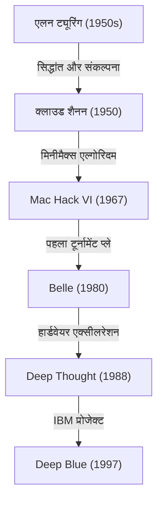
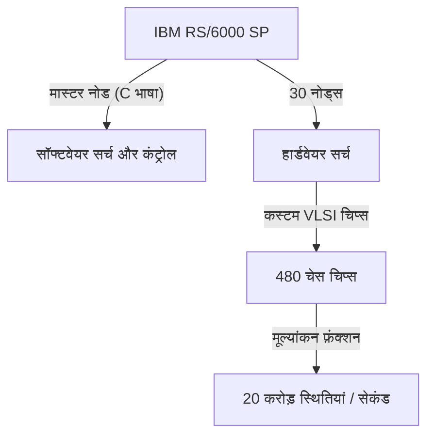

## प्रस्तावना: 1997, "अज्ञात बुद्धिमत्ता" जिसका सामना मानवता ने किया

11 मई, 1997 को न्यूयॉर्क के इक्विटेबल सेंटर में खेला गया शतरंज का मैच मानव इतिहास में एक विलक्षण बिंदु के रूप में याद किया जाता है। तत्कालीन विश्व शतरंज चैंपियन और "इतिहास के सबसे महान खिलाड़ी" के रूप में जाने जाने वाले गैरी कास्पारोव (Garry Kasparov) को IBM द्वारा विकसित सुपरकंप्यूटर "डीप ब्लू (Deep Blue)" ने हरा दिया था।

यह घटना एक साधारण बोर्ड गेम की जीत या हार से कहीं आगे थी, और यह लंबे समय से चले आ रहे दार्शनिक प्रश्न "क्या वह दिन आएगा जब मशीनें मानवीय बुद्धिमत्ता को पार कर जाएंगी?" के लिए एक मजबूत मील का पत्थर बन गई। इस लेख में, हम 1997 के इस मैच तक के कंप्यूटर शतरंज के इतिहास, कास्पारोव जैसे दिग्गज की यात्रा, डीप ब्लू की तकनीकी पृष्ठभूमि, और उस प्रसिद्ध छह-गेम के मैच के विवरण को उजागर करेंगे, और एआई (कृत्रिम बुद्धिमत्ता) के इतिहास में इस घटना के अर्थ का गहराई से विश्लेषण करेंगे।

## कंप्यूटर शतरंज की शुरुआत: ट्यूरिंग से लेकर डीप ब्लू तक

कंप्यूटर से शतरंज खिलवाने का विचार कंप्यूटर विज्ञान के शुरुआती दिनों से ही मौजूद था। एलन ट्यूरिंग और क्लाउड शैनन जैसे अग्रदूत शतरंज को "मानवीय विचार प्रक्रियाओं की नकल करने और उन्हें समझने के लिए एक आदर्श परीक्षण का मैदान (टेस्टबेड)" मानते थे।

1950 के दशक में, क्लाउड शैनन ने शतरंज के कार्यक्रमों पर एक ऐतिहासिक पेपर प्रकाशित किया, जिसने मिनीमैक्स विधि (Minimax) पर आधारित [खोज एल्गोरिदम](/hi/p/search-algorithms-linear-binary-hash-table-principles/) की नींव रखी। इसके बाद, 1970 और 80 के दशक के दौरान, शतरंज-विशिष्ट हार्डवेयर से लैस मशीनें सामने आने लगीं। बेल लैब्स की "Belle" ने समर्पित सर्किट का उपयोग करके प्रति सेकंड हजारों स्थितियों की खोज की, और इसमें मास्टर क्लास की ताकत थी।

फिर, कार्नेगी मेलन विश्वविद्यालय के छात्रों द्वारा विकसित "Deep Thought" एक ग्रैंडमास्टर को हराने वाला पहला कंप्यूटर बन गया। IBM ने इस परियोजना को अपने हाथ में लिया, और भारी निवेश तथा बेहतरीन इंजीनियरिंग के साथ "डीप ब्लू" का निर्माण किया।

## IBM की उत्कृष्ट कृति "डीप ब्लू" का आर्किटेक्चर

डीप ब्लू उस समय की अत्याधुनिक समानांतर कंप्यूटिंग (parallel computing) तकनीक का परिणाम था। यह सामान्य-प्रयोजन वाले सुपरकंप्यूटर "IBM RS/6000 SP" पर आधारित था, और इसमें शतरंज के लिए विशेष रूप से डिज़ाइन किए गए बड़ी संख्या में VLSI चिप्स लगे थे।

इसकी सबसे बड़ी विशेषता इसकी **प्रति सेकंड 20 करोड़ चालों (20 करोड़ स्थितियों)** की खोज करने की असीम क्षमता थी, जिसे "ब्रूट फोर्स (Brute-force)" खोज कहा जाता है। जबकि एक मानव खिलाड़ी प्रति सेकंड केवल कुछ चालों के बारे में ही सोच सकता है (लेकिन अपनी उच्च अंतर्ज्ञान से आशाजनक चालों को चुनता है), डीप ब्लू ने एक कारपेट-बॉम्बिंग दृष्टिकोण अपनाया जिसमें हर संभव चाल की गणना की गई। इसके अलावा, शतरंज के ग्रैंडमास्टर जोएल बेंजामिन जैसे लोग विकास टीम में शामिल हुए और उन्होंने मूल्यांकन फ़ंक्शन (स्थिति के फायदे और नुकसान को मापने वाला एल्गोरिदम) को बारीकी से ट्यून किया।

## इतिहास का सबसे मजबूत चैंपियन, गैरी कास्पारोव

दूसरी ओर, गैरी कास्पारोव 22 वर्ष की सबसे कम उम्र में विश्व चैंपियन बने, और एक परम प्रतिभाशाली खिलाड़ी थे जिन्होंने 15 वर्षों तक इस खिताब को बरकरार रखा। उनकी खेलने की शैली बेहद आक्रामक थी, और वे गहरी सोच, उत्कृष्ट अंतर्ज्ञान, और विरोधियों पर भारी दबाव डालने वाले मनोवैज्ञानिक युद्ध में माहिर थे।

वह अब तक किसी भी कंप्यूटर के खिलाफ समान या उससे बेहतर खेले थे, और उन्हें पूरा विश्वास था कि इंसान कभी भी मशीनों से नहीं हारेंगे (कम से कम उनके जीवनकाल में)। 1996 में फिलाडेल्फिया में डीप ब्लू के साथ हुए पहले मैच में, भले ही कास्पारोव पहला गेम हार गए, अंततः उन्होंने 3 जीत, 1 हार और 2 ड्रॉ के साथ जीत हासिल की। उस समय, कास्पारोव ने घोषणा की थी कि "मशीनें कभी भी मनुष्य की सच्ची बुद्धिमत्ता और अंतर्ज्ञान को नहीं हरा सकतीं।"

## 1997: भाग्य का रिटर्न मैच (न्यूयॉर्क)

1996 की हार के बाद, IBM की विकास टीम (फेंग-ह्सियुंग ह्सू, मरे कैंपबेल आदि) ने डीप ब्लू में पूरी तरह से सुधार किया। उन्होंने इसकी गणना की गति को दोगुना कर दिया, इसके मूल्यांकन फ़ंक्शन को अधिक लचीला और मानवीय बना दिया, और इसे कास्पारोव के पिछले सभी गेम रिकॉर्ड सिखाए। "डीपर ब्लू (Deeper Blue)" के नाम से जाना जाने वाला यह नया संस्करण मई 1997 के रीमैच में मंच पर आया।

### गेम 1: कास्पारोव की अपेक्षित जीत
गेम 1 में, कास्पारोव अपनी शैली पर टिके रहे और एक जटिल स्थिति बनाकर जीत हासिल की। डीप ब्लू की गणना शक्ति बहुत अच्छी थी, लेकिन ऐसा लगा कि वह दीर्घकालिक रणनीति या स्थिति की सूक्ष्मताओं को नहीं समझ सका। सभी को लगा कि "इस बार भी कास्पारोव की जीत होगी।"

### गेम 2: संदिग्ध 44वीं चाल और कास्पारोव की घबराहट
इतिहास का निर्णायक मोड़ गेम 2 में आया। यहाँ डीप ब्लू ने एक ऐसी चाल चली जो "मानवीय" थी और "दीर्घकालिक स्थितिगत लाभ" पर जोर देती थी - ऐसी चाल जो पिछले कंप्यूटर कभी नहीं चलते थे। विशेष रूप से, डीप ब्लू की 44वीं चाल बहुत ही परिष्कृत और रणनीतिक थी, जिसमें उसने तत्काल भौतिक लाभ (विरोधी का मोहरा लेने का मौका) को छोड़ दिया और विरोधी के पलटवार की संभावना को पूरी तरह से कुचल दिया।

कास्पारोव इस चाल से बहुत परेशान हुए। उन्होंने बाद में कहा, "मैंने बोर्ड के उस पार एक उत्कृष्ट मानवीय बुद्धिमत्ता को महसूस किया।" घबराहट में, कास्पारोव ने 45वीं चाल में हार मान ली (इस्तीफा दे दिया), भले ही अभी भी ड्रा की संभावना थी। इस हार ने कास्पारोव के मन में यह संदेह पैदा कर दिया कि "IBM मैच के दौरान किसी मानव ग्रैंडमास्टर को हस्तक्षेप करवा रहा है," जिससे वे मनोवैज्ञानिक रूप से गहरे दबाव में आ गए।

### गेम 3-5: तनावपूर्ण ड्रा
गेम 3 से 5 तक, कास्पारोव ने कंप्यूटर की पसंदीदा सामरिक उलझनों से बचने की कोशिश की और दीर्घकालिक रणनीतिक लड़ाई (बंद स्थितियों) का सहारा लेकर डीप ब्लू की गणना शक्ति को बेअसर करने का प्रयास किया। परिणामस्वरूप, ये सभी खेल ड्रा रहे। स्कोर 2.5 बनाम 2.5 से बराबर था। अब सब कुछ अंतिम गेम 6 पर निर्भर था।

### गेम 6: चैंपियन का पतन (11 मई)
भाग्य का खेल 6। कास्पारोव काले मोहरों के साथ खेल रहे थे और उन्होंने कैरो-कन्न डिफेंस (Caro-Kann Defense) चुना। हालाँकि, उन्होंने शुरुआत में ही एक तरह का जुआ खेला और ज्ञात उद्घाटनों (openings) से हटकर एक चाल चली। यह डीप ब्लू के उद्घाटन डेटाबेस को भ्रमित करने की एक रणनीति थी, लेकिन यह एक घातक गलती साबित हुई।

डीप ब्लू ने तुरंत नाइट (घोड़े) की बलि देकर एक शक्तिशाली हमला किया (नाइट सैक्रिफाइस)। कंप्यूटर शतरंज में, "यह आमतौर पर चुनी जाने वाली चाल नहीं है क्योंकि यह अस्थायी रूप से मूल्यांकन मूल्य को कम कर देती है," लेकिन उन्नत डीप ब्लू ने इसके बाद के घटनाक्रम को पूरी तरह से पढ़ लिया था।

पूरी तरह से रक्षात्मक स्थिति में आ चुके कास्पारोव को केवल 19 चालों के बाद शर्मनाक तरीके से हार मानने के लिए मजबूर होना पड़ा। स्कोर 3.5 बनाम 2.5 था। यह वह क्षण था जब इतिहास का सबसे मजबूत इंसान अंततः एक मशीन से हार गया।

## इस हार का अर्थ: एआई प्रतिमान में बदलाव

डीप ब्लू की जीत ने पूरी दुनिया को सदमे में डाल दिया। न्यूज़वीक पत्रिका के कवर पर शीर्षक था "The Brain's Last Stand (मस्तिष्क का अंतिम प्रतिरोध)"।

हालाँकि, तकनीकी दृष्टिकोण से देखा जाए तो, डीप ब्लू आधुनिक एआई (जैसे डीप लर्निंग) से मौलिक रूप से अलग है। डीप ब्लू कोई "स्वायत्त रूप से सीखने और अवधारणाओं को समझने वाला एआई" नहीं था, बल्कि यह "विशेषज्ञ प्रणाली (Expert System)" का अंतिम रूप था। यह मानव विशेषज्ञों द्वारा परिभाषित नियमों और मूल्यांकन कार्यों के आधार पर सुपरफास्ट हार्डवेयर के माध्यम से **ब्रूट-फोर्स पूर्ण खोज** द्वारा इष्टतम समाधान निकालता था।

इस जीत ने यह दिखाया कि "शतरंज जैसे सीमित नियमों और पूर्ण-जानकारी वाले खेल की सीमाओं के भीतर, मानवीय अंतर्ज्ञान और समग्र दृष्टि को भी अत्यधिक गणना द्वारा संचालित पैटर्न खोज के माध्यम से पार किया जा सकता है।"

इसके बाद, कृत्रिम बुद्धिमत्ता पर शोध नियम-आधारित खोज से हटकर तंत्रिका नेटवर्क (Neural Networks) का उपयोग करते हुए मशीन लर्निंग की ओर स्थानांतरित हो गया। Google DeepMind का "AlphaGo", जिसने 2016 में दुनिया के शीर्ष गो (Go) खिलाड़ी ली सेडोल को हराया, ने डीप ब्लू की तरह ब्रूट फोर्स का उपयोग नहीं किया, बल्कि डीप लर्निंग और सुदृढीकरण शिक्षा (Reinforcement Learning) का उपयोग करके "स्वयं मूल्यांकन फ़ंक्शन सीखने" के एक दृष्टिकोण के साथ जीत हासिल की, जो मानवीय अंतर्ज्ञान के बहुत करीब है। एक मायने में, डीप ब्लू "अच्छे पुराने एआई (Good Old-Fashioned AI)" का शिखर और पूर्ण रूप था।

## निष्कर्ष: मानवता की सीमा या एक नई संभावना?

मैच के बाद, कास्पारोव उग्र हो गए और उन्होंने IBM से लॉग प्रकाशित करने और रीमैच की मांग की, लेकिन IBM ने यह कहते हुए डीप ब्लू को तुरंत रिटायर करके नष्ट कर दिया कि उनका उद्देश्य पूरा हो गया था। इस प्रतिक्रिया ने कास्पारोव के मन में लंबे समय तक अविश्वास पैदा कर दिया।

हालाँकि, समय बीतने के साथ, कास्पारोव की सोच में बदलाव आया। आज, एआई के खतरे से अत्यधिक डरने के बजाय, वह "सेंटॉर चेस (Centaur Chess - एक ऐसा प्रारूप जिसमें इंसान और एआई मिलकर खेलते हैं)" के समर्थकों में से एक बन गए हैं, जो एआई को "मानव क्षमताओं को बढ़ाने के एक उपकरण" के रूप में देखता है।

1997 में डीप ब्लू की जीत मानवता की हार नहीं थी। यह "मानवीय इंजीनियरिंग की जीत" थी, यह साबित करते हुए कि मानव बुद्धि द्वारा बनाए गए उपकरण ने अंततः एक क्षेत्र में अपने निर्माता की सीमाओं को पार कर लिया है। इस ऐतिहासिक मैच के दशकों बाद भी, यह सवाल कि हम एआई के साथ कैसे सह-अस्तित्व में रहेंगे और हम अपनी क्षमताओं का विस्तार कैसे करेंगे, आज भी उतना ही प्रासंगिक है。
