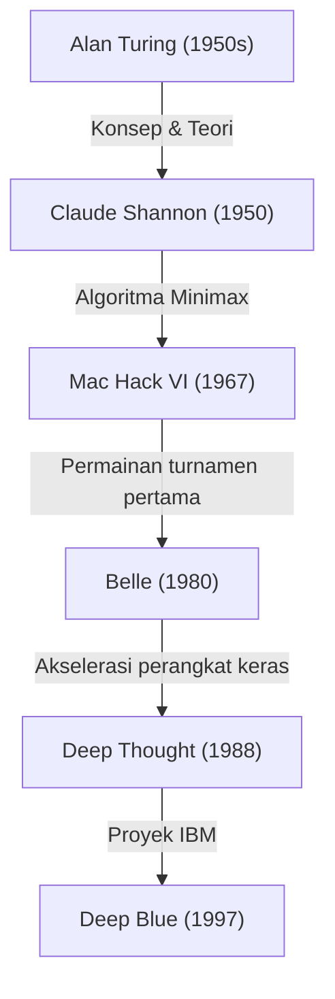
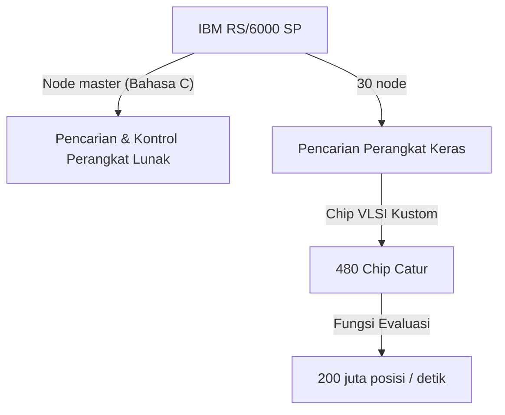

## Pengantar: 1997, "Kecerdasan Tak Dikenal" yang Dihadapi Umat Manusia

Pertandingan catur yang diadakan di Equitable Center, New York, pada 11 Mei 1997 dikenang sebagai salah satu titik singularitas dalam sejarah umat manusia. Garry Kasparov, juara dunia catur saat itu yang diakui sebagai "pemain terkuat dalam sejarah", menelan kekalahan dari superkomputer buatan IBM, "Deep Blue".

Peristiwa ini melampaui sekadar menang-kalah dalam permainan papan, dan menjadi tonggak sejarah yang kuat untuk menjawab pertanyaan filosofis yang telah lama ada: "Akankah tiba harinya mesin melampaui kecerdasan manusia?". Dalam artikel ini, kita akan menelusuri sejarah catur komputer hingga pertandingan tahun 1997, jejak langkah raksasa Kasparov, latar belakang teknis Deep Blue, dan detail dari 6 pertandingan legendaris tersebut, sembari menggali makna di balik peristiwa ini dalam sejarah AI (Kecerdasan Buatan).

## Fajar Catur Komputer: Dari Turing hingga Deep Blue

Gagasan untuk membuat komputer bermain catur telah ada sejak masa awal ilmu komputer. Para pelopor seperti Alan Turing dan Claude Shannon memandang catur sebagai "tempat uji coba yang ideal untuk meniru dan mengungkap proses pemikiran manusia".

Pada tahun 1950-an, Claude Shannon menerbitkan makalah monumental tentang program catur, meletakkan dasar bagi algoritma pencarian berbasis metode Minimax. Kemudian, antara tahun 1970-an dan 80-an, mesin yang dilengkapi perangkat keras khusus untuk catur mulai bermunculan. "Belle" dari Bell Labs memamerkan kekuatan setingkat master dengan menggunakan sirkuit khusus yang mampu mengevaluasi puluhan ribu posisi per detik.

Lalu, "Deep Thought", yang dikembangkan oleh mahasiswa Universitas Carnegie Mellon, menjadi komputer pertama yang mengalahkan seorang grandmaster. Proyek ini kemudian diambil alih oleh IBM, yang menyuntikkan dana besar dan rekayasa teknik tingkat tertinggi untuk menciptakan "Deep Blue".

## Arsitektur "Deep Blue", Mahakarya IBM

Deep Blue adalah kristalisasi dari teknologi komputasi paralel paling mutakhir pada masanya. Berbasis pada superkomputer serbaguna "IBM RS/6000 SP", mesin ini memuat sejumlah besar chip VLSI yang dirancang khusus untuk catur.

Fitur utamanya adalah kekuatan komputasi luar biasa yang mampu mengevaluasi **200 juta langkah (200 juta posisi) per detik**, sebuah pendekatan yang dikenal dengan istilah "Brute Force" (pencarian paksa). Berbeda dengan pemain manusia yang hanya membaca beberapa hingga puluhan langkah per detik (namun memfilter langkah yang menjanjikan dengan intuisi tingkat tinggi), Deep Blue mengambil pendekatan menghitung semua kemungkinan seperti pengeboman karpet. Selain itu, grandmaster catur Joel Benjamin dan yang lainnya bergabung dengan tim pengembangan untuk melakukan penyesuaian menyeluruh pada fungsi evaluasi (algoritma yang mengukur seberapa menguntungkan suatu posisi).

## Juara Terkuat Sepanjang Masa, Garry Kasparov

Sebagai lawannya, Garry Kasparov adalah seorang jenius absolut yang menjadi juara dunia termuda pada usia 22 tahun, dan mempertahankan tahtanya selama 15 tahun. Gaya bermainnya sangat agresif, unggul dalam perhitungan yang mendalam, intuisi luar biasa, dan perang psikologis yang memberikan tekanan luar biasa pada lawannya.

Hingga saat itu, ia telah bertanding melawan komputer apa pun dan selalu lebih unggul, meyakini bahwa manusia tidak akan pernah kalah dari mesin (setidaknya selama ia masih hidup). Pada pertandingan pertamanya melawan Deep Blue pada tahun 1996 di Philadelphia, meskipun Kasparov kalah pada gim pertama, ia pada akhirnya menang dengan 3 kemenangan, 1 kekalahan, dan 2 hasil imbang. Saat itu, Kasparov menyatakan, "Mesin tidak akan pernah bisa mengalahkan kecerdasan sejati dan intuisi manusia."

## 1997: Pertandingan Ulang yang Menentukan (New York)

Menerima kekalahan di tahun 1996, tim pengembang IBM (Feng-hsiung Hsu, Murray Campbell, dkk.) menyempurnakan Deep Blue secara drastis. Mereka menggandakan kecepatan perhitungan, menyesuaikan fungsi evaluasi agar lebih fleksibel seperti manusia, dan memasukkan seluruh catatan pertandingan Kasparov di masa lalu ke dalam sistemnya. Versi baru yang juga disebut "Deeper Blue" ini melangkah ke panggung pertandingan ulang pada Mei 1997.

### Gim 1: Kemenangan Wajar Kasparov
Pada gim pertama, Kasparov mempertahankan gayanya, membawa permainan ke posisi yang rumit dan meraih kemenangan. Meskipun unggul dalam perhitungan, Deep Blue tampak tidak memahami strategi jangka panjang dan kerumitan posisi. Semua orang berpikir, "Kali ini juga akan berakhir dengan kemenangan Kasparov."

### Gim 2: Langkah ke-44 yang Mencurigakan dan Kegelisahan Kasparov
Titik balik sejarah terjadi di gim kedua. Di sini, Deep Blue memainkan langkah yang sangat "manusiawi" dan "mengutamakan keunggulan posisi jangka panjang", sesuatu yang tidak akan pernah dilakukan oleh komputer sebelumnya. Secara khusus, langkah ke-44 Deep Blue merupakan langkah strategis yang sangat canggih: mesin ini sengaja melewatkan keuntungan material di depan mata (kesempatan untuk memakan bidak), demi memotong habis peluang serangan balik lawan.

Kasparov sangat terguncang oleh langkah ini. Ia kemudian berkata, "Saya merasakan kecerdasan manusia yang luar biasa dari seberang papan." Dilanda kepanikan, Kasparov memilih untuk menyerah (resign) pada langkah ke-45, meskipun masih ada kemungkinan untuk memaksakan hasil imbang. Kekalahan ini membuat Kasparov mulai curiga bahwa "IBM mungkin telah campur tangan menggunakan grandmaster manusia selama pertandingan," yang semakin menyudutkannya secara psikologis.

### Gim 3–5: Hasil Imbang yang Menegangkan
Dari gim ke-3 hingga ke-5, Kasparov mencoba menetralkan kekuatan perhitungan Deep Blue dengan menghindari pertarungan taktis yang menjadi keahlian komputer, dan memilih perang strategis jangka panjang (posisi tertutup). Hasilnya, semua gim ini berakhir imbang (draw). Skor menjadi imbang 2.5 - 2.5. Semuanya bergantung pada gim ke-6 yang terakhir.

### Gim 6: Runtuhnya Sang Juara (11 Mei)
Gim ke-6 yang menentukan. Kasparov memegang bidak hitam dan memilih Pertahanan Caro-Kann (Caro-Kann Defense). Namun, di awal permainan ia mengambil langkah yang menyimpang dari pembukaan (opening) yang sudah dikenal, sebuah langkah yang bisa dibilang sebagai pertaruhan. Itu adalah siasat untuk mengacaukan basis data pembukaan Deep Blue, tetapi justru menjadi kesalahan fatal.

Deep Blue seketika melancarkan serangan kuat dengan mengorbankan kuda (Knight Sacrifice). Dalam catur komputer, ini biasanya merupakan langkah yang "tidak dipilih karena nilai evaluasinya akan turun untuk sementara waktu", tetapi Deep Blue yang telah disempurnakan mampu membaca perkembangan situasi selanjutnya dengan sempurna.

Kasparov, yang terus-menerus harus bertahan, terpaksa menelan kekalahan memalukan hanya dalam 19 langkah singkat. Skor menjadi 3.5 melawan 2.5. Itu adalah momen ketika umat manusia terkuat, akhirnya tumbang oleh mesin.

## Makna di Balik Kekalahan Ini: Transisi Paradigma AI

Kemenangan Deep Blue memberikan kejutan yang tak terukur di seluruh dunia. Sampul majalah Newsweek mengusung tajuk "The Brain's Last Stand" (Perlawanan Terakhir Otak).

Namun, dari sudut pandang teknis, Deep Blue pada dasarnya berbeda dengan AI modern (seperti deep learning). Deep Blue bukanlah "AI yang belajar secara mandiri dan memahami konsep", melainkan bentuk pamungkas dari "Sistem Pakar" (Expert System) yang menemukan solusi optimal melalui **pencarian paksa secara menyeluruh (Brute Force)** dengan perangkat keras super cepat, berdasarkan aturan dan fungsi evaluasi yang didefinisikan oleh pakar manusia.

Kemenangan ini menunjukkan fakta bahwa "dalam batasan aturan dan permainan informasi sempurna seperti catur, bahkan intuisi dan pandangan luas manusia dapat dikalahkan oleh pencarian pola dengan volume perhitungan yang luar biasa".

Setelah itu, penelitian kecerdasan buatan beralih dari pencarian berbasis aturan menuju machine learning menggunakan jaringan saraf tiruan (neural networks). Pada tahun 2016, "AlphaGo" milik Google DeepMind yang mengalahkan Lee Sedol, pemain Go terbaik dunia, tidak menggunakan brute force seperti Deep Blue. Ia menang dengan pendekatan yang lebih mendekati intuisi manusia, yaitu "mempelajari sendiri fungsi evaluasinya" menggunakan deep learning dan reinforcement learning (pembelajaran penguatan). Dalam arti tertentu, Deep Blue adalah puncak sekaligus bentuk sempurna dari "AI klasik yang hebat".

## Penutup: Batas Kemampuan Manusia atau Kemungkinan Baru?

Setelah pertandingan, Kasparov sangat marah dan menuntut IBM untuk memublikasikan log serta meminta pertandingan ulang, tetapi IBM langsung membongkar dan memensiunkan Deep Blue karena menganggap tujuannya telah tercapai. Respons ini meninggalkan ketidakpercayaan mendalam pada diri Kasparov untuk waktu yang lama.

Namun, seiring berjalannya waktu, pandangan Kasparov juga berubah. Saat ini, daripada menakuti ancaman AI secara berlebihan, ia menjadi salah satu pendukung "Catur Centaur" (format di mana manusia dan AI bekerja sama untuk bermain), yang memandang AI sebagai "alat untuk memperluas kemampuan manusia".

Kemenangan Deep Blue pada tahun 1997 bukanlah kekalahan umat manusia. Itu adalah "kemenangan rekayasa manusia", ketika alat yang diciptakan oleh kecerdasan manusia sendiri akhirnya melampaui batas kemampuan penciptanya dalam satu bidang tertentu. Puluhan tahun setelah pertandingan bersejarah tersebut, pertanyaan tentang bagaimana kita akan hidup berdampingan dengan AI dan bagaimana kita akan memperluas kemampuan kita sendiri, terus dihadapkan pada kita tanpa pernah memudar.
