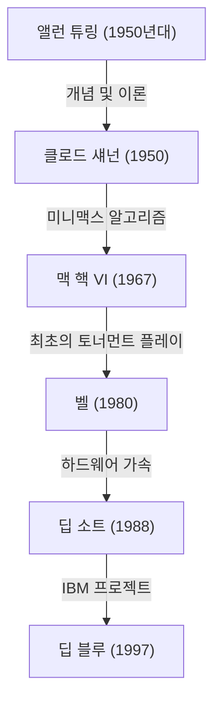
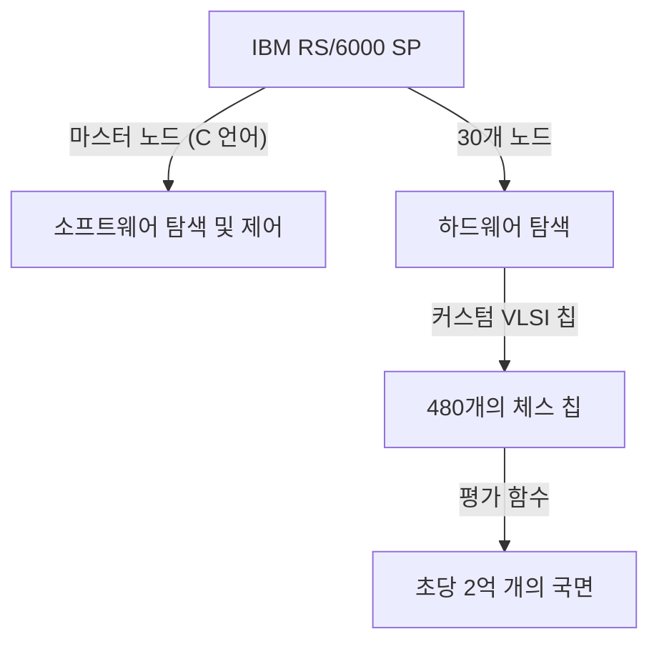

## 시작하며: 1997년, 인류가 직면한 '미지의 지성'

1997년 5월 11일, 뉴욕의 에퀴터블 센터(Equitable Center)에서 열린 체스 대국은 인류 역사에 있어 하나의 특이점으로 기억되고 있습니다. 당시 체스 세계 챔피언이자 '사상 최강의 플레이어'라 불리던 가리 카스파로프(Garry Kasparov)가 IBM이 개발한 슈퍼컴퓨터 '딥 블루(Deep Blue)'에게 패배를 당한 것입니다.

이 사건은 단순한 보드게임의 승패를 넘어 "기계가 인간의 지성을 넘어서는 날이 올 것인가?"라는 오랜 철학적 질문에 대한 하나의 강렬한 이정표가 되었습니다. 본 기사에서는 이 1997년의 매치에 이르기까지 컴퓨터 체스의 역사, 카스파로프라는 거인의 궤적, 딥 블루의 기술적 배경, 그리고 전설이 된 6번기의 상세한 내용을 살펴보며, AI(인공지능) 역사에서 이 사건이 어떤 의미를 지니고 있었는지를 깊이 파헤쳐 보겠습니다.

## 컴퓨터 체스의 여명: 튜링부터 딥 블루까지

컴퓨터에게 체스를 플레이하게 한다는 아이디어는 컴퓨터 과학의 여명기부터 존재했습니다. 앨런 튜링과 클로드 섀넌 같은 선구자들은 체스를 '인간의 사고 과정을 모방하고 규명하기 위한 이상적인 테스트베드'로 여겼습니다.

1950년대에 클로드 섀넌은 체스 프로그램에 관한 기념비적인 논문을 발표하고, 미니맥스 알고리즘에 기반한 탐색 알고리즘의 기초를 다졌습니다. 이후 1970년대부터 80년대에 걸쳐 체스 전용 하드웨어를 탑재한 머신이 등장하기 시작합니다. 벨 연구소의 '벨(Belle)'은 전용 회로를 사용하여 1초에 수만 개의 국면을 탐색하며 마스터급의 강함을 자랑했습니다.

그리고 카네기멜론 대학교의 학생들에 의해 개발된 '딥 소트(Deep Thought)'가 그랜드마스터를 꺾은 최초의 컴퓨터가 됩니다. 이 프로젝트를 IBM이 넘겨받아 막대한 자금과 최고의 엔지니어링을 쏟아부어 탄생시킨 것이 바로 '딥 블루'였습니다.

## IBM의 걸작 '딥 블루'의 아키텍처

딥 블루는 당시 최첨단 병렬 컴퓨팅 기술의 결정체였습니다. 범용 슈퍼컴퓨터인 'IBM RS/6000 SP'를 기반으로, 체스 전용으로 설계된 VLSI 칩을 대량으로 탑재하고 있었습니다.

가장 큰 특징은 **1초에 2억 수(2억 국면)**라는 엄청난 수의 국면을 탐색할 수 있는 압도적인 계산력, 이른바 '브루트 포스(Brute force, 무차별 대입 탐색)'에 있었습니다. 인간 플레이어가 1초에 수~수십 수밖에 읽지 않는(그러나 고도의 직관으로 유망한 수를 좁히는) 반면, 딥 블루는 모든 가능성을 융단폭격하듯 샅샅이 계산하는 방식을 취했습니다. 또한, 체스 그랜드마스터인 조엘 벤자민 등이 개발팀에 합류하여 국면의 평가 함수(포지션의 유불리를 수치화하는 알고리즘)를 철저하게 튜닝했습니다.

## 사상 최강의 챔피언, 가리 카스파로프

상대인 가리 카스파로프는 역대 최연소인 22세에 세계 챔피언이 되어 이후 15년 동안 왕좌에 군림했던 절대적인 천재입니다. 그의 플레이 스타일은 극히 공격적이었으며, 깊은 수읽기와 탁월한 직관, 그리고 상대에게 엄청난 압박감을 주는 심리전에 능했습니다.

그는 지금까지 어떤 컴퓨터와도 대등 이상으로 싸워왔고, 인간이 기계에게 지는 일은 (적어도 자신이 살아있는 동안에는) 없을 것이라고 확신했습니다. 1996년에 열린 딥 블루와의 첫 매치(필라델피아)에서도 카스파로프는 첫 번째 게임을 내주긴 했지만, 결국 3승 1패 2무로 승리를 거두었습니다. 이때 카스파로프는 "기계는 결코 인간의 진정한 지성, 직관을 이길 수 없다"고 선언했습니다.

## 1997년: 운명의 리턴 매치 (뉴욕)

1996년의 패배를 딛고, IBM의 개발팀(쉬펑슝, 머레이 캠벨 등)은 딥 블루를 철저하게 개량했습니다. 계산 속도를 두 배로 늘리고, 평가 함수를 보다 인간에 가깝게 유연하게 조정했으며, 카스파로프의 과거 기보를 모두 학습시켰습니다. '디퍼 블루(Deeper Blue)'라고도 불린 이 새로운 버전이 1997년 5월 재대결 무대에 올랐습니다.

### 제1게임: 카스파로프의 순조로운 승리
제1게임에서 카스파로프는 자신의 스타일을 고수하며 복잡한 국면으로 끌고 가 승리를 거두었습니다. 딥 블루는 계산력은 뛰어나지만 장기적인 전략이나 포지션의 미묘함을 이해하지 못하는 것처럼 보였습니다. 모두가 '이번에도 카스파로프의 승리로 끝날 것'이라고 생각했습니다.

### 제2게임: 의혹의 제44수와 카스파로프의 동요
역사의 전환점이 된 것은 제2게임입니다. 여기서 딥 블루는 기존의 컴퓨터가 절대 하지 않을 법한 '인간적'이고 '장기적인 포지션의 우위를 중시하는' 수를 두었습니다. 특히, 딥 블루의 44번째 수는 눈앞의 물질적 이익(기물을 잡을 기회)을 굳이 포기하고 상대의 반격의 싹을 완전히 잘라버리는 극히 세련되고 전략적인 한 수였습니다.

카스파로프는 이 수에 격하게 동요했습니다. 그는 나중에 "체스판 건너편에서 탁월한 인간의 지성을 느꼈다"고 말했습니다. 패닉에 빠진 카스파로프는 아직 무승부로 이끌 가능성이 있었음에도 불구하고 45번째 수에서 스스로 기권(Resign)하고 말았습니다. 이 패배로 카스파로프는 'IBM이 대국 중에 인간 그랜드마스터를 개입시키고 있는 것이 아닌가'하는 의구심을 갖게 되었고, 심리적으로 깊이 궁지에 몰려갔습니다.

### 제3~5게임: 숨 막히는 무승부
제3게임부터 제5게임까지는 카스파로프가 컴퓨터가 특기로 하는 전술적인 난전을 피하고, 장기적인 전략전(클로즈드 게임)으로 끌고 가 딥 블루의 계산력을 무력화하려고 시도했습니다. 결과적으로 이들은 모두 무승부(Draw)로 끝났습니다. 스코어는 2.5 대 2.5의 동점. 모든 것은 마지막 제6게임에 맡겨졌습니다.

### 제6게임: 챔피언의 붕괴 (5월 11일)
운명의 제6게임. 카스파로프는 흑번(후수)으로 카로-칸 디펜스(Caro-Kann Defense)를 선택했습니다. 그러나 그는 초반에 알려진 정석에서 벗어나는, 일종의 도박이라고도 할 수 있는 수를 두었습니다. 딥 블루의 정석 데이터베이스를 교란시키기 위한 책략이었지만, 이것이 치명적인 실수가 됩니다.

딥 블루는 즉각적으로 나이트를 희생하는 강력한 공격을 시도했습니다(나이트 새크리파이스). 이는 컴퓨터 체스에서는 '평가치가 일시적으로 떨어지기 때문에 일반적으로 선택되지 않는 수'였지만, 개량된 딥 블루는 완벽하게 그 후의 전개를 읽어내고 있었습니다.

수세에 몰린 카스파로프는 불과 19수라는 짧은 수순 만에 굴욕적인 기권을 해야만 했습니다. 스코어는 3.5 대 2.5. 사상 최강의 인류가 마침내 기계에게 패배한 순간이었습니다.

## 이 패배가 의미한 것: AI 패러다임의 변천

딥 블루의 승리는 전 세계에 헤아릴 수 없는 충격을 주었습니다. 뉴스위크지의 표지에는 "The Brain's Last Stand(뇌의 마지막 저항)"이라는 제목이 실렸습니다.

그러나 기술적인 관점에서 보면 딥 블루는 현대의 AI(딥러닝 등)와는 근본적으로 다릅니다. 딥 블루는 '자율적으로 학습하고 개념을 이해하는 AI'가 아니라, 인간 전문가가 정의한 규칙과 평가 함수를 바탕으로 초고속 하드웨어를 통한 **무차별 대입 탐색(브루트 포스)**으로 최적해를 도출해내는 '전문가 시스템(Expert system)'의 궁극적인 형태였습니다.

이 승리가 보여준 것은 '체스라는 제한된 규칙과 완전 정보 게임의 틀 안에서는 인간의 직관이나 대국관조차도 압도적인 계산량에 의한 패턴 탐색으로 능가할 수 있다'는 사실이었습니다.

이후 인공지능 연구는 규칙 기반의 탐색에서 신경망을 이용한 기계 학습으로 전환되어 갑니다. 2016년 바둑 세계 정상급 기사인 이세돌을 꺾은 구글 딥마인드의 '알파고(AlphaGo)'는 딥 블루와 같은 브루트 포스가 아니라, 심층 학습(딥러닝)과 강화 학습을 사용하여 '스스로 평가 함수를 학습하는', 보다 인간의 직관에 가까운 접근 방식으로 승리를 거두었습니다. 딥 블루는 어떤 의미에서 '좋았던 시절의 AI'의 정점이자 완성형이었던 것입니다.

## 맺음말: 인류의 한계인가, 새로운 가능성인가

대국 후 카스파로프는 격노하며 IBM에 로그 공개와 재대결을 요구했지만, IBM은 목적을 달성했다며 딥 블루를 즉시 해체하고 은퇴시켰습니다. 이 대응은 카스파로프 내면에 오랫동안 불신감을 남기게 됩니다.

그러나 시간이 지나면서 카스파로프의 생각도 변화해 갔습니다. 현재 그는 AI의 위협을 과도하게 두려워하기보다는, AI를 '인간의 능력을 확장하기 위한 도구'로 파악하는 '켄타우로스 체스(인간과 AI가 팀을 이뤄 플레이하는 형태)'의 제창자 중 한 명이 되었습니다.

1997년 딥 블루의 승리는 인류의 패배가 아니었습니다. 그것은 인간 자신의 지성이 만들어낸 도구가 마침내 한 영역에서 창조주의 한계를 넘어섰다는, '인간 엔지니어링의 승리'였던 것입니다. 이 역사적인 대국으로부터 수십 년이 지난 지금도, 우리가 AI와 어떻게 공존하고, 어떻게 스스로의 능력을 확장해 나갈 것인가 하는 질문은 퇴색되지 않은 채 우리에게 던져지고 있습니다.
