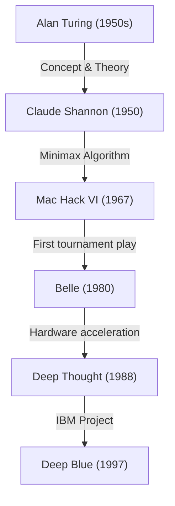
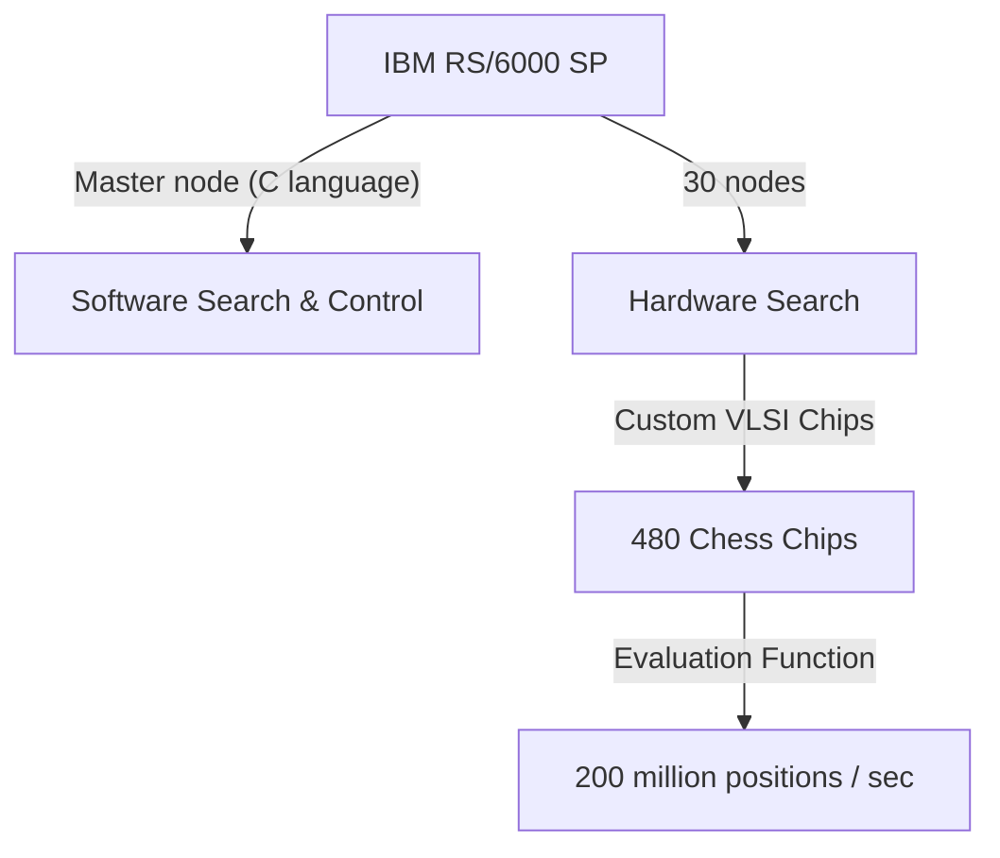

## はじめに：1997年、人類が直面した「未知なる知性」

1997年5月11日、ニューヨークの equitable center で行われたチェスの対局は、人類の歴史における一つの特異点として記憶されています。当時のチェス世界チャンピオンであり、「史上最強のプレイヤー」と謳われたガルリ・カスパロフ（Garry Kasparov）が、IBMの開発したスーパーコンピュータ「ディープブルー（Deep Blue）」に敗北を喫したのです。

この出来事は単なるボードゲームの勝敗を超え、「機械が人間の知性を超える日が来るのか？」という長年の哲学的な問いに対する、一つの強烈なマイルストーンとなりました。本記事では、この1997年のマッチに至るまでのコンピュータチェスの歴史、カスパロフという巨人の軌跡、ディープブルーの技術的背景、そして伝説となった6番勝負の詳細を紐解きながら、AI（人工知能）史においてこの事件がどのような意味を持っていたのかを深掘りしていきます。

## コンピュータチェスの夜明け：チューリングからディープブルーまで

コンピュータにチェスをプレイさせるというアイデアは、計算機科学の黎明期から存在していました。アラン・チューリングやクロード・シャノンといった先駆者たちは、チェスを「人間の思考プロセスを模倣・解明するための理想的なテストベッド」と見なしていました。

1950年代、クロード・シャノンはチェスのプログラムに関する記念碑的な論文を発表し、ミニマックス法に基づく[探索アルゴリズム](/p/search-algorithms-linear-binary-hash-table-principles/)の基礎を築きました。その後、1970年代から80年代にかけて、チェス専用のハードウェアを搭載したマシンが登場し始めます。ベル研究所の「Belle」は、専用回路を用いることで一秒間に数万局面を探索し、マスタースラスの強さを誇りました。

そして、カーネギーメロン大学の学生たちによって開発された「Deep Thought（ディープ・ソート）」が、グランドマスターを破る最初のコンピュータとなります。このプロジェクトをIBMが引き継ぎ、莫大な資金と最高峰のエンジニアリングを注ぎ込んで生み出されたのが、「ディープブルー」でした。

## IBMの傑作「ディープブルー」のアーキテクチャ

ディープブルーは、当時の最先端の並列コンピューティング技術の結晶でした。汎用スーパーコンピュータである「IBM RS/6000 SP」をベースに、チェス専用に設計されたVLSIチップを大量に搭載していました。

最大の特徴は、<strong>1秒間に2億手（2億局面）</strong>という途方もない数の局面を探索できる圧倒的な計算力、いわゆる「ブルートフォース（力任せの探索）」にありました。人間のプレイヤーが1秒間に数手〜数十手しか読まない（しかし高度な直感で有望な手を絞り込む）のに対し、ディープブルーはすべての可能性を絨毯爆撃のように計算し尽くすアプローチをとりました。また、チェスのグランドマスターであるジョエル・ベンジャミンらが開発チームに加わり、局面の評価関数（ポジションの有利不利を数値化するアルゴリズム）を徹底的にチューニングしていました。

## 史上最強の王者、ガルリ・カスパロフ

対するガルリ・カスパロフは、史上最年少の22歳で世界チャンピオンとなり、その後15年間にわたって王座に君臨し続けた絶対的な天才です。彼のプレイスタイルは極めて攻撃的で、深い読みと卓越した直感、そして相手にすさまじいプレッシャーを与える心理戦に長けていました。

彼はこれまで、どんなコンピュータとも対等以上に戦い、人間が機械に負けることは（少なくとも自分の生きている間は）ないと確信していました。1996年に行われた最初のディープブルーとのマッチ（フィラデルフィア）でも、カスパロフは第1ゲームこそ落としたものの、最終的には3勝1敗2引き分けで勝利を収めています。この時、カスパロフは「機械は決して人間の真の知性、直感には勝てない」と宣言しました。

## 1997年：運命のリターンマッチ（ニューヨーク）

1996年の敗北を受け、IBMの開発チーム（許峰雄、マレー・キャンベルら）はディープブルーを徹底的に改良しました。計算速度を倍増させ、評価関数をより人間に近い柔軟なものに調整し、カスパロフの過去の棋譜をすべて学習させました。「ディーパーブルー（Deeper Blue）」とも呼ばれたこの新バージョンが、1997年5月の再戦の舞台に上がりました。

### 第1ゲーム：カスパロフの順当な勝利
第1ゲーム、カスパロフは自らのスタイルを貫き、複雑な局面へと持ち込んで勝利を収めました。ディープブルーは計算力には優れているものの、長期的な戦略やポジションの機微を理解していないように見えました。誰もが「今回もカスパロフの勝利に終わる」と思いました。

### 第2ゲーム：疑惑の第44手とカスパロフの動揺
歴史の転換点となったのは第2ゲームです。ここでディープブルーは、従来のコンピュータが絶対に行わないような「人間的」かつ「長期的なポジションの優位性を重視する」手を指しました。特に、ディープブルーの第44手は、目前の物質的利益（駒を取れるチャンス）をあえて見送り、相手の反撃の芽を完全に摘み取るという、極めて洗練された戦略的な一手でした。

カスパロフはこの手に激しく動揺しました。彼は後に「盤の向こう側に、卓越した人間の知性を感じた」と述べています。パニックに陥ったカスパロフは、まだ引き分けに持ち込める可能性があったにもかかわらず、第45手で自ら投了（リザイン）してしまいました。この敗北により、カスパロフは「IBMは対局中に人間のグランドマスターを介入させているのではないか」という疑念を抱くようになり、心理的に深く追い詰められていきました。

### 第3〜5ゲーム：息詰まるドロー
第3ゲームから第5ゲームにかけては、カスパロフがコンピュータが得意とする戦術的な乱戦を避け、長期的な戦略戦（クローズドな局面）に持ち込むことで、ディープブルーの計算力を無力化しようと試みました。結果としてこれらはすべて引き分け（ドロー）となりました。スコアは2.5対2.5のタイ。すべては最終の第6ゲームに委ねられました。

### 第6ゲーム：王者の崩壊（5月11日）
運命の第6ゲーム。カスパロフは黒番（後手）で、カロ・カン・ディフェンス（Caro-Kann Defense）を選択しました。しかし、彼は序盤で既知の定跡から外れる、ある種ギャンブルとも言える手を打ちました。ディープブルーの定跡データベースを狂わせるための策でしたが、これが致命的なミスとなります。

ディープブルーは即座にナイトを犠牲にする強力な攻撃を仕掛けました（ナイト・サクリファイス）。これはコンピュータチェスにおいては「評価値が一時的に下がるため、通常は選ばれない手」でしたが、改良されたディープブルーは完璧にその後の展開を読み切っていました。

防戦一方となったカスパロフは、わずか19手という短手数で、屈辱的な投了を余儀なくされました。スコアは3.5対2.5。史上最強の人類が、ついに機械に敗れ去った瞬間でした。

## この敗北が意味したもの：AIパラダイムの変遷

ディープブルーの勝利は、世界中に計り知れない衝撃を与えました。ニュースウィーク誌の表紙には「The Brain's Last Stand（脳の最後の抵抗）」という見出しが躍りました。

しかし、技術的な観点から見ると、ディープブルーは現代のAI（ディープラーニングなど）とは根本的に異なります。ディープブルーは「自律的に学習し、概念を理解するAI」ではなく、人間の専門家が定義したルールと評価関数に基づき、超高速なハードウェアによる<strong>力任せの全探索（ブルートフォース）</strong>で最適解を導き出す「エキスパートシステム」の究極形でした。

この勝利が示したのは、「チェスという限定されたルールと完全情報ゲームの枠内であれば、人間の直感や大局観すらも、圧倒的な計算量によるパターン探索によって凌駕できる」という事実でした。

その後、人工知能の研究は、ルールベースの探索から、ニューラルネットワークを用いた機械学習へとシフトしていきます。2016年に囲碁の世界トップ棋士イ・セドルを破ったGoogle DeepMindの「AlphaGo（アルファ碁）」は、ディープブルーのようなブルートフォースではなく、深層学習（ディープラーニング）と強化学習を用いて「自ら評価関数を学習する」という、より人間の直感に近いアプローチで勝利を収めました。ディープブルーは、ある意味で「古き良きAI」の頂点であり、完成形だったのです。

## おわりに：人類の限界か、新たな可能性か

対局後、カスパロフは激怒し、IBMにログの公開や再戦を要求しましたが、IBMは目的を達成したとしてディープブルーを即座に解体・引退させました。この対応は、カスパロフの中に長らく不信感を残すことになります。

しかし、時が経つにつれ、カスパロフの考え方も変化していきました。現在、彼はAIの脅威を過度に恐れるのではなく、AIを「人間の能力を拡張するためのツール」として捉える「ケンタウロス・チェス（人間とAIがタッグを組んでプレイする形式）」の提唱者の一人となっています。

1997年のディープブルーの勝利は、人類の敗北ではありませんでした。それは、人間自身の知性が生み出した道具が、ついに一つの領域において創造主の限界を超えたという、「人間のエンジニアリングの勝利」だったのです。この歴史的対局から数十年が経過した今も、私たちがAIとどのように共存し、どのように自らの能力を拡張していくのかという問いは、色褪せることなく私たちに突きつけられています。
