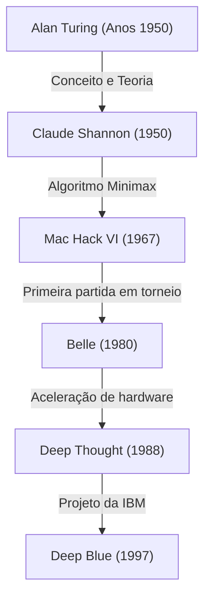
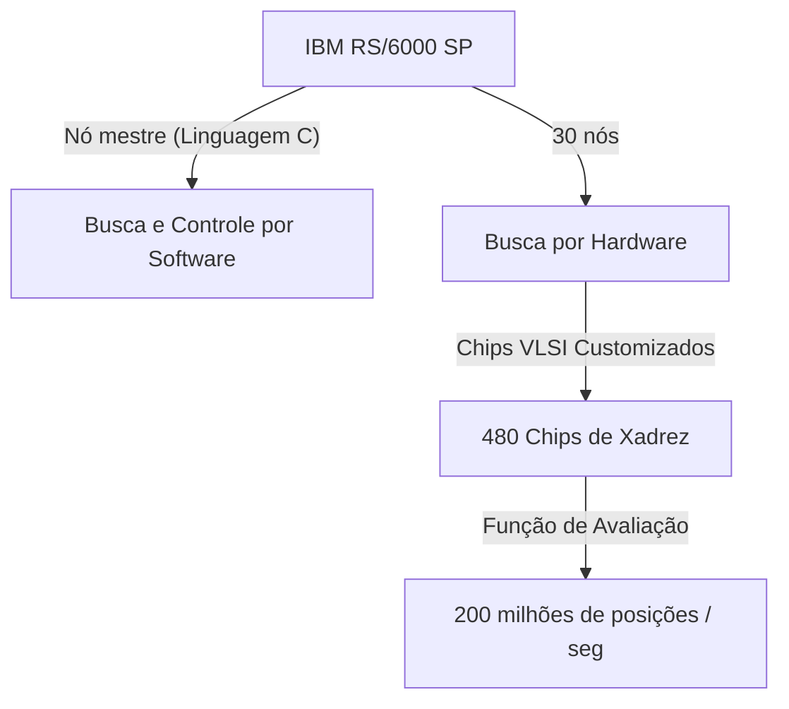

## Introdução: 1997, a "Inteligência Desconhecida" Enfrentada pela Humanidade

A partida de xadrez realizada em 11 de maio de 1997 no Equitable Center em Nova York é lembrada como uma singularidade na história da humanidade. Garry Kasparov, então campeão mundial de xadrez e aclamado como o "jogador mais forte da história", foi derrotado pelo supercomputador "Deep Blue", desenvolvido pela IBM.

Este evento transcendeu o mero resultado de um jogo de tabuleiro, tornando-se um marco contundente para a antiga questão filosófica: "Chegará o dia em que as máquinas superarão a inteligência humana?". Neste artigo, exploraremos a história do xadrez computacional até a partida de 1997, a trajetória do gigante Kasparov, os bastidores técnicos do Deep Blue e os detalhes do lendário confronto de 6 jogos, aprofundando o significado que esse evento teve na história da IA (Inteligência Artificial).

## O Amanhecer do Xadrez Computacional: De Turing ao Deep Blue

A ideia de fazer um computador jogar xadrez existe desde os primórdios da ciência da computação. Pioneiros como Alan Turing e Claude Shannon viam o xadrez como um "ambiente de teste ideal para simular e desvendar os processos de pensamento humano".

Na década de 1950, Claude Shannon publicou um artigo monumental sobre programas de xadrez, estabelecendo as bases para algoritmos de busca baseados no método Minimax. Posteriormente, entre as décadas de 1970 e 1980, começaram a surgir máquinas equipadas com hardware dedicado ao xadrez. O "Belle" do Bell Labs utilizava circuitos dedicados para examinar dezenas de milhares de posições por segundo, ostentando uma força equivalente à de um mestre.

Em seguida, o "Deep Thought", desenvolvido por estudantes da Universidade Carnegie Mellon, tornou-se o primeiro computador a derrotar um grande mestre. A IBM assumiu este projeto, investindo enormes fundos e engenharia de ponta para criar o "Deep Blue".

## A Arquitetura do "Deep Blue", a Obra-Prima da IBM

O Deep Blue era a culminação da tecnologia de computação paralela de ponta da época. Baseado no supercomputador de uso geral "IBM RS/6000 SP", era equipado com um grande número de chips VLSI projetados exclusivamente para o xadrez.

A sua característica mais notável era a capacidade avassaladora de calcular um número absurdo de posições, **200 milhões de jogadas (posições) por segundo**, também conhecida como "Força Bruta" (busca exaustiva). Enquanto os jogadores humanos preveem apenas algumas dezenas de jogadas por segundo (mas restringem os movimentos promissores com alta intuição), o Deep Blue adotava uma abordagem de calcular exaustivamente todas as possibilidades, como um bombardeio em massa. Além disso, grandes mestres de xadrez como Joel Benjamin juntaram-se à equipe de desenvolvimento para ajustar exaustivamente a função de avaliação (o algoritmo que quantifica as vantagens e desvantagens das posições).

## O Rei Mais Forte da História, Garry Kasparov

Por outro lado, Garry Kasparov é um gênio absoluto que se tornou o campeão mundial mais jovem da história aos 22 anos, mantendo o seu trono nos 15 anos seguintes. O seu estilo de jogo era extremamente agressivo, destacando-se por cálculos profundos, intuição excepcional e uma guerra psicológica que impunha imensa pressão aos oponentes.

Ele havia lutado de igual para igual, ou melhor, contra qualquer computador até então, e estava convencido de que um humano não perderia para uma máquina (pelo menos durante a sua vida). Na primeira partida contra o Deep Blue em 1996 (Filadélfia), embora Kasparov tenha perdido o primeiro jogo, ele finalmente saiu vitorioso com 3 vitórias, 1 derrota e 2 empates. Naquela época, Kasparov declarou que "as máquinas nunca poderão derrotar a verdadeira inteligência e intuição humana".

## 1997: A Revanche do Destino (Nova York)

Após a derrota de 1996, a equipe de desenvolvimento da IBM (Feng-hsiung Hsu, Murray Campbell, entre outros) melhorou radicalmente o Deep Blue. Eles dobraram a velocidade de cálculo, ajustaram a função de avaliação para ser mais flexível e semelhante à de um humano, e fizeram com que ele aprendesse com todos os jogos anteriores de Kasparov. Esta nova versão, também conhecida como "Deeper Blue", entrou em cena para a revanche em maio de 1997.

### Jogo 1: Uma Vitória Esperada para Kasparov
No primeiro jogo, Kasparov manteve o seu estilo, levando a posições complexas e alcançando a vitória. Embora o Deep Blue se destacasse pelo poder de cálculo, ele parecia não compreender estratégias a longo prazo ou as sutilezas das posições. Todos pensavam: "Desta vez também terminará com a vitória de Kasparov".

### Jogo 2: A Suspeita da 44ª Jogada e a Perturbação de Kasparov
O ponto de inflexão na história foi o segundo jogo. Aqui, o Deep Blue fez um movimento "humano" e "orientado para posições de longo prazo", algo que os computadores tradicionais nunca fariam. Especificamente, o 44º movimento do Deep Blue ignorou um ganho material imediato (a chance de capturar uma peça) para cortar completamente qualquer contra-ataque, numa jogada estratégica extremamente sofisticada.

Kasparov ficou profundamente abalado com este movimento. Mais tarde, ele afirmou: "Eu senti uma inteligência humana excepcional do outro lado do tabuleiro". Em pânico, Kasparov desistiu (abandonou) no 45º movimento, embora ainda houvesse uma possibilidade de forçar um empate. Com esta derrota, Kasparov começou a suspeitar de que "a IBM estava intervindo com a ajuda de um grande mestre humano durante a partida", sentindo-se psicologicamente pressionado.

### Jogos 3 a 5: Empates Tensos
Do terceiro ao quinto jogo, Kasparov tentou neutralizar o poder de cálculo do Deep Blue evitando os combates táticos em que o computador era forte, levando os jogos para batalhas estratégicas de longo prazo (posições fechadas). Como resultado, todos terminaram em empates (draws). O placar estava empatado em 2,5 a 2,5. Tudo dependia do sexto e último jogo.

### Jogo 6: A Queda do Rei (11 de maio)
O fatídico sexto jogo. Kasparov jogou com as peças pretas e escolheu a Defesa Caro-Kann. No entanto, logo na abertura, ele fez um movimento que se desviou da teoria conhecida, algo que poderia ser considerado uma aposta. Foi uma manobra para confundir a base de dados de aberturas do Deep Blue, mas provou ser um erro fatal.

O Deep Blue imediatamente iniciou um ataque poderoso sacrificando um cavalo (sacrifício de cavalo). Este era um movimento que "normalmente não é escolhido no xadrez computacional, pois o valor da avaliação cai temporariamente", mas o Deep Blue melhorado havia calculado perfeitamente todo o desenrolar subsequente.

Forçado a defender-se continuamente, Kasparov foi obrigado a uma humilhante desistência após apenas 19 movimentos. O placar ficou 3,5 a 2,5. Foi o momento em que o ser humano mais forte da história foi finalmente derrotado por uma máquina.

## O Significado Desta Derrota: A Transição do Paradigma da IA

A vitória do Deep Blue causou um impacto imensurável em todo o mundo. A capa da revista Newsweek exibia a manchete "The Brain's Last Stand" (A Última Resistência do Cérebro).

No entanto, do ponto de vista tecnológico, o Deep Blue era fundamentalmente diferente da IA moderna (como o aprendizado profundo). O Deep Blue não era uma "IA que aprende e compreende conceitos de forma autônoma", mas sim a forma definitiva de um "sistema especialista" que, baseado em regras e funções de avaliação definidas por especialistas humanos, chegava à solução ideal por meio de uma **busca exaustiva baseada na força bruta**, usando hardware ultrarrápido.

Esta vitória demonstrou o fato de que "dentro da estrutura de regras limitadas e do jogo de informação perfeita que é o xadrez, até mesmo a intuição humana e a visão global poderiam ser superadas pela busca de padrões baseada em imenso poder computacional".

Posteriormente, a pesquisa em inteligência artificial mudou de buscas baseadas em regras para aprendizado de máquina usando redes neurais. O "AlphaGo" do Google DeepMind, que derrotou o melhor jogador de Go do mundo, Lee Sedol, em 2016, não dependeu de força bruta como o Deep Blue, mas usou uma abordagem de "aprender as suas próprias funções de avaliação" através de aprendizado profundo (Deep Learning) e aprendizado por reforço (Reinforcement Learning), de forma mais próxima à intuição humana. O Deep Blue foi, de certa forma, o pico e a forma completa da "boa e velha IA".

## Conclusão: Os Limites da Humanidade ou Novas Possibilidades?

Após a partida, um Kasparov furioso exigiu que a IBM tornasse públicos os registos e concedesse uma revanche, mas a IBM desmantelou e aposentou o Deep Blue imediatamente, considerando que o seu objetivo havia sido alcançado. Essa atitude deixou um sentimento prolongado de desconfiança em Kasparov.

No entanto, com o passar do tempo, os pontos de vista de Kasparov também mudaram. Hoje, em vez de temer excessivamente a ameaça da IA, ele tornou-se num dos defensores do "Xadrez Centauro" (um formato em que humanos e IAs se juntam para jogar), vendo a IA como "uma ferramenta para expandir as capacidades humanas".

A vitória do Deep Blue em 1997 não foi uma derrota da humanidade. Foi, sim, "uma vitória da engenharia humana", onde uma ferramenta criada pela própria inteligência humana finalmente superou os limites do seu criador numa área. Décadas após este histórico confronto, a questão de como coexistiremos com a IA e como expandiremos as nossas próprias capacidades continua a confrontar-nos sem perder a sua importância.
